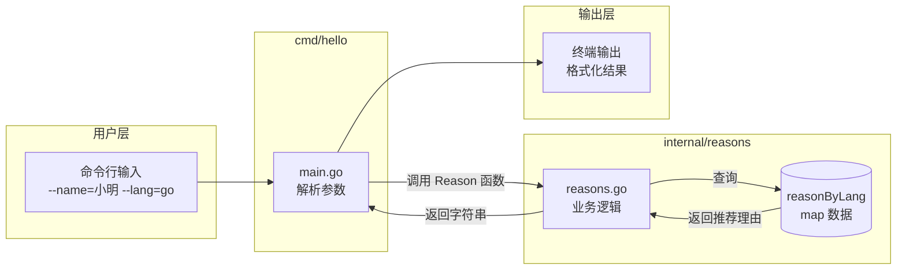

# 写作前的代码理解摘要

## 1. 项目地图

| 类型 | 路径/名称 |
|------|-----------|
| main 入口 | `cmd/hello/main.go` |
| 核心业务逻辑 | `internal/reasons/reasons.go` |
| 单元测试 | `internal/reasons/reasons_test.go` |
| 关键结构体/接口 | `reasonByLang` (map[string]string)、`Reason()` 函数 |

## 2. 核心三问

**这个项目解决的具体痛点是什么？**
对于想学习 Go 语言的开发者来说，最大的困惑不是语法本身，而是"Go 项目应该长什么样"。这个项目提供了一个麻雀虽小、五脏俱全的标准项目骨架，展示了 `cmd/`、`internal/` 的经典目录布局，以及如何组织可测试的业务代码。

**它的核心技术实现逻辑（Trick）是什么？**
项目通过 `flag` 包实现命令行参数解析，将用户输入的 `name` 和 `lang` 传递给业务层。业务层使用 `map` 做语言到推荐理由的映射，并通过 `comma ok` 惯用法安全地处理不存在的 key。整体设计遵循"关注点分离"原则：`main` 只负责 I/O，`reasons` 包只负责业务逻辑。

**它最适合用在什么业务场景？**
作为 Go 语言学习的"第一个正式项目"，帮助开发者理解 Go 的项目结构规范、包管理、单元测试写法，以及命令行工具的开发模式。

## 3. Go 语言特性提取

本项目涉及以下 Go 典型特性，将在正文中重点科普：

1. **包（Package）与可见性规则**：大写字母开头的函数/变量才能被外部包访问
2. **flag 包**：Go 标准库的命令行参数解析方案
3. **map 与 comma ok 惯用法**：`if v, ok := m[key]; ok { ... }`
4. **指针（Pointer）**：`flag.String()` 返回 `*string`，需要用 `*name` 解引用
5. **internal 目录约定**：Go 编译器强制的私有包机制
6. **表驱动测试（Table-Driven Test）**：Go 社区推崇的测试组织方式

---

**标题选择（请从以下 3 个中选择）**

- **风格 A（痛点型）**：《Go 项目结构总是写乱？这个 50 行代码的 Demo 教你标准姿势》
- **风格 B（干货型）**：《从零拆解：一个标准 Go 项目的目录布局与代码组织》
- **风格 C（悬念型）**：《为什么你的第一个 Go 项目不该只有一个 main.go？》

---

## 1. 场景复现：那个让我头疼的时刻

去年，我接手了一个"祖传" Go 项目。打开代码仓库的那一刻，我整个人都不好了——所有代码都塞在一个 `main.go` 里，足足 3000 多行。想加个功能？先花半小时找代码在哪。想写个单元测试？抱歉，函数全是私有的，而且互相耦合，根本没法单独测。

我当时就在想：**如果当初写这个项目的人，能从第一天就用一个规范的结构，后面的人得少掉多少头发？**

后来我开始研究 Go 官方和社区推荐的项目布局，发现其实规则很简单，但很多人就是不知道。于是我写了这个 50 行代码的小 Demo，把 Go 项目结构的精髓浓缩进去。今天，我就带你一起拆解它。

## 2. 架构蓝图：上帝视角看设计

先来看这个项目的目录结构：

```
series/01/
├── cmd/
│   └── hello/
│       └── main.go        # 程序入口，只做 I/O
├── internal/
│   └── reasons/
│       ├── reasons.go     # 核心业务逻辑
│       └── reasons_test.go # 单元测试
└── go.mod                  # 模块定义
```

这不是我随便画的，而是 Go 社区广泛认可的**标准项目布局**。我用一张图来展示数据是怎么流转的：



**核心设计思想：关注点分离**

- `cmd/` 目录：放可执行程序的入口。每个子目录对应一个可执行文件。`main.go` 只负责"接收输入、调用业务、输出结果"，不写任何业务逻辑。
- `internal/` 目录：放内部包。这个目录有个**魔法属性**——Go 编译器会强制禁止外部项目 import 这里的代码。这是 Go 语言级别的"私有化"保护。
- `go.mod`：Go Modules 的配置文件，声明模块名和 Go 版本。

## 3. 源码拆解：手把手带你读核心

### 3.1 入口文件：main.go

```go
package main

import (
    "flag"
    "fmt"
    "runtime"
    "strings"
    "time"

    "learn-go/series/01/internal/reasons"
)

func main() {
    name := flag.String("name", "工程师", "读者名称")
    lang := flag.String("lang", "go", "关注的语言")
    flag.Parse()

    lines := []string{
        fmt.Sprintf("你好，%s！", *name),
        fmt.Sprintf("你正在体验：%s", strings.ToUpper(*lang)),
        fmt.Sprintf("今天的结论：%s", reasons.Reason(*lang)),
        // ... 省略部分
    }

    fmt.Println(strings.Join(lines, "\n"))
}
```

**逐行解读：**

**第 1 行 `package main`**：Go 规定，可执行程序的入口包必须叫 `main`，入口函数也必须叫 `main()`。这是铁律，没得商量。

**第 10-11 行 `flag.String(...)`**：这是 Go 标准库提供的命令行参数解析方案。

> **知识点贴士：flag 包**
> 
> `flag.String("name", "默认值", "帮助说明")` 会返回一个 `*string`（字符串指针），而不是 `string`。为什么？因为 `flag.Parse()` 需要在解析完命令行后，把值"写回"到这个变量里。如果返回的是值而不是指针，就没法修改了。
> 
> 类比 Java：这有点像 Java 里用 `AtomicReference` 来实现"可变的引用"。

**第 12 行 `flag.Parse()`**：真正执行解析。调用这行之后，`name` 和 `lang` 指针指向的值才会被填充。

**第 15 行 `*name`**：这里的 `*` 是**解引用操作符**，意思是"取出指针指向的值"。

> **知识点贴士：指针**
> 
> Go 的指针比 C 简单很多——没有指针运算，只有"取地址 `&`"和"解引用 `*`"两个操作。你可以把指针理解为"变量的门牌号"，`*` 就是"按门牌号找到房间里的东西"。

**第 17 行 `reasons.Reason(*lang)`**：调用 `internal/reasons` 包里的 `Reason` 函数。注意这里的 `R` 是大写的。

> **知识点贴士：可见性规则**
> 
> Go 没有 `public`/`private` 关键字。它用一个极简的规则：**首字母大写 = 公开，首字母小写 = 私有**。所以 `Reason` 能被外部调用，而如果写成 `reason` 就只能在 `reasons` 包内部用。

### 3.2 业务逻辑：reasons.go

```go
package reasons

import "strings"

var reasonByLang = map[string]string{
    "go":     "编译快、部署简单、并发模型清晰，适合做基础设施和服务端。",
    "python": "生态丰富、验证快，适合数据处理和脚本。",
    "java":   "工程成熟、生态庞大，适合大型企业级系统。",
}

func Reason(lang string) string {
    key := strings.ToLower(strings.TrimSpace(lang))
    if key == "" {
        key = "go"
    }
    if reason, ok := reasonByLang[key]; ok {
        return reason
    }
    return "先选一个目标场景，再决定语言。Go 适合服务端与工具链。"
}
```

**逐行解读：**

**第 5-9 行 `var reasonByLang = map[string]string{...}`**：这是 Go 的 `map` 类型，相当于 Java 的 `HashMap` 或 Python 的 `dict`。

注意这里用的是**包级变量**（定义在函数外面），小写开头意味着它是私有的，外部包访问不到。这是一种常见的"模块内共享数据"的方式。

**第 16 行 `if reason, ok := reasonByLang[key]; ok`**：这是 Go 最经典的惯用法之一——**comma ok**。

> **知识点贴士：comma ok 惯用法**
> 
> 在 Go 里访问 map，可以用两种方式：
> - `v := m[key]`：如果 key 不存在，返回零值（空字符串、0 等）
> - `v, ok := m[key]`：`ok` 是个布尔值，告诉你 key 到底存不存在
> 
> 第二种方式能区分"key 存在但值为空"和"key 根本不存在"，更安全。

### 3.3 单元测试：reasons_test.go

```go
package reasons

import "testing"

func TestReason(t *testing.T) {
    tests := []struct {
        name string
        lang string
        want string
    }{
        {name: "default", lang: "", want: reasonByLang["go"]},
        {name: "go", lang: "go", want: reasonByLang["go"]},
        {name: "python", lang: "python", want: reasonByLang["python"]},
    }

    for _, tt := range tests {
        t.Run(tt.name, func(t *testing.T) {
            if got := Reason(tt.lang); got != tt.want {
                t.Fatalf("Reason(%q) = %q, want %q", tt.lang, got, tt.want)
            }
        })
    }
}
```

这是 Go 社区推崇的**表驱动测试（Table-Driven Test）**风格。

> **知识点贴士：表驱动测试**
> 
> 核心思想是：把测试用例组织成一个"表格"（切片），然后用循环遍历执行。好处是：
> 1. 新增用例只需要加一行数据，不用写重复的测试代码
> 2. 测试逻辑集中，一眼就能看出覆盖了哪些场景
> 3. `t.Run()` 会给每个用例起名字，失败时能精确定位

**第 16 行 `for _, tt := range tests`**：`range` 是 Go 遍历切片/map 的关键字。`_` 表示"我不关心索引，只要值"。

## 4. 避坑指南 & 深度思考

### 坑 1：忘记调用 flag.Parse()

如果你删掉 `flag.Parse()` 这行，程序不会报错，但 `*name` 和 `*lang` 永远是默认值。这是个很隐蔽的 Bug。

### 坑 2：map 并发读写会 panic

当前代码里的 `reasonByLang` 是只读的，没问题。但如果你想在运行时动态添加语言，**千万不要**在多个 goroutine 里同时读写这个 map——Go 的 map 不是并发安全的，会直接 panic。

**生产环境怎么办？** 用 `sync.RWMutex` 加锁，或者用 `sync.Map`。

### 坑 3：internal 目录的"魔法"是编译器强制的

有些同学以为 `internal` 只是个命名约定，其实不是。Go 编译器会**硬性禁止**外部模块 import `internal` 下的包。如果你的项目是个库，想暴露某些包给外部用，就不能放在 `internal` 里。

### Demo 与生产代码的差距

这个 Demo 为了教学做了简化，生产环境还需要考虑：

1. **错误处理**：当前代码没有任何 `error` 返回，真实场景要处理各种异常
2. **日志**：用 `log` 或 `slog` 包记录关键操作
3. **配置管理**：硬编码的 map 应该改成从配置文件或环境变量读取
4. **优雅退出**：监听系统信号，做资源清理

## 5. 快速上手 & 改造建议

### 运行命令

```bash
# 进入项目目录
cd series/01

# 直接运行
go run ./cmd/hello

# 带参数运行
go run ./cmd/hello --name=小明 --lang=python

# 运行测试
go test ./internal/reasons -v

# 编译成可执行文件
go build -o hello ./cmd/hello
./hello --name=读者
```

### 工程化改造建议

**建议 1：加入结构化日志**

```go
import "log/slog"

func main() {
    slog.Info("程序启动", "name", *name, "lang", *lang)
    // ...
}
```

`slog` 是 Go 1.21 引入的标准库，支持 JSON 格式输出，方便对接日志系统。

**建议 2：配置外部化**

把 `reasonByLang` 改成从 YAML/JSON 文件读取：

```go
import "os"
import "encoding/json"

func loadReasons(path string) (map[string]string, error) {
    data, err := os.ReadFile(path)
    if err != nil {
        return nil, err
    }
    var m map[string]string
    err = json.Unmarshal(data, &m)
    return m, err
}
```

**建议 3：添加版本信息**

利用 `go build -ldflags` 在编译时注入版本号：

```go
var Version = "dev" // 会被编译时覆盖

func main() {
    fmt.Println("版本：", Version)
}
```

编译命令：
```bash
go build -ldflags "-X main.Version=v1.0.0" -o hello ./cmd/hello
```

## 6. 总结与脑图

- **cmd/ 放入口，internal/ 放私有逻辑**——这是 Go 项目结构的黄金法则
- **flag 包返回指针**，记得用 `*` 解引用，别忘了调用 `Parse()`
- **comma ok 惯用法**（`v, ok := m[key]`）是安全访问 map 的标准姿势
- **首字母大小写决定可见性**，这是 Go 独特的"无关键字"设计哲学
- **表驱动测试**让你的测试代码更简洁、更易维护

如果你正准备入坑 Go，不妨把这个 Demo clone 下来，亲手改一改、跑一跑。**看十遍不如写一遍**，这是我这些年最深的体会。
