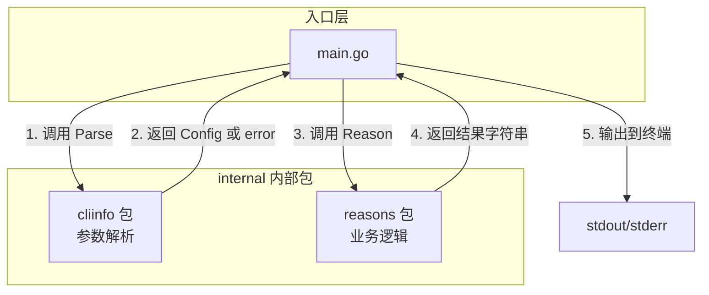

# 写作前的代码理解摘要

## 1. 项目地图

| 类型 | 路径/名称 |
|------|-----------|
| main 入口 | `cmd/cli/main.go` |
| 参数解析模块 | `internal/cliinfo/cliinfo.go` |
| 业务逻辑模块 | `internal/reasons/reasons.go` |
| 核心结构体 | `cliinfo.Config` (Name, Lang 两个字段) |
| 核心函数 | `cliinfo.Parse()`, `reasons.Reason()` |

## 2. 核心三问

**痛点**：很多初学者写 Go 程序时，把所有逻辑都堆在 `main()` 里，导致代码难以测试、难以维护。当程序出错时，错误信息模糊，用户不知道哪里出了问题。

**核心 Trick**：将参数解析逻辑抽离到独立的 `internal` 包中，`main()` 只负责"调度"——调用解析、处理错误、输出结果。这种分层让每个模块都可以独立测试，入口函数保持极简。

**适用场景**：任何需要接收命令行参数的 CLI 工具、定时任务、运维脚本。这是 Go 项目的"标准起手式"，掌握后可复用到所有项目。

## 3. Go 语言特性提取

- **多返回值**：`Parse()` 返回 `(Config, error)`，这是 Go 处理错误的惯用模式
- **指针与解引用**：`flag.String()` 返回 `*string`，需要用 `*name` 取值
- **结构体（Struct）**：`Config` 结构体封装配置，类似其他语言的 Class
- **Map 数据结构**：`reasonByLang` 用 map 实现语言到描述的映射
- **包（Package）机制**：`internal` 目录下的包只能被同模块代码引用
- **表驱动测试**：测试代码使用切片+循环的方式组织测试用例

---

**标题备选**

- **风格 A（痛点型）**：程序启动就报错？从 Go 的 main 函数开始写一个"会说话"的入口
- **风格 B（干货型）**：Go CLI 入口设计：参数解析、错误处理与项目分层实战
- **风格 C（悬念型）**：为什么我建议你把 main 函数写得越短越好

---

## 1. 场景复现：那个让我头疼的时刻

周一早上，我接手了一个线上的配置同步小工具。它的职责很简单：每天凌晨跑一次，从配置中心拉数据，然后推送到各个节点。

工具跑了大半年都没出过问题，直到那天——凌晨 3 点告警响了，日志里只有一行：

```
程序启动失败
```

我盯着这行字看了五分钟，脑子里全是问号：**哪里失败了？参数没传？配置文件没找到？网络不通？**

排查了一个多小时，最后发现是运维同学改了启动脚本，漏掉了一个必填参数。但程序压根没告诉我是哪个参数出了问题。

那一刻我意识到：**一个靠谱的程序，必须从入口就"把话说清楚"**。参数怎么解析、默认值是什么、出错时怎么反馈——这些看似基础的东西，决定了凌晨 3 点你能不能多睡一会儿。

今天这个项目，就是我总结出来的 **Go CLI 入口模板**。它很小，但五脏俱全。

## 2. 架构蓝图：上帝视角看设计

先来看整体结构。这个项目只有三个核心文件，但它展示了 Go 项目的**标准分层方式**：



**核心设计思想**：

- **main.go 只做调度**：它不包含任何业务逻辑，只负责"接参数 → 调函数 → 输出结果"
- **internal 目录放内部包**：Go 有个约定，`internal` 目录下的代码只能被同一个模块引用，外部项目无法 import。这是一种"访问控制"
- **一个目录一个包**：`cliinfo` 负责参数解析，`reasons` 负责业务逻辑，职责清晰

这种分层的好处是什么？**每个包都可以独立写单元测试**。你不需要启动整个程序，就能验证参数解析逻辑对不对。

## 3. 源码拆解：手把手带你读核心

### 3.1 入口文件：main.go

```go
package main

import (
	"fmt"
	"os"
	"runtime"
	"strings"
	"time"

	"learn-go/series/02/internal/cliinfo"
	"learn-go/series/02/internal/reasons"
)

func main() {
	cfg, err := cliinfo.Parse(os.Args[1:])
	if err != nil {
		fmt.Fprintln(os.Stderr, "参数错误:", err)
		os.Exit(1)
	}

	lines := []string{
		fmt.Sprintf("你好，%s！", cfg.Name),
		fmt.Sprintf("你正在体验：%s", strings.ToUpper(cfg.Lang)),
		fmt.Sprintf("今天的结论：%s", reasons.Reason(cfg.Lang)),
		fmt.Sprintf("运行环境：%s/%s", runtime.GOOS, runtime.GOARCH),
		fmt.Sprintf("Go 版本：%s", runtime.Version()),
		fmt.Sprintf("生成时间：%s", time.Now().Format(time.RFC3339)),
	}

	fmt.Println(strings.Join(lines, "\n"))
}
```

这段代码只有 20 多行，但信息量很大。让我逐个拆解：

**`os.Args[1:]` 是什么？**

`os.Args` 是一个字符串切片，包含了命令行的所有参数。`Args[0]` 是程序本身的路径，`Args[1:]` 才是用户传入的参数。这个写法在 Python 里类似 `sys.argv[1:]`。

**`cfg, err := cliinfo.Parse(...)` 的多返回值**

这是 Go 最经典的模式。函数同时返回"结果"和"错误"，调用方必须处理错误。如果你写过 Java，可以把它理解为"不用 try-catch，但必须检查返回值"。

> **Go 知识点**：Go 没有异常机制，错误通过返回值传递。`if err != nil` 是你会写一万遍的代码。

**`fmt.Fprintln(os.Stderr, ...)` 为什么用 Stderr？**

正常输出走 `stdout`，错误信息走 `stderr`。这是 Unix 的惯例。好处是：用户可以用管道把正常输出重定向到文件，而错误信息仍然显示在终端。

**`os.Exit(1)` 的退出码**

程序正常结束返回 0，出错返回非零值。这让调用方（比如 shell 脚本）可以判断程序是否成功。

### 3.2 参数解析：cliinfo 包

```go
package cliinfo

import (
	"flag"
	"fmt"
	"strings"
)

type Config struct {
	Name string
	Lang string
}

func Parse(args []string) (Config, error) {
	fs := flag.NewFlagSet("hello", flag.ContinueOnError)
	name := fs.String("name", "工程师", "读者名称")
	lang := fs.String("lang", "go", "关注的语言")
	fs.SetOutput(new(strings.Builder))

	if err := fs.Parse(args); err != nil {
		return Config{}, err
	}

	cfg := Config{
		Name: strings.TrimSpace(*name),
		Lang: strings.ToLower(strings.TrimSpace(*lang)),
	}
	if cfg.Name == "" {
		return Config{}, fmt.Errorf("name 不能为空")
	}
	if cfg.Lang == "" {
		cfg.Lang = "go"
	}
	return cfg, nil
}
```

**为什么用 `flag.NewFlagSet` 而不是全局的 `flag.Parse()`？**

全局的 `flag` 包会直接操作 `os.Args`，而且解析失败时默认会调用 `os.Exit()`。这让代码**无法测试**——你没法在测试里模拟不同的参数组合。

用 `NewFlagSet` 创建独立的解析器，传入任意的 `[]string`，就可以在单元测试里随便折腾了。

**`fs.String()` 返回的是指针**

```go
name := fs.String("name", "工程师", "读者名称")
// name 的类型是 *string，不是 string
```

为什么返回指针？因为 `Parse()` 调用之后，flag 包会把解析到的值写入这个指针指向的内存。如果返回值类型，就没法"回填"了。

> **Go 知识点**：`*name` 是解引用操作，取出指针指向的值。这和 C 语言的指针概念一样。

**`flag.ContinueOnError` 的作用**

默认情况下，flag 解析失败会直接退出程序。设置 `ContinueOnError` 后，它会返回 error，让我们自己决定怎么处理。

**`return Config{}, err` 的零值**

当出错时，我们返回一个"空的" Config。`Config{}` 是结构体的零值，所有字段都是默认值（string 的零值是空字符串）。

### 3.3 业务逻辑：reasons 包

```go
package reasons

import "strings"

var reasonByLang = map[string]string{
	"go":     "编译快、部署简单、并发模型清晰，适合做基础设施和服务端。",
	"python": "生态丰富、验证快，适合数据处理和脚本。",
	"java":   "工程成熟、生态庞大，适合大型企业级系统。",
}

func Reason(lang string) string {
	key := strings.ToLower(strings.TrimSpace(lang))
	if key == "" {
		key = "go"
	}
	if reason, ok := reasonByLang[key]; ok {
		return reason
	}
	return "先选一个目标场景，再决定语言。Go 适合服务端与工具链。"
}
```

**`map[string]string` 的声明**

这是 Go 的 map 类型，等价于 Java 的 `Map<String, String>` 或 Python 的 `dict`。

**`reason, ok := reasonByLang[key]` 的双返回值**

访问 map 时，Go 允许你同时获取"值"和"是否存在"。如果 key 不存在，`ok` 为 false，`reason` 是零值。

这比 Java 的 `map.get(key) != null` 更优雅，因为它能区分"key 不存在"和"key 存在但值为 null"。

> **Go 知识点**：这种 `value, ok := map[key]` 的写法叫做 "comma ok" 惯用法，在 Go 里非常常见。

### 3.4 测试代码：表驱动测试

```go
func TestReason(t *testing.T) {
	tests := []struct {
		name string
		lang string
		want string
	}{
		{name: "default", lang: "", want: reasonByLang["go"]},
		{name: "go", lang: "go", want: reasonByLang["go"]},
		{name: "python", lang: "python", want: reasonByLang["python"]},
	}

	for _, tt := range tests {
		t.Run(tt.name, func(t *testing.T) {
			if got := Reason(tt.lang); got != tt.want {
				t.Fatalf("Reason(%q) = %q, want %q", tt.lang, got, tt.want)
			}
		})
	}
}
```

这是 Go 社区推崇的**表驱动测试**风格。把测试用例定义成一个切片，然后循环执行。好处是：

- 新增用例只需要加一行，不用复制粘贴整个测试函数
- 测试逻辑集中，一眼能看出覆盖了哪些场景
- `t.Run()` 让每个用例有独立的名字，失败时能精确定位

## 4. 避坑指南 & 深度思考

### 坑 1：忘记处理 error

```go
cfg, _ := cliinfo.Parse(os.Args[1:])  // 危险！忽略了 error
```

用 `_` 忽略 error 是 Go 新手最常犯的错误。程序不会报错，但 `cfg` 可能是零值，后续逻辑会出现诡异的 bug。

**建议**：在 IDE 里开启 `errcheck` 或 `golangci-lint`，它会提醒你未处理的 error。

### 坑 2：全局 flag 导致测试困难

如果你直接用 `flag.String()` 和 `flag.Parse()`，它们操作的是全局状态。多个测试用例之间会互相干扰，而且无法模拟不同的参数组合。

**建议**：始终用 `flag.NewFlagSet()` 创建独立的解析器。

### 坑 3：错误信息不够具体

```go
return Config{}, fmt.Errorf("参数错误")  // 太模糊
return Config{}, fmt.Errorf("name 不能为空")  // 好
```

错误信息要能让用户**不看代码就知道怎么修**。

### Demo 与生产的差距

这个 Demo 是教学用的，生产环境还需要考虑：

- **配置文件支持**：除了命令行参数，还要支持从文件、环境变量读取配置
- **日志系统**：用 `log/slog` 或 `zap` 替代 `fmt.Println`，支持结构化日志
- **优雅退出**：监听 `SIGTERM` 信号，做清理工作后再退出
- **版本信息**：编译时注入 git commit、构建时间等信息

## 5. 快速上手 & 改造建议

### 运行命令

```bash
# 进入项目目录
cd series/02

# 运行程序（使用默认参数）
go run ./cmd/cli

# 运行程序（自定义参数）
go run ./cmd/cli -name="张三" -lang=python

# 运行测试
go test ./...
```

### 工程化改造建议

**1. 添加结构化日志**

把 `fmt.Println` 替换成 Go 1.21 引入的 `log/slog`：

```go
import "log/slog"

slog.Info("程序启动", "name", cfg.Name, "lang", cfg.Lang)
```

**2. 支持环境变量**

在 `Parse()` 里增加环境变量的读取，优先级：命令行参数 > 环境变量 > 默认值：

```go
if envName := os.Getenv("CLI_NAME"); envName != "" && *name == "工程师" {
    *name = envName
}
```

**3. 添加 `-version` 参数**

在编译时注入版本信息，方便排查问题：

```go
var Version = "dev"  // 编译时用 -ldflags 覆盖

version := fs.Bool("version", false, "显示版本信息")
if *version {
    fmt.Println("版本:", Version)
    os.Exit(0)
}
```

## 6. 总结

- **main 函数要短**：只做调度，不写业务逻辑，这样才能测试
- **错误必须处理**：`if err != nil` 是 Go 的生存法则，别用 `_` 忽略
- **用 NewFlagSet**：独立的 flag 解析器让代码可测试
- **internal 目录**：Go 的访问控制机制，内部包不会被外部引用
- **表驱动测试**：用切片组织测试用例，新增场景只需加一行
