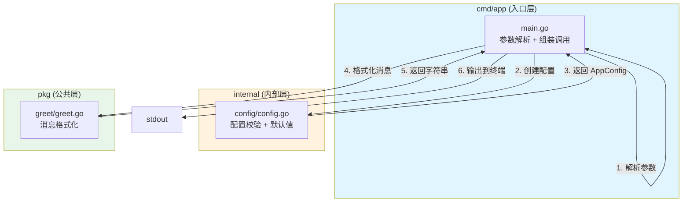

# 写作前的代码理解摘要

## 1. 项目地图

| 类型 | 路径 | 说明 |
|------|------|------|
| main 入口 | `cmd/app/main.go` | 程序启动入口，负责参数解析和组装调用 |
| 核心业务逻辑 | `internal/config/config.go` | 配置校验与默认值处理 |
| 可复用模块 | `pkg/greet/greet.go` | 消息格式化输出 |
| 单元测试 | `internal/config/config_test.go` | 配置模块的测试用例 |

**关键结构体/类型**：
- `config.AppConfig`：应用配置结构体，包含 AppName 和 Owner 两个字段
- `greet.Message`：消息结构体，用于格式化输出

## 2. 核心三问

**这个项目解决的具体痛点是什么？**
解决 Go 项目代码组织混乱的问题。当项目代码全部堆在根目录时，文件边界模糊、职责不清、合并冲突频发。本项目演示了如何用 Go 的包机制（`cmd`/`internal`/`pkg` 三层结构）来划分清晰的代码边界。

**它的核心技术实现逻辑（Trick）是什么？**
利用 Go 语言"一个目录即一个包"的硬性规则，配合 `internal` 目录的访问控制特性，强制实现代码的模块化隔离。`cmd` 层只做参数解析和组装，`internal` 放内部实现，`pkg` 放可复用代码。

**它最适合用在什么业务场景？**
适合作为任何新 Go 项目的起步骨架，尤其是需要多人协作、后续会持续迭代的中大型项目。这套结构能从源头避免"代码屎山"的形成。

## 3. Go 语言特性提取

本项目涉及的 Go 典型特性：
- **多返回值与错误处理**：`config.New()` 返回 `(AppConfig, error)`，体现 Go 的显式错误处理哲学
- **结构体（Struct）**：`AppConfig` 和 `Message` 展示了 Go 的数据建模方式
- **包的可见性规则**：大写字母开头的标识符可导出，小写则包内私有
- **flag 标准库**：命令行参数解析的标准做法
- **testing 标准库**：Go 内置的单元测试框架

---

**标题备选**

**风格 A（痛点型）**：代码全堆根目录？一文讲透 Go 项目结构的正确姿势

**风格 B（干货型）**：cmd/internal/pkg 三层架构：从零搭建规范的 Go 项目骨架

**风格 C（悬念型）**：为什么你的 Go 项目总是越写越乱？问题出在第一步

---

## 1. 场景复现：那个让我头疼的时刻

上个月，我接手了一个"祖传"的 Go 项目。

打开项目根目录，我愣住了：`main.go`、`utils.go`、`helper.go`、`common.go`、`tmp.go`……十几个文件平铺在那里，像一堆没人收拾的快递盒。

我问同事："这个发送通知的逻辑在哪？"

他想了想："好像在 `utils.go`……不对，可能在 `helper.go`？你搜一下吧。"

更要命的是，我需要加一个"发布提醒"功能。我把代码写进了 `utils.go`，结果提交代码时发现——另一个同事在 `main.go` 里加了一个同名函数。Git 合并冲突，一片红。

那一刻我意识到：**代码组织混乱，不是"不够整洁"的问题，而是会实实在在拖慢开发效率、制造 Bug 的问题。**

后来我花了一个周末，用 Go 的标准项目结构重构了整个项目。这篇文章，我就把这套方法论分享给你。

## 2. 架构蓝图：上帝视角看设计

先来看一下本文示例项目的整体结构：

```
series/03/
├── cmd/
│   └── app/
│       └── main.go        # 程序入口：只做参数解析和组装
├── internal/
│   └── config/
│       ├── config.go      # 内部逻辑：配置校验
│       └── config_test.go # 单元测试
├── pkg/
│   └── greet/
│       └── greet.go       # 可复用：消息格式化
└── go.mod
```

这套结构的核心思想可以用一张图来表达：



**三层职责一句话总结**：
- **cmd**：程序入口，只负责"组装"，不写业务逻辑
- **internal**：内部实现，外部项目无法引用（Go 编译器强制保证）
- **pkg**：可复用的公共代码，可以被其他项目 import

## 3. 源码拆解：手把手带你读核心

### 3.1 入口层：main.go 只做"胶水"

```go
package main

import (
    "flag"
    "fmt"
    "os"

    "learn-go/series/03/internal/config"
    "learn-go/series/03/pkg/greet"
)

func main() {
    appName := flag.String("app", "deploy-bot", "应用名称")
    owner := flag.String("owner", "", "负责人或团队")
    flag.Parse()

    cfg, err := config.New(*appName, *owner)
    if err != nil {
        fmt.Fprintln(os.Stderr, "启动失败:", err)
        os.Exit(1)
    }

    message := greet.Format(greet.Message{AppName: cfg.AppName, Owner: cfg.Owner})
    fmt.Println(message)
}
```

**为什么这么写？**

你可以看到，`main` 函数只做了三件事：
1. 解析命令行参数（`flag.Parse()`）
2. 调用 `config.New()` 创建配置
3. 调用 `greet.Format()` 输出结果

**没有任何业务逻辑**。这就是"入口层要薄"的精髓。

> **Go 知识点：flag 包**
> 
> `flag.String()` 返回的是一个 `*string`（字符串指针），所以后面使用时需要用 `*appName` 来取值。这是 Go 标准库的设计，目的是让 `flag.Parse()` 能够修改这个变量的值。

> **Go 知识点：多返回值与错误处理**
> 
> `config.New()` 返回 `(AppConfig, error)` 两个值。Go 没有 try-catch，而是用这种显式的方式处理错误。你会在 Go 代码里频繁看到 `if err != nil` 这个模式——这不是啰嗦，而是 Go 的设计哲学：**错误是值，必须被显式处理**。

### 3.2 内部层：config 包的校验逻辑

```go
package config

import (
    "fmt"
    "strings"
)

type AppConfig struct {
    AppName string
    Owner   string
}

func New(appName, owner string) (AppConfig, error) {
    appName = strings.TrimSpace(appName)
    owner = strings.TrimSpace(owner)
    if appName == "" {
        return AppConfig{}, fmt.Errorf("appName 不能为空")
    }
    if owner == "" {
        owner = "团队"
    }
    return AppConfig{AppName: appName, Owner: owner}, nil
}
```

**为什么这么写？**

1. **输入清洗**：`strings.TrimSpace()` 去除首尾空格，防止用户传入 `"  "` 这种"看起来有值但实际为空"的输入
2. **默认值处理**：`owner` 为空时自动填充 `"团队"`，这是防御性编程的体现
3. **返回零值**：当校验失败时，返回 `AppConfig{}` 和一个 error。`AppConfig{}` 是 Go 的**零值**——结构体的所有字段都会被初始化为对应类型的零值（string 的零值是空字符串）

> **Go 知识点：结构体与零值**
> 
> 在 Go 里，`AppConfig{}` 会创建一个所有字段都是零值的结构体。这和 Java/Python 里的 `null` 不同——Go 的零值是**可用的**，不会引发空指针异常。

> **Go 知识点：包的可见性**
> 
> 注意 `AppConfig` 和 `New` 都是**大写字母开头**。在 Go 里，大写开头的标识符是"导出的"（exported），可以被其他包访问；小写开头则是包内私有。这个规则简单粗暴，但非常有效。

### 3.3 公共层：greet 包的格式化

```go
package greet

import "fmt"

type Message struct {
    AppName string
    Owner   string
}

func Format(msg Message) string {
    return fmt.Sprintf("[%s] 由 %s 维护，今天运行正常。", msg.AppName, msg.Owner)
}
```

**为什么单独拆一个包？**

`greet` 包放在 `pkg/` 目录下，意味着它是**可以被其他项目复用的**。假设你有另一个项目也需要这种格式化输出，直接 `import "learn-go/series/03/pkg/greet"` 就能用。

而 `internal/config` 就不行——Go 编译器会阻止外部项目引用 `internal` 目录下的代码。

### 3.4 测试代码：表驱动测试的雏形

```go
func TestNew(t *testing.T) {
    cfg, err := New("service", "平台组")
    if err != nil {
        t.Fatalf("New returned error: %v", err)
    }
    if cfg.AppName != "service" {
        t.Fatalf("AppName = %q, want %q", cfg.AppName, "service")
    }
}

func TestNewEmptyAppName(t *testing.T) {
    _, err := New(" ", "平台组")
    if err == nil {
        t.Fatal("expected error for empty appName")
    }
}
```

> **Go 知识点：testing 包**
> 
> Go 内置了测试框架，不需要额外安装。测试文件以 `_test.go` 结尾，测试函数以 `Test` 开头，参数是 `*testing.T`。运行 `go test ./...` 就能执行所有测试。

## 4. 避坑指南 & 深度思考

### 坑 1：在 main 里写业务逻辑

如果你把配置校验、消息格式化全写在 `main.go` 里，会发生什么？

- **无法单元测试**：`main` 函数没法被其他代码调用，你只能靠集成测试
- **无法复用**：想在另一个项目用同样的逻辑？复制粘贴吧
- **职责混乱**：改一个小功能，可能影响整个启动流程

### 坑 2：把所有代码都放 pkg

有些人走另一个极端：既然 `pkg` 可以被复用，那我全放 `pkg` 不就行了？

问题是：**不是所有代码都应该被复用**。

`internal` 的存在就是为了保护那些"只服务于本项目"的代码。如果你把数据库连接、业务配置这些东西放到 `pkg`，其他项目可能会误用，导致耦合。

### 坑 3：Demo 与生产的差距

这个示例项目是教学用的，和生产环境还有差距：

1. **缺少日志**：生产环境应该用 `log/slog` 或 `zap` 等日志库，而不是 `fmt.Println`
2. **缺少配置文件**：真实项目通常从 YAML/TOML 文件或环境变量读取配置
3. **缺少优雅退出**：生产服务需要处理 SIGTERM 信号，做好资源清理

## 5. 快速上手 & 改造建议

### 运行命令

```bash
# 运行程序
go run ./series/03/cmd/app -app="deploy-bot" -owner="平台组"

# 运行测试
go test ./series/03/...

# 查看测试覆盖率
go test -cover ./series/03/...
```

### 工程化改造建议

**建议 1：引入结构化日志**

把 `fmt.Println` 替换为 `log/slog`（Go 1.21+ 内置）：

```go
import "log/slog"

slog.Info("应用启动", "app", cfg.AppName, "owner", cfg.Owner)
```

**建议 2：支持配置文件**

使用 `github.com/spf13/viper` 从 YAML 文件读取配置，同时支持环境变量覆盖：

```go
viper.SetConfigName("config")
viper.AddConfigPath(".")
viper.AutomaticEnv()
```

**建议 3：添加 Makefile**

把常用命令封装成 Makefile，降低团队协作的心智负担：

```makefile
.PHONY: run test build

run:
    go run ./cmd/app

test:
    go test -v ./...

build:
    go build -o bin/app ./cmd/app
```

## 6. 总结与脑图

- **一个目录就是一个包**：Go 用目录结构强制划分代码边界，这是语言层面的约束
- **cmd 层要薄**：入口只做参数解析和组装，业务逻辑下沉到包里
- **internal 保护内部实现**：不想被外部引用的代码，放 `internal`
- **pkg 暴露可复用能力**：希望被其他项目使用的代码，放 `pkg`
- **显式错误处理**：`if err != nil` 是 Go 的标准模式，习惯它、拥抱它
