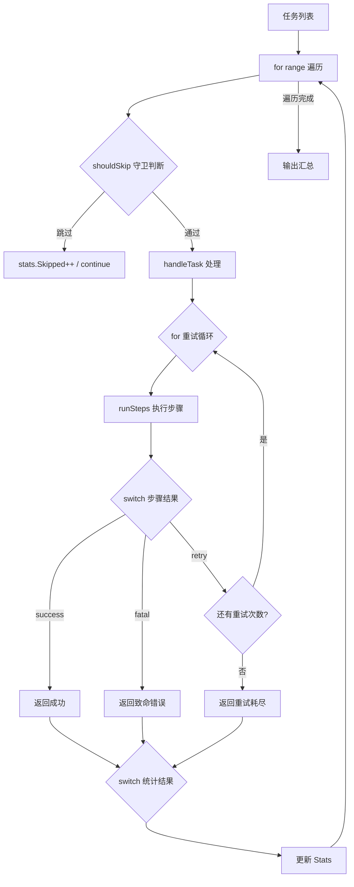

# 写作前的代码理解摘要

## 1. 项目地图

| 类型 | 路径/名称 |
|------|-----------|
| main 入口 | `cmd/flow/main.go` |
| 核心业务逻辑 | 同上（单文件项目） |
| 关键结构体 | `Task`（任务定义）、`Stats`（统计结果）、`HandleResult`（处理结果） |
| 关键常量类型 | `TaskStatus`（任务状态枚举）、`stepOutcome`（步骤执行结果枚举） |
| 核心函数 | `shouldSkip()`（跳过判断）、`handleTask()`（任务处理+重试）、`runSteps()`（步骤执行） |

## 2. 核心三问

**这个项目解决的具体痛点是什么？**
在任务调度场景中，开发者经常写出层层嵌套的 if/else 迷宫：先判断是否跳过，再判断执行结果，再判断是否重试……代码缩进越来越深，逻辑分支越来越难追踪。一旦某个分支漏了处理，线上就会出现"静默失败"的诡异 Bug。

**它的核心技术实现逻辑（Trick）是什么？**
项目通过三层控制流的组合演示了 Go 风格的"平铺式"写法：用 `if` 做守卫式提前返回（shouldSkip 快速剪枝）、用 `for` 实现重试循环和步骤遍历、用 `switch` 做多分支调度（条件 switch 和表达式 switch 混用）。特别是 `break stepLoop` 这个带标签的跳出，展示了如何优雅地从嵌套循环中退出。

**它最适合用在什么业务场景？**
适合所有需要"条件判断 + 循环重试 + 多分支处理"的场景：任务调度器、消息消费者、批处理流水线、状态机驱动的业务逻辑等。这套模式能让代码保持扁平、可读、易于调试。

## 3. Go 语言特性提取

| 特性 | 项目中的体现 | 文章中的科普重点 |
|------|-------------|-----------------|
| if 短变量声明 | `if reason := shouldSkip(task); reason != ""` | 变量作用域收紧，避免污染外部命名空间 |
| for range | `for idx, task := range tasks` | Go 唯一的循环关键字，三种形态 |
| for 条件循环 | `for attempt := 1; attempt <= maxRetry; attempt++` | 重试模式的标准写法 |
| break label | `break stepLoop` | 从嵌套循环中优雅跳出 |
| switch 表达式 | `switch result.Status { case StatusSuccess: ... }` | 比 if/else 链更清晰 |
| switch 条件 | `switch { case task.Priority < 3 && ...: ... }` | 多条件判断的利器 |
| 类型别名常量 | `type TaskStatus string` + `const` | 枚举的 Go 风格实现 |
| 多返回值 | `runSteps(task) (stepOutcome, string)` | 返回结果+消息的惯用模式 |
| continue | `continue` 跳过未知步骤 | 循环控制语句 |

---

**备选标题 A（痛点型）**：if/else 嵌套成山？用 Go 控制流三件套写出"一眼看懂"的代码

**备选标题 B（干货型）**：Go 控制流实战：if 守卫、for 重试、switch 分发的正确打开方式

**备选标题 C（悬念型）**：为什么我不建议你在 Go 里写超过三层的 if/else

---

## 1. 场景复现：那个让我头疼的时刻

上个月我接手了一个任务调度模块的重构。打开代码一看，我的血压瞬间上来了：

```go
if task.Priority > 0 {
    if task.EnvReady {
        if task.Kind == "import" {
            if task.PayloadSize > 0 {
                // 终于到正经逻辑了，已经缩进四层
                for i := 0; i < maxRetry; i++ {
                    if result == "success" {
                        // ...
                    } else if result == "retry" {
                        // ...
                    } else {
                        // ...
                    }
                }
            }
        }
    }
}
```

**五层缩进，三种 if/else 分支，一个 for 循环里还套着 if/else if/else**。我光是理清"什么情况下会走到哪个分支"就花了半小时。更要命的是，有个 `else` 分支里什么都没写——原作者可能觉得"不会走到这里"，结果线上真的走到了，任务静默失败，没有任何日志。

后来我用 Go 的控制流"三件套"重写了这段逻辑：**if 做守卫式提前返回、for 做重试循环、switch 做分支调度**。代码从 200 行缩到 120 行，缩进从 5 层降到 2 层，最重要的是——每个分支都有明确的处理，不会再有"静默失败"。

今天就把这套方法分享给你。

## 2. 架构蓝图：上帝视角看设计

先看整体数据流转：



整个设计的核心思想是**"分层过滤 + 平铺逻辑"**：

1. **第一层 for**：遍历所有任务
2. **第一层 if（守卫）**：`shouldSkip` 快速剪枝，不符合条件的任务直接 `continue`
3. **第二层 for**：`handleTask` 里的重试循环
4. **多层 switch**：根据执行结果分发到不同处理逻辑

这样一来，每个函数只做一件事，嵌套层级被控制在 2 层以内。

## 3. 源码拆解：手把手带你读核心

### 3.1 守卫式 if：快速剪枝

```go
func shouldSkip(task Task) string {
    if task.Priority <= 0 {
        return "优先级为 0，直接忽略"
    }
    if !task.EnvReady && task.Kind == "import" {
        return "导入任务的环境未就绪"
    }

    switch {
    case task.Priority < 3 && len(task.Steps) == 0:
        return "步骤为空且优先级低"
    case strings.Contains(task.Kind, "demo") && task.DryRun:
        return "演示任务仅演练，不做真实执行"
    }

    return ""
}
```

这段代码展示了 Go 风格的**守卫式返回**：先处理异常情况，符合条件就立即返回，不符合的继续往下走。

**知识点贴士**：`switch { case condition: ... }` 是 Go 的"条件 switch"，等价于 `switch true { case condition: ... }`。它比一长串 `if/else if/else` 更清晰，特别适合多个独立条件的判断。

你可能注意到了，这个函数返回的是 `string` 而不是 `bool`。**为什么？** 因为返回跳过原因比返回"是否跳过"更有价值——调用方可以直接打印原因，方便调试。这是一个小技巧：**让返回值携带更多信息**。

### 3.2 for 重试循环：经典模式

```go
func handleTask(task Task) HandleResult {
    maxRetry := task.MaxRetry
    if maxRetry < 1 {
        maxRetry = 1
    }

    for attempt := 1; attempt <= maxRetry; attempt++ {
        outcome, msg := runSteps(task)

        switch outcome {
        case outcomeSuccess:
            return HandleResult{Status: StatusSuccess, Attempts: attempt, Message: msg}
        case outcomeFatal:
            return HandleResult{Status: StatusFatal, Attempts: attempt, Message: msg}
        case outcomeRetry:
            fmt.Printf("  尝试 %d 需要重试：%s\n", attempt, msg)
            if task.PayloadSize > 120 {
                task.PayloadSize -= 60
                fmt.Printf("  调整负载到 %d 后再试\n", task.PayloadSize)
            }
            if attempt < maxRetry {
                time.Sleep(80 * time.Millisecond)
            }
        }
    }

    return HandleResult{Status: StatusRetryExhausted, Attempts: maxRetry, Message: "多次重试仍失败"}
}
```

这是一个标准的**重试循环模式**：

1. `for attempt := 1; attempt <= maxRetry; attempt++` 控制重试次数
2. 每次循环调用 `runSteps` 执行任务
3. 用 `switch` 根据结果决定：成功就返回、致命错误就返回、可重试就继续循环
4. 循环结束还没成功，返回"重试耗尽"

**知识点贴士**：Go 只有 `for` 一个循环关键字，没有 `while`。`for condition {}` 就是 while，`for {}` 就是无限循环。这种设计减少了心智负担——你只需要记住一个关键字。

注意第 14-17 行：**重试前调整参数**。这是一个实用技巧——如果失败原因是"批次太大"，那就缩小批次再试。这种"自适应重试"比简单的"重试 N 次"更智能。

### 3.3 break label：优雅跳出嵌套

```go
func runSteps(task Task) (stepOutcome, string) {
    if !task.EnvReady {
        return outcomeFatal, "依赖环境未准备好"
    }

    message := "步骤全部完成"

stepLoop:
    for idx, step := range task.Steps {
        fmt.Printf("  步骤 %d：%s\n", idx+1, step)

        switch step {
        case "dry-run":
            if task.DryRun {
                fmt.Println("    仅演练，跳过后续执行")
                message = "演练完成，未做实际修改"
                break stepLoop  // 跳出整个 for 循环
            }
        // ... 其他 case
        }
    }

    return outcomeSuccess, message
}
```

这里有个关键技巧：**`break stepLoop`**。

普通的 `break` 只能跳出最内层的 `switch`，而我们想跳出外层的 `for` 循环。Go 的解决方案是**带标签的 break**：在 `for` 前面加一个标签 `stepLoop:`，然后用 `break stepLoop` 跳出。

**知识点贴士**：`break label` 是 Go 处理嵌套跳出的方式。Java 也有类似的语法。但要**慎用**——如果你发现需要频繁使用 label，说明代码可能需要重构成多个函数。

### 3.4 switch 的三种形态

项目里展示了 switch 的两种常用形态：

**表达式 switch**（根据变量值分发）：
```go
switch result.Status {
case StatusSuccess:
    stats.Success++
case StatusRetryExhausted, StatusFatal:
    stats.Failed++
}
```

**条件 switch**（根据条件分发）：
```go
switch {
case task.Kind == "reconcile" && task.PayloadSize > 200:
    return outcomeRetry, "对账批次太大，拆分后再试"
case task.Kind == "import" && task.PayloadSize > 350:
    return outcomeRetry, "导入批次过大，等待上游切分"
default:
    fmt.Println("    处理完成")
}
```

**知识点贴士**：Go 的 switch **默认不会 fallthrough**（贯穿到下一个 case）。这和 C/Java 不同——它们需要显式写 `break`。Go 的设计更安全，如果你真的需要贯穿，要显式写 `fallthrough`。

## 4. 避坑指南 & 深度思考

### 坑 1：for range 的闭包陷阱

```go
// 危险写法
for i, task := range tasks {
    go func() {
        fmt.Println(i, task.ID)  // 可能打印重复的值！
    }()
}
```

**原因**：`i` 和 `task` 在整个循环中是同一个变量，goroutine 启动时可能循环已经结束了。

**解法**：在循环内拷贝变量：
```go
for i, task := range tasks {
    i, task := i, task  // 拷贝到新变量
    go func() {
        fmt.Println(i, task.ID)
    }()
}
```

### 坑 2：switch 忘记 default

```go
switch task.Kind {
case "import":
    // ...
case "export":
    // ...
// 没有 default！新增的 "reconcile" 类型会静默跳过
}
```

**解法**：处理外部输入时，永远加 default：
```go
default:
    log.Printf("未知任务类型: %s", task.Kind)
```

### 坑 3：if 短变量声明的作用域

```go
var err error
if err := doSomething(); err != nil {
    // 这里的 err 是新变量，不是外层的 err！
    return err
}
// 外层的 err 仍然是 nil
```

**解法**：如果需要在 if 外使用，用 `=` 而不是 `:=`：
```go
var err error
if err = doSomething(); err != nil {
    return err
}
```

### 生产环境的差距

这个 Demo 是教学用的简化版本。真实生产环境还需要考虑：

- **指数退避**：重试间隔应该递增（1s, 2s, 4s...），而不是固定 80ms
- **超时控制**：用 `context.Context` 控制整体超时，避免无限等待
- **并发执行**：多个任务可以并行处理，用 goroutine + channel
- **可观测性**：加入 metrics、tracing，而不只是 fmt.Printf

## 5. 快速上手 & 改造建议

### 运行命令

```bash
# 运行示例
go run ./series/05/cmd/flow

# 如果遇到缓存权限问题
GOCACHE=$(pwd)/.cache/go-build go run ./series/05/cmd/flow
```

### 工程化改造建议

**1. 加入 context 超时控制**

```go
func handleTask(ctx context.Context, task Task) HandleResult {
    for attempt := 1; attempt <= maxRetry; attempt++ {
        select {
        case <-ctx.Done():
            return HandleResult{Status: StatusFatal, Message: "超时取消"}
        default:
            // 继续执行
        }
        // ...
    }
}
```

**2. 用结构化日志替代 fmt.Printf**

```go
import "log/slog"

slog.Info("任务开始",
    "task_id", task.ID,
    "kind", task.Kind,
    "attempt", attempt,
)
```

**3. 抽象重试策略**

```go
type RetryPolicy struct {
    MaxAttempts int
    InitialDelay time.Duration
    MaxDelay     time.Duration
    Multiplier   float64
}

func (p RetryPolicy) NextDelay(attempt int) time.Duration {
    delay := float64(p.InitialDelay) * math.Pow(p.Multiplier, float64(attempt-1))
    if delay > float64(p.MaxDelay) {
        delay = float64(p.MaxDelay)
    }
    return time.Duration(delay)
}
```

## 6. 总结与脑图

- **if 守卫式返回**：先处理异常，再写主流程，减少嵌套层级
- **for 是唯一的循环**：三段式、条件式、range 三种形态覆盖所有场景
- **switch 比 if/else 链更清晰**：表达式 switch 做值分发，条件 switch 做多条件判断
- **break label 解决嵌套跳出**：慎用，但在多层循环中很实用
- **Go 的 switch 默认不贯穿**：比 C/Java 更安全，需要贯穿时显式写 fallthrough
