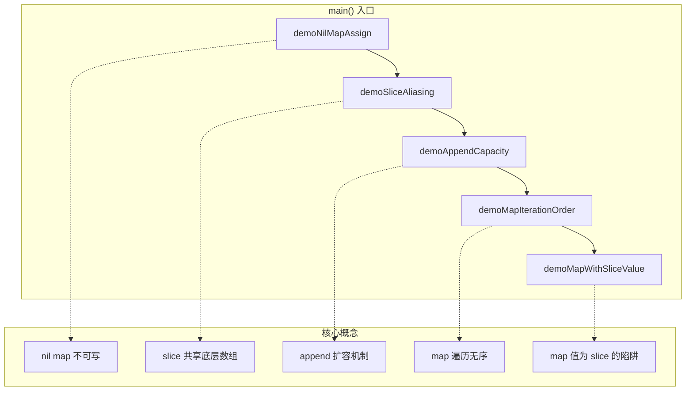
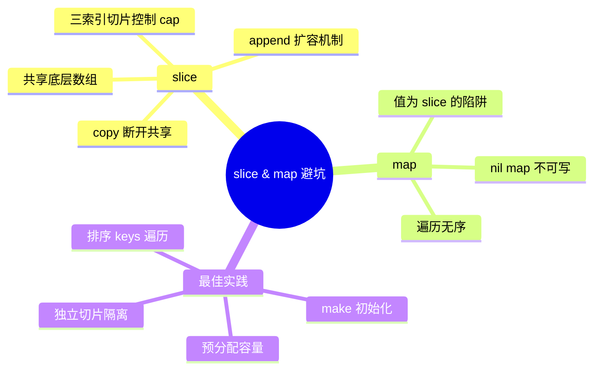

# 写作前的代码理解摘要

## 项目地图

- **main 入口文件**：`series/06/cmd/collection/main.go`
- **核心业务逻辑**：全部集中在 `main.go` 中，通过 5 个演示函数展示 slice 和 map 的典型陷阱
- **关键结构体**：
  - `product`：商品结构体，用于演示切片预分配
  - `bucket`：桶结构体，用于 map 转有序输出

## 核心三问

1. **解决的痛点**：线上系统中 90% 的"玄学 Bug"都来自 slice 和 map 的误用——nil map 写入 panic、子切片共享底层数组导致数据被意外篡改、map 遍历顺序不稳定导致测试时好时坏、map 值为切片时复用底层导致多 key 数据串改。

2. **核心技术实现**：通过 5 个精心设计的演示函数，分别展示：nil map 初始化、三索引切片 `[:len:cap]` 控制共享、`make` 预分配减少扩容、排序 keys 实现稳定遍历、独立切片避免底层复用。核心 Trick 是理解 slice 的"指针+len+cap"三元组结构，以及 append 在 cap 不足时会"搬家"的行为。

3. **适用场景**：任何需要处理集合数据的 Go 项目，特别是订单系统、日志聚合、缓存管理等需要频繁操作 slice/map 的业务场景。

## Go 语言特性提取

- **slice 三索引切片**：`base[:2:3]` 语法控制 cap，是 Go 独有的切片隔离技巧
- **make 函数**：`make([]T, len, cap)` 和 `make(map[K]V, hint)` 的预分配机制
- **range 遍历**：map 遍历的无序性是 Go 的设计决策
- **nil 值语义**：nil slice 可读、nil map 可读不可写的差异
- **闭包**：`addShared` 和 `addIsolated` 展示了 Go 闭包捕获外部变量的特性

---

**标题备选**

- A（痛点型）：线上那个"偶发"的 Bug，原来是 slice 和 map 在作怪
- B（干货型）：一文讲透 Go 的 slice 与 map：从底层原理到避坑指南
- C（悬念型）：为什么我说 90% 的 Go 新手都会在这里翻车

---

## 1. 场景复现：那个让我头疼的时刻

周一早上刚到工位，运维群就炸了。

"订单链路又出问题了，日志里一堆 `index out of range`。"

我打开监控一看，错误率不高，大概千分之一，但就是这千分之一，让我排查了整整两天。问题复现不了，本地跑得好好的，一上压测就炸。

最后定位到原因，我差点把键盘摔了——**一个子切片的修改，把原数组给改了**。

更离谱的是，另一个服务里还藏着 `assignment to entry in nil map` 的 panic，只在特定并发场景下触发。

这两个问题的根源都指向同一个地方：**slice 和 map 的底层机制**。

如果你也被这类"玄学 Bug"折磨过，这篇文章就是为你准备的。我会用一个完整的演示项目，把 slice 和 map 最容易踩的坑一次性讲透。

## 2. 架构蓝图：上帝视角看设计

这个演示项目结构很简单，但覆盖了 5 个最典型的陷阱场景：



每个演示函数对应一个核心概念，你可以把它当作一份"slice/map 避坑清单"来用。

## 3. 源码拆解：手把手带你读核心

### 3.1 nil map 的致命陷阱

```go
func demoNilMapAssign() {
    var stock map[string]int
    fmt.Printf("初始 stock == nil ? %v\n", stock == nil)
    
    // 下面这行如果取消注释会 panic
    // stock["apple"] = 10
    
    safeStock := make(map[string]int, 4)
    safeStock["apple"] = 10
    safeStock["banana"] = 6
}
```

**知识点贴士**：在 Go 里，`var m map[K]V` 声明的 map 是 nil。你可以从 nil map 里读数据（返回零值），但**写入会直接 panic**。这和 Java 的 HashMap 不一样，Java 会给你一个空对象，Go 不会。

**为什么这么设计？** Go 的哲学是"显式优于隐式"。它不想在你不知情的情况下偷偷创建一个 map，所以强制你用 `make` 初始化。

### 3.2 子切片共享底层：最隐蔽的坑

```go
func demoSliceAliasing() {
    base := []string{"A", "B", "C", "D"}
    window := base[:2:3]  // 三索引切片：len=2, cap=3
    
    window[0] = "a"
    fmt.Printf("改 window[0] 后 base: %v\n", base)  // [a B C D]
    
    window = append(window, "X")  // 还在原底层
    fmt.Printf("append 后 base: %v\n", base)  // [a B X D]
    
    window = append(window, "Y")  // 触发扩容，分离了
    window[1] = "b"
    fmt.Printf("再次 append 后 base: %v\n", base)  // [a B X D]，不变了
}
```

**这里有个关键语法**：`base[:2:3]` 是 Go 的**三索引切片**，格式是 `[low:high:max]`。它的作用是：
- `low:high` 决定 len（这里是 2）
- `low:max` 决定 cap（这里是 3）

**为什么要限制 cap？** 因为 append 在 cap 够用时会原地写入。如果你不限制 cap，append 可能会"写穿"到原数组的后续元素。

**Code Review 视角**：这段代码展示了一个经典的 Bug 模式——你以为 `window` 是独立的，但它和 `base` 共享底层数组。直到 append 触发扩容，它们才真正分离。

### 3.3 预分配的性能差异

```go
func demoAppendCapacity() {
    items := []product{{Name: "A"}, {Name: "B"}, {Name: "C"}}
    
    // 不预分配
    noCap := []product{}
    for _, p := range items {
        noCap = append(noCap, p)
        fmt.Printf("无预分配 -> len=%d cap=%d\n", len(noCap), cap(noCap))
    }
    
    // 预分配
    withCap := make([]product, 0, len(items))
    for _, p := range items {
        withCap = append(withCap, p)
        fmt.Printf("有预分配 -> len=%d cap=%d\n", len(withCap), cap(withCap))
    }
}
```

运行结果会告诉你：不预分配时，cap 会从 0→1→2→4 逐步扩容，每次扩容都要复制数据；预分配后，cap 始终是 3，零扩容。

**知识点贴士**：`make([]T, 0, n)` 创建一个 len=0、cap=n 的切片。注意和 `make([]T, n)` 的区别——后者 len=cap=n，而且元素已经初始化为零值。

### 3.4 map 遍历的无序性

```go
func demoMapIterationOrder() {
    views := map[string]int{
        "/api/orders":  210,
        "/api/pay":     180,
        "/api/profile": 90,
    }
    
    // 直接遍历，顺序不保证
    for path, cnt := range views {
        fmt.Printf("%s -> %d\n", path, cnt)
    }
    
    // 排序 keys 后遍历
    keys := make([]string, 0, len(views))
    for k := range views {
        keys = append(keys, k)
    }
    sort.Strings(keys)
    for _, k := range keys {
        fmt.Printf("%s -> %d\n", k, views[k])
    }
}
```

**为什么 Go 的 map 遍历是无序的？** 这是故意的设计。Go 团队不希望开发者依赖遍历顺序，所以每次遍历都会随机化起始位置。如果你需要稳定顺序，就得自己排序 keys。

### 3.5 map 值为 slice 时的底层复用陷阱

```go
func demoMapWithSliceValue() {
    // 错误写法：复用同一个 buffer
    buffer := []string{}
    shared := map[string][]string{}
    addShared := func(tag, item string) {
        buffer = append(buffer, item)
        shared[tag] = buffer  // 所有 key 指向同一个底层！
    }
    
    addShared("slow", "order-1")
    addShared("slow", "order-2")
    addShared("retry", "order-3")
    // shared["slow"] 和 shared["retry"] 都是 [order-1, order-2, order-3]
    
    // 正确写法：每个 key 独立切片
    isolated := map[string][]string{}
    addIsolated := func(tag, item string) {
        s := isolated[tag]
        s = append(s, item)
        isolated[tag] = s
    }
}
```

**这是我见过最多的线上 Bug 之一**。你以为每个 key 有自己的切片，但实际上它们共享同一个底层数组。一改全改，数据全串了。

**Code Review 视角**：正确写法的关键是 `s := isolated[tag]`——如果 key 不存在，s 是 nil；append 到 nil slice 会创建新的底层数组，从而实现隔离。

## 4. 避坑指南 & 深度思考

| 坑点 | 症状 | 解决方案 |
|------|------|----------|
| nil map 写入 | panic: assignment to entry in nil map | 始终用 `make` 初始化 |
| 子切片共享 | 修改子切片影响原数组 | 用 `copy` 或 `append([]T(nil), sub...)` 断开 |
| append 写穿 | 原数组被意外修改 | 用三索引切片限制 cap |
| map 遍历顺序 | 测试时好时坏 | 排序 keys 后遍历 |
| map 值复用底层 | 多 key 数据串改 | 每个 key 独立 append |

**深度思考**：这些问题在单线程下可能不明显，但一旦加上并发，就会变成 data race。比如多个 goroutine 同时 append 到共享切片，或者同时读写 map，都会导致不可预测的行为。

## 5. 快速上手 & 改造建议

**运行命令**：

```bash
go run ./series/06/cmd/collection
```

**工程化改造建议**：

1. **封装安全的 map 操作**：写一个 `SafeMap` 结构体，内部用 `sync.RWMutex` 保护，避免并发写入 panic。

2. **切片操作统一用工具函数**：Go 1.21+ 提供了 `slices.Clone`、`slices.Delete` 等函数，用它们代替手写的 copy/append 组合。

3. **静态检查加持**：用 `go vet` 和 `staticcheck` 扫描代码，它们能发现部分 nil map 和切片越界问题。

## 6. 总结与脑图

- **slice 是"窗口"**：它指向底层数组，修改会互相影响，用 `copy` 或三索引切片断开共享
- **nil map 可读不可写**：声明后必须 `make`，否则写入 panic
- **append 可能"搬家"**：cap 不够时扩容，之后才与原数组分离
- **map 遍历无序**：需要稳定顺序就排序 keys
- **map 值为 slice 时**：每个 key 要独立切片，别复用底层



把这些坑记住，你的 Go 代码会稳定很多。下次再遇到"偶发"的集合类 Bug，先检查这 5 个点，大概率能快速定位。
