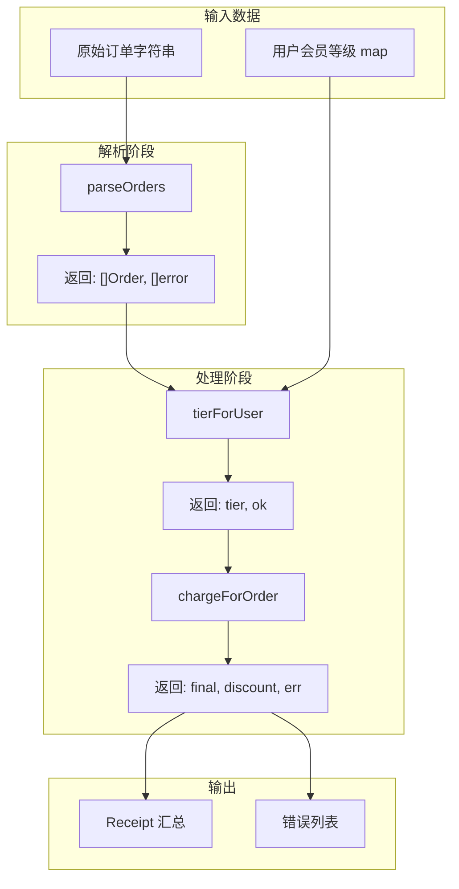
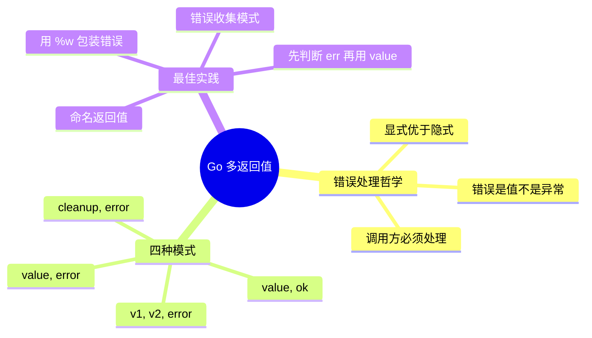

# 写作前的代码理解摘要

## 项目地图

- **main 入口文件**：`series/07/cmd/receipt/main.go`
- **核心业务逻辑**：全部在 `main.go` 中，通过订单计费场景演示多返回值模式
- **关键结构体**：
  - `Order`：订单结构体，包含 ID、用户、金额、状态
  - `Receipt`：汇总结构体，记录处理数、跳过数、总额、折扣、实收

## 核心三问

1. **解决的痛点**：线上结算服务出现"部分订单少扣钱"，排查发现函数只返回 bool，错误细节丢失。Go 的多返回值机制让错误信息显式传递，避免"错误不可见"和"信息散落"的问题。

2. **核心技术实现**：展示 Go 多返回值的四种典型模式——`(value, error)` 标准错误返回、`(value, ok)` 存在性检查、`(v1, v2, error)` 多值+错误、`(cleanup, error)` 资源释放函数返回。通过 `%w` 动词实现错误链包装，让上层知道"在哪失败"+"为什么失败"。

3. **适用场景**：任何需要精细错误处理的业务系统，特别是订单处理、支付结算、数据解析等需要收集多条错误并汇总的场景。

## Go 语言特性提取

- **多返回值**：Go 函数可返回多个值，是错误处理的基石
- **error 接口**：Go 的错误是值，不是异常，必须显式处理
- **%w 错误包装**：`fmt.Errorf("context: %w", err)` 保留错误链
- **value, ok 模式**：map 查找、类型断言的惯用法
- **命名返回值**：`func f() (result int, err error)` 可在函数体内直接赋值
- **闭包返回**：`writeReceipt` 返回 cleanup 函数，展示函数作为返回值

---

**标题备选**

- A（痛点型）：那个"少扣钱"的 Bug，让我重新理解了 Go 的错误处理
- B（干货型）：Go 多返回值的四种模式：从 value,err 到 cleanup 函数
- C（悬念型）：为什么 Go 不用 try-catch？聊聊显式错误处理的哲学

---

## 1. 场景复现：那个让我头疼的时刻

上线一周的结算服务，运营反馈"有些订单好像少扣钱了"。

我翻了半天日志，只看到一句"process ok"。问题是，哪个订单？少扣了多少？为什么少扣？一概不知。

追到代码里一看，差点气笑了：

```go
func processOrder(order Order) bool {
    // ... 一堆逻辑
    if err != nil {
        return false  // 错误细节？没了
    }
    return true
}
```

调用方只知道"成功或失败"，至于失败的原因、失败的订单、失败的金额——全部丢失在函数内部。

这就是典型的"错误不可见"问题。在 Java 里你可能会抛异常，但 Go 选择了另一条路：**多返回值**。

今天这篇文章，我用一个订单计费的完整示例，带你把 Go 的多返回值模式用顺。

## 2. 架构蓝图：上帝视角看设计

这个演示项目模拟了一个订单计费流程，核心是展示多返回值的四种典型模式：



每个函数都有明确的返回值契约，调用方一眼就知道能拿到什么、需要处理什么。

## 3. 源码拆解：手把手带你读核心

### 3.1 模式一：value + error（最常用）

```go
func parseOrderLine(line string) (Order, error) {
    parts := strings.Split(line, ",")
    if len(parts) != 4 {
        return Order{}, fmt.Errorf("字段数量应为 4，实际 %d", len(parts))
    }
    
    amount, err := strconv.ParseFloat(parts[2], 64)
    if err != nil {
        return Order{}, fmt.Errorf("金额解析失败: %w", err)
    }
    
    return Order{
        ID:     strings.TrimSpace(parts[0]),
        User:   strings.TrimSpace(parts[1]),
        Amount: amount,
        Status: strings.TrimSpace(parts[3]),
    }, nil
}
```

**知识点贴士**：Go 没有 try-catch，错误就是普通的返回值。`if err != nil` 是你会写一万遍的代码，习惯就好。

**为什么用 `%w` 而不是 `%v`？** `%w` 会保留原始错误，上层可以用 `errors.Is()` 或 `errors.As()` 来判断具体错误类型。这叫**错误链**。

### 3.2 模式二：value + ok（存在性检查）

```go
func tierForUser(user string, tiers map[string]string) (string, bool) {
    tier, ok := tiers[user]
    return tier, ok
}
```

**这是 Go 的惯用法**。从 map 里取值时，第二个返回值 `ok` 告诉你 key 是否存在。如果你只写 `tier := tiers[user]`，当 key 不存在时会得到零值（空字符串），但你分不清是"值本身就是空"还是"key 不存在"。

**Code Review 视角**：这个函数看起来多此一举（直接用 map 语法不就行了？），但它的价值在于**封装意图**。调用方看到 `tierForUser` 就知道这是在查会员等级，比裸用 map 更有语义。

### 3.3 模式三：多值 + error（需要额外信息）

```go
func chargeForOrder(order Order, tier string) (final float64, discount float64, err error) {
    if order.Status != "paid" {
        return 0, 0, fmt.Errorf("状态为 %s，跳过计费", order.Status)
    }
    
    rate, err := discountRate(tier)
    if err != nil {
        return 0, 0, err
    }
    
    discount = order.Amount * rate
    final = order.Amount - discount
    return final, discount, nil
}
```

**为什么返回三个值？** 因为调用方既需要知道"实收多少"，也需要知道"折扣多少"。如果只返回 final，调用方还得自己算折扣，重复劳动。

**注意命名返回值**：`(final float64, discount float64, err error)` 这种写法叫命名返回值。好处是函数签名就是文档，一眼看出每个返回值的含义。

### 3.4 模式四：cleanup + error（资源释放）

```go
func writeReceipt(path string, r Receipt) (cleanup func() error, err error) {
    f, err := os.Create(path)
    if err != nil {
        return nil, err
    }
    
    cleanup = func() error {
        return f.Close()
    }
    
    if _, err := fmt.Fprintf(f, "..."); err != nil {
        return cleanup, err  // 即使写入失败，也要返回 cleanup
    }
    return cleanup, nil
}
```

**这是个高级技巧**。函数返回一个"清理函数"，让调用方决定什么时候关闭文件。这在需要延迟释放资源的场景很有用。

**Code Review 视角**：注意即使写入失败，也要返回 cleanup。因为文件已经打开了，不管后续操作成功与否，都需要关闭。

### 3.5 错误收集模式

```go
func parseOrders(raw string) ([]Order, []error) {
    var orders []Order
    var errs []error
    
    for scanner.Scan() {
        order, err := parseOrderLine(line)
        if err != nil {
            errs = append(errs, fmt.Errorf("line %d: %w", lineNo, err))
            continue  // 不中断，继续处理下一行
        }
        orders = append(orders, order)
    }
    
    return orders, errs
}
```

**这是"尽量多处理"的策略**。遇到错误不立即返回，而是收集起来，最后一起报告。适合批量数据处理场景。

## 4. 避坑指南 & 深度思考

| 坑点 | 症状 | 解决方案 |
|------|------|----------|
| 忽略 error | `res, _ := f()` 吞掉错误 | 必须处理或向上返回 |
| 变量遮蔽 | if 内的 err 不等于外层 err | 拆分声明或改名 |
| 零值陷阱 | 返回零值但忘记检查 error | 先判断 err，再用 value |
| 裸返回滥用 | 大函数用 naked return 难读 | 仅在短函数使用 |
| 缺少上下文 | `return err` 不知道哪步出错 | 用 `%w` 包装错误 |

**深度思考**：Go 的错误处理被很多人吐槽"啰嗦"，但它的好处是**错误路径显式可见**。你不会被一个深层的异常突然打断，每个可能出错的地方都有明确的处理代码。

## 5. 快速上手 & 改造建议

**运行命令**：

```bash
go run ./series/07/cmd/receipt
```

**工程化改造建议**：

1. **自定义错误类型**：把 `[]error` 封装成 `type ParseErrors []error`，实现 `Error()` 方法，让它可以作为单个 error 返回。

2. **错误码体系**：在生产环境中，给每种错误定义错误码，方便监控和告警分类。

3. **结构化日志**：用 `slog` 或 `zap` 记录错误，包含 order_id、user、amount 等字段，方便排查。

## 6. 总结与脑图

- **Go 的错误是值**：不是异常，必须显式处理
- **四种返回模式**：`(v, err)`、`(v, ok)`、`(v1, v2, err)`、`(cleanup, err)`
- **用 `%w` 包装错误**：保留错误链，让上层知道完整上下文
- **错误收集模式**：批量处理时不中断，最后汇总报告
- **命名返回值**：函数签名即文档



把这些模式用熟，你的 Go 代码会变得更健壮。下次再遇到"错误信息丢失"的问题，先检查函数签名和错误处理，大概率能快速定位。
