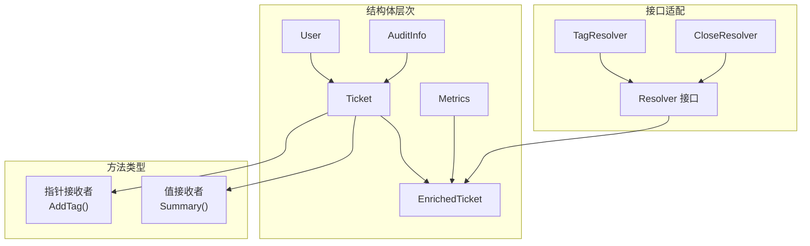
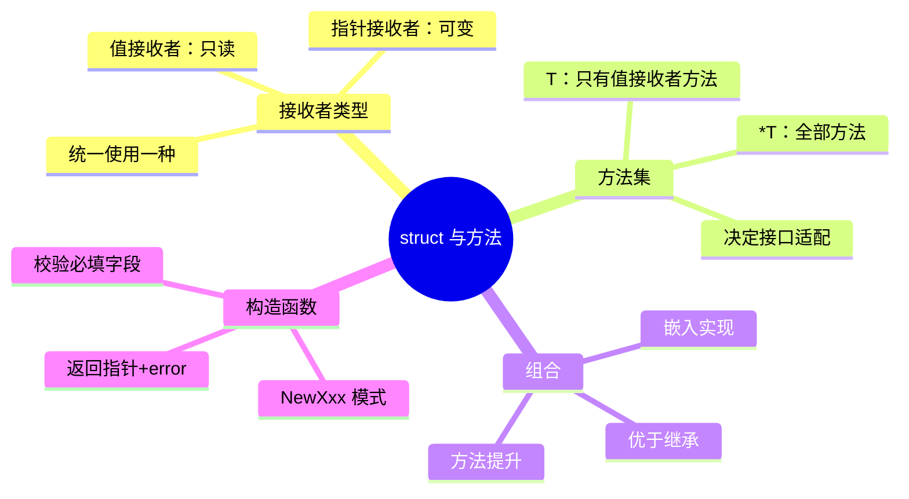

# 写作前的代码理解摘要

## 项目地图

- **main 入口文件**：`series/08/cmd/ticket/main.go`
- **核心业务逻辑**：全部在 `main.go` 中，通过工单处理场景演示 struct 与方法
- **关键结构体/接口**：
  - `User`：用户信息
  - `AuditInfo`：审计信息，演示方法提升
  - `Ticket`：工单核心结构体
  - `Metrics`：指标统计
  - `EnrichedTicket`：组合结构体，嵌入 Ticket 和 Metrics
  - `Resolver`：接口，演示方法集与接口适配

## 核心三问

1. **解决的痛点**：开发者给 struct 加了多个匿名字段导致方法名冲突，或者把方法全写成值接收者导致状态修改不生效。Go 没有 class，但用 struct + 方法 + 组合可以写出清晰的对象风格代码。

2. **核心技术实现**：通过工单处理场景展示四个核心概念——值接收者（只读）vs 指针接收者（可变）、方法集决定接口适配、嵌入实现方法提升、构造函数模式 `NewXxx() (*T, error)`。关键 Trick 是理解"值类型方法集只包含值接收者方法，指针类型方法集包含全部方法"。

3. **适用场景**：任何需要面向对象风格的 Go 项目，特别是工单系统、订单处理、状态机等需要封装状态和行为的业务场景。

## Go 语言特性提取

- **struct 嵌入**：匿名字段实现组合，方法自动提升
- **值接收者 vs 指针接收者**：`func (t Ticket)` vs `func (t *Ticket)`
- **方法集**：决定类型能否实现某个接口
- **接口隐式实现**：无需 implements 关键字
- **构造函数模式**：`NewXxx() (*T, error)` 惯用法
- **零值可用**：struct 零值字段为各类型零值

---

**标题备选**

- A（痛点型）：那个"修改不生效"的 Bug，让我搞懂了值接收者和指针接收者
- B（干货型）：Go 的"面向对象"：struct、方法集与组合的正确打开方式
- C（悬念型）：为什么 Go 没有 class？聊聊组合优于继承的设计哲学

---

## 1. 场景复现：那个让我头疼的时刻

上周 Code Review，我看到一段让人窒息的代码：

```go
func (t Ticket) AddTag(tag string) {
    t.Tags = append(t.Tags, tag)
}

// 调用
ticket.AddTag("urgent")
fmt.Println(ticket.Tags)  // 还是空的！
```

写代码的同事一脸懵："我明明调用了 AddTag，为什么标签没加上？"

问题出在**值接收者**。`func (t Ticket)` 拿到的是 ticket 的副本，你在副本上 append，原来的 ticket 当然不会变。

这不是个例。我见过太多人踩这个坑：

- 把所有方法都写成值接收者，结果状态改不动
- 给 struct 加了五个匿名字段，方法名冲突了
- 实现接口时报错"does not implement"，明明方法都写了

今天这篇文章，我用一个工单处理的完整示例，把 Go 的 struct 与方法讲透。

## 2. 架构蓝图：上帝视角看设计

这个演示项目模拟了一个工单处理系统，核心是展示 struct 与方法的四个关键概念：



通过嵌入（embedding），`EnrichedTicket` 自动获得了 `Ticket` 和 `AuditInfo` 的方法。这就是 Go 的"组合优于继承"。

## 3. 源码拆解：手把手带你读核心

### 3.1 值接收者 vs 指针接收者

```go
// 值接收者：只读，不修改原对象
func (t Ticket) Summary() string {
    return fmt.Sprintf("%s (%s) [%s]", t.Title, t.User.Name, strings.Join(t.Tags, ","))
}

// 指针接收者：可以修改原对象
func (t *Ticket) AddTag(tag string) bool {
    if tag == "" {
        return false
    }
    t.Tags = append(t.Tags, tag)
    return true
}
```

**知识点贴士**：在 Go 里，`func (t Ticket)` 和 `func (t *Ticket)` 是两种不同的方法。前者拿到的是副本，后者拿到的是指针。

**什么时候用哪个？**
- **值接收者**：方法只读取数据，不修改状态（如 `String()`、`Summary()`）
- **指针接收者**：方法需要修改状态，或者 struct 很大想避免拷贝

**Code Review 视角**：一个 struct 的方法最好统一用一种接收者。如果混用，容易让人困惑"这个方法会不会改状态"。

### 3.2 方法集与接口适配

```go
type Resolver interface {
    Resolve(t *EnrichedTicket) error
}

type TagResolver struct {
    Tag string
}

// 值接收者实现接口
func (r TagResolver) Resolve(t *EnrichedTicket) error {
    t.AddTag(r.Tag)
    return nil
}
```

**这里有个关键规则**：
- **值类型 T** 的方法集：只包含值接收者方法
- **指针类型 *T** 的方法集：包含值接收者 + 指针接收者方法

所以如果你的接口需要指针接收者方法，你必须用 `*T` 来实现接口，不能用 `T`。

### 3.3 嵌入与方法提升

```go
type AuditInfo struct {
    CreatedBy string
    UpdatedBy string
}

func (a AuditInfo) Label() string {
    return fmt.Sprintf("created_by=%s updated_by=%s", a.CreatedBy, a.UpdatedBy)
}

type Ticket struct {
    ID     string
    Title  string
    AuditInfo  // 匿名嵌入
}

// 现在 Ticket 可以直接调用 Label()
ticket.Label()  // 等价于 ticket.AuditInfo.Label()
```

**这就是 Go 的"组合"**。通过匿名嵌入，`Ticket` 自动获得了 `AuditInfo` 的所有方法。这不是继承，是组合——`Ticket` 里面有一个 `AuditInfo`，只是语法上可以省略中间层。

**Code Review 视角**：如果多个嵌入字段有同名方法，会产生冲突。这时候必须显式调用 `ticket.AuditInfo.Label()`。

### 3.4 构造函数模式

```go
func NewTicket(id, title, userName, tier string) (*Ticket, error) {
    if id == "" || title == "" || userName == "" {
        return nil, fmt.Errorf("id/title/user 不能为空")
    }
    return &Ticket{
        ID:        id,
        Title:     title,
        Status:    "new",
        Tags:      []string{"triage"},
        User:      User{ID: "u-" + userName, Name: userName, Tier: tier},
        AuditInfo: AuditInfo{CreatedBy: userName, UpdatedBy: userName},
    }, nil
}
```

**Go 没有构造函数关键字**，但 `NewXxx() (*T, error)` 是惯用模式。返回指针是因为：
1. 避免拷贝大 struct
2. 让调用方明确知道这是一个"新创建的对象"
3. 可以返回 nil 表示创建失败

### 3.5 接口驱动的流水线

```go
func runPipeline(ticket EnrichedTicket) {
    pipeline := []Resolver{
        TagResolver{Tag: "ops"},
        TagResolver{Tag: "mobile"},
        CloseResolver{},
    }
    
    for _, step := range pipeline {
        if err := step.Resolve(&ticket); err != nil {
            fmt.Printf("处理失败: %v\n", err)
            return
        }
    }
}
```

**这是 Go 接口的典型用法**。`Resolver` 接口定义了"能处理工单"的契约，具体怎么处理由各个实现决定。你可以随时加新的 Resolver，不用改流水线代码。

## 4. 避坑指南 & 深度思考

| 坑点 | 症状 | 解决方案 |
|------|------|----------|
| 值接收者修改无效 | 调用方法后状态没变 | 改用指针接收者 |
| 方法集不匹配 | "does not implement" 报错 | 用 *T 而不是 T |
| 嵌入字段冲突 | 方法调用模糊 | 显式命名或显式调用 |
| 构造函数缺校验 | 零值对象导致 panic | 在 NewXxx 里检查必填字段 |
| 暴露内部切片 | 外部修改破坏封装 | 返回副本 |

**深度思考**：Go 的"组合优于继承"不是口号，是真的没有继承。这意味着你不能用"父类指针指向子类对象"这种多态，但你可以用接口实现更灵活的多态。

## 5. 快速上手 & 改造建议

**运行命令**：

```bash
go run ./series/08/cmd/ticket
```

**工程化改造建议**：

1. **统一接收者类型**：一个 struct 的方法要么全用值接收者，要么全用指针接收者，别混用。

2. **接口要小**：Go 的接口应该小而精，一个接口 1-3 个方法就够了。大接口拆成小接口组合。

3. **构造函数加 Option 模式**：当参数很多时，用函数式选项模式 `NewTicket(id, title, WithUser(...), WithTags(...))`。

## 6. 总结与脑图

- **值接收者只读，指针接收者可变**：需要改状态就用指针
- **方法集决定接口适配**：指针类型的方法集更大
- **嵌入实现组合**：匿名字段的方法会被提升
- **构造函数返回指针**：`NewXxx() (*T, error)` 是惯用模式
- **接口要小**：小接口更灵活，更容易组合



把这些概念理清，你的 Go 代码会更有"对象"的味道。下次再遇到"修改不生效"的问题，先检查接收者类型，大概率能快速定位。
