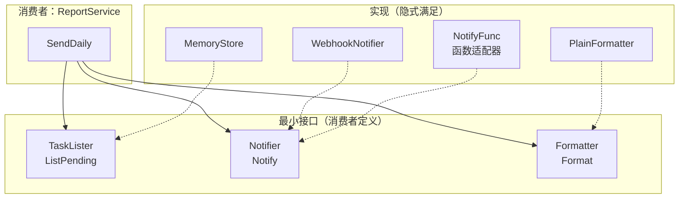
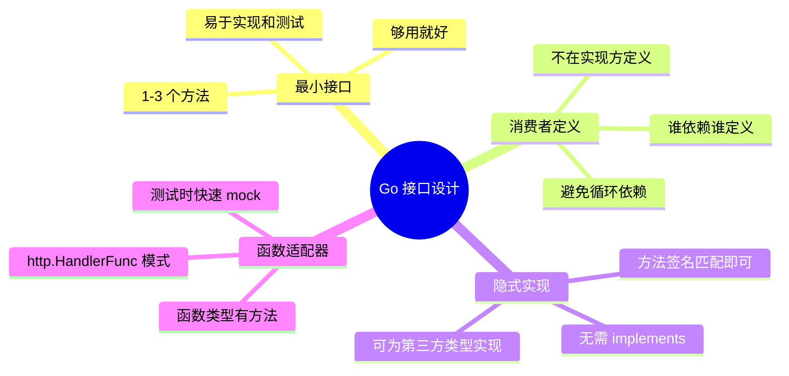

# 写作前的代码理解摘要

## 项目地图

- **main 入口文件**：`series/09/cmd/notifier/main.go`
- **核心业务逻辑**：全部在 `main.go` 中，通过待办通知场景演示接口设计
- **关键接口/结构体**：
  - `TaskLister`：最小接口，只有 `ListPending()` 方法
  - `Notifier`：最小接口，只有 `Notify()` 方法
  - `Formatter`：格式化接口
  - `MemoryStore`：TaskLister 的实现
  - `WebhookNotifier`：Notifier 的 struct 实现
  - `NotifyFunc`：Notifier 的函数类型适配器
  - `ReportService`：依赖三个接口的业务服务

## 核心三问

1. **解决的痛点**：开发者定义了 12 个方法的"大一统接口"，结果没人愿意实现，大家直接 new 具体类型，导致替换实现时牵一发动全身。Go 的接口是隐式实现的，但必须遵守"最小接口、由消费者定义"的原则。

2. **核心技术实现**：展示 Go 接口设计的三个核心原则——最小接口（1-3 个方法）、消费者定义接口（谁依赖谁定义）、函数类型适配器（`NotifyFunc` 实现 `Notifier` 接口）。关键 Trick 是理解"隐式实现"意味着实现方不需要声明 implements，只要方法签名匹配即可。

3. **适用场景**：任何需要依赖注入、可测试性、可替换实现的 Go 项目，特别是通知系统、数据访问层、插件架构等需要抽象的场景。

## Go 语言特性提取

- **接口隐式实现**：无需 implements 关键字，方法集匹配即实现
- **函数类型实现接口**：`type NotifyFunc func(...) error` 可以有方法
- **接口组合**：小接口可以组合成大接口
- **依赖注入**：通过接口参数实现松耦合
- **strings.Builder**：高效字符串拼接

---

**标题备选**

- A（痛点型）：那个 12 个方法的"大接口"，让我重新理解了 Go 的接口设计
- B（干货型）：Go 接口的正确打开方式：最小接口、消费者定义、函数适配器
- C（悬念型）：为什么 Go 没有 implements 关键字？聊聊隐式实现的设计哲学

---

## 1. 场景复现：那个让我头疼的时刻

上个月接手一个老项目，看到一个让我头皮发麻的接口：

```go
type NotificationService interface {
    SendEmail(to, subject, body string) error
    SendSMS(phone, message string) error
    SendPush(deviceID, title, body string) error
    SendWebhook(url string, payload []byte) error
    SendSlack(channel, message string) error
    SendDingTalk(webhook, message string) error
    GetDeliveryStatus(id string) (Status, error)
    RetryFailed(id string) error
    ListFailed(since time.Time) ([]Notification, error)
    MarkAsRead(id string) error
    GetStats() (Stats, error)
    Shutdown() error
}
```

12 个方法的"大一统接口"。

结果呢？没有人愿意实现这个接口。大家都在代码里直接 `new(RealNotificationService)`，测试时要么跳过，要么起一个真实的通知服务。

想换一个实现？牵一发动全身。

这就是典型的"接口污染"。Go 的接口是隐式实现的，但这不意味着你可以随便定义大接口。今天这篇文章，我用一个待办通知的示例，带你理解 Go 接口设计的正确姿势。

## 2. 架构蓝图：上帝视角看设计

这个演示项目的核心是"最小接口"原则：



关键点：
- 接口定义在**消费者侧**（ReportService 需要什么，就定义什么）
- 每个接口只有**1 个方法**
- 实现方**不需要声明** implements

## 3. 源码拆解：手把手带你读核心

### 3.1 最小接口原则

```go
// 消费者定义的接口，只有 1 个方法
type TaskLister interface {
    ListPending() ([]Task, error)
}

type Notifier interface {
    Notify(user string, message string) error
}

type Formatter interface {
    Format(tasks []Task) string
}
```

**知识点贴士**：Go 社区有句话叫"Accept interfaces, return structs"（接受接口，返回结构体）。接口应该小而精，1-3 个方法最佳。

**为什么不定义一个大接口？** 因为：
1. 大接口难以实现——你可能只需要其中一个方法
2. 大接口难以测试——你得 mock 所有方法
3. 大接口难以替换——改一个方法影响所有实现

### 3.2 隐式实现：没有 implements

```go
type MemoryStore struct {
    tasks []Task
}

// 只要有这个方法，就自动实现了 TaskLister
func (m *MemoryStore) ListPending() ([]Task, error) {
    var out []Task
    for _, t := range m.tasks {
        if t.Status == "pending" {
            out = append(out, t)
        }
    }
    return out, nil
}
```

**这是 Go 接口的核心特性**。`MemoryStore` 没有写 `implements TaskLister`，但它有 `ListPending` 方法，所以它就是 `TaskLister`。

**Code Review 视角**：这意味着你可以为任何第三方类型"追加"接口实现，只要方法签名匹配。这在 Java/C# 里是做不到的。

### 3.3 函数类型适配器

```go
// 定义一个函数类型
type NotifyFunc func(user string, message string) error

// 给函数类型加方法，让它实现 Notifier 接口
func (f NotifyFunc) Notify(user string, message string) error {
    return f(user, message)
}

// 使用：把普通函数转成 Notifier
console := NotifyFunc(func(user, message string) error {
    fmt.Printf("[console] to %s:\n%s\n", user, message)
    return nil
})
```

**这是 Go 的一个高级技巧**。函数类型也可以有方法，所以函数也可以实现接口。这在测试时特别有用——你不需要定义一个 struct，直接用闭包就能 mock。

**知识点贴士**：标准库的 `http.HandlerFunc` 就是这个模式。它让普通函数可以作为 HTTP handler 使用。

### 3.4 依赖注入

```go
type ReportService struct {
    store    TaskLister
    notifier Notifier
    builder  Formatter
}

func NewReportService(store TaskLister, notifier Notifier, formatter Formatter) (*ReportService, error) {
    if store == nil || notifier == nil || formatter == nil {
        return nil, errors.New("store/notifier/formatter 不能为空")
    }
    return &ReportService{store: store, notifier: notifier, builder: formatter}, nil
}
```

**ReportService 依赖的是接口，不是具体类型**。这意味着：
- 生产环境可以用 `WebhookNotifier`
- 测试环境可以用 `NotifyFunc` 包装的 mock
- 切换实现不需要改 ReportService 的代码

### 3.5 运行时替换

```go
service, _ := NewReportService(store, webhook, PlainFormatter{})
service.SendDaily("pm-lisa")  // 用 webhook 发送

service.notifier = console    // 运行时替换
service.SendDaily("pm-lisa")  // 用 console 发送
```

**这就是接口的威力**。同一个 service，换一个 notifier 实现，行为就变了。

## 4. 避坑指南 & 深度思考

| 坑点 | 症状 | 解决方案 |
|------|------|----------|
| 接口过大 | 没人愿意实现 | 拆成 1-3 个方法的小接口 |
| 接口定义在实现方 | 调用方被迫依赖实现包 | 把接口移到消费者侧 |
| 滥用 interface{} | 到处是类型断言 | 定义明确的接口 |
| 接口化过度 | 每个 struct 都有接口 | 只在需要替换/测试时抽象 |
| 方法集不匹配 | 编译报错 | 检查值/指针接收者 |

**深度思考**：Go 的隐式实现是一把双刃剑。好处是灵活，坏处是你不知道谁实现了这个接口。所以接口要小，小到一眼就能看出"谁能满足这个契约"。

## 5. 快速上手 & 改造建议

**运行命令**：

```bash
go run ./series/09/cmd/notifier
```

**工程化改造建议**：

1. **接口放在使用方包里**：不要在 `notifier` 包里定义 `Notifier` 接口，而是在需要它的 `report` 包里定义。

2. **用函数适配器做测试**：测试时不需要定义 `MockNotifier` struct，直接用 `NotifyFunc` 包装一个闭包。

3. **组合小接口**：如果某个函数需要多个能力，可以组合接口 `type Repo interface { TaskLister; Saver }`。

## 6. 总结与脑图

- **最小接口原则**：1-3 个方法，够用就好
- **消费者定义接口**：谁依赖谁定义，不要在实现方定义
- **隐式实现**：方法签名匹配就是实现，无需 implements
- **函数适配器**：函数类型也能实现接口，测试利器
- **依赖接口不依赖实现**：让代码可测试、可替换



把这些原则用好，你的 Go 代码会变得更灵活、更可测试。下次再看到"大一统接口"，勇敢地拆分它。
