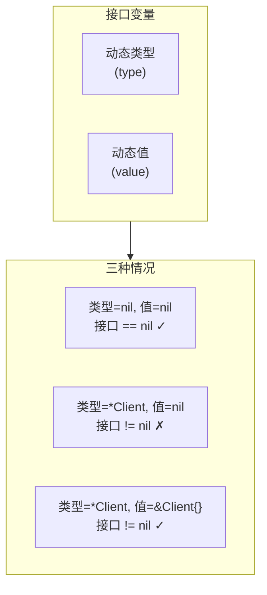
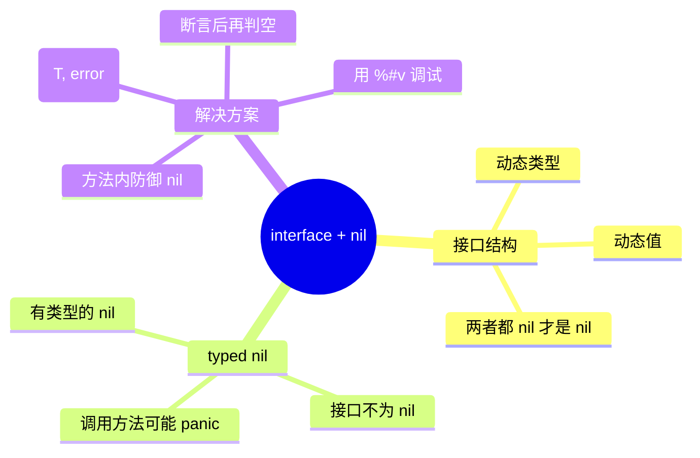

# 写作前的代码理解摘要

## 项目地图

- **main 入口文件**：`series/10/cmd/nilpit/main.go`
- **核心业务逻辑**：全部在 `main.go` 中，通过 5 个场景演示 interface + nil 的陷阱
- **关键接口/结构体**：
  - `Service`：消费者接口
  - `OptionalClient`：可能为 nil 的实现
  - `Processor`：依赖 Service 的处理器

## 核心三问

1. **解决的痛点**：接口变量打印不是 nil，但调用方法就 panic；工厂返回了 nil 却被当成非 nil 继续执行。这是 Go 初学者最容易踩的坑——interface 与 nil 的组合问题。

2. **核心技术实现**：通过 5 个场景演示 typed nil 问题——接口值由"动态类型 + 动态值"组成，只要类型非 nil，接口整体就非 nil。解决方案包括：安全工厂返回 `(Service, error)`、方法内部防御 nil 接收者、断言后再判 nil。

3. **适用场景**：任何使用接口的 Go 项目，特别是插件系统、可选依赖、工厂模式等需要处理"可能为空"的场景。

## Go 语言特性提取

- **接口值的双层结构**：动态类型 + 动态值
- **typed nil**：`(*T)(nil)` 赋给接口后，接口不为 nil
- **nil 接收者**：指针方法可以在 nil 上调用，但访问字段会 panic
- **类型断言**：`svc.(*OptionalClient)` 可能成功但值为 nil
- **防御性编程**：方法内检查 `if c == nil`

---

**标题备选**

- A（痛点型）：那个"不为 nil 却 panic"的 Bug，让我搞懂了 Go 接口的双层结构
- B（干货型）：Go 接口与 nil 的五个陷阱：从 typed nil 到安全工厂
- C（悬念型）：为什么 interface != nil 却还是 panic？Go 初学者第一大坑

---

## 1. 场景复现：那个让我头疼的时刻

线上告警，NPE（空指针异常）。

我看了一眼代码，明明有判空：

```go
if client != nil {
    client.Do()  // panic: nil pointer dereference
}
```

判空了还 panic？这不科学啊。

打印一下：

```go
fmt.Printf("client == nil ? %v\n", client == nil)  // false
fmt.Printf("client = %#v\n", client)               // (*main.Client)(nil)
```

接口不为 nil，但里面装的是个 nil 指针。

这就是 Go 里最诡异的坑之一：**typed nil**。接口变量有两层——动态类型和动态值。只要类型不为 nil，接口整体就不为 nil，即使值是 nil。

今天这篇文章，我用 5 个场景把这个坑彻底讲透。

## 2. 架构蓝图：上帝视角看设计

理解这个问题的关键是理解接口的内部结构：



**关键规则**：接口 == nil 当且仅当类型和值都为 nil。

## 3. 源码拆解：手把手带你读核心

### 3.1 场景一：typed nil 被当成非 nil

```go
func NewClient(enabled bool) Service {
    if !enabled {
        return (*OptionalClient)(nil)  // 返回 typed nil
    }
    return &OptionalClient{Name: "primary"}
}

func main() {
    client := NewClient(false)
    fmt.Printf("client == nil ? %v\n", client == nil)  // false！
}
```

**这是最常见的坑**。工厂函数返回 `(*OptionalClient)(nil)`，这是一个"有类型的 nil"。接口变量的动态类型是 `*OptionalClient`，动态值是 nil。

**知识点贴士**：在 Go 里，`nil` 有类型。`(*int)(nil)` 和 `(*string)(nil)` 是不同的 nil。当你把它们赋给接口时，接口会记住这个类型。

### 3.2 场景二：具体类型 nil，接口非 nil

```go
var c *OptionalClient = nil
var s Service = c
fmt.Printf("具体指针 nil? %v，接口 nil? %v\n", c == nil, s == nil)
// 输出：具体指针 nil? true，接口 nil? false
```

**这就是 typed nil 的本质**。`c` 是 nil，但把它赋给接口 `s` 后，`s` 就不是 nil 了。因为 `s` 知道自己装的是 `*OptionalClient` 类型。

### 3.3 场景三：安全工厂

```go
func NewClientSafe(enabled bool) (Service, error) {
    if !enabled {
        return nil, nil  // 返回真正的 nil
    }
    return &OptionalClient{Name: "primary"}, nil
}

func main() {
    s, _ := NewClientSafe(false)
    fmt.Printf("s == nil ? %v\n", s == nil)  // true！
}
```

**这是解决方案**。不要返回 typed nil，直接返回 `nil, nil` 或 `nil, error`。这样接口变量的类型和值都是 nil，判空才能正常工作。

### 3.4 场景四：方法内防御 nil 接收者

```go
func (c *OptionalClient) Do() error {
    if c == nil {
        return errors.New("OptionalClient is nil")
    }
    fmt.Printf("OptionalClient %s executing...\n", c.Name)
    return nil
}

func main() {
    var c *OptionalClient  // nil
    err := c.Do()          // 不会 panic！
    fmt.Println(err)       // OptionalClient is nil
}
```

**这是另一个解决方案**。在方法内部检查接收者是否为 nil。Go 允许在 nil 指针上调用方法，只要你不访问字段就不会 panic。

**Code Review 视角**：这种防御性编程在"可选组件"场景很有用。比如一个可选的日志记录器，nil 时静默跳过。

### 3.5 场景五：类型断言与 nil

```go
var svc Service
if _, ok := svc.(*OptionalClient); !ok {
    fmt.Println("断言失败")  // 空接口断言任何类型都失败
}

var c *OptionalClient
svc = c
if oc, ok := svc.(*OptionalClient); ok {
    fmt.Printf("断言成功，oc == nil ? %v\n", oc == nil)  // true
}
```

**断言成功不代表值不为 nil**。类型断言只检查动态类型，不检查动态值。所以断言成功后，你还得再判一次 nil。

## 4. 避坑指南 & 深度思考

| 坑点 | 症状 | 解决方案 |
|------|------|----------|
| typed nil | 判空通过但 panic | 工厂返回 `(T, error)` |
| nil 接收者 | 访问字段 panic | 方法内检查 `if c == nil` |
| 断言后不判空 | 断言成功但值为 nil | 断言后再判 nil |
| 空接口传 nil | `interface{}` 持有 typed nil | 保持具体类型或统一判空 |

**深度思考**：为什么 Go 要这样设计？因为接口需要知道类型才能调度方法。如果接口只存值不存类型，它就不知道该调用哪个类型的方法了。这是一个权衡——灵活性带来了复杂性。

## 5. 快速上手 & 改造建议

**运行命令**：

```bash
go run ./series/10/cmd/nilpit
```

**工程化改造建议**：

1. **工厂函数返回 `(T, error)`**：不要返回 typed nil，让调用方通过 error 或 nil 判断。

2. **方法内防御 nil**：对于"可选组件"，在方法开头检查 `if c == nil`。

3. **用 `%#v` 调试**：当你怀疑 typed nil 时，用 `fmt.Printf("%#v", x)` 打印，能看到具体类型。

## 6. 总结与脑图

- **接口有两层**：动态类型 + 动态值
- **typed nil**：类型非 nil，值为 nil，接口整体非 nil
- **安全工厂**：返回 `(T, error)` 而不是 typed nil
- **方法内防御**：检查 `if c == nil`
- **断言后判空**：断言成功不代表值不为 nil



把这个坑记住，你会少踩很多"看似不为 nil 却 panic"的雷。下次遇到诡异的 NPE，先检查是不是 typed nil。
