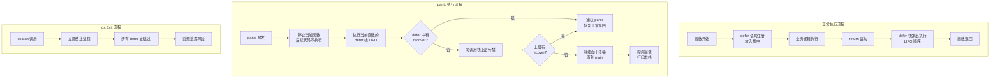

# 写作前的代码理解摘要

## 项目地图

| 类别 | 路径/名称 |
|------|-----------|
| main 入口文件 | `series/11/cmd/safejob/main.go` |
| 核心业务逻辑 | 同上（单文件项目，所有逻辑集中在 main.go） |
| 关键类型 | `Job`（任务函数类型）、`Result`（执行结果结构体） |
| 关键函数 | `SafeExecute`（核心安全执行器，封装 defer/panic/recover） |
| 演示函数 | `demoExit`（演示 os.Exit 跳过 defer 的危险行为） |

## 核心三问

**这个项目解决的具体痛点是什么？**
线上服务偶发 panic，日志只剩一行 "nil pointer dereference"，完全不知道是哪个请求、哪段逻辑出了问题。更糟糕的是，有人在代码里用了 `os.Exit`，导致 defer 里的资源清理（关闭文件、释放连接）全部跳过，引发资源泄露。Go 没有 try-catch，但 defer/panic/recover 组成了异常控制的"三件套"，用好它们能让服务更健壮。

**它的核心技术实现逻辑（Trick）是什么？**
项目通过 `SafeExecute` 函数展示了三个关键机制：1）defer 的 LIFO（后进先出）执行顺序；2）recover 只能在 defer 函数中直接调用才能捕获 panic；3）使用**命名返回值**让 recover 能够修改函数的返回结果。这个 Trick 是很多 HTTP 框架（如 Gin）实现"请求级 panic 恢复"的基础。

**它最适合用在什么业务场景？**
任何需要"不能因为一个 panic 就挂掉整个服务"的场景：HTTP handler、RPC 服务、任务调度器、插件系统、批量数据处理。核心思想是"隔离故障域"——一个请求的 panic 不应该影响其他请求。

## Go 语言特性提取

| 特性 | 项目中的应用 | 后续重点科普 |
|------|-------------|-------------|
| `defer` | 注册延迟调用，LIFO 执行 | defer 的执行时机、参数求值时机 |
| `panic` | 触发运行时恐慌，中止当前函数 | panic 的栈展开机制 |
| `recover` | 在 defer 中捕获 panic | recover 的使用限制和返回值 |
| 命名返回值 | `(res Result)` 让 defer 能修改返回值 | 命名返回值 vs 匿名返回值 |
| 函数类型 | `type Job func() error` | 函数作为一等公民 |
| 闭包 | defer 中的匿名函数捕获外部变量 | 闭包的变量捕获机制 |

---

**备选标题 A（痛点型）**：凌晨三点的 panic 告警，让我彻底搞懂了 defer/panic/recover

**备选标题 B（干货型）**：Go 异常处理三件套：defer、panic、recover 的正确打开方式

**备选标题 C（悬念型）**：为什么 Go 没有 try-catch？聊聊 panic/recover 的设计哲学

---

## 1. 场景复现：那个让我头疼的时刻

凌晨三点，告警电话响了。

我迷迷糊糊地打开电脑，看到监控大盘上一片红色。订单服务挂了，而且是那种"挂了又拉起来、拉起来又挂"的循环。

翻了半天日志，只找到一行：

```
panic: runtime error: invalid memory address or nil pointer dereference
```

没有堆栈，没有请求 ID，没有任何上下文。我盯着这行日志，感觉自己像个瞎子。

花了两个小时，我终于定位到问题：某个边界条件下，一个 map 没初始化就被访问了。但真正让我崩溃的是——**这个 panic 本可以被捕获**，只是之前的代码没有做任何防护。

更离谱的事情发生在第二天。我加了 recover 逻辑，信心满满地上线。结果运维反馈："文件句柄泄露了，服务跑一段时间就报 too many open files。"

追查下来，发现是另一个同事在某个分支里加了 `os.Exit(1)`。这玩意儿会**直接退出进程，跳过所有 defer**。我写的 `defer file.Close()` 根本没执行。

那一刻我意识到，Go 的 defer/panic/recover 看起来简单，但里面的坑比我想象的多得多。

今天这篇文章，我用一个"安全执行器"的示例，把这三个关键字的执行机制、使用限制、常见陷阱全部讲透。

## 2. 架构蓝图：上帝视角看设计

理解 defer/panic/recover 的核心，是理解它们的**执行顺序**和**作用边界**。



**三条核心规则**：

1. **defer 是 LIFO**：后注册的先执行，像栈一样
2. **recover 只在 defer 中生效**：在普通代码里调用 recover 永远返回 nil
3. **os.Exit 是核弹**：它会跳过所有 defer，直接终止进程

## 3. 源码拆解：手把手带你读核心

### 3.1 SafeExecute：安全执行器的核心设计

```go
func SafeExecute(name string, job Job, cleanup func()) (res Result) {
    res.Name = name
    res.Status = "ok"
    start := time.Now()

    // defer 1：记录耗时（最后执行）
    defer func() {
        res.Cost = time.Since(start)
    }()

    // defer 2：执行清理（倒数第二执行）
    defer func() {
        if cleanup != nil {
            cleanup()
        }
    }()

    // defer 3：捕获 panic（最先执行）
    defer func() {
        if r := recover(); r != nil {
            fmt.Printf("[recover] job=%s panic=%v\n", name, r)
            res.Status = "panic"
            res.Err = fmt.Errorf("panic: %v", r)
        }
    }()

    if runErr := job(); runErr != nil {
        res.Status = "error"
        res.Err = runErr
    }

    return res
}
```

这段代码有几个精妙的设计，让我逐一拆解。

**第一个关键点：命名返回值 `(res Result)`**

你注意到函数签名里的 `(res Result)` 了吗？这叫**命名返回值**。它的作用是让 defer 中的代码能够修改最终的返回值。

如果你用匿名返回值 `func SafeExecute(...) Result`，然后在 defer 里写 `res.Status = "panic"`，这个修改是**无效的**——因为 `res` 只是 defer 闭包里的局部变量，和函数的返回值没有关系。

**知识点贴士**：在 Java 里，你可能习惯了 `try { return x; } finally { x = y; }` 这种写法，finally 里的修改不会影响返回值。但 Go 的命名返回值不一样——defer 里对命名返回值的修改**会**反映到最终返回值上。

**第二个关键点：defer 的执行顺序**

代码里注册了三个 defer，执行顺序是：

1. defer 3（recover）最先执行
2. defer 2（cleanup）其次
3. defer 1（记录耗时）最后

这是 LIFO——**后注册的先执行**。为什么这么设计？因为资源的释放顺序通常和获取顺序相反。比如你先打开文件 A，再打开文件 B，关闭时应该先关 B 再关 A。

**第三个关键点：recover 必须在 defer 中直接调用**

```go
defer func() {
    if r := recover(); r != nil {
        // 能捕获到 panic
    }
}()
```

这是**唯一正确的写法**。如果你写成这样：

```go
func myRecover() {
    if r := recover(); r != nil {
        // 永远捕获不到！
    }
}

defer myRecover()  // 错误！
```

为什么？因为 `recover()` 只有在**直接被 defer 调用的函数内部**才能捕获 panic。多包一层函数，recover 就失效了。

**Code Review 视角**：这个限制是 Go 故意设计的。它防止你在任意位置"偷偷"捕获 panic，强迫你在函数边界显式处理。这让错误处理更可控、更可预测。

### 3.2 defer 的参数求值时机

这是一个经典的坑，让我用代码演示：

```go
func demo() {
    i := 0
    defer fmt.Println("defer 打印:", i)  // 打印 0，不是 1！
    i++
    fmt.Println("正常打印:", i)  // 打印 1
}
```

**defer 的参数在注册时就求值了**，不是在执行时。所以 `fmt.Println("defer 打印:", i)` 里的 `i` 在 defer 语句执行的那一刻就被"快照"成 0 了。

如果你想捕获最终值，用闭包：

```go
defer func() {
    fmt.Println("defer 打印:", i)  // 打印 1
}()
```

闭包捕获的是变量的**引用**，不是值。所以执行时会读取 `i` 的最新值。

**知识点贴士**：这个行为和 JavaScript 的闭包类似。如果你写过 `for` 循环里的 `setTimeout`，应该对这种"变量捕获"问题不陌生。

### 3.3 panic 的栈展开机制

当 panic 发生时，Go 会做以下事情：

1. **停止当前函数的执行**：panic 后面的代码不会运行
2. **执行当前函数的 defer 栈**：按 LIFO 顺序
3. **向调用栈上层传播**：如果没有 recover，继续展开
4. **直到 main 函数**：如果 main 也没有 recover，程序崩溃

让我用示例代码演示：

```go
SafeExecute("panic", func() error {
    defer fmt.Println("  [panic] defer 1")  // 第二个执行
    defer fmt.Println("  [panic] defer 2")  // 第一个执行
    panic("未知 panic：nil pointer")
    fmt.Println("这行永远不会执行")
    return nil
}, func() {
    fmt.Println("  [panic] cleanup: close files")  // 第三个执行
})
```

执行顺序：
1. panic 触发
2. job 内的 defer 2 执行（打印 "[panic] defer 2"）
3. job 内的 defer 1 执行（打印 "[panic] defer 1"）
4. job 函数返回，panic 向上传播到 SafeExecute
5. SafeExecute 的 defer 3（recover）捕获 panic
6. SafeExecute 的 defer 2（cleanup）执行
7. SafeExecute 的 defer 1（记录耗时）执行
8. SafeExecute 正常返回

**关键理解**：panic 不是"立即崩溃"，而是"有序撤退"。它会给你机会执行 defer 里的清理逻辑。

### 3.4 os.Exit：最危险的操作

```go
func demoExit() {
    defer fmt.Println("  [exit] 我不会被打印")
    os.Exit(1)
}
```

`os.Exit` 会**立即终止进程**，不执行任何 defer。这意味着：

- 文件没关
- 数据库连接没断
- 日志没刷
- 锁没释放

**这是生产环境的定时炸弹**。

**最佳实践**：

1. **只在 main 函数的最外层使用 os.Exit**
2. **确保 os.Exit 之前没有必须执行的 defer**
3. **优先使用 return 或 panic 来退出**

如果你真的需要在某个地方退出程序，考虑用 panic + 顶层 recover 的方式，这样至少 defer 会执行。

### 3.5 跨 goroutine 的 panic

这是另一个重要的限制：**recover 只能捕获当前 goroutine 的 panic**。

```go
func main() {
    defer func() {
        if r := recover(); r != nil {
            fmt.Println("捕获到了吗？", r)  // 永远不会执行
        }
    }()
    
    go func() {
        panic("goroutine 里的 panic")  // 这个 panic 无法被 main 的 recover 捕获
    }()
    
    time.Sleep(time.Second)
}
```

这个程序会崩溃，因为 goroutine 里的 panic 无法被 main 的 recover 捕获。

**解决方案**：每个 goroutine 都要有自己的 recover：

```go
func safeGo(fn func()) {
    go func() {
        defer func() {
            if r := recover(); r != nil {
                log.Printf("goroutine panic: %v\n%s", r, debug.Stack())
            }
        }()
        fn()
    }()
}
```

## 4. 避坑指南 & 深度思考

| 坑点 | 症状 | 解决方案 |
|------|------|----------|
| defer 参数提前求值 | 打印的是旧值，不是最新值 | 用闭包捕获变量引用 |
| recover 不在 defer 中 | panic 捕获不到，程序崩溃 | 确保 recover 在 defer 的匿名函数里直接调用 |
| recover 包了一层函数 | `defer myRecover()` 无效 | 直接写 `defer func() { recover() }()` |
| panic 后返回零值 | 调用方拿到的是空结果 | 用命名返回值，在 recover 里设置返回值 |
| os.Exit 跳过 defer | 资源泄露、数据丢失 | 避免使用，或只在 main 最外层使用 |
| 跨 goroutine recover | 子 goroutine 的 panic 无法捕获 | 每个 goroutine 单独 recover |
| 库代码吞掉 panic | 错误被隐藏，难以排查 | recover 后记录日志并返回 error |

**深度思考：为什么 Go 不用 try-catch？**

很多从 Java/Python 转过来的开发者会问这个问题。Go 的设计哲学是**"错误是值"**：

- **大多数错误应该通过返回值处理**：`result, err := doSomething()`
- **panic 只用于"不可恢复的 bug"**：比如数组越界、空指针、程序员的逻辑错误
- **recover 是"最后的防线"**：用于防止一个 bug 搞挂整个服务

这种设计让错误处理更**显式**、更**可控**。你不会被一个深层的异常突然打断，每个可能出错的地方都有明确的处理代码。

**这个 Demo 与生产环境的差距**：

1. **缺少堆栈信息**：生产环境应该用 `debug.Stack()` 记录完整堆栈
2. **缺少结构化日志**：应该用 slog/zap 记录 panic 信息，包含请求 ID、用户 ID 等上下文
3. **缺少监控告警**：panic 应该触发告警，而不是静默恢复
4. **缺少限流熔断**：如果某个接口频繁 panic，应该触发熔断

## 5. 快速上手 & 改造建议

**运行命令**：

```bash
cd series/11
go run ./cmd/safejob
```

你会看到类似这样的输出：

```
=== defer / panic / recover 演示 ===
  [normal] defer #2 (LIFO)
  [normal] defer #1
  [with-error] defer 也会执行
  [with-error] cleanup: release db connection
  [panic] defer 2
  [panic] defer 1
[recover] job=panic panic=未知 panic：nil pointer
  [panic] cleanup: close files
...
```

**工程化改造建议**：

**1. HTTP handler 包一层 recover**

```go
func RecoverMiddleware(next http.Handler) http.Handler {
    return http.HandlerFunc(func(w http.ResponseWriter, r *http.Request) {
        defer func() {
            if err := recover(); err != nil {
                // 记录堆栈
                stack := debug.Stack()
                log.Printf("panic: %v\n%s", err, stack)
                
                // 返回 500
                http.Error(w, "Internal Server Error", http.StatusInternalServerError)
            }
        }()
        next.ServeHTTP(w, r)
    })
}
```

**2. goroutine 入口封装 safeGo**

```go
func safeGo(fn func()) {
    go func() {
        defer func() {
            if r := recover(); r != nil {
                log.Printf("goroutine panic: %v\n%s", r, debug.Stack())
                // 可以在这里上报监控
                metrics.PanicCounter.Inc()
            }
        }()
        fn()
    }()
}

// 使用
safeGo(func() {
    // 你的业务逻辑
})
```

**3. 用命名返回值让 recover 能修改结果**

```go
func ProcessOrder(orderID string) (result *Order, err error) {
    defer func() {
        if r := recover(); r != nil {
            err = fmt.Errorf("panic processing order %s: %v", orderID, r)
            result = nil
        }
    }()
    
    // 业务逻辑
    return doProcess(orderID)
}
```

## 6. 总结与脑图

- **defer 是 LIFO**：后注册的先执行，像栈一样弹出
- **defer 参数在注册时求值**：想捕获最新值要用闭包
- **recover 只在 defer 中生效**：而且必须直接调用，不能包一层函数
- **panic 沿栈展开**：执行完当前函数的 defer 后向上传播
- **os.Exit 跳过一切**：不执行任何 defer，是生产环境的定时炸弹
- **跨 goroutine 无法 recover**：每个 goroutine 要有自己的 recover


把这些规则记住，你的 Go 服务会更健壮。下次再遇到"偶发 panic"，先检查有没有 recover 兜底，再看看是不是有人用了 os.Exit。
