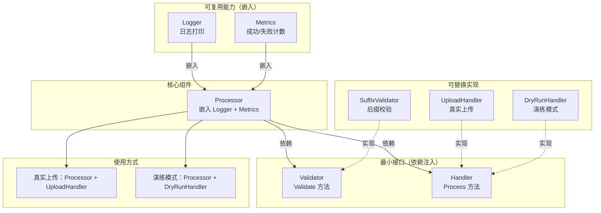
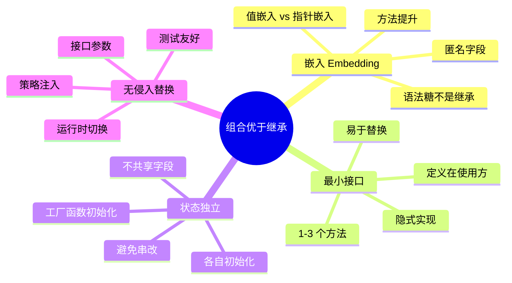

# 写作前的代码理解摘要

## 项目地图

| 类别 | 路径/名称 |
|------|-----------|
| main 入口文件 | `series/12/cmd/composite/main.go` |
| 核心业务逻辑 | 同上（单文件项目，通过文件处理场景演示组合模式） |
| 关键结构体 | `Logger`（日志能力）、`Metrics`（指标能力）、`Processor`（核心处理器） |
| 关键接口 | `Validator`（校验接口）、`Handler`（处理接口） |
| 接口实现 | `SuffixValidator`、`UploadHandler`、`DryRunHandler` |

## 核心三问

**这个项目解决的具体痛点是什么？**
为了复用日志、指标、校验等通用逻辑，传统 OOP 语言会用继承，但继承层层嵌套后会变成"继承地狱"：父类方法名冲突、子类状态串改、改一处动全身。Go 没有继承，用"组合 + 方法提升"替代，让代码更清晰、更灵活。

**它的核心技术实现逻辑（Trick）是什么？**
项目展示了 Go 组合的两个核心机制：1）**嵌入（embedding）**——把 `Logger` 和 `*Metrics` 作为匿名字段嵌入 `Processor`，它们的方法会被"提升"到 `Processor`，可以直接调用 `p.Info()` 和 `p.MarkSuccess()`；2）**最小接口**——`Validator` 和 `Handler` 各只有一个方法，实现简单、替换灵活。

**它最适合用在什么业务场景？**
任何需要"拼装能力"的场景：处理器、中间件、插件系统、策略模式。核心思想是"能力是可插拔的"——今天用真实上传，明天换成演练模式，只需要换一个参数，不需要改调用方代码。

## Go 语言特性提取

| 特性 | 项目中的应用 | 后续重点科普 |
|------|-------------|-------------|
| struct 嵌入 | `Processor` 嵌入 `Logger` 和 `*Metrics` | 嵌入 vs 字段、方法提升机制 |
| 方法提升 | `p.Info()` 实际调用 `p.Logger.Info()` | 提升的优先级和冲突处理 |
| 最小接口 | `Validator` 和 `Handler` 各一个方法 | 接口设计的最佳实践 |
| 值接收者 vs 指针接收者 | `Logger` 用值，`Metrics` 用指针 | 什么时候用哪种 |
| 构造函数模式 | `NewProcessor`、`NewUploadHandler` | Go 没有构造函数，用工厂函数替代 |
| 接口参数 | `Handle(items, validator, handler)` | 依赖注入的 Go 风格实现 |

---

**备选标题 A（痛点型）**：告别"继承地狱"：Go 的组合模式让我的代码清晰了 10 倍

**备选标题 B（干货型）**：Go 组合优于继承：嵌入、方法提升与无侵入替换实战

**备选标题 C（悬念型）**：为什么 Go 没有继承？用了组合之后我再也不想回去了

---

## 1. 场景复现：那个让我头疼的时刻

接手一个 Java 项目的第一天，我打开 IDE，看到了这样的继承链：

```
BaseProcessor
  └── LoggingProcessor
        └── MetricsProcessor
              └── ValidatingProcessor
                    └── RetryProcessor
                          └── UploadProcessor
```

六层继承。我当时的表情大概是这样的：😐

更离谱的是，`LoggingProcessor` 和 `MetricsProcessor` 都有一个 `reset()` 方法。当我在 `UploadProcessor` 里调用 `super.reset()` 时，我根本不知道调的是哪个。

后来需求变了，要加一个"演练模式"——不真正上传，只打印日志。按照继承的思路，我得再加一个 `DryRunUploadProcessor`，继承自 `UploadProcessor`，然后覆写 `upload()` 方法。

但问题来了：`DryRunUploadProcessor` 还需要 `RetryProcessor` 的重试逻辑吗？如果不需要，我是不是得再搞一个 `DryRunValidatingProcessor`？

这就是**继承地狱**。改一个父类方法，五个子类全炸。加一个新功能，继承链要重新设计。

后来我开始写 Go，发现 Go 根本没有继承。一开始我还觉得不方便，但用了组合之后，我发现代码反而更清晰了。

今天这篇文章，我用一个文件处理的示例，带你理解 Go 的"组合优于继承"。

## 2. 架构蓝图：上帝视角看设计

这个示例的核心思想是**能力拼装**：把日志、指标、校验、处理等能力拆成独立的组件，按需组合。



**关键设计点**：

1. **嵌入获得能力**：`Processor` 嵌入 `Logger` 和 `Metrics`，自动获得它们的方法
2. **接口实现解耦**：`Validator` 和 `Handler` 是接口，可以随时替换实现
3. **无继承链**：每个组件独立，没有父子关系

## 3. 源码拆解：手把手带你读核心

### 3.1 嵌入与方法提升：组合的核心机制

```go
type Logger struct {
    Prefix string
}

func (l Logger) Info(msg string) {
    fmt.Printf("[%s] %s\n", l.Prefix, msg)
}

type Metrics struct {
    success int
    failed  int
}

func (m *Metrics) MarkSuccess() {
    m.success++
}

func (m *Metrics) MarkFailed() {
    m.failed++
}
```

这是两个独立的"能力"：`Logger` 负责打印日志，`Metrics` 负责统计成功/失败次数。

现在看 `Processor` 如何组合它们：

```go
type Processor struct {
    Logger           // 嵌入 Logger（值类型）
    *Metrics         // 嵌入 *Metrics（指针类型）
    Name string
}
```

**知识点贴士**：当你把一个类型作为**匿名字段**嵌入 struct 时，它的方法会被"提升"到外层。这意味着你可以直接调用 `p.Info()` 而不是 `p.Logger.Info()`。

```go
func (p *Processor) Handle(items []string, validator Validator, handler Handler) error {
    p.Info(fmt.Sprintf("handling %d items", len(items)))  // 直接调用 Logger.Info
    
    for _, item := range items {
        if err := validator.Validate(item); err != nil {
            p.MarkFailed()  // 直接调用 Metrics.MarkFailed
            continue
        }
        if err := handler.Process(item); err != nil {
            p.MarkFailed()
            continue
        }
        p.MarkSuccess()  // 直接调用 Metrics.MarkSuccess
    }
    return nil
}
```

**Code Review 视角：为什么嵌入 `*Metrics` 而不是 `Metrics`？**

看 `MarkSuccess` 的接收者：

```go
func (m *Metrics) MarkSuccess() {
    m.success++
}
```

这是**指针接收者**，因为它需要修改 `Metrics` 的状态。如果你嵌入的是值类型 `Metrics`，每次调用 `p.MarkSuccess()` 时，Go 会自动取地址，但这个地址指向的是 `Processor` 内部的 `Metrics` 副本。

听起来没问题？问题在于，如果你这样写：

```go
type Processor struct {
    Metrics  // 值类型嵌入
}

proc := Processor{}
proc.MarkSuccess()  // 修改的是 proc.Metrics
```

这确实能工作。但如果你把 `Processor` 作为值传递给另一个函数：

```go
func doSomething(p Processor) {
    p.MarkSuccess()  // 修改的是副本！
}
```

这时候修改就丢失了。嵌入指针 `*Metrics` 可以避免这个问题——所有副本共享同一个 `Metrics` 实例。

**知识点贴士**：在 Java 里，所有对象都是引用类型，你不需要考虑这个问题。但 Go 的 struct 是值类型，传递时会复制。这是 Go 和 Java 的一个重要区别。

### 3.2 最小接口：灵活替换的基础

```go
type Validator interface {
    Validate(item string) error
}

type Handler interface {
    Process(item string) error
}
```

**每个接口只有一个方法**。这是 Go 接口设计的最佳实践，有个专门的名字叫 **Single Method Interface**。

为什么要这么小？因为**接口越小，实现越容易，替换越灵活**。

想象一下，如果 `Handler` 接口有 10 个方法：

```go
type Handler interface {
    Process(item string) error
    Retry(item string) error
    Validate(item string) error
    Log(msg string)
    // ... 还有 6 个
}
```

你想实现一个 `DryRunHandler`，就得实现所有 10 个方法，即使你只关心 `Process`。

但如果接口只有一个方法，实现起来就很轻松：

```go
type DryRunHandler struct {
    Logger
}

func (h DryRunHandler) Process(item string) error {
    h.Info("dry-run " + item)
    return nil
}
```

三行代码，搞定。

**Code Review 视角：接口应该定义在哪里？**

Go 的惯例是**接口定义在使用方，而不是实现方**。

在 Java 里，你可能会在 `handler` 包里定义 `Handler` 接口，然后让 `UploadHandler`、`DryRunHandler` 都实现它。

但在 Go 里，`Validator` 和 `Handler` 应该定义在 `Processor` 所在的包里——因为是 `Processor` 在使用它们。这样做的好处是：

1. **实现方不需要依赖接口定义**：`UploadHandler` 不需要 import 任何接口包
2. **接口可以按需定义**：不同的使用方可以定义不同的接口

这就是 Go 的**隐式接口实现**——只要你的类型有 `Process(item string) error` 方法，它就自动实现了 `Handler` 接口，不需要显式声明 `implements Handler`。

### 3.3 无侵入替换：组合的威力

```go
func main() {
    items := []string{"report.pdf", "avatar.png", "notes.txt"}
    validator := SuffixValidator{AllowedSuffix: ".png"}
    
    // 真实上传
    uploader := NewUploadHandler("uploader")
    proc := NewProcessor("processor")
    proc.Handle(items, validator, uploader)
    
    // 演练模式——不改 Processor，只换 Handler
    dry := DryRunHandler{Logger{Prefix: "dry"}}
    proc2 := NewProcessor("processor-dry")
    proc2.Handle(items, validator, dry)
}
```

**这就是组合的威力**。`Processor` 不关心 `Handler` 是真实上传还是演练，它只关心 `Handler` 有 `Process` 方法。

对比一下继承的写法：

```java
// Java 风格
class UploadProcessor extends ValidatingProcessor {
    void process(String item) { /* 真实上传 */ }
}

class DryRunProcessor extends ValidatingProcessor {
    void process(String item) { /* 演练 */ }
}
```

你需要两个类，而且它们都要继承 `ValidatingProcessor`。如果 `ValidatingProcessor` 改了，两个子类都受影响。

Go 的组合风格：

```go
// Go 风格
proc.Handle(items, validator, uploader)   // 真实上传
proc.Handle(items, validator, dryRunner)  // 演练模式
```

同一个 `Processor`，换一个参数就行。**这就是"无侵入替换"**。

### 3.4 状态独立：避免继承的"状态串改"问题

```go
type UploadHandler struct {
    Logger
    store map[string]string  // 自己的状态
}

type Processor struct {
    Logger
    *Metrics  // 自己的状态
    Name string
}
```

每个组件有**自己的状态**。`UploadHandler` 的 `store` 和 `Processor` 的 `Metrics` 互不影响。

这和继承不同。在继承体系里，子类共享父类的状态：

```java
class BaseProcessor {
    protected int counter;  // 所有子类共享
}

class UploadProcessor extends BaseProcessor {
    void process() {
        counter++;  // 修改父类状态
    }
}

class DryRunProcessor extends BaseProcessor {
    void process() {
        counter++;  // 也修改父类状态，可能冲突
    }
}
```

如果 `UploadProcessor` 和 `DryRunProcessor` 对 `counter` 的理解不一样，就会出问题。

Go 的组合避免了这个问题——**每个组件管理自己的状态，通过方法暴露能力，而不是共享字段**。

### 3.5 构造函数模式：初始化嵌入字段

```go
func NewProcessor(name string) *Processor {
    return &Processor{
        Logger:  Logger{Prefix: name},
        Metrics: &Metrics{},  // 必须初始化！
        Name:    name,
    }
}

func NewUploadHandler(prefix string) *UploadHandler {
    return &UploadHandler{
        Logger: Logger{Prefix: prefix},
        store:  make(map[string]string),  // 必须初始化！
    }
}
```

**知识点贴士**：Go 没有构造函数，但有**工厂函数**的惯例——以 `New` 开头的函数，返回初始化好的实例。

为什么需要工厂函数？因为嵌入的指针和 map 必须初始化：

```go
// 错误示例
proc := Processor{}
proc.MarkSuccess()  // panic: nil pointer dereference
// 因为 proc.Metrics 是 nil
```

工厂函数确保所有字段都被正确初始化。

## 4. 避坑指南 & 深度思考

| 坑点 | 症状 | 解决方案 |
|------|------|----------|
| 嵌入字段命名冲突 | 两个匿名字段有同名方法，编译报错 | 显式命名字段，或用限定调用 `p.Logger.Info()` |
| 嵌入指针未初始化 | `nil pointer dereference` | 用工厂函数初始化 |
| 嵌入 map/slice 未初始化 | `panic: assignment to entry in nil map` | 工厂函数里 `make()` |
| 值类型嵌入 + 值传递 | 状态修改丢失 | 嵌入指针，或用指针接收者 |
| 接口过大 | 实现困难，替换麻烦 | 拆成最小接口，每个 1-3 个方法 |
| 想"覆写"方法 | Go 没有覆写机制 | 用策略注入（接口参数） |

**深度思考：嵌入不是继承**

很多人把 Go 的嵌入当成"继承的替代品"，但它们有本质区别：

| 特性 | 继承 | 嵌入 |
|------|------|------|
| 关系 | is-a（是一个） | has-a（有一个） |
| 多态 | 子类可以覆写父类方法 | 没有覆写，只有提升 |
| 状态 | 子类共享父类状态 | 各自独立 |
| 耦合 | 紧耦合，改父类影响子类 | 松耦合，组件独立 |

**嵌入只是语法糖**，让你少写几个字符。`p.Info()` 本质上就是 `p.Logger.Info()` 的简写。没有多态覆盖，没有 super 调用，没有继承链。

**这个 Demo 与生产环境的差距**：

1. **缺少错误聚合**：生产环境应该收集所有错误，而不是只打印日志
2. **缺少并发安全**：`Metrics` 的计数器在并发场景下需要加锁或用 atomic
3. **缺少配置注入**：`Logger` 的 `Prefix` 应该从配置读取，而不是硬编码
4. **缺少生命周期管理**：`UploadHandler` 的 `store` 应该有清理机制

## 5. 快速上手 & 改造建议

**运行命令**：

```bash
cd series/12
go run ./cmd/composite
```

你会看到类似这样的输出：

```
=== 组合优于继承：行为嵌入示例 ===
[processor] handling 3 items
[processor] skip invalid item "report.pdf": suffix must be ".png"
[uploader] uploading avatar.png
[processor] skip invalid item "notes.txt": suffix must be ".png"
Uploader metrics: success=1 failed=2

切换 Handler 为 DryRun（无侵入替换）
[processor-dry] handling 3 items
[processor-dry] skip invalid item "report.pdf": suffix must be ".png"
[dry] dry-run avatar.png
[processor-dry] skip invalid item "notes.txt": suffix must be ".png"
DryRun metrics: success=1 failed=2
```

**工程化改造建议**：

**1. 能力拆成独立包**

```
internal/
  logger/
    logger.go      // Logger struct
  metrics/
    metrics.go     // Metrics struct
  processor/
    processor.go   // Processor struct
    validator.go   // Validator interface
    handler.go     // Handler interface
```

**2. 接口定义在使用方**

```go
// processor/handler.go
package processor

// Handler 定义在 processor 包，因为是 Processor 在使用它
type Handler interface {
    Process(item string) error
}
```

```go
// upload/handler.go
package upload

// UploadHandler 不需要 import processor 包
// 只要有 Process 方法，就自动实现了 processor.Handler
type UploadHandler struct {
    // ...
}

func (h *UploadHandler) Process(item string) error {
    // ...
}
```

**3. 并发安全的 Metrics**

```go
type Metrics struct {
    success atomic.Int64
    failed  atomic.Int64
}

func (m *Metrics) MarkSuccess() {
    m.success.Add(1)
}

func (m *Metrics) Snapshot() (int64, int64) {
    return m.success.Load(), m.failed.Load()
}
```

## 6. 总结与脑图

- **组合替代继承**：把能力作为字段嵌入，按需拼装，而不是层层继承
- **方法提升**：匿名字段的方法可以直接调用，是语法糖不是继承
- **最小接口**：每个接口 1-3 个方法，易于实现、易于替换
- **接口定义在使用方**：实现方不需要依赖接口定义
- **状态独立**：每个组件有自己的状态，不共享、不串改
- **无侵入替换**：通过接口参数，换实现不改调用方



把这些原则用好，你的 Go 代码会比继承更清晰、更灵活。下次再想"继承"时，先问问自己：能不能用组合？
