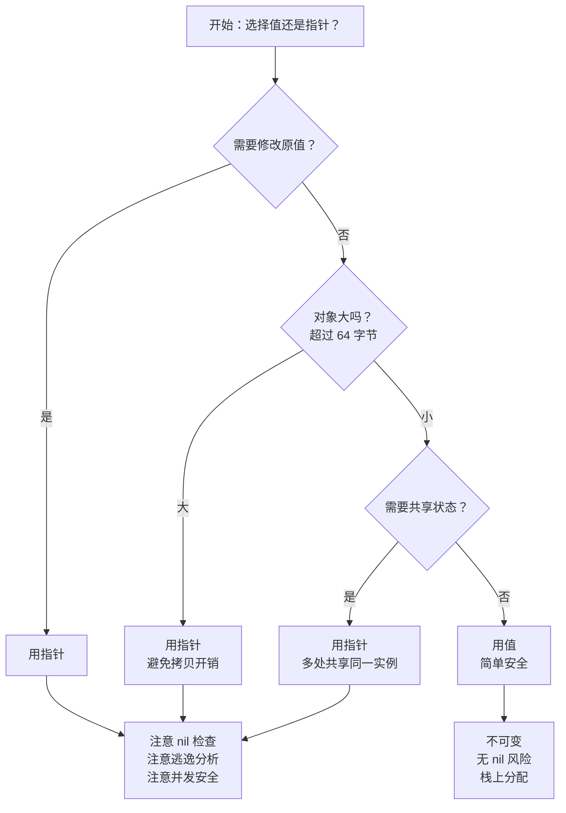
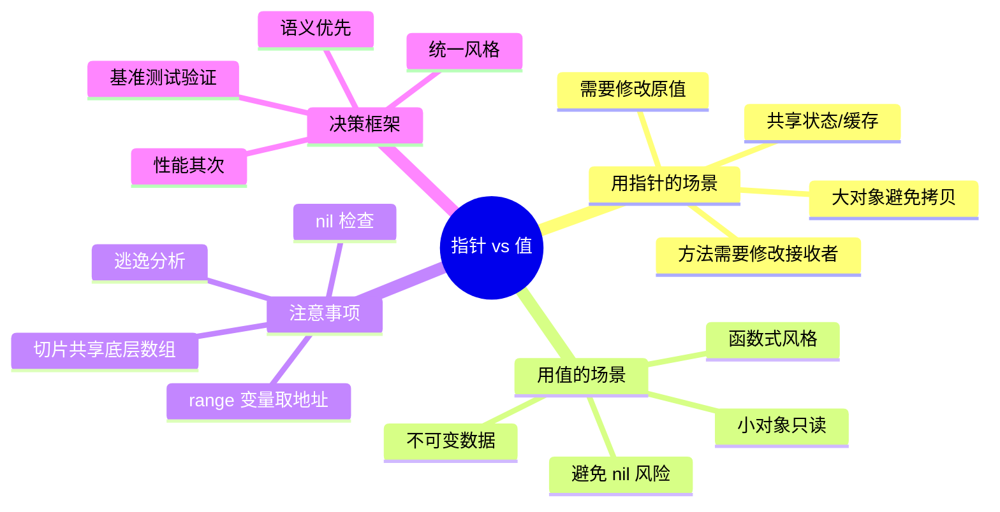

# 写作前的代码理解摘要

## 项目地图

| 类别 | 路径/名称 |
|------|-----------|
| main 入口文件 | `series/13/cmd/ptrdemo/main.go` |
| 核心业务逻辑 | 同上（单文件项目，通过四个场景演示指针与值的选择） |
| 关键结构体 | `User`（用户结构体）、`Payload`（大对象，包含 1KB 数组） |
| 关键函数 | `valueProcessor`（值处理）、`pointerProcessor`（指针处理）、`bumpValue`/`bumpPointer`（参数传递对比） |

## 核心三问

**这个项目解决的具体痛点是什么？**
新手常见的困惑："这个函数明明修改了 user.Score，为什么外面的值没变？"以及"我是不是应该全部用指针？"。一味用值导致频繁拷贝、状态修改无效；一味用指针带来逃逸、空指针 panic 和可变共享问题。关键在于理解**语义和成本**的权衡。

**它的核心技术实现逻辑（Trick）是什么？**
项目通过四个场景演示指针与值的选择：1）值拷贝 vs 指针原地修改；2）函数参数传递对比；3）大对象传参的性能差异；4）缓存复用场景。核心 Trick 是建立一个决策框架：**需要修改 → 用指针；大对象 → 用指针；共享状态 → 用指针；小对象只读 → 用值**。

**它最适合用在什么业务场景？**
任何需要在性能和可维护性之间做权衡的 Go 项目：处理大数据结构、缓存系统、状态管理、高性能服务。理解指针与值的选择，是写出高效 Go 代码的基础。

## Go 语言特性提取

| 特性 | 项目中的应用 | 后续重点科普 |
|------|-------------|-------------|
| 值语义 vs 指针语义 | `bumpValue` vs `bumpPointer` | Go 的值传递本质 |
| 切片的底层结构 | `[]User` vs `[]*User` | 切片是引用类型的"假象" |
| 逃逸分析 | `go build -gcflags=-m` | 什么情况会逃逸到堆 |
| 方法接收者 | 值接收者 vs 指针接收者 | 如何选择接收者类型 |
| map 存储指针 | `cache := map[int]*User{}` | 缓存场景的常见模式 |
| 零值可用 | `var out []int` 可以直接 append | Go 的零值设计哲学 |

---

**备选标题 A（痛点型）**：那个"修改不生效"的 Bug，让我彻底搞懂了 Go 的指针

**备选标题 B（干货型）**：Go 指针使用指南：什么时候用值，什么时候用指针

**备选标题 C（悬念型）**：指针不是洪水猛兽：Go 开发者必须掌握的指针决策框架

---

## 1. 场景复现：那个让我头疼的时刻

新同事入职第一周，就来问我一个问题：

"这个函数明明修改了 user.Score，为什么外面的值没变？"

我凑过去看他的代码：

```go
func bumpScore(u User) {
    u.Score += 10
    fmt.Println("函数内:", u.Score)  // 100
}

func main() {
    user := User{Score: 90}
    bumpScore(user)
    fmt.Println("函数外:", user.Score)  // 还是 90！
}
```

我看了一眼："你传的是值，不是指针。Go 是值传递，函数拿到的是副本。"

他恍然大悟，然后问了第二个问题："那我是不是应该全部用指针？"

这个问题我被问过无数次。答案是：**不是**。

全部用指针会带来新的问题：
- **空指针 panic**：忘记初始化就解引用
- **逃逸到堆**：本来可以在栈上的变量被迫分配到堆上，增加 GC 压力
- **可变共享**：多个地方持有同一个指针，修改会互相影响

指针不是洪水猛兽，也不是万能药。关键在于**语义和成本**：
- 需要修改吗？
- 对象大吗？
- 需要共享状态吗？

今天这篇文章，我用四个场景帮你建立指针使用的直觉。

## 2. 架构蓝图：上帝视角看设计

指针选择的决策树：



**核心原则**：**语义优先，性能其次**。先问"需不需要改"，再问"大不大"。

## 3. 源码拆解：手把手带你读核心

### 3.1 场景一：值拷贝 vs 指针原地修改

```go
type User struct {
    ID    int
    Name  string
    Score int
    Tags  []string
}
```

先看值处理：

```go
func valueProcessor(users []User) []User {
    out := make([]User, len(users))
    copy(out, users)  // 复制一份
    for i := range out {
        out[i].Score += 10
        out[i].Tags = append(out[i].Tags, "value-copy")
    }
    return out  // 返回新切片
}
```

再看指针处理：

```go
func pointerProcessor(users []*User) {
    for _, u := range users {
        if u == nil {
            continue  // 指针要检查 nil
        }
        u.Score += 20
        u.Tags = append(u.Tags, "ptr-mutate")
    }
    // 不需要返回，原地修改
}
```

**什么时候用哪个？**

| 场景 | 选择 | 原因 |
|------|------|------|
| 想保持原值不变 | 值处理 | 函数式风格，无副作用 |
| 想原地修改 | 指针处理 | 避免复制，直接改 |
| 需要返回修改后的数据 | 值处理 | 更清晰的数据流 |
| 批量更新大量对象 | 指针处理 | 性能更好 |

**知识点贴士**：Go 的切片本身是一个"胖指针"（包含指针、长度、容量），传递切片不会复制底层数组。但 `[]User` 里的每个 `User` 是值类型，遍历时会复制。如果你写 `for _, u := range users { u.Score++ }`，修改的是副本，原切片不变。

### 3.2 场景二：函数参数传递

这是最常见的坑，让我详细演示：

```go
func bumpValue(u User) {
    u.Score += 5
    u.Tags = append(u.Tags, "bumpValue")
    fmt.Printf("函数内: Score=%d, Tags=%v\n", u.Score, u.Tags)
}

func bumpPointer(u *User) {
    u.Score += 5
    u.Tags = append(u.Tags, "bumpPointer")
    fmt.Printf("函数内: Score=%d, Tags=%v\n", u.Score, u.Tags)
}
```

调用对比：

```go
user := User{Score: 90, Tags: []string{"original"}}

bumpValue(user)
fmt.Printf("bumpValue 后: Score=%d, Tags=%v\n", user.Score, user.Tags)
// Score=90, Tags=[original]  —— 没变！

bumpPointer(&user)
fmt.Printf("bumpPointer 后: Score=%d, Tags=%v\n", user.Score, user.Tags)
// Score=95, Tags=[original bumpPointer]  —— 变了！
```

**为什么 bumpValue 里的修改没生效？**

Go 是**值传递**。调用 `bumpValue(user)` 时，Go 会复制整个 `User` struct，函数拿到的是副本。你在副本上改，原值当然不变。

**知识点贴士**：如果你是 Java 程序员，可能会困惑——Java 里对象不是引用传递吗？其实 Java 也是值传递，只不过传递的是"引用的值"。Go 更直接：struct 是值类型，传递时复制整个 struct；指针是值类型，传递时复制指针（8 字节）。

**一个微妙的细节：Tags 切片**

你可能注意到，`bumpValue` 里 `append(u.Tags, "bumpValue")` 也没影响原值。这是因为 `append` 可能会创建新的底层数组。

但如果切片容量足够，`append` 不会创建新数组，这时候修改**会**影响原值：

```go
user := User{Tags: make([]string, 0, 10)}  // 预分配容量
user.Tags = append(user.Tags, "original")

bumpValue(user)
// 如果 append 没有触发扩容，原切片的底层数组会被修改！
```

这是一个隐蔽的坑。**如果你不想让函数修改原值，要么用深拷贝，要么明确文档说明**。

### 3.3 场景三：大对象传参

```go
type Payload struct {
    Data [1024]byte  // 1KB 的数组
}

func processValue(p Payload) {
    _ = p.Data[0]  // 每次调用都要复制 1KB
}

func processPointer(p *Payload) {
    _ = p.Data[0]  // 只传 8 字节的指针
}
```

**性能差异有多大？**

```go
// 基准测试结果（示意）
BenchmarkProcessValue-8     1000000    1200 ns/op    1024 B/op
BenchmarkProcessPointer-8   5000000     240 ns/op       0 B/op
```

值传递每次调用都要复制 1KB，指针传递只复制 8 字节。差距是 5 倍。

**多大算"大对象"？**

没有绝对标准，但一般来说：
- **小于 64 字节**：用值，栈上分配，复制成本低
- **64-256 字节**：看情况，如果是热路径考虑用指针
- **大于 256 字节**：用指针，避免复制开销

**知识点贴士**：你可以用 `go build -gcflags=-m` 查看逃逸分析。如果看到 `moved to heap`，说明变量逃逸到堆上了。堆分配比栈分配慢，而且需要 GC 回收。

### 3.4 场景四：缓存复用

```go
cache := map[int]*User{}

getOrCreate := func(id int) *User {
    if u, ok := cache[id]; ok {
        return u  // 返回缓存的指针
    }
    u := &User{ID: id, Name: fmt.Sprintf("user-%d", id)}
    cache[id] = u
    return u
}

// 使用
u1 := getOrCreate(100)
u1.Score++  // 直接修改缓存中的对象

u2 := getOrCreate(100)
fmt.Println(u2.Score)  // 1，因为 u1 和 u2 指向同一个对象
```

**这是指针的典型用法**。缓存存指针，多次获取返回同一个对象，修改会反映到缓存中。

**Code Review 视角：为什么用 `map[int]*User` 而不是 `map[int]User`？**

如果用 `map[int]User`，每次 `cache[id]` 返回的是**值的副本**：

```go
cache := map[int]User{}
cache[100] = User{ID: 100, Score: 0}

u := cache[100]
u.Score++  // 修改的是副本

fmt.Println(cache[100].Score)  // 还是 0！
```

更糟糕的是，你不能直接修改 map 里的值：

```go
cache[100].Score++  // 编译错误：cannot assign to struct field in map
```

这是 Go 的设计限制。用 `map[int]*User` 可以避免这个问题。

**但指针缓存也有风险**：

```go
u := getOrCreate(100)
go func() {
    u.Score++  // goroutine 1 修改
}()
go func() {
    u.Score++  // goroutine 2 也修改，数据竞争！
}()
```

多个 goroutine 共享同一个指针，需要加锁或用 atomic。

### 3.5 方法接收者：值 vs 指针

```go
type Counter struct {
    count int
}

// 值接收者：不能修改原值
func (c Counter) IncrementValue() {
    c.count++  // 修改的是副本
}

// 指针接收者：可以修改原值
func (c *Counter) IncrementPointer() {
    c.count++  // 修改原值
}
```

**选择原则**：

| 情况 | 选择 | 原因 |
|------|------|------|
| 需要修改接收者 | 指针接收者 | 值接收者修改无效 |
| 接收者是大对象 | 指针接收者 | 避免复制 |
| 接收者包含 sync.Mutex | 指针接收者 | Mutex 不能复制 |
| 一致性 | 统一风格 | 一个类型的方法要么全用值，要么全用指针 |

**知识点贴士**：Go 会自动处理值和指针的转换。如果你有一个值 `c`，调用 `c.IncrementPointer()` 时，Go 会自动取地址 `(&c).IncrementPointer()`。反过来，如果你有一个指针 `p`，调用 `p.IncrementValue()` 时，Go 会自动解引用 `(*p).IncrementValue()`。

## 4. 避坑指南 & 深度思考

| 坑点 | 症状 | 解决方案 |
|------|------|----------|
| 值传递修改无效 | 函数内修改了，外面没变 | 传指针，或返回新值 |
| nil 指针 panic | `panic: runtime error: invalid memory address` | 使用前判空，或用工厂函数初始化 |
| range 变量取地址 | 所有指针指向同一个变量 | 用索引 `&items[i]`，或在循环内创建局部变量 |
| 切片共享底层数组 | 修改一个切片影响另一个 | 用 `copy` 深拷贝，或 `append` 触发扩容 |
| 指针逃逸到堆 | GC 压力增大，性能下降 | 用 `-gcflags=-m` 分析，热路径避免不必要的指针 |
| 误以为指针总比值快 | 小对象用指针反而慢 | 基准测试验证，语义优先 |

**range 变量取地址的坑**：

```go
users := []User{{ID: 1}, {ID: 2}, {ID: 3}}
var ptrs []*User

for _, u := range users {
    ptrs = append(ptrs, &u)  // 错误！所有指针指向同一个变量
}

for _, p := range ptrs {
    fmt.Println(p.ID)  // 全是 3！
}
```

**为什么？** 因为 `u` 是循环变量，每次迭代复用同一个内存地址。`&u` 取的是这个地址，循环结束后 `u` 的值是最后一个元素。

**正确写法**：

```go
for i := range users {
    ptrs = append(ptrs, &users[i])  // 用索引
}

// 或者
for _, u := range users {
    u := u  // 创建局部变量
    ptrs = append(ptrs, &u)
}
```

**知识点贴士**：Go 1.22 修复了这个问题，循环变量每次迭代都是新的。但如果你的代码要兼容旧版本，还是要注意这个坑。

**深度思考：Go 的设计哲学**

Go 的设计哲学是**"显式优于隐式"**。指针让你明确表达：
- "我要改它"（指针参数）
- "我要共享它"（返回指针）
- "我不改它"（值参数）

这比 Java 的"一切皆引用"更清晰。在 Java 里，你传一个对象进去，不知道函数会不会改它。在 Go 里，看参数类型就知道。

## 5. 快速上手 & 改造建议

**运行命令**：

```bash
cd series/13
go run ./cmd/ptrdemo
```

**查看逃逸分析**：

```bash
go build -gcflags=-m ./cmd/ptrdemo
```

你会看到类似这样的输出：

```
./main.go:15:2: moved to heap: u
./main.go:23:9: &User{...} escapes to heap
```

`moved to heap` 表示变量逃逸到堆上了。

**工程化改造建议**：

**1. 方法接收者统一风格**

```go
// 好：一个类型的方法全用指针接收者
type User struct { ... }

func (u *User) UpdateScore(delta int) { u.Score += delta }
func (u *User) AddTag(tag string) { u.Tags = append(u.Tags, tag) }
func (u *User) String() string { return fmt.Sprintf("User{ID:%d}", u.ID) }

// 不好：混用值和指针接收者
func (u User) GetScore() int { return u.Score }  // 值接收者
func (u *User) SetScore(s int) { u.Score = s }   // 指针接收者
```

**2. 大对象用指针，小对象用值**

```go
// 小对象：用值
type Point struct {
    X, Y float64  // 16 字节
}

func Distance(a, b Point) float64 {  // 值传递 OK
    dx := a.X - b.X
    dy := a.Y - b.Y
    return math.Sqrt(dx*dx + dy*dy)
}

// 大对象：用指针
type Image struct {
    Pixels [1024 * 1024]byte  // 1MB
}

func Process(img *Image) {  // 指针传递
    // ...
}
```

**3. 零值可用优先于指针表示可选**

```go
// 不好：用指针表示可选
type Config struct {
    Timeout *time.Duration  // nil 表示"未设置"
}

// 好：用零值表示默认
type Config struct {
    Timeout time.Duration  // 0 表示"使用默认值"
}

func (c Config) GetTimeout() time.Duration {
    if c.Timeout == 0 {
        return 30 * time.Second  // 默认值
    }
    return c.Timeout
}
```

## 6. 总结与脑图

- **Go 是值传递**：函数参数、赋值、range 都是复制
- **需要修改 → 用指针**：否则修改无效
- **大对象 → 用指针**：避免复制开销（一般 >64 字节）
- **共享状态 → 用指针**：缓存、单例等场景
- **小对象只读 → 用值**：简单安全，无 nil 风险
- **语义优先，性能其次**：先保证正确性，再考虑优化



把这个决策框架记住，你就不会再纠结"该用指针还是值"了。下次遇到"修改不生效"的 Bug，先检查是不是值传递的问题。
