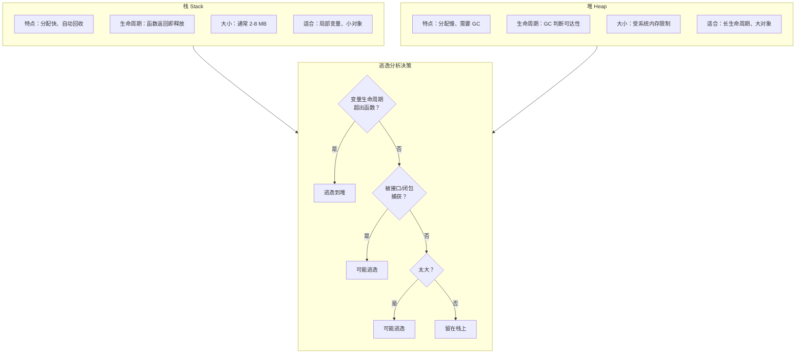
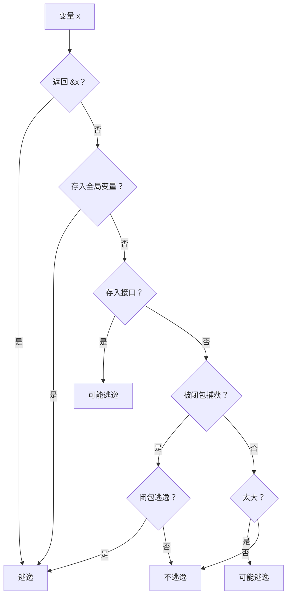
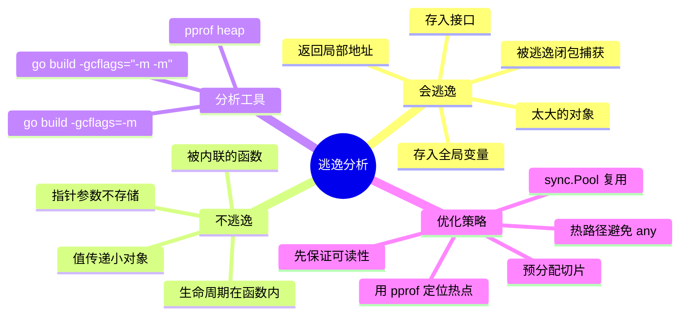

# 写作前的代码理解摘要

## 项目地图

| 类别 | 路径/名称 |
|------|-----------|
| main 入口文件 | `series/14/cmd/escape/main.go` |
| 核心业务逻辑 | 同上（单文件项目，通过五个场景演示逃逸分析） |
| 关键结构体 | `Record`（包含 512 字节数组的大对象） |
| 关键函数 | `newRecord`（返回局部地址，会逃逸）、`sum`（不逃逸）、`buildSlice`（切片返回，底层数组逃逸）、`storeInInterface`（接口存储导致逃逸）、`touchLarge`（指针参数但不逃逸） |

## 核心三问

**这个项目解决的具体痛点是什么？**
开发者常有两个误解：1）"用指针就会逃逸到堆上"；2）"值传递就在栈上"。现实更精细——逃逸由编译器根据**变量生命周期**决定，指针只是信号之一。不理解逃逸分析，就无法解释为什么有些代码 GC 压力大、内存飙升。

**它的核心技术实现逻辑（Trick）是什么？**
项目通过五个场景演示逃逸的不同情况：1）返回局部变量地址 → 必逃逸；2）简单计算 → 不逃逸；3）返回切片 → 底层数组逃逸；4）存入接口 → 可能逃逸；5）指针参数不存储 → 不逃逸。核心 Trick 是用 `go build -gcflags=-m` 查看编译器的逃逸分析输出。

**它最适合用在什么业务场景？**
任何需要优化内存分配和 GC 压力的 Go 项目：高性能服务、热点路径优化、内存敏感的嵌入式场景。理解逃逸分析，是写出"对 GC 友好"代码的基础。

## Go 语言特性提取

| 特性 | 项目中的应用 | 后续重点科普 |
|------|-------------|-------------|
| 逃逸分析 | 编译器静态分析变量生命周期 | 逃逸的判断规则 |
| 栈 vs 堆 | 栈分配快、自动回收；堆需要 GC | 两种内存的特点 |
| `-gcflags=-m` | 查看逃逸分析输出 | 如何解读输出 |
| 接口的动态类型 | `any` 存储导致逃逸 | 接口的内存布局 |
| 内联优化 | 内联可以减少逃逸 | 内联与逃逸的关系 |
| 切片的底层数组 | 返回切片时底层数组逃逸 | 切片的内存结构 |

---

**备选标题 A（痛点型）**：那个"内存飙升"的问题，让我搞懂了 Go 的逃逸分析

**备选标题 B（干货型）**：Go 逃逸分析深入浅出：变量什么时候在栈，什么时候在堆

**备选标题 C（悬念型）**：指针就会逃逸？这个误解让你的 Go 程序慢了 10 倍

---

## 1. 场景复现：那个让我头疼的时刻

线上服务的内存曲线一直在涨，GC 压力很大。

我用 pprof 一看，堆分配热点在一个看起来很简单的函数：

```go
func newRecord(id int) *Record {
    r := Record{ID: id}
    return &r  // 返回局部变量地址
}
```

同事看了一眼说："这不是很正常吗？返回指针，调用方能用。"

我说："问题是，这个函数每秒被调用 10 万次。每次调用都在堆上分配一个 `Record`，GC 压力能不大吗？"

他问："那怎么办？不返回指针？"

我说："不是不能返回指针，而是要理解**什么时候会逃逸到堆上**。有些情况可以避免，有些情况避免不了。"

那天晚上，我花了几个小时研究 Go 的逃逸分析。今天这篇文章，我把这些知识整理出来，帮你建立对逃逸的直觉。

## 2. 架构蓝图：上帝视角看设计

先理解两个概念：**栈**和**堆**。



**核心原则**：编译器会尽量把变量放在栈上（快、不需要 GC），但如果变量的**生命周期超出函数**，就必须放到堆上。

## 3. 源码拆解：手把手带你读核心

### 3.1 场景一：返回局部变量地址 → 必逃逸

```go
type Record struct {
    ID   int
    Data [512]byte
    Meta string
}

func newRecord(id int) *Record {
    r := Record{ID: id, Meta: "stack?"}
    return &r  // r 必须逃逸到堆
}
```

**为什么逃逸？**

`r` 是局部变量，按理说函数返回后，栈帧就没了，`r` 的内存也应该被回收。但你返回了 `&r`，调用方还要用这个地址。

如果 `r` 在栈上，函数返回后这块内存就无效了，调用方拿到的是**悬垂指针**（dangling pointer）。

所以编译器必须把 `r` 放到堆上，让它的生命周期超出函数。

**用 `-gcflags=-m` 验证**：

```bash
go build -gcflags="-m" ./cmd/escape
```

输出：

```
./main.go:15:2: moved to heap: r
```

`moved to heap` 就是逃逸的标志。

**知识点贴士**：在 C 语言里，返回局部变量地址是**未定义行为**，可能导致程序崩溃。Go 的逃逸分析自动处理了这个问题，但代价是堆分配。

### 3.2 场景二：简单计算 → 不逃逸

```go
func sum(a, b int) int {
    return a + b  // 全在栈上完成
}
```

**为什么不逃逸？**

参数 `a`、`b` 和返回值都是值类型（int），生命周期不超出函数。编译器可以全部放在栈上，函数返回后自动释放。

这是最理想的情况：**零堆分配**。

### 3.3 场景三：返回切片 → 底层数组逃逸

```go
func buildSlice(n int) []int {
    out := []int{}
    for i := 0; i < n; i++ {
        out = append(out, i)
    }
    return out  // 底层数组必须逃逸
}
```

**为什么逃逸？**

切片本身是个小结构体（24 字节：指针 + len + cap），但它指向一个**底层数组**。

```go
// 切片的内部结构
type slice struct {
    array unsafe.Pointer  // 指向底层数组
    len   int
    cap   int
}
```

当你返回切片时，调用方需要访问底层数组。如果底层数组在栈上，函数返回后就没了。所以底层数组必须逃逸到堆上。

**知识点贴士**：很多人以为"切片是引用类型，不会复制"。其实切片本身会复制（24 字节），只是底层数组不复制。理解这一点，才能理解切片的逃逸行为。

### 3.4 场景四：存入接口 → 可能逃逸

```go
func storeInInterface() any {
    s := "hello"
    return &s  // 存入 interface，可能逃逸
}
```

**为什么接口会导致逃逸？**

接口在 Go 里是**动态类型**。编译器不知道接口最终会被怎么用，只能保守地假设"可能会被长期持有"。

```go
// 接口的内部结构
type iface struct {
    tab  *itab          // 类型信息
    data unsafe.Pointer // 指向实际数据
}
```

当你把 `&s` 存入 `any` 时，`s` 的地址被存入 `data` 字段。编译器无法确定这个接口会被传到哪里、存多久，所以 `s` 必须逃逸。

**Code Review 视角**：这就是为什么在热路径上要**避免使用 `interface{}`/`any`**。每次存入接口都可能导致逃逸。

```go
// 不好：热路径用 any
func process(data any) { ... }

// 好：热路径用具体类型
func processString(data string) { ... }
func processInt(data int) { ... }
```

### 3.5 场景五：指针参数不存储 → 不逃逸

```go
func touchLarge(p *Record) {
    p.Meta = "touched"  // 只是修改，不存储
}

func main() {
    var big Record
    touchLarge(&big)  // big 不逃逸！
}
```

**这是最常见的误解**。很多人以为"用指针就会逃逸"，但这个例子证明不是。

**为什么不逃逸？**

`touchLarge` 只是通过指针修改 `big` 的字段，没有把指针存到任何地方（全局变量、返回值、闭包等）。

编译器分析后发现：`big` 的生命周期仍然在 `main` 函数内，不需要逃逸。

**逃逸的关键不是"有没有指针"，而是"生命周期有没有超出函数"**。

### 3.6 如何查看逃逸分析

```bash
# 基本输出
go build -gcflags="-m" ./cmd/escape

# 更详细的输出（两个 -m）
go build -gcflags="-m -m" ./cmd/escape
```

输出解读：

| 输出 | 含义 |
|------|------|
| `moved to heap: x` | 变量 x 逃逸到堆 |
| `x escapes to heap` | 变量 x 逃逸到堆（另一种表述） |
| `x does not escape` | 变量 x 没有逃逸 |
| `leaking param: x` | 参数 x 可能逃逸（取决于调用方） |
| `inlining call to f` | 函数 f 被内联 |

**知识点贴士**：内联（inlining）可以减少逃逸。如果一个函数被内联到调用方，原本"返回局部地址"的逃逸可能就消失了，因为变量的生命周期变成了调用方的函数。

### 3.7 逃逸分析的完整规则

让我总结一下编译器判断逃逸的规则：



**简化版规则**：

1. **返回局部变量地址** → 逃逸
2. **存入全局变量** → 逃逸
3. **存入接口** → 可能逃逸
4. **被逃逸的闭包捕获** → 逃逸
5. **太大（通常 >64KB）** → 可能逃逸
6. **其他情况** → 不逃逸

## 4. 避坑指南 & 深度思考

| 坑点 | 症状 | 解决方案 |
|------|------|----------|
| 以为指针就逃逸 | 过度避免指针，代码别扭 | 用 `-m` 验证，指针参数不一定逃逸 |
| 无意识返回局部地址 | 堆分配增加，GC 压力大 | 热路径考虑让调用方传入指针 |
| 热路径用 `any`/`interface{}` | 每次调用都逃逸 | 用具体类型或泛型 |
| 闭包捕获大对象 | 对象随闭包逃逸 | 只捕获需要的字段 |
| 过度优化破坏可读性 | 代码难维护 | 先保证可读性，用 pprof 定位热点 |

**深度思考：逃逸分析是编译器的优化，不是你的负担**

很多人学了逃逸分析后，开始"过度优化"：

```go
// 过度优化：为了避免逃逸，让调用方传入指针
func processRecord(r *Record) {
    // ...
}

// 调用方
var r Record
processRecord(&r)
```

这样确实避免了逃逸，但代码变复杂了。

**正确的做法**：

1. **先写清晰的代码**：该返回指针就返回指针
2. **用 pprof 定位热点**：找到真正有性能问题的地方
3. **用 `-gcflags=-m` 分析**：确认是逃逸导致的问题
4. **针对性优化**：只优化热点，不要全局"防逃逸"

**这个 Demo 与生产环境的差距**：

1. **缺少基准测试**：应该用 `go test -bench` 量化逃逸的影响
2. **缺少 pprof 集成**：生产环境应该能随时查看堆分配热点
3. **缺少对象池**：高频分配的大对象应该用 `sync.Pool` 复用

## 5. 快速上手 & 改造建议

**运行命令**：

```bash
cd series/14
go run ./cmd/escape
```

**查看逃逸分析**：

```bash
go build -gcflags="-m" ./cmd/escape
```

你会看到类似这样的输出：

```
./main.go:15:2: moved to heap: r
./main.go:28:9: &s escapes to heap
./main.go:33:6: p does not escape
```

**工程化改造建议**：

**1. 热路径避免返回局部地址**

```go
// 不好：每次调用都堆分配
func NewRecord(id int) *Record {
    return &Record{ID: id}
}

// 好：让调用方控制分配
func InitRecord(r *Record, id int) {
    r.ID = id
}

// 调用方
var r Record  // 栈上分配
InitRecord(&r, 123)
```

**2. 预分配切片**

```go
// 不好：多次扩容，多次逃逸
func buildSlice(n int) []int {
    var out []int
    for i := 0; i < n; i++ {
        out = append(out, i)
    }
    return out
}

// 好：一次分配
func buildSlice(n int) []int {
    out := make([]int, n)
    for i := 0; i < n; i++ {
        out[i] = i
    }
    return out
}
```

**3. 用 sync.Pool 复用大对象**

```go
var recordPool = sync.Pool{
    New: func() any {
        return &Record{}
    },
}

func getRecord() *Record {
    return recordPool.Get().(*Record)
}

func putRecord(r *Record) {
    *r = Record{}  // 清空
    recordPool.Put(r)
}
```

## 6. 总结与脑图

- **逃逸由生命周期决定**：不是"有指针就逃逸"
- **返回局部地址 → 必逃逸**：编译器无法让变量留在栈上
- **存入接口 → 可能逃逸**：接口是动态类型，编译器保守处理
- **指针参数不一定逃逸**：只要不存储，就可以留在栈上
- **用 `-gcflags=-m` 验证**：不要猜，让编译器告诉你
- **先保证可读性，再优化热点**：过度优化是万恶之源



把这些规则记住，你就能更好地理解 Go 的内存行为。下次遇到内存问题，先用 `-gcflags=-m` 看看逃逸情况，再决定怎么优化。
