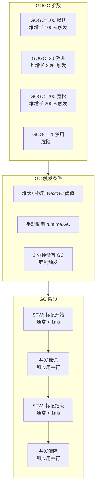
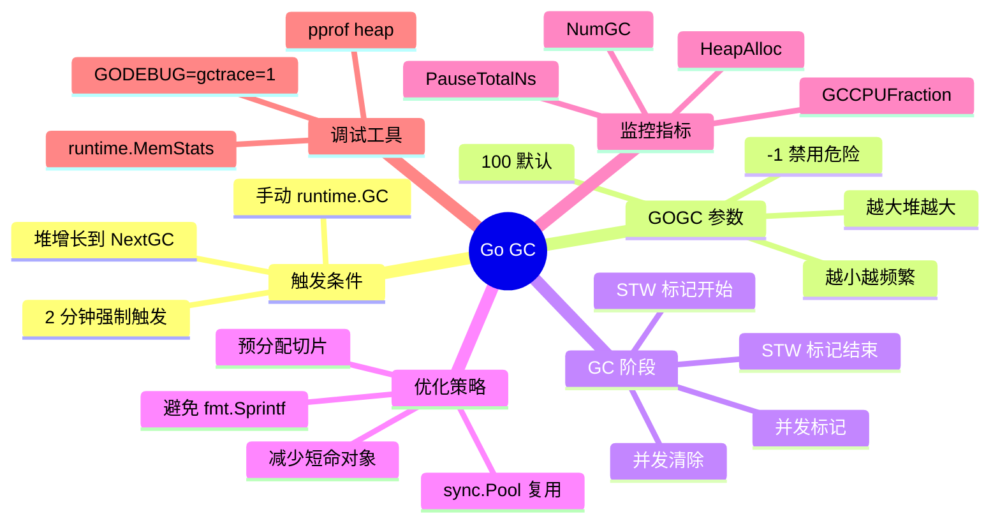

# 写作前的代码理解摘要

## 项目地图

| 类别 | 路径/名称 |
|------|-----------|
| main 入口文件 | `series/15/cmd/gcplay/main.go` |
| 核心业务逻辑 | 同上（单文件项目，通过不同 GOGC 设置演示 GC 行为） |
| 关键结构体 | `snapshot`（GC 快照，包含 HeapAlloc、NumGC、PauseTotalNs 等指标） |
| 关键函数 | `phase`（执行一个阶段并打印前后快照）、`runChurn`（制造分配压力）、`readSnapshot`（读取 runtime.MemStats） |

## 核心三问

**这个项目解决的具体痛点是什么？**
线上服务延迟曲线偶尔冒出"尖刺"，排查发现不是慢 SQL 也不是网络，有人说"可能是 GC 卡住了"。但 GC 到底什么时候跑？会卡多久？能控制吗？这些问题如果不理解，就无法判断延迟问题是不是 GC 导致的。

**它的核心技术实现逻辑（Trick）是什么？**
项目通过不同 GOGC 设置（100/20/200/-1）对比 GC 行为——GC 次数、总暂停时间、堆大小。核心 Trick 是用 `runtime.ReadMemStats` 读取 GC 指标，用 `debug.SetGCPercent` 动态调整 GC 频率，让开发者直观看到 GOGC 对 GC 行为的影响。

**它最适合用在什么业务场景？**
任何需要理解和优化 GC 行为的 Go 服务：对延迟敏感的在线服务、高吞吐系统、内存受限的容器环境。理解 GC 的触发机制和调优参数，是解决"延迟尖刺"问题的基础。

## Go 语言特性提取

| 特性 | 项目中的应用 | 后续重点科普 |
|------|-------------|-------------|
| `runtime.MemStats` | 读取 GC 和内存统计信息 | MemStats 的关键字段解读 |
| `debug.SetGCPercent` | 动态调整 GOGC | GOGC 的工作原理 |
| `runtime.GC()` | 手动触发 GC | 什么时候该手动 GC |
| `runtime.KeepAlive` | 防止编译器优化掉分配 | 为什么需要 KeepAlive |
| `GODEBUG=gctrace=1` | GC 跟踪日志 | 如何解读 gctrace 输出 |

---

**备选标题 A（痛点型）**：那个"延迟尖刺"的问题，让我搞懂了 Go 的 GC

**备选标题 B（干货型）**：Go GC 深入浅出：什么时候跑、会不会卡、怎么调

**备选标题 C（悬念型）**：GC 会卡住程序吗？这个问题的答案可能和你想的不一样

---

## 1. 场景复现：那个让我头疼的时刻

线上服务的 p99 延迟曲线，偶尔会冒出几根"尖刺"。

我打开监控大盘，开始排查：

- **慢 SQL？** 数据库监控一切正常，没有慢查询。
- **网络抖动？** 网络延迟稳定在 1ms 以内。
- **锁竞争？** pprof 的 mutex profile 没有异常。
- **CPU 打满？** CPU 使用率才 30%。

排查了一圈，毫无头绪。

这时候，一个老同事凑过来看了一眼监控，说了一句："你看看 GC 的暂停时间。"

我打开 GC 监控，发现尖刺出现的时间点，正好对应 GC 的 STW（Stop The World）暂停。

"GC 不是并发的吗？怎么还会卡住程序？"我问。

老同事说："大部分时间是并发的，但标记开始和标记结束有两个短暂的 STW 阶段。如果你的服务分配压力大，GC 跑得频繁，这些小停顿叠加起来，就会影响尾部延迟。"

那天晚上，我花了几个小时研究 Go 的 GC 机制。今天这篇文章，我把这些知识整理出来，帮你理解 GC 的触发时机、暂停影响和调优方法。

## 2. 架构蓝图：上帝视角看设计

Go 的 GC 是**并发标记清除**（Concurrent Mark and Sweep），大部分工作和应用程序并行执行，只有两个短暂的 STW 阶段。



**关键点**：

1. **GC 不是定时跑**：而是**堆增长驱动**，堆大小达到阈值才触发
2. **STW 通常很短**：现代 Go 版本的 STW 通常在 1ms 以内
3. **GOGC 控制频率**：越小越频繁，越大堆越大

## 3. 源码拆解：手把手带你读核心

### 3.1 GC 快照：读取运行时指标

```go
type snapshot struct {
    heapAlloc      uint64  // 当前堆分配大小
    heapSys        uint64  // 从系统获取的堆内存
    heapObjects    uint64  // 堆上对象数量
    numGC          uint32  // GC 次数
    pauseTotalNs   uint64  // 总暂停时间（纳秒）
    lastPauseNs    uint64  // 最近一次暂停时间
    nextGC         uint64  // 下次 GC 的堆大小阈值
    gccpuFraction  float64 // GC 占用 CPU 比例
    lastGCTimeUnix int64   // 最近一次 GC 的时间戳
}

func readSnapshot() snapshot {
    var m runtime.MemStats
    runtime.ReadMemStats(&m)
    // ...
}
```

**知识点贴士**：`runtime.MemStats` 是 Go 提供的内存统计结构体，包含几十个字段。最常用的几个：

| 字段 | 含义 | 用途 |
|------|------|------|
| `HeapAlloc` | 当前堆分配大小 | 监控内存使用 |
| `NumGC` | GC 次数 | 判断 GC 频率 |
| `PauseTotalNs` | 总暂停时间 | 评估 GC 对延迟的影响 |
| `NextGC` | 下次 GC 阈值 | 理解 GC 触发时机 |
| `GCCPUFraction` | GC 占用 CPU 比例 | 判断 GC 开销 |

### 3.2 GOGC 的工作原理

```go
// GOGC=100（默认）：堆增长 100% 后触发 GC
debug.SetGCPercent(100)

// GOGC=20：更激进，堆增长 20% 就触发
debug.SetGCPercent(20)

// GOGC=200：更宽松，堆增长 200% 才触发
debug.SetGCPercent(200)

// GOGC=-1：禁用 GC（危险！）
debug.SetGCPercent(-1)
```

**GOGC 的计算公式**：

```
NextGC = LiveHeap * (1 + GOGC/100)
```

假设当前存活对象占用 100MB：
- GOGC=100：NextGC = 100MB * 2 = 200MB
- GOGC=20：NextGC = 100MB * 1.2 = 120MB
- GOGC=200：NextGC = 100MB * 3 = 300MB

**直觉理解**：

| GOGC | GC 频率 | 堆大小 | CPU 开销 | 适用场景 |
|------|---------|--------|----------|----------|
| 小（如 20） | 高 | 小 | 高 | 内存受限 |
| 默认（100） | 中 | 中 | 中 | 通用场景 |
| 大（如 200） | 低 | 大 | 低 | 内存充足、延迟敏感 |

**Code Review 视角**：GOGC 不是"越大越好"或"越小越好"，而是**内存与 CPU 的权衡**。调大 GOGC 可以减少 GC 次数，但堆会变大；调小 GOGC 可以控制堆大小，但 GC 会更频繁。

### 3.3 制造分配压力

```go
func runChurn(objects int, size int, keep bool) {
    var keepAlive [][]byte
    if keep {
        keepAlive = make([][]byte, 0, objects/8)
    }

    for i := 0; i < objects; i++ {
        b := make([]byte, size)  // 分配
        b[0] = byte(i)
        if keep && i%8 == 0 {
            keepAlive = append(keepAlive, b)  // 保留部分
        }
    }

    runtime.KeepAlive(keepAlive)
}
```

**这个函数模拟真实场景**：大量分配，部分保留（长命对象），部分丢弃（短命对象）。

**为什么需要 `runtime.KeepAlive`？**

编译器很聪明，如果它发现 `keepAlive` 后面没有被使用，可能会优化掉整个分配。`runtime.KeepAlive` 告诉编译器："这个变量到这里还活着，别优化掉。"

**知识点贴士**：`runtime.KeepAlive` 是一个空函数，不做任何事情，但它的存在阻止了编译器的优化。这在基准测试和演示代码中很常用。

### 3.4 对比不同 GOGC 的效果

```go
func phase(name string, fn func()) {
    fmt.Printf("\n--- %s ---\n", name)
    before := readSnapshot()
    printSnapshot("before", before)

    start := time.Now()
    fn()
    cost := time.Since(start)

    after := readSnapshot()
    printSnapshot("after ", after)
    fmt.Printf("time=%s | gc+%d | pause+%s\n",
        cost,
        int(after.numGC-before.numGC),
        time.Duration(after.pauseTotalNs-before.pauseTotalNs))
}
```

运行程序后，你会看到类似这样的输出：

```
--- 默认 GOGC=100 ---
before | heap_alloc=0.12MB next_gc=4.00MB num_gc=0
after  | heap_alloc=2.45MB next_gc=4.91MB num_gc=5
time=45ms | gc+5 | pause+1.2ms

--- 更激进 GOGC=20 ---
before | heap_alloc=2.45MB next_gc=2.94MB num_gc=5
after  | heap_alloc=2.51MB next_gc=3.01MB num_gc=17
time=52ms | gc+12 | pause+2.8ms

--- 更宽松 GOGC=200 ---
before | heap_alloc=2.51MB next_gc=7.53MB num_gc=17
after  | heap_alloc=5.12MB next_gc=15.36MB num_gc=20
time=41ms | gc+3 | pause+0.8ms
```

**数据说话**：

| GOGC | GC 次数 | 总暂停 | 堆大小 |
|------|---------|--------|--------|
| 100 | 5 | 1.2ms | 2.45MB |
| 20 | 12 | 2.8ms | 2.51MB |
| 200 | 3 | 0.8ms | 5.12MB |

- **GOGC=20**：GC 次数最多（12 次），暂停时间最长（2.8ms），但堆最小
- **GOGC=200**：GC 次数最少（3 次），暂停时间最短（0.8ms），但堆最大

### 3.5 手动触发 GC

```go
phase("手动触发 runtime.GC()", func() {
    debug.SetGCPercent(100)
    runtime.GC()
})
```

**什么时候该手动 GC？**

大多数情况下，**不需要手动 GC**。Go 的 GC 调度器会自动处理。

但有几个场景可能需要：

1. **大量临时分配后**：比如处理完一个大请求，想立即释放内存
2. **进入低负载期前**：比如夜间，提前 GC 避免高峰期触发
3. **基准测试前**：确保测试环境一致

**注意**：`runtime.GC()` 是同步的，会阻塞直到 GC 完成。在生产环境慎用。

### 3.6 禁用 GC 的危险

```go
phase("禁用 GC（仅用于演示）", func() {
    debug.SetGCPercent(-1)  // 禁用 GC
    runChurn(120_000, 512, false)
})
```

**GOGC=-1 会禁用自动 GC**。这意味着：

- 堆会无限增长
- 直到 OOM（Out of Memory）被系统杀掉

**什么时候可以禁用 GC？**

几乎没有。唯一的场景是：程序生命周期很短（比如命令行工具），分配量可控，跑完就退出。

### 3.7 用 gctrace 观察 GC 细节

```bash
GODEBUG=gctrace=1 go run ./cmd/gcplay
```

输出类似：

```
gc 1 @0.012s 2%: 0.018+1.2+0.008 ms clock, 0.14+0.32/1.1/0+0.064 ms cpu, 4->4->2 MB, 5 MB goal, 8 P
```

**解读**：

| 字段 | 含义 |
|------|------|
| `gc 1` | 第 1 次 GC |
| `@0.012s` | 程序启动后 0.012 秒 |
| `2%` | GC 占用 CPU 2% |
| `0.018+1.2+0.008 ms clock` | STW1 + 并发标记 + STW2 的时钟时间 |
| `4->4->2 MB` | GC 前堆 -> GC 后堆 -> 存活对象 |
| `5 MB goal` | 下次 GC 的目标堆大小 |
| `8 P` | 使用 8 个 P（处理器） |

**知识点贴士**：`gctrace` 是调试 GC 问题的利器。如果你怀疑延迟问题和 GC 有关，先开 gctrace 看看 STW 时间。

## 4. 避坑指南 & 深度思考

| 坑点 | 症状 | 解决方案 |
|------|------|----------|
| 把 GC 当定时器 | 以为每隔几秒跑一次 | 理解堆增长触发机制 |
| 盲目调大 GOGC | 内存暴涨 OOM | 先确定内存预算 |
| 盲目调小 GOGC | CPU 被 GC 吃掉 | 观察 GCCPUFraction |
| 延迟尖刺都归因 GC | 误判问题 | 用 gctrace 对齐时间点 |
| 短命对象太多 | GC 过于频繁 | 复用 buffer、预分配 |
| 频繁调用 runtime.GC() | 性能下降 | 让 GC 调度器自己决定 |

**深度思考：优化分配比调 GOGC 更有效**

很多人遇到 GC 问题，第一反应是调 GOGC。但这只是治标不治本。

**根本原因是分配太多**。如果你能减少分配，GC 自然就轻松了。

几个减少分配的技巧：

1. **预分配切片**：`make([]T, 0, n)` 而不是 `var s []T`
2. **复用 buffer**：用 `sync.Pool` 复用临时对象
3. **避免 fmt.Sprintf**：热路径用 `strconv` 或 `strings.Builder`
4. **减少 []byte 和 string 转换**：每次转换都是一次分配

**这个 Demo 与生产环境的差距**：

1. **缺少监控集成**：生产环境应该把 MemStats 暴露到 Prometheus
2. **缺少告警规则**：GCCPUFraction > 10% 应该告警
3. **缺少自动调优**：可以根据内存压力动态调整 GOGC

## 5. 快速上手 & 改造建议

**运行命令**：

```bash
cd series/15
go run ./cmd/gcplay
```

**开启 GC 跟踪**：

```bash
GODEBUG=gctrace=1 go run ./cmd/gcplay
```

**工程化改造建议**：

**1. 监控 GC 指标**

```go
func exposeMetrics() {
    var m runtime.MemStats
    runtime.ReadMemStats(&m)
    
    // 暴露到 Prometheus
    heapAllocGauge.Set(float64(m.HeapAlloc))
    numGCCounter.Set(float64(m.NumGC))
    gcPauseHistogram.Observe(float64(m.PauseNs[(m.NumGC+255)%256]) / 1e6)
    gcCPUFractionGauge.Set(m.GCCPUFraction)
}
```

**2. 设置合理的 GOGC**

```go
func init() {
    // 根据容器内存限制设置 GOGC
    memLimit := getMemoryLimit()  // 从 cgroup 读取
    if memLimit > 0 {
        // 内存充足，调大 GOGC 减少 GC 频率
        if memLimit > 4*1024*1024*1024 {  // > 4GB
            debug.SetGCPercent(200)
        }
    }
}
```

**3. 减少短命对象**

```go
// 不好：每次请求都分配
func handleRequest(r *Request) {
    buf := make([]byte, 4096)
    // ...
}

// 好：用 sync.Pool 复用
var bufPool = sync.Pool{
    New: func() any { return make([]byte, 4096) },
}

func handleRequest(r *Request) {
    buf := bufPool.Get().([]byte)
    defer bufPool.Put(buf)
    // ...
}
```

## 6. 总结与脑图

- **GC 由堆增长驱动**：不是定时跑，堆达到 NextGC 阈值才触发
- **GOGC 控制频率**：越小越频繁（堆小），越大越稀疏（堆大）
- **STW 通常很短**：现代 Go 的 STW 在 1ms 以内
- **延迟尖刺不一定是 GC**：用 gctrace 对齐时间点验证
- **优化分配比调参数更有效**：减少短命对象是根本解决方案
- **监控是基础**：把 MemStats 暴露到监控系统



把这些概念理清，你就能更好地理解 Go 的内存行为。下次遇到"延迟尖刺"，先用 gctrace 验证是不是 GC 的锅，再决定怎么优化。
