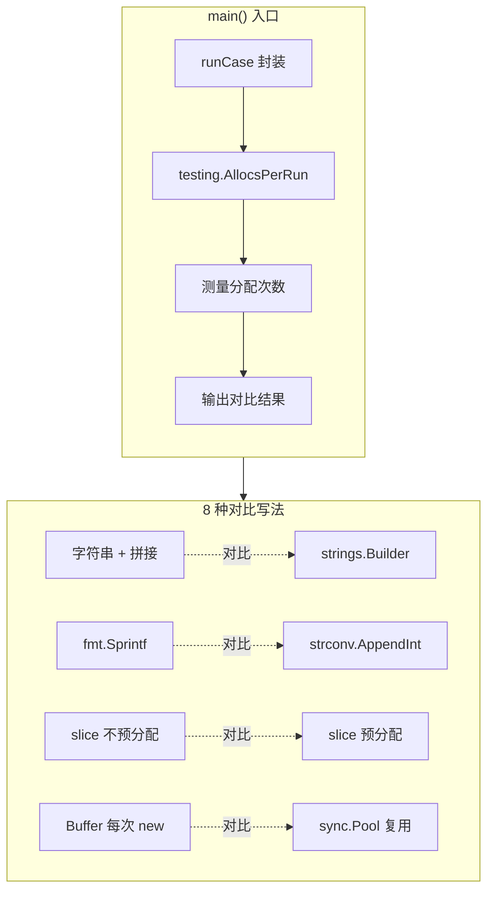

# 写作前的代码理解摘要

## 1. 项目地图

| 类别 | 路径/名称 |
|------|-----------|
| main 入口文件 | `series/16/cmd/alloclab/main.go` |
| 核心业务逻辑 | 同上（单文件项目，所有逻辑集中在 main.go） |
| 关键函数 | `concatPlus`、`concatBuilder`、`numbersFmt`、`numbersAppendInt`、`appendNoPrealloc`、`appendPrealloc`、`bufferNew`、`bufferPool` |
| 关键变量 | `bufPool`（sync.Pool 实例） |

## 2. 核心三问

**这个项目解决的具体痛点是什么？**
Go 程序在高并发场景下，频繁的内存分配会导致 GC 压力剧增，进而引发 p99 延迟飙升、服务抖动等"玄学"问题。开发者往往不知道哪些写法会产生大量临时对象，也缺乏直观的对比手段。

**它的核心技术实现逻辑（Trick）是什么？**
项目通过 `testing.AllocsPerRun` 函数精确测量每种写法的内存分配次数（allocs/op），将 8 种常见写法两两对比：字符串拼接（+ vs Builder）、数字格式化（fmt vs strconv）、切片追加（预分配 vs 不预分配）、Buffer 使用（每次 new vs sync.Pool 复用）。通过数据说话，让开发者直观看到"低分配写法"的效果。

**它最适合用在什么业务场景？**
适合需要优化 Go 服务性能的场景，尤其是：高 QPS 的 API 服务、对延迟敏感的实时系统、内存受限的容器环境。这套技巧可以直接落地到代码评审规范中。

## 3. Go 语言特性提取

| 特性 | 项目中的应用 | 后续重点科普 |
|------|-------------|-------------|
| `sync.Pool` | 复用 `bytes.Buffer`，减少重复分配 | 对象池的正确使用姿势与陷阱 |
| `defer` | `defer bufPool.Put(b)` 确保对象归还 | defer 的执行时机与性能影响 |
| `strings.Builder` | 高效字符串拼接 | 为什么比 + 拼接快 |
| `strconv.AppendInt` | 零分配数字转字符串 | append 系列函数的设计哲学 |
| 切片预分配 | `make([]int, 0, n)` | 切片扩容机制与性能影响 |
| 类型断言 | `bufPool.Get().(*bytes.Buffer)` | interface{} 与类型安全 |

---

**备选标题 A（痛点型）**：服务 p99 延迟飙升？可能是你的 Go 代码分配太多了

**备选标题 B（干货型）**：8 种写法对比：如何写出对 GC 友好的 Go 代码

**备选标题 C（悬念型）**：为什么我不建议你在循环里用 fmt.Sprintf

---

## 1. 场景复现：那个让我头疼的时刻

上个月，我负责的一个订单服务突然出了问题。

监控大盘上，QPS 没变，CPU 也没打满，但 p99 延迟从 50ms 飙到了 200ms。更诡异的是，这个问题时有时无，像极了"玄学"。

我翻遍了代码改动记录，最后定位到一个看起来人畜无害的函数——它在循环里用 `fmt.Sprintf` 拼接日志字段。每次请求调用几百次，每次调用都在疯狂制造临时字符串对象。

GC 被迫频繁工作，STW（Stop The World）的微小停顿不断叠加，最终拖垮了尾部延迟。

那一刻我意识到：**在 Go 里，分配（allocation）本身就是有成本的**。写代码时多一点"分配意识"，能省掉很多线上排查的痛苦。

今天这篇文章，我就用一个可运行的小实验，带你直观感受不同写法的分配差异。

## 2. 架构蓝图：上帝视角看设计

这个实验项目的结构非常简洁，核心逻辑如下：



整个项目只有一个文件，但它回答了一个关键问题：**同样的功能，不同写法的内存分配差异有多大？**

核心测量工具是 `testing.AllocsPerRun`，它会多次执行目标函数，返回平均每次调用的分配次数。这个数字越小，说明代码对 GC 越友好。

## 3. 源码拆解：手把手带你读核心

### 3.1 测量框架：runCase 函数

```go
func runCase(name string, fn func()) {
    allocs := testing.AllocsPerRun(200, fn)
    start := time.Now()
    fn()
    cost := time.Since(start)
    fmt.Printf("%-30s | allocs/op=%.2f | time=%s\n", name, allocs, cost)
}
```

这段代码做了三件事：
1. 用 `testing.AllocsPerRun` 跑 200 次，算出平均分配次数
2. 再跑一次，测量单次耗时
3. 格式化输出结果

**知识点贴士**：`testing.AllocsPerRun` 是 Go 标准库提供的工具函数，专门用来测量内存分配。它内部会调用 `runtime.ReadMemStats`，对比执行前后的分配计数。

### 3.2 字符串拼接：+ 号 vs Builder

先看"反面教材"：

```go
func concatPlus(n int) string {
    s := ""
    for i := 0; i < n; i++ {
        s += "a"
    }
    return s
}
```

这段代码的问题在于：**Go 的 string 是不可变的**。每次 `s += "a"`，都会创建一个新字符串，把旧内容复制过去，再追加新字符。循环 200 次，就分配 200 次。

再看"正确姿势"：

```go
func concatBuilder(n int) string {
    var b strings.Builder
    b.Grow(n)  // 关键：预分配空间
    for i := 0; i < n; i++ {
        b.WriteByte('a')
    }
    return b.String()
}
```

`strings.Builder` 内部维护一个 `[]byte`，写入时直接追加到切片末尾。`Grow(n)` 提前分配好空间，整个循环只需要 1 次分配。

**为什么这么写？** 因为 `strings.Builder` 的设计目标就是"高效拼接"。它避免了 string 不可变带来的重复拷贝，同时 `Grow` 让你可以一次性申请足够的内存。

### 3.3 数字格式化：fmt vs strconv

```go
// 高分配写法
func numbersFmt(n int) string {
    var b strings.Builder
    for i := 0; i < n; i++ {
        b.WriteString(fmt.Sprintf("%d,", i))
    }
    return b.String()
}
```

`fmt.Sprintf` 功能强大，但它内部需要解析格式字符串、创建临时对象。在热循环里用它，分配次数会随循环次数线性增长。

```go
// 低分配写法
func numbersAppendInt(n int) string {
    buf := make([]byte, 0, n*4)  // 预估容量
    for i := 0; i < n; i++ {
        buf = strconv.AppendInt(buf, int64(i), 10)
        buf = append(buf, ',')
    }
    return string(buf)
}
```

`strconv.AppendInt` 直接把数字追加到现有切片末尾，不创建新对象。配合预分配的 `buf`，整个函数只需要 2 次分配（初始 make + 最后的 string 转换）。

**知识点贴士**：Go 的 `strconv` 包提供了一系列 `Append*` 函数，它们的签名都是 `func Append*(dst []byte, ...) []byte`。这种设计让调用方可以复用已有的切片，避免额外分配。

### 3.4 切片追加：预分配的威力

```go
// 不预分配
func appendNoPrealloc(n int) []int {
    var out []int
    for i := 0; i < n; i++ {
        out = append(out, i)
    }
    return out
}

// 预分配
func appendPrealloc(n int) []int {
    out := make([]int, 0, n)  // 关键：指定 cap
    for i := 0; i < n; i++ {
        out = append(out, i)
    }
    return out
}
```

不预分配时，切片会经历多次扩容。Go 的扩容策略大致是"容量翻倍"（小切片）或"增长 25%"（大切片），10000 个元素大约需要 14-16 次扩容，每次扩容都是一次分配。

预分配后，`make([]int, 0, n)` 一次性申请好空间，后续 append 只是移动指针，不触发扩容。

**为什么这么设计？** 切片的动态扩容是为了方便使用，但在你明确知道最终大小时，预分配能显著减少分配次数和内存拷贝。

### 3.5 sync.Pool：对象复用的艺术

```go
var bufPool = sync.Pool{
    New: func() any {
        return new(bytes.Buffer)
    },
}

func bufferPool(n int) []byte {
    b := bufPool.Get().(*bytes.Buffer)  // 从池中取
    b.Reset()                            // 清空旧数据
    defer bufPool.Put(b)                 // 用完放回
    
    b.Grow(n * 8)
    // ... 写入逻辑 ...
    
    out := make([]byte, b.Len())
    copy(out, b.Bytes())  // 复制出结果
    return out
}
```

`sync.Pool` 是 Go 提供的对象池，适合复用临时对象。它的工作原理是：
1. `Get()` 尝试从池中取一个对象，没有就调用 `New` 创建
2. `Put()` 把对象放回池中，供下次使用
3. GC 时，池中的对象可能被清空（所以不能依赖它做缓存）

**知识点贴士**：`defer` 关键字确保函数返回前执行 `Put`，即使中间发生 panic 也不会泄漏对象。这是 Go 里管理资源的惯用模式。

**为什么要 copy 出结果？** 因为 Buffer 会被放回池中复用，如果直接返回 `b.Bytes()`，下次使用时数据会被覆盖。这是使用 Pool 最常见的坑之一。

## 4. 避坑指南 & 深度思考

### 常见陷阱

1. **Pool 对象不 Reset**：旧数据混入新结果，导致诡异 Bug。每次 Get 后第一件事就是 Reset。

2. **Pool 放入超大对象**：一个 10MB 的 Buffer 放回池里，长期占用内存。建议放回前检查大小：
   ```go
   if b.Cap() < 64*1024 {
       bufPool.Put(b)
   }
   // 超过 64KB 就丢弃，让 GC 回收
   ```

3. **预分配过度**：为了省几次扩容，一次性分配 1GB 内存，反而浪费。用真实数据估算，接受少量扩容是合理的。

4. **过早优化**：代码还没上线就开始抠分配次数。正确做法是先用 pprof 定位热点，热点才值得优化。

### 这个 Demo 与生产代码的差距

- Demo 用 `testing.AllocsPerRun` 做快速验证，生产环境应该用 `go test -bench -benchmem` 做更严谨的基准测试
- Demo 没有处理并发场景，`sync.Pool` 在高并发下的表现需要单独测试
- Demo 的 Buffer 大小是硬编码的，生产环境应该根据实际数据动态调整

## 5. 快速上手 & 改造建议

### 运行命令

```bash
# 进入项目目录
cd series/16

# 运行实验
go run ./cmd/alloclab
```

你会看到类似这样的输出：

```
=== 减少分配：写出对 GC 友好的 Go 代码 ===
string 拼接: +                 | allocs/op=199.00 | time=...
string 拼接: strings.Builder   | allocs/op=1.00   | time=...
...
```

### 工程化改造建议

1. **加入基准测试**：把这些函数改写成 `Benchmark*` 形式，用 `go test -bench=. -benchmem` 获取更准确的 `B/op`（每次分配的字节数）。

2. **集成到 CI**：在 CI 流程中跑基准测试，对比 PR 前后的分配变化，防止性能退化。

3. **封装为工具函数**：把 `strconv.AppendInt` 的用法封装成项目内的工具函数，降低使用门槛，统一代码风格。

## 6. 总结与脑图

- **分配有成本**：每次分配都会增加 GC 压力，热路径上的高频分配是延迟抖动的常见元凶
- **字符串拼接用 Builder**：`strings.Builder` + `Grow` 比 `+` 拼接快 100 倍以上
- **数字格式化用 strconv**：`strconv.AppendInt` 比 `fmt.Sprintf` 分配少 100 倍
- **切片要预分配**：知道大小就用 `make([]T, 0, n)`，避免多次扩容
- **临时对象用 Pool**：`sync.Pool` 适合复用 Buffer 等临时对象，但要注意 Reset 和大小控制
