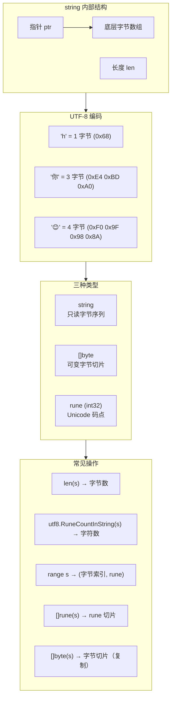

# 写作前的代码理解摘要

## 项目地图

| 类别 | 路径/名称 |
|------|-----------|
| main 入口文件 | `series/17/cmd/textlab/main.go` |
| 核心业务逻辑 | 同上（单文件项目，通过五个场景演示字符串编码） |
| 关键函数 | `demoLenAndRuneCount`（len vs rune 数）、`demoRangeOverString`（range 遍历真相）、`demoByteSlicingPitfall`（字节切片陷阱）、`truncateRunes`/`truncateUTF8Bytes`（安全截断）、`demoBytesAndString`（[]byte 与 string 转换） |

## 核心三问

**这个项目解决的具体痛点是什么？**
中文、emoji 等多字节字符在 Go 里处理时，`len()` 返回的是字节数而不是字符数，直接切片可能切断一个字符导致乱码。很多从 Python/Java 转过来的开发者会踩这个坑，因为那些语言的字符串是按字符索引的。

**它的核心技术实现逻辑（Trick）是什么？**
项目通过五个场景演示 Go 字符串的本质：1）`len()` vs `utf8.RuneCountInString()`；2）`range` 遍历返回的是 rune 而不是 byte；3）按字节切片的乱码风险；4）两种安全截断方式（按 rune 或按 UTF-8 边界）；5）`[]byte` 与 `string` 的转换成本。核心 Trick 是理解 Go 的 string 是**只读的 UTF-8 字节序列**。

**它最适合用在什么业务场景？**
任何处理多语言文本的场景：用户昵称截断、搜索关键词高亮、日志脱敏、国际化文案处理。理解 string/[]byte/rune 的关系，是写出正确处理 Unicode 代码的基础。

## Go 语言特性提取

| 特性 | 项目中的应用 | 后续重点科普 |
|------|-------------|-------------|
| string 不可变 | `[]byte(s)` 会复制 | string 的内存布局 |
| rune 类型 | `[]rune(s)` 转换 | rune 是 int32 的别名 |
| range 遍历 string | 返回 (index, rune) | index 是字节偏移 |
| utf8 包 | `RuneCountInString`、`ValidString` | UTF-8 编码基础 |
| bytes.Buffer | 高效拼接字符串 | 避免 + 拼接的分配 |

---

**备选标题 A（痛点型）**：那个"用户昵称乱码"的 Bug，让我搞懂了 Go 的字符串

**备选标题 B（干货型）**：Go 字符串深入浅出：string、[]byte、rune 的爱恨情仇

**备选标题 C（悬念型）**：为什么 len("你好") 等于 6？Go 字符串的真相可能颠覆你的认知

---

## 1. 场景复现：那个让我头疼的时刻

上线一个用户中心服务后，运营反馈："有些用户的昵称显示乱码。"

我打开数据库一看，昵称存的是正常的中文。再看代码，发现问题出在一个"昵称截断"的逻辑：

```go
func truncateNickname(name string, maxLen int) string {
    if len(name) > maxLen {
        return name[:maxLen] + "..."
    }
    return name
}
```

看起来没问题对吧？但当 `name = "张三丰"` 且 `maxLen = 4` 时，返回的是 `"张�..."` ——一个乱码字符。

问题在于：**Go 的 `len()` 返回的是字节数，不是字符数**。中文字符在 UTF-8 编码下占 3 个字节，`name[:4]` 切的是 4 个字节，正好把"三"这个字切断了。

这个 Bug 让我意识到，Go 的字符串和 Python/Java 完全不一样。今天这篇文章，我用五个场景帮你彻底搞懂 Go 的 string、[]byte、rune。

## 2. 架构蓝图：上帝视角看设计

Go 字符串的内存模型：



**核心概念**：

1. **string 是只读的 UTF-8 字节序列**：不能修改，`s[0] = 'A'` 会编译报错
2. **rune 是 int32 的别名**：表示一个 Unicode 码点（字符）
3. **[]byte 是可变的字节切片**：可以修改，但和 string 互转会复制

## 3. 源码拆解：手把手带你读核心

### 3.1 len() vs rune 数：第一个认知颠覆

```go
func demoLenAndRuneCount() {
    s1 := "hello"
    s2 := "你好"
    s3 := "Go😊"

    fmt.Printf("%q: len=%d bytes, rune=%d\n", s1, len(s1), utf8.RuneCountInString(s1))
    fmt.Printf("%q: len=%d bytes, rune=%d\n", s2, len(s2), utf8.RuneCountInString(s2))
    fmt.Printf("%q: len=%d bytes, rune=%d\n", s3, len(s3), utf8.RuneCountInString(s3))
}
```

输出：

```
"hello": len=5 bytes, rune=5
"你好": len=6 bytes, rune=2
"Go😊": len=6 bytes, rune=3
```

**为什么 "你好" 的 len 是 6？**

UTF-8 是变长编码：
- ASCII 字符（如 'h'）：1 字节
- 中文字符（如 '你'）：3 字节
- emoji（如 '😊'）：4 字节

"你好" = 3 + 3 = 6 字节。

**知识点贴士**：如果你是 Python 程序员，`len("你好")` 在 Python 3 里返回 2（字符数）。但 Go 的 `len()` 返回的是**字节数**。想要字符数，用 `utf8.RuneCountInString()`。

### 3.2 range 遍历的真相

```go
func demoRangeOverString() {
    s := "你a好😊"
    for i, r := range s {
        fmt.Printf("  i=%d r=%U char=%q\n", i, r, r)
    }
}
```

输出：

```
  i=0 r=U+4F60 char='你'
  i=3 r=U+0061 char='a'
  i=4 r=U+597D char='好'
  i=7 r=U+1F60A char='😊'
```

**注意 i 的值**：0, 3, 4, 7。这不是连续的！

**为什么？** 因为 `i` 是**字节索引**，不是字符索引。'你' 占 3 字节（索引 0-2），'a' 占 1 字节（索引 3），'好' 占 3 字节（索引 4-6），'😊' 占 4 字节（索引 7-10）。

**知识点贴士**：`range` 遍历 string 时，Go 会自动解码 UTF-8，返回 `(字节索引, rune)`。这是 Go 的贴心设计，但如果你不知道，可能会被 `i` 的跳跃搞糊涂。

### 3.3 按字节切片的乱码陷阱

```go
func demoByteSlicingPitfall() {
    s := "你好世界"
    
    bad := s[:4]  // 切 4 个字节
    fmt.Printf("bad slice s[:4]=%q (valid_utf8=%v)\n", bad, utf8.ValidString(bad))
    
    good := s[:6]  // 切 6 个字节（正好两个中文）
    fmt.Printf("good slice s[:6]=%q (valid_utf8=%v)\n", good, utf8.ValidString(good))
}
```

输出：

```
bad slice s[:4]="你�" (valid_utf8=false)
good slice s[:6]="你好" (valid_utf8=true)
```

**为什么 s[:4] 会乱码？**

"你" 占字节 0-2，"好" 占字节 3-5。`s[:4]` 切的是字节 0-3，正好把"好"的第一个字节切进来了，但后两个字节没有，所以变成了无效的 UTF-8 序列。

**Code Review 视角**：这就是开头那个 Bug 的原因。直接用 `s[:maxLen]` 切中文字符串，大概率会切断字符。

### 3.4 安全截断：两种方式

**方式一：按 rune 截断**

```go
func truncateRunes(s string, n int) string {
    if utf8.RuneCountInString(s) <= n {
        return s
    }
    rs := []rune(s)  // 转成 rune 切片
    return string(rs[:n])
}
```

这种方式**语义正确**——截断 n 个字符。但有个问题：`[]rune(s)` 会分配一个新的切片，如果字符串很长，开销不小。

**方式二：按 UTF-8 字节边界截断**

```go
func truncateUTF8Bytes(s string, maxBytes int) string {
    if len(s) <= maxBytes {
        return s
    }
    
    b := []byte(s)
    i := maxBytes
    // 往回找，直到找到一个完整的 rune 边界
    for i > 0 && !utf8.FullRune(b[:i]) {
        i--
    }
    return string(b[:i])
}
```

这种方式**按字节限制**，但保证不切断字符。适合"限制存储大小"的场景。

**什么时候用哪种？**

| 场景 | 选择 | 原因 |
|------|------|------|
| 显示截断（如昵称） | 按 rune | 用户看到的是字符数 |
| 存储限制（如数据库字段） | 按字节边界 | 数据库限制的是字节数 |
| 性能敏感 | 按字节边界 | 避免 []rune 分配 |

### 3.5 []byte 与 string 的转换成本

```go
func demoBytesAndString() {
    s := "abc你好"
    b := []byte(s)  // 复制！
    
    b[0] = 'A'
    fmt.Printf("改 b[0]='A' 后：b=%v，string 仍是 %q\n", b, s)
    
    s2 := string(b)  // 又复制！
    fmt.Printf("[]byte -> string: %v -> %q\n", b, s2)
}
```

输出：

```
改 b[0]='A' 后：b=[65 98 99 228 189 160 229 165 189]，string 仍是 "abc你好"
```

**为什么修改 b 不影响 s？**

因为 `[]byte(s)` 会**复制**底层数据。Go 的 string 是不可变的，如果 `[]byte(s)` 不复制，你就能通过 `b` 修改 `s`，破坏不可变性。

**知识点贴士**：`string` 和 `[]byte` 互转都会复制数据。在热路径上频繁转换会产生大量分配。如果你需要频繁操作字节，一开始就用 `[]byte`；如果需要频繁拼接字符串，用 `strings.Builder` 或 `bytes.Buffer`。

### 3.6 高效拼接：bytes.Buffer

```go
var buf bytes.Buffer
buf.Grow(32)  // 预分配
buf.WriteString("id=")
buf.WriteString("1001")
buf.WriteString(" msg=")
buf.WriteString(s)
result := buf.String()
```

**为什么不用 + 拼接？**

```go
s := "a" + "b" + "c"  // 每次 + 都可能分配新字符串
```

`+` 拼接在循环里会产生大量中间字符串，GC 压力大。`bytes.Buffer` 内部维护一个可增长的 `[]byte`，最后一次性转成 string。

## 4. 避坑指南 & 深度思考

| 坑点 | 症状 | 解决方案 |
|------|------|----------|
| len() 当字符数用 | 中文截断乱码 | 用 `utf8.RuneCountInString()` |
| 直接切片 s[:n] | 切断多字节字符 | 用 `truncateRunes` 或 `truncateUTF8Bytes` |
| range 的 i 当字符索引 | 索引计算错误 | 理解 i 是字节索引 |
| 频繁 string/[]byte 互转 | 大量分配，GC 压力 | 统一用一种类型处理 |
| + 拼接大量字符串 | 性能差 | 用 `strings.Builder` |
| 假设一个字符一个字节 | 国际化场景出错 | 始终考虑 UTF-8 |

**深度思考：为什么 Go 选择 UTF-8？**

Go 的两位创始人 Rob Pike 和 Ken Thompson 也是 UTF-8 的发明者。他们设计 Go 时，自然选择了 UTF-8 作为字符串的默认编码。

UTF-8 的优点：
- **兼容 ASCII**：ASCII 字符只占 1 字节
- **自同步**：从任意位置都能找到字符边界
- **无字节序问题**：不像 UTF-16 有大小端

代价是：**字符串操作变复杂了**。你不能简单地用索引访问第 n 个字符，必须遍历或转成 `[]rune`。

**这个 Demo 与生产环境的差距**：

1. **缺少边界检查**：生产代码应该处理空字符串、nil 等边界情况
2. **缺少性能测试**：应该用 benchmark 对比不同截断方式的性能
3. **缺少 Unicode 规范化**：有些字符有多种表示方式（如 é = e + ́），可能需要 `golang.org/x/text/unicode/norm`

## 5. 快速上手 & 改造建议

**运行命令**：

```bash
cd series/17
go run ./cmd/textlab
```

**工程化改造建议**：

**1. 封装安全截断函数**

```go
// truncate.go
package strutil

import "unicode/utf8"

// TruncateRunes 按字符数截断，超出部分用 suffix 替代
func TruncateRunes(s string, n int, suffix string) string {
    if n <= 0 {
        return suffix
    }
    runes := []rune(s)
    if len(runes) <= n {
        return s
    }
    return string(runes[:n]) + suffix
}

// 使用
nickname := TruncateRunes(user.Name, 10, "...")
```

**2. 用 strings.Builder 替代 + 拼接**

```go
// 不好
func buildSQL(ids []int) string {
    sql := "SELECT * FROM users WHERE id IN ("
    for i, id := range ids {
        if i > 0 {
            sql += ","
        }
        sql += strconv.Itoa(id)
    }
    sql += ")"
    return sql
}

// 好
func buildSQL(ids []int) string {
    var b strings.Builder
    b.WriteString("SELECT * FROM users WHERE id IN (")
    for i, id := range ids {
        if i > 0 {
            b.WriteByte(',')
        }
        b.WriteString(strconv.Itoa(id))
    }
    b.WriteByte(')')
    return b.String()
}
```

**3. 验证用户输入的 UTF-8 有效性**

```go
func validateInput(s string) error {
    if !utf8.ValidString(s) {
        return errors.New("invalid UTF-8 string")
    }
    return nil
}
```

## 6. 总结与脑图

- **string 是只读的 UTF-8 字节序列**：`len()` 返回字节数，不是字符数
- **rune 是 int32**：表示一个 Unicode 码点，`[]rune(s)` 可以按字符操作
- **range 遍历返回 (字节索引, rune)**：索引会跳跃
- **直接切片可能切断字符**：用 `truncateRunes` 或 `truncateUTF8Bytes` 安全截断
- **string/[]byte 互转会复制**：热路径避免频繁转换
- **拼接用 Builder**：避免 + 拼接产生大量中间字符串

```mermaid
mindmap
  root((Go 字符串))
    string
      只读字节序列
      UTF-8 编码
      len 返回字节数
      不可修改
    rune
      int32 别名
      Unicode 码点
      []rune 按字符操作
      有分配开销
    []byte
      可变字节切片
      和 string 互转复制
      适合频繁修改
    操作
      range 返回 rune
      切片按字节
      安全截断两种方式
    性能
      避免频繁转换
      用 Builder 拼接
      预分配 Grow
```

把这些概念理清，你就不会再被"中文乱码"困扰了。下次处理用户输入时，记得问自己：我需要的是字节数还是字符数？
