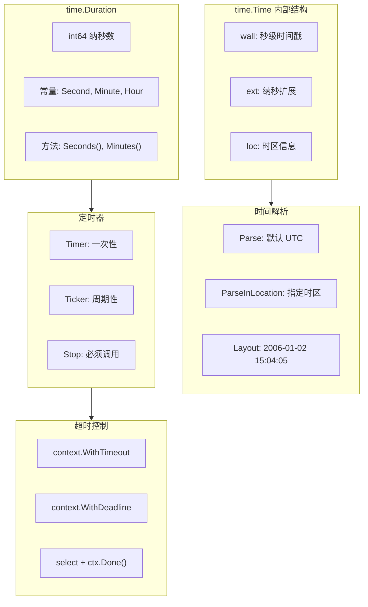
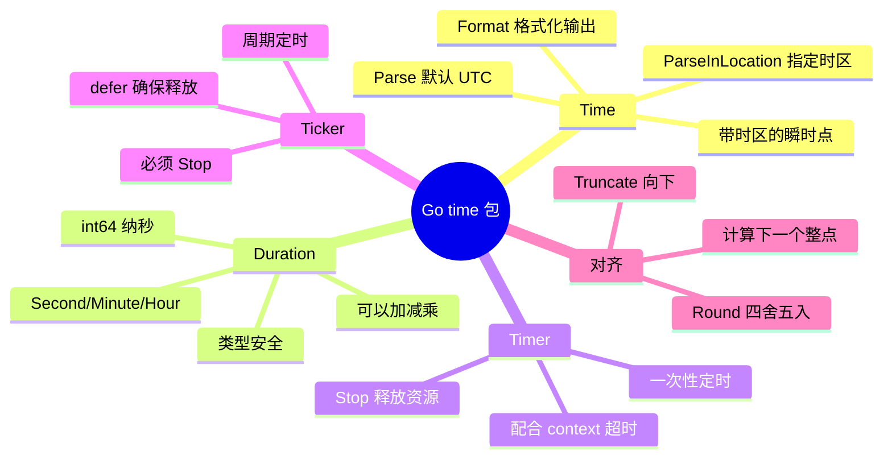

# 写作前的代码理解摘要

## 项目地图

| 类别 | 路径/名称 |
|------|-----------|
| main 入口文件 | `series/18/cmd/timelab/main.go` |
| 核心业务逻辑 | 同上（单文件项目，通过五个场景演示 time 包） |
| 关键函数 | `demoDuration`（Duration 单位换算）、`demoParseLocation`（时区解析）、`demoTimer`（超时控制）、`demoTicker`（周期任务）、`demoRoundTruncate`（时间对齐） |

## 核心三问

**这个项目解决的具体痛点是什么？**
时间处理是 Bug 高发区：时区混乱导致订单时间错误、定时任务在错误的时间执行、超时控制不当导致 goroutine 泄露。很多开发者对 `time.Parse` 和 `time.ParseInLocation` 的区别不清楚，对 Timer/Ticker 的正确使用姿势也不熟悉。

**它的核心技术实现逻辑（Trick）是什么？**
项目通过五个场景演示 time 包的核心用法：1）Duration 的单位换算和组合；2）Parse vs ParseInLocation 的时区差异；3）Timer + context 实现超时控制；4）Ticker 的周期任务和正确 Stop；5）Round/Truncate 实现"对齐到整点"。核心 Trick 是理解 Go 的时间是**带时区的瞬时点**，而不是简单的数字。

**它最适合用在什么业务场景？**
任何涉及时间的业务：订单系统、定时任务、超时控制、日志时间戳、跨时区业务。理解 time 包的正确用法，是避免"时间 Bug"的基础。

## Go 语言特性提取

| 特性 | 项目中的应用 | 后续重点科普 |
|------|-------------|-------------|
| time.Duration | 类型安全的时间间隔 | Duration 的单位常量 |
| time.Time | 带时区的时间点 | Time 的内部结构 |
| time.Timer | 一次性定时器 | Timer 的正确使用 |
| time.Ticker | 周期定时器 | Ticker 的 Stop 和泄露 |
| context.WithTimeout | 超时控制 | context 与 Timer 的配合 |
| select | 多路复用 | Timer/Ticker 的 channel |

---

**备选标题 A（痛点型）**：那个"订单时间差 8 小时"的 Bug，让我搞懂了 Go 的时区处理

**备选标题 B（干货型）**：Go time 包完全指南：时区、Timer、Ticker 与超时控制

**备选标题 C（悬念型）**：为什么你的定时任务总在错误的时间执行？Go 时间处理的 5 个坑

---

## 1. 场景复现：那个让我头疼的时刻

上线一个订单系统后，客服反馈："用户说订单时间不对，显示的是 8 小时前。"

我打开数据库一看，存的时间是 `2025-01-04 10:30:00`，但用户看到的是 `2025-01-04 02:30:00`。

追查代码，发现问题出在时间解析：

```go
layout := "2006-01-02 15:04:05"
t, _ := time.Parse(layout, "2025-01-04 10:30:00")
```

看起来没问题对吧？但 `time.Parse` 默认使用 **UTC 时区**，而我们的业务在中国（UTC+8）。当这个时间被转成本地时间显示时，就差了 8 小时。

更离谱的是，另一个同事写的定时任务，本来应该每天凌晨 2 点执行，结果在上午 10 点执行了——同样是时区问题。

那天我花了半天时间，把 Go 的 time 包从头到尾研究了一遍。今天这篇文章，我把这些知识整理出来，帮你避开时间处理的常见坑。

## 2. 架构蓝图：上帝视角看设计

Go 时间处理的核心概念：



**核心概念**：

1. **time.Time 是带时区的瞬时点**：同一个瞬间，在不同时区显示不同
2. **time.Duration 是纳秒数**：类型安全，避免单位混淆
3. **Timer/Ticker 是 channel**：用 select 监听

## 3. 源码拆解：手把手带你读核心

### 3.1 Duration：类型安全的时间间隔

```go
func demoDuration() {
    d := 1500 * time.Millisecond
    fmt.Printf("d=%s | ms=%d | sec=%.3f\n", d, d.Milliseconds(), d.Seconds())
    
    timeout := 2*time.Second + 300*time.Millisecond
    fmt.Printf("timeout=%s\n", timeout)
}
```

输出：

```
d=1.5s | ms=1500 | sec=1.500
timeout=2.3s
```

**为什么 Go 要设计 Duration 类型？**

在 C/Java 里，超时参数通常是 `int`，单位靠文档说明：

```java
// Java: 这个 1000 是毫秒还是秒？
socket.setSoTimeout(1000);
```

Go 的 Duration 是**类型安全**的：

```go
// Go: 一眼就知道是 1 秒
conn.SetDeadline(time.Now().Add(1 * time.Second))
```

**知识点贴士**：`time.Duration` 本质是 `int64`，单位是纳秒。`time.Second` 是常量 `1000000000`（10^9 纳秒）。你可以用 `+`、`*` 组合 Duration，非常直观。

### 3.2 Parse vs ParseInLocation：时区的坑

```go
func demoParseLocation() {
    layout := "2006-01-02 15:04:05"
    input := "2025-12-31 23:30:00"
    
    // Parse: 默认 UTC
    t1, _ := time.Parse(layout, input)
    fmt.Printf("Parse: %s loc=%s\n", t1.Format(time.RFC3339), t1.Location())
    
    // ParseInLocation: 指定时区
    locShanghai, _ := time.LoadLocation("Asia/Shanghai")
    t2, _ := time.ParseInLocation(layout, input, locShanghai)
    fmt.Printf("ParseInLocation: %s loc=%s\n", t2.Format(time.RFC3339), t2.Location())
    
    fmt.Printf("same instant? %v\n", t1.Equal(t2))
    fmt.Printf("diff = %s\n", t2.Sub(t1))
}
```

输出：

```
Parse: 2025-12-31T23:30:00Z loc=UTC
ParseInLocation: 2025-12-31T23:30:00+08:00 loc=Asia/Shanghai
same instant? false
diff = -8h0m0s
```

**这就是开头那个 Bug 的原因！**

`time.Parse` 把 "2025-12-31 23:30:00" 解析成 UTC 时区的 23:30。
`time.ParseInLocation` 把同样的字符串解析成上海时区的 23:30。

这两个时间**不是同一个瞬间**，差了 8 小时。

**Code Review 视角**：如果你的输入字符串**没有时区信息**（如 "2025-12-31 23:30:00"），一定要用 `ParseInLocation` 明确指定时区。否则 Go 会默认用 UTC，大概率不是你想要的。

**最佳实践**：

```go
// 好：明确指定时区
loc, _ := time.LoadLocation("Asia/Shanghai")
t, err := time.ParseInLocation(layout, input, loc)

// 或者：使用带时区的格式
t, err := time.Parse(time.RFC3339, "2025-12-31T23:30:00+08:00")
```

### 3.3 Timer + Context：超时控制

```go
func runWithContext(ctx context.Context, job func() error) error {
    done := make(chan error, 1)
    go func() {
        done <- job()
    }()
    
    select {
    case <-ctx.Done():
        return ctx.Err()  // 超时
    case err := <-done:
        return err  // 正常完成
    }
}

func demoTimer() {
    // 超时 120ms，任务耗时 80ms → 成功
    ctx, cancel := context.WithTimeout(context.Background(), 120*time.Millisecond)
    defer cancel()
    err := runWithContext(ctx, func() error {
        time.Sleep(80 * time.Millisecond)
        return nil
    })
    fmt.Printf("err=%v\n", err)  // nil
    
    // 超时 50ms，任务耗时 80ms → 超时
    ctx2, cancel2 := context.WithTimeout(context.Background(), 50*time.Millisecond)
    defer cancel2()
    err = runWithContext(ctx2, func() error {
        time.Sleep(80 * time.Millisecond)
        return nil
    })
    fmt.Printf("err=%v\n", err)  // context deadline exceeded
}
```

**这是 Go 里实现超时控制的标准模式**：

1. 用 `context.WithTimeout` 创建带超时的 context
2. 把耗时操作放到 goroutine 里
3. 用 `select` 同时监听 `ctx.Done()` 和结果 channel
4. **一定要 defer cancel()**，否则会泄露资源

**知识点贴士**：`context.WithTimeout` 内部用的就是 `time.Timer`。当超时到达时，context 会被取消，`ctx.Done()` 会收到信号。

**为什么要 defer cancel()？**

即使任务正常完成，context 内部的 Timer 还在运行。`cancel()` 会停止 Timer，释放资源。如果你不调用，Timer 会一直等到超时才释放——这是资源泄露。

### 3.4 Ticker：周期任务

```go
func demoTicker() {
    ticker := time.NewTicker(40 * time.Millisecond)
    defer ticker.Stop()  // 必须 Stop！
    
    count := 0
    for {
        select {
        case t := <-ticker.C:
            count++
            fmt.Printf("tick #%d at %s\n", count, t.Format("15:04:05.000"))
            if count >= 3 {
                return
            }
        }
    }
}
```

输出：

```
tick #1 at 10:30:00.040
tick #2 at 10:30:00.080
tick #3 at 10:30:00.120
```

**Ticker 的正确使用姿势**：

1. `NewTicker` 创建，返回的 `ticker.C` 是一个 channel
2. **必须调用 `ticker.Stop()`**，否则 Ticker 会一直运行，goroutine 泄露
3. 用 `defer ticker.Stop()` 确保退出时停止

**常见错误**：

```go
// 错误：忘记 Stop
func badTicker() {
    ticker := time.NewTicker(time.Second)
    for range ticker.C {
        // 如果这里 return 或 break，Ticker 还在运行
        if someCondition {
            return  // 泄露！
        }
    }
}

// 正确：defer Stop
func goodTicker() {
    ticker := time.NewTicker(time.Second)
    defer ticker.Stop()
    for range ticker.C {
        if someCondition {
            return  // Stop 会被调用
        }
    }
}
```

### 3.5 Round/Truncate：对齐到整点

```go
func demoRoundTruncate() {
    now := time.Now()  // 假设是 10:30:45.678
    
    fmt.Printf("now       = %s\n", now.Format("15:04:05.000"))
    fmt.Printf("Truncate  = %s\n", now.Truncate(time.Second).Format("15:04:05.000"))
    fmt.Printf("Round     = %s\n", now.Round(time.Second).Format("15:04:05.000"))
    
    nextMinute := now.Truncate(time.Minute).Add(time.Minute)
    fmt.Printf("nextMinute= %s\n", nextMinute.Format("15:04:05.000"))
}
```

输出：

```
now       = 10:30:45.678
Truncate  = 10:30:45.000  // 向下取整
Round     = 10:30:46.000  // 四舍五入
nextMinute= 10:31:00.000  // 下一个整分钟
```

**什么时候用？**

- **日志聚合**：按分钟/小时聚合日志，用 `Truncate`
- **定时任务**：计算"下一个整点"，用 `Truncate + Add`
- **缓存过期**：对齐到整秒，避免缓存雪崩

**计算"下一个整点"的模式**：

```go
// 下一个整分钟
nextMinute := now.Truncate(time.Minute).Add(time.Minute)

// 下一个整小时
nextHour := now.Truncate(time.Hour).Add(time.Hour)

// 今天的 0 点
today := now.Truncate(24 * time.Hour)  // 注意：这在 UTC 时区
```

## 4. 避坑指南 & 深度思考

| 坑点 | 症状 | 解决方案 |
|------|------|----------|
| Parse 默认 UTC | 时间差 N 小时 | 用 ParseInLocation |
| 忘记 Ticker.Stop() | goroutine 泄露 | defer ticker.Stop() |
| 忘记 cancel() | Timer 资源泄露 | defer cancel() |
| Duration 单位混淆 | 超时时间错误 | 用 time.Second 等常量 |
| 时区字符串错误 | LoadLocation 失败 | 用 IANA 时区名 |
| Truncate 在 UTC | 本地时间对齐错误 | 先转本地时区再 Truncate |

**深度思考：为什么 Go 的时间 layout 是 "2006-01-02 15:04:05"？**

这是 Go 的一个"彩蛋"。这个时间是：

```
Mon Jan 2 15:04:05 MST 2006
  1   2  3  4  5       6
```

每个数字都是唯一的：1（月）、2（日）、3（时，15=3pm）、4（分）、5（秒）、6（年）。这样你只需要记住这个"魔法时间"，就能写出任何格式。

**这个 Demo 与生产环境的差距**：

1. **缺少时区配置**：生产环境应该从配置读取时区，而不是硬编码
2. **缺少错误处理**：`LoadLocation` 可能失败（时区数据库不存在）
3. **缺少 NTP 同步**：分布式系统需要时钟同步
4. **缺少时间 Mock**：测试时需要能控制"当前时间"

## 5. 快速上手 & 改造建议

**运行命令**：

```bash
cd series/18
go run ./cmd/timelab
```

**工程化改造建议**：

**1. 封装时区安全的解析函数**

```go
var defaultLocation *time.Location

func init() {
    var err error
    defaultLocation, err = time.LoadLocation("Asia/Shanghai")
    if err != nil {
        defaultLocation = time.FixedZone("CST", 8*3600)
    }
}

func ParseLocalTime(layout, value string) (time.Time, error) {
    return time.ParseInLocation(layout, value, defaultLocation)
}
```

**2. 超时控制的标准模式**

```go
func DoWithTimeout(ctx context.Context, timeout time.Duration, fn func() error) error {
    ctx, cancel := context.WithTimeout(ctx, timeout)
    defer cancel()
    
    done := make(chan error, 1)
    go func() {
        done <- fn()
    }()
    
    select {
    case <-ctx.Done():
        return fmt.Errorf("timeout after %s: %w", timeout, ctx.Err())
    case err := <-done:
        return err
    }
}
```

**3. 周期任务的优雅退出**

```go
func RunPeriodic(ctx context.Context, interval time.Duration, fn func()) {
    ticker := time.NewTicker(interval)
    defer ticker.Stop()
    
    for {
        select {
        case <-ctx.Done():
            return  // 优雅退出
        case <-ticker.C:
            fn()
        }
    }
}

// 使用
ctx, cancel := context.WithCancel(context.Background())
go RunPeriodic(ctx, time.Minute, func() {
    // 每分钟执行
})

// 需要停止时
cancel()
```

## 6. 总结与脑图

- **time.Parse 默认 UTC**：处理本地时间用 ParseInLocation
- **Duration 是类型安全的**：用 time.Second 等常量，避免单位混淆
- **Timer/Ticker 必须 Stop**：否则资源泄露
- **context.WithTimeout 要 defer cancel()**：即使任务完成也要调用
- **Truncate/Round 用于时间对齐**：日志聚合、定时任务常用
- **layout 是 "2006-01-02 15:04:05"**：Go 的魔法时间



把这些概念理清，你就不会再被"时间差 8 小时"困扰了。下次处理时间时，记得问自己：这个时间是哪个时区的？
