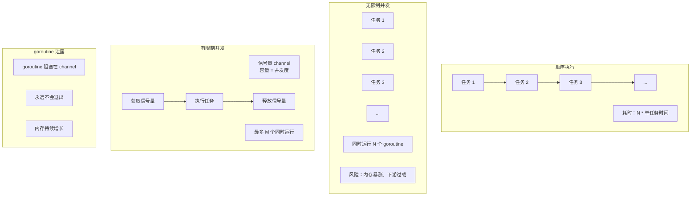
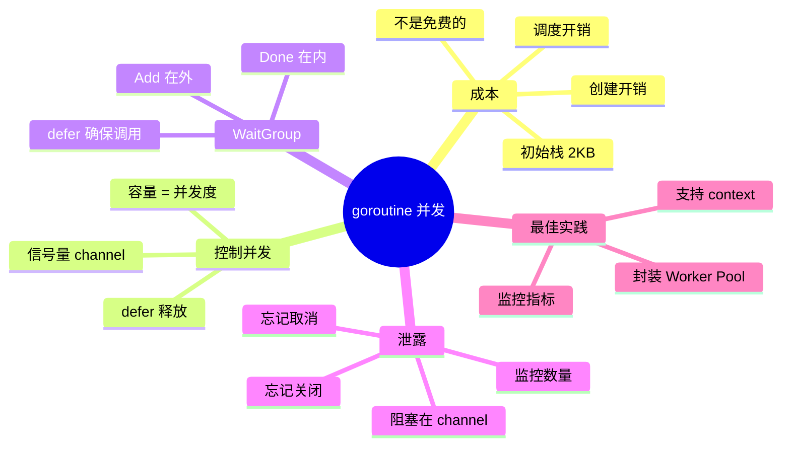

# 写作前的代码理解摘要

## 项目地图

| 类别 | 路径/名称 |
|------|-----------|
| main 入口文件 | `series/19/cmd/gorun/main.go` |
| 核心业务逻辑 | 同上（单文件项目，通过四种模式演示 goroutine 并发） |
| 关键结构体 | `config`（命令行配置） |
| 关键函数 | `runSequential`（顺序执行）、`runUnbounded`（无限制并发）、`runBounded`（有限制并发）、`demoLeak`（goroutine 泄露演示） |

## 核心三问

**这个项目解决的具体痛点是什么？**
很多开发者以为 goroutine 是"免费的"，随手 `go func()` 就开几万个。结果要么内存暴涨、要么把下游服务打挂、要么 goroutine 泄露导致服务慢慢变卡。并发不是免费的午餐，需要控制并发度、避免泄露。

**它的核心技术实现逻辑（Trick）是什么？**
项目通过四种模式对比：1）顺序执行（基准）；2）无限制并发（`go func` 直接开）；3）有限制并发（用 channel 做信号量）；4）goroutine 泄露演示（阻塞在 channel 上）。核心 Trick 是用**带缓冲的 channel 作为信号量**控制并发度。

**它最适合用在什么业务场景？**
任何需要并发处理的场景：批量数据处理、并发 HTTP 请求、文件并行处理。理解 goroutine 的成本和控制方法，是写出高性能且稳定的 Go 代码的基础。

## Go 语言特性提取

| 特性 | 项目中的应用 | 后续重点科普 |
|------|-------------|-------------|
| goroutine | `go func()` 启动并发 | goroutine 的调度模型 |
| sync.WaitGroup | 等待所有 goroutine 完成 | Add/Done/Wait 的正确用法 |
| channel 作为信号量 | `sem := make(chan struct{}, n)` | 控制并发度 |
| runtime.NumGoroutine | 监控 goroutine 数量 | 检测泄露 |
| runtime.MemStats | 监控内存使用 | 评估并发开销 |
| flag 包 | 命令行参数解析 | 配置化运行 |

---

**备选标题 A（痛点型）**：那个"内存暴涨"的事故，让我搞懂了 goroutine 不是免费的

**备选标题 B（干货型）**：Go 并发控制实战：从无限制到有限制，从泄露到优雅退出

**备选标题 C（悬念型）**：为什么我不建议你随手写 go func()？goroutine 的隐藏成本

---

## 1. 场景复现：那个让我头疼的时刻

上线一个批量数据处理服务后，运维告警："内存从 500MB 涨到 8GB，然后 OOM 被杀了。"

我打开代码一看，逻辑很简单：

```go
func processAll(items []Item) {
    for _, item := range items {
        go processItem(item)  // 每个 item 开一个 goroutine
    }
}
```

items 有 100 万条。也就是说，这段代码瞬间创建了 100 万个 goroutine。

"goroutine 不是很轻量吗？网上都说可以开几十万个。"同事问。

我说："轻量不等于免费。每个 goroutine 至少占 2KB 栈空间，100 万个就是 2GB。而且这些 goroutine 同时发起网络请求，下游服务直接被打挂了。"

那天我花了半天时间重构代码，加上并发控制。今天这篇文章，我用四种模式帮你理解 goroutine 的成本和控制方法。

## 2. 架构蓝图：上帝视角看设计

四种并发模式的对比：



**核心概念**：

1. **顺序执行**：安全但慢
2. **无限制并发**：快但危险
3. **有限制并发**：平衡速度和安全
4. **泄露**：goroutine 无法退出，内存持续增长

## 3. 源码拆解：手把手带你读核心

### 3.1 顺序执行：基准线

```go
func runSequential(cfg config) {
    for i := 0; i < cfg.n; i++ {
        doTask(i, cfg.sleep)
    }
}

func doTask(i int, sleep time.Duration) {
    time.Sleep(sleep)  // 模拟 IO
}
```

300 个任务，每个 10ms，总耗时 = 300 * 10ms = 3 秒。

这是最安全的方式，但也是最慢的。

### 3.2 无限制并发：危险的诱惑

```go
func runUnbounded(cfg config) {
    var wg sync.WaitGroup
    wg.Add(cfg.n)
    
    for i := 0; i < cfg.n; i++ {
        i := i  // 重要：捕获循环变量
        go func() {
            defer wg.Done()
            doTask(i, cfg.sleep)
        }()
    }
    
    wg.Wait()
}
```

300 个任务同时运行，总耗时 ≈ 10ms（取决于调度）。

**快是快了，但有几个问题**：

1. **内存暴涨**：如果 n = 100 万，瞬间创建 100 万个 goroutine
2. **下游过载**：如果 doTask 是 HTTP 请求，下游服务会被打挂
3. **资源竞争**：大量 goroutine 竞争 CPU，调度开销增加

**知识点贴士**：`i := i` 这行很重要。Go 的循环变量在每次迭代时是同一个变量，如果不重新声明，所有 goroutine 会共享同一个 `i`，导致 Bug。Go 1.22 修复了这个问题，但为了兼容旧版本，建议还是加上。

### 3.3 有限制并发：生产环境的正确姿势

```go
func runBounded(cfg config) {
    sem := make(chan struct{}, cfg.concurrency)  // 信号量
    var wg sync.WaitGroup
    wg.Add(cfg.n)
    
    for i := 0; i < cfg.n; i++ {
        i := i
        sem <- struct{}{}  // 获取信号量（可能阻塞）
        go func() {
            defer wg.Done()
            defer func() { <-sem }()  // 释放信号量
            doTask(i, cfg.sleep)
        }()
    }
    
    wg.Wait()
}
```

**这是生产环境最常用的模式**。

**工作原理**：

1. `sem` 是一个容量为 `concurrency` 的 channel
2. 启动 goroutine 前，先往 `sem` 里发一个空结构体
3. 如果 `sem` 满了（已有 `concurrency` 个 goroutine 在运行），发送会阻塞
4. goroutine 完成后，从 `sem` 里取出一个，释放"名额"

**为什么用 `struct{}` 而不是 `bool` 或 `int`？**

`struct{}` 是空结构体，大小为 0 字节。用它作为信号量，不占用额外内存。这是 Go 的惯用法。

**Code Review 视角**：注意 `defer func() { <-sem }()` 的位置。它在 goroutine 内部，确保即使 `doTask` panic，信号量也会被释放。如果放在外面，panic 会导致信号量泄露。

### 3.4 WaitGroup 的正确用法

```go
var wg sync.WaitGroup
wg.Add(cfg.n)  // 在启动 goroutine 前 Add

for i := 0; i < cfg.n; i++ {
    go func() {
        defer wg.Done()  // 在 goroutine 内 Done
        // ...
    }()
}

wg.Wait()  // 等待所有 goroutine 完成
```

**三个关键点**：

1. **Add 在 goroutine 外**：确保在 Wait 前所有 Add 都执行了
2. **Done 在 goroutine 内**：用 defer 确保即使 panic 也会调用
3. **Wait 阻塞直到计数归零**

**常见错误**：

```go
// 错误：Add 在 goroutine 内
for i := 0; i < n; i++ {
    go func() {
        wg.Add(1)  // 可能在 Wait 之后才执行！
        defer wg.Done()
        // ...
    }()
}
wg.Wait()  // 可能提前返回
```

### 3.5 goroutine 泄露演示

```go
func demoLeak(cfg config) {
    block := make(chan struct{})  // 永远不会关闭
    
    for i := 0; i < cfg.leak; i++ {
        go func() {
            <-block  // 永远阻塞在这里
        }()
    }
    
    printStats("after spawn")  // goroutines=5000+
    
    close(block)  // 关闭 channel，所有 goroutine 退出
    time.Sleep(80 * time.Millisecond)
    printStats("after release")  // goroutines 恢复正常
}
```

**这就是 goroutine 泄露的典型场景**：goroutine 阻塞在 channel 上，永远无法退出。

**常见的泄露场景**：

1. **忘记关闭 channel**：生产者退出了，消费者还在等
2. **忘记取消 context**：goroutine 在等 `<-ctx.Done()`
3. **死锁**：两个 goroutine 互相等待
4. **无限循环**：没有退出条件

**如何检测泄露？**

```go
func printStats(label string) {
    fmt.Printf("[%s] goroutines=%d\n", label, runtime.NumGoroutine())
}
```

在关键节点打印 goroutine 数量。如果数量持续增长，说明有泄露。

生产环境可以暴露 `/debug/pprof/goroutine` 端点，用 pprof 分析。

### 3.6 goroutine 的成本

```go
func printStats(label string) {
    var m runtime.MemStats
    runtime.ReadMemStats(&m)
    fmt.Printf("[%s] goroutines=%d heap_alloc=%s\n",
        label,
        runtime.NumGoroutine(),
        bytes(m.HeapAlloc),
    )
}
```

运行 `go run ./cmd/gorun -mode=leak -leak=5000`：

```
[after spawn] goroutines=5001 heap_alloc=1.2MB
```

5000 个空闲 goroutine 占用约 1.2MB 内存（每个约 2KB）。

**goroutine 的成本**：

| 项目 | 成本 |
|------|------|
| 初始栈 | 2KB（可增长到 1GB） |
| 调度开销 | 每次切换约 100ns |
| 创建开销 | 约 1μs |

看起来很小，但乘以 100 万就不小了。

## 4. 避坑指南 & 深度思考

| 坑点 | 症状 | 解决方案 |
|------|------|----------|
| 无限制并发 | 内存暴涨、下游过载 | 用信号量控制并发度 |
| 循环变量捕获 | 所有 goroutine 用同一个值 | `i := i` 重新声明 |
| WaitGroup Add 位置错误 | Wait 提前返回 | Add 在 goroutine 外 |
| 忘记 Done | Wait 永远阻塞 | defer wg.Done() |
| channel 阻塞泄露 | goroutine 数量持续增长 | 确保 channel 会关闭或有退出条件 |
| 忘记释放信号量 | 并发度越来越低 | defer 释放 |

**深度思考：多少并发度合适？**

没有标准答案，取决于：

1. **下游承受能力**：如果下游是数据库，可能只能承受 100 并发
2. **任务类型**：CPU 密集型用 `runtime.NumCPU()`，IO 密集型可以更高
3. **内存限制**：每个 goroutine 2KB 起步，加上任务本身的内存
4. **实际测试**：用压测找到最优值

**经验值**：

- HTTP 请求：10-100
- 数据库操作：连接池大小
- 文件处理：CPU 核数 * 2
- 纯计算：CPU 核数

**这个 Demo 与生产环境的差距**：

1. **缺少优雅退出**：生产环境需要能响应 SIGTERM，停止接收新任务
2. **缺少错误处理**：任务失败应该记录日志、重试或跳过
3. **缺少监控**：应该暴露 goroutine 数量、任务队列长度等指标
4. **缺少限流**：除了并发度，还需要 QPS 限流

## 5. 快速上手 & 改造建议

**运行命令**：

```bash
cd series/19

# 顺序执行
go run ./cmd/gorun -mode=seq -n=100

# 无限制并发
go run ./cmd/gorun -mode=unbounded -n=300

# 有限制并发（推荐）
go run ./cmd/gorun -mode=bounded -n=300 -c=20

# 泄露演示
go run ./cmd/gorun -mode=leak -leak=5000
```

**工程化改造建议**：

**1. 封装 Worker Pool**

```go
type WorkerPool struct {
    sem    chan struct{}
    wg     sync.WaitGroup
}

func NewWorkerPool(concurrency int) *WorkerPool {
    return &WorkerPool{
        sem: make(chan struct{}, concurrency),
    }
}

func (p *WorkerPool) Submit(task func()) {
    p.wg.Add(1)
    p.sem <- struct{}{}
    go func() {
        defer p.wg.Done()
        defer func() { <-p.sem }()
        task()
    }()
}

func (p *WorkerPool) Wait() {
    p.wg.Wait()
}

// 使用
pool := NewWorkerPool(20)
for _, item := range items {
    item := item
    pool.Submit(func() {
        processItem(item)
    })
}
pool.Wait()
```

**2. 支持 context 取消**

```go
func (p *WorkerPool) SubmitWithContext(ctx context.Context, task func()) error {
    select {
    case <-ctx.Done():
        return ctx.Err()
    case p.sem <- struct{}{}:
    }
    
    p.wg.Add(1)
    go func() {
        defer p.wg.Done()
        defer func() { <-p.sem }()
        task()
    }()
    return nil
}
```

**3. 监控 goroutine 数量**

```go
func init() {
    go func() {
        ticker := time.NewTicker(10 * time.Second)
        defer ticker.Stop()
        for range ticker.C {
            log.Printf("goroutines=%d", runtime.NumGoroutine())
        }
    }()
}
```

## 6. 总结与脑图

- **goroutine 不是免费的**：每个至少 2KB，大量创建会内存暴涨
- **用信号量控制并发度**：`make(chan struct{}, n)` 是标准模式
- **WaitGroup 的 Add 在外，Done 在内**：用 defer 确保调用
- **循环变量要重新声明**：`i := i` 避免共享
- **监控 goroutine 数量**：`runtime.NumGoroutine()` 检测泄露
- **泄露的本质是阻塞**：确保 goroutine 有退出条件



把这些概念理清，你就不会再随手写 `go func()` 了。下次写并发代码时，记得问自己：并发度是多少？goroutine 能退出吗？
