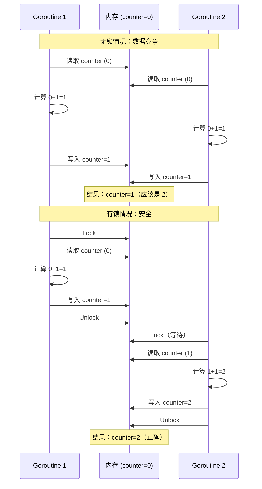
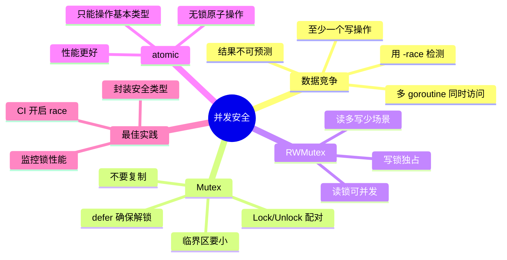

# 写作前的代码理解摘要

## 项目地图

| 类别 | 路径/名称 |
|------|-----------|
| main 入口文件 | `series/20/cmd/counter/main.go` |
| 核心业务逻辑 | 同上（单文件项目，通过两种模式演示数据竞争与 Mutex） |
| 关键结构体 | `config`（命令行配置） |
| 关键函数 | `runUnsafe`（无锁，有数据竞争）、`runWithMutex`（有锁，安全） |

## 核心三问

**这个项目解决的具体痛点是什么？**
多个 goroutine 同时读写共享变量时，会发生数据竞争（data race），导致结果不可预测。很多开发者以为"只是加个 1，能有什么问题"，结果线上出现诡异的计数错误。数据竞争是并发编程最常见也最隐蔽的 Bug。

**它的核心技术实现逻辑（Trick）是什么？**
项目通过两种模式对比：1）无锁模式（unsafe）——多个 goroutine 直接操作共享变量，结果不正确；2）有锁模式（mutex）——用 `sync.Mutex` 保护共享变量，结果正确。核心 Trick 是理解**临界区**的概念：同一时刻只能有一个 goroutine 访问共享资源。

**它最适合用在什么业务场景？**
任何涉及共享状态的并发场景：计数器、缓存、连接池、配置热更新。理解 Mutex 的正确用法，是写出线程安全代码的基础。

## Go 语言特性提取

| 特性 | 项目中的应用 | 后续重点科普 |
|------|-------------|-------------|
| sync.Mutex | 互斥锁保护共享变量 | Lock/Unlock 的正确用法 |
| sync.WaitGroup | 等待所有 goroutine 完成 | 与 Mutex 配合使用 |
| go run -race | 数据竞争检测 | race detector 的原理 |
| 闭包捕获变量 | goroutine 内访问外部变量 | 共享 vs 复制 |

---

**备选标题 A（痛点型）**：那个"计数少了几万"的 Bug，让我搞懂了 Go 的数据竞争

**备选标题 B（干货型）**：Go 并发安全：从数据竞争到 Mutex，一文讲透共享变量保护

**备选标题 C（悬念型）**：为什么 counter++ 不是原子操作？Go 数据竞争的真相

---

## 1. 场景复现：那个让我头疼的时刻

上线一个统计服务后，运营反馈："今天的 PV 统计好像不对，比昨天少了 30%。"

我打开代码一看，逻辑很简单：

```go
var pageViews int

func handleRequest(w http.ResponseWriter, r *http.Request) {
    pageViews++  // 统计 PV
    // ... 处理请求
}
```

看起来没问题对吧？但在高并发下，`pageViews++` 会丢数据。

"不就是加个 1 吗？能有什么问题？"同事问。

我说："问题大了。`pageViews++` 不是原子操作，它实际上是三步：读取 → 加 1 → 写回。两个 goroutine 同时执行时，可能都读到同一个值，然后各自加 1 写回，结果只加了 1 而不是 2。"

这就是**数据竞争**（data race）。今天这篇文章，我用一个计数器的例子，帮你理解数据竞争和 Mutex 的正确用法。

## 2. 架构蓝图：上帝视角看设计

数据竞争的本质：



**核心概念**：

1. **数据竞争**：多个 goroutine 同时访问同一变量，且至少一个是写操作
2. **临界区**：访问共享资源的代码段，同一时刻只能有一个 goroutine 执行
3. **Mutex**：互斥锁，用于保护临界区

## 3. 源码拆解：手把手带你读核心

### 3.1 无锁模式：数据竞争的现场

```go
func runUnsafe(cfg config) (got int, expected int) {
    expected = cfg.workers * cfg.loops  // 40 * 50000 = 2000000
    
    counter := 0
    var wg sync.WaitGroup
    wg.Add(cfg.workers)
    
    for w := 0; w < cfg.workers; w++ {
        go func() {
            defer wg.Done()
            for i := 0; i < cfg.loops; i++ {
                counter++  // 数据竞争！
            }
        }()
    }
    
    wg.Wait()
    return counter, expected
}
```

运行结果：

```
expected=2000000 got=1847293
WARNING: result mismatch (likely data race)
```

**为什么少了 15 万？**

`counter++` 看起来是一行代码，但在 CPU 层面是三步：

1. **读取**：从内存读取 counter 的值到寄存器
2. **计算**：寄存器的值加 1
3. **写回**：把寄存器的值写回内存

当两个 goroutine 同时执行时：

```
时刻 1: G1 读取 counter=100
时刻 2: G2 读取 counter=100（G1 还没写回）
时刻 3: G1 计算 100+1=101
时刻 4: G2 计算 100+1=101
时刻 5: G1 写回 counter=101
时刻 6: G2 写回 counter=101（覆盖了 G1 的结果）
```

两次 `++` 只增加了 1。这种情况在高并发下会频繁发生。

### 3.2 用 race detector 检测

```bash
go run -race ./cmd/counter -mode=unsafe
```

输出：

```
==================
WARNING: DATA RACE
Read at 0x00c0000b4008 by goroutine 8:
  main.runUnsafe.func1()
      /path/to/main.go:65 +0x44

Previous write at 0x00c0000b4008 by goroutine 7:
  main.runUnsafe.func1()
      /path/to/main.go:65 +0x56
==================
```

**知识点贴士**：`-race` 是 Go 内置的数据竞争检测器。它会在运行时检测并发访问，发现竞争就报警。**强烈建议在测试环境开启**，但生产环境不要开（有 10 倍性能开销）。

### 3.3 有锁模式：正确的姿势

```go
func runWithMutex(cfg config) (got int, expected int) {
    expected = cfg.workers * cfg.loops
    
    counter := 0
    var mu sync.Mutex  // 互斥锁
    var wg sync.WaitGroup
    wg.Add(cfg.workers)
    
    for w := 0; w < cfg.workers; w++ {
        go func() {
            defer wg.Done()
            for i := 0; i < cfg.loops; i++ {
                mu.Lock()    // 加锁
                counter++    // 临界区
                mu.Unlock()  // 解锁
            }
        }()
    }
    
    wg.Wait()
    return counter, expected
}
```

运行结果：

```
expected=2000000 got=2000000
```

**完美！**

**Mutex 的工作原理**：

1. `mu.Lock()`：尝试获取锁。如果锁已被其他 goroutine 持有，当前 goroutine 会阻塞等待
2. 临界区代码执行
3. `mu.Unlock()`：释放锁，唤醒等待的 goroutine

**同一时刻只有一个 goroutine 能进入临界区**，所以不会有数据竞争。

### 3.4 Mutex 的正确用法

**规则一：Lock 和 Unlock 必须配对**

```go
// 错误：忘记 Unlock，其他 goroutine 永远阻塞
mu.Lock()
counter++
// 忘记 mu.Unlock()

// 正确：用 defer 确保 Unlock
mu.Lock()
defer mu.Unlock()
counter++
```

**规则二：不要复制 Mutex**

```go
type Counter struct {
    mu    sync.Mutex
    value int
}

// 错误：值传递会复制 Mutex
func (c Counter) Increment() {
    c.mu.Lock()  // 锁的是副本！
    c.value++
    c.mu.Unlock()
}

// 正确：用指针接收者
func (c *Counter) Increment() {
    c.mu.Lock()
    c.value++
    c.mu.Unlock()
}
```

**知识点贴士**：`sync.Mutex` 不能复制。如果你把一个 Mutex 复制了，两个副本是独立的锁，起不到互斥作用。Go 的 `go vet` 工具可以检测这个问题。

**规则三：临界区要尽量小**

```go
// 不好：整个函数都在临界区
func (c *Counter) Process(data []byte) {
    c.mu.Lock()
    defer c.mu.Unlock()
    
    result := expensiveComputation(data)  // 耗时操作
    c.value += result
}

// 好：只保护共享变量
func (c *Counter) Process(data []byte) {
    result := expensiveComputation(data)  // 不需要锁
    
    c.mu.Lock()
    c.value += result  // 只锁这一行
    c.mu.Unlock()
}
```

临界区越大，并发度越低。只保护真正需要保护的代码。

### 3.5 RWMutex：读多写少的优化

```go
type Cache struct {
    mu    sync.RWMutex
    data  map[string]string
}

// 读操作：可以多个 goroutine 同时读
func (c *Cache) Get(key string) (string, bool) {
    c.mu.RLock()         // 读锁
    defer c.mu.RUnlock()
    v, ok := c.data[key]
    return v, ok
}

// 写操作：独占
func (c *Cache) Set(key, value string) {
    c.mu.Lock()          // 写锁
    defer c.mu.Unlock()
    c.data[key] = value
}
```

**RWMutex 的规则**：

- 多个 goroutine 可以同时持有读锁（RLock）
- 写锁（Lock）是独占的，持有写锁时不能有任何读锁或写锁
- 适合**读多写少**的场景

### 3.6 atomic：更轻量的选择

对于简单的计数器，`sync/atomic` 包更高效：

```go
import "sync/atomic"

var counter int64

func increment() {
    atomic.AddInt64(&counter, 1)  // 原子操作
}

func get() int64 {
    return atomic.LoadInt64(&counter)  // 原子读取
}
```

**atomic vs Mutex**：

| 特性 | atomic | Mutex |
|------|--------|-------|
| 性能 | 更快（无锁） | 较慢（有锁） |
| 适用场景 | 简单的读写 | 复杂的临界区 |
| 灵活性 | 低（只能操作基本类型） | 高（可以保护任意代码） |

**经验法则**：简单计数用 atomic，复杂逻辑用 Mutex。

## 4. 避坑指南 & 深度思考

| 坑点 | 症状 | 解决方案 |
|------|------|----------|
| 忘记加锁 | 数据竞争，结果不可预测 | 用 -race 检测 |
| 忘记解锁 | 死锁，goroutine 永远阻塞 | defer mu.Unlock() |
| 复制 Mutex | 锁失效 | 用指针传递 |
| 临界区太大 | 并发度低，性能差 | 只保护必要的代码 |
| 锁的粒度太粗 | 不相关的操作互相阻塞 | 拆分成多个锁 |
| 嵌套加锁 | 死锁 | 避免在持有锁时调用可能加锁的函数 |

**深度思考：为什么 counter++ 不是原子的？**

这涉及到 CPU 和内存的工作方式：

1. **CPU 缓存**：每个 CPU 核心有自己的缓存，变量可能在多个缓存中有副本
2. **指令重排**：编译器和 CPU 可能重排指令顺序以优化性能
3. **非原子操作**：`counter++` 在汇编层面是多条指令

Go 的 Mutex 和 atomic 会插入**内存屏障**（memory barrier），确保：
- 缓存同步
- 禁止重排
- 操作的原子性

**这个 Demo 与生产环境的差距**：

1. **缺少超时**：生产环境应该用 `TryLock` 或带超时的锁
2. **缺少监控**：应该监控锁的等待时间、持有时间
3. **缺少死锁检测**：可以用 pprof 的 mutex profile 分析
4. **缺少分布式锁**：单机 Mutex 不能跨进程

## 5. 快速上手 & 改造建议

**运行命令**：

```bash
cd series/20

# 无锁模式（会有数据竞争）
go run ./cmd/counter -mode=unsafe

# 有锁模式（安全）
go run ./cmd/counter -mode=mutex

# 用 race detector 检测
go run -race ./cmd/counter -mode=unsafe
```

**工程化改造建议**：

**1. 封装线程安全的计数器**

```go
type SafeCounter struct {
    mu    sync.Mutex
    value int64
}

func (c *SafeCounter) Inc() {
    c.mu.Lock()
    c.value++
    c.mu.Unlock()
}

func (c *SafeCounter) Add(delta int64) {
    c.mu.Lock()
    c.value += delta
    c.mu.Unlock()
}

func (c *SafeCounter) Value() int64 {
    c.mu.Lock()
    defer c.mu.Unlock()
    return c.value
}
```

**2. 用 atomic 实现高性能计数器**

```go
type AtomicCounter struct {
    value int64
}

func (c *AtomicCounter) Inc() {
    atomic.AddInt64(&c.value, 1)
}

func (c *AtomicCounter) Value() int64 {
    return atomic.LoadInt64(&c.value)
}
```

**3. 在 CI 中开启 race 检测**

```yaml
# .github/workflows/test.yml
- name: Test with race detector
  run: go test -race ./...
```

## 6. 总结与脑图

- **counter++ 不是原子操作**：读取 → 计算 → 写回，三步可能被打断
- **数据竞争导致结果不可预测**：用 `-race` 检测
- **Mutex 保护临界区**：Lock/Unlock 必须配对，用 defer 确保
- **不要复制 Mutex**：用指针传递
- **临界区要尽量小**：只保护必要的代码
- **读多写少用 RWMutex**：允许多个读者同时读
- **简单计数用 atomic**：性能更好



把这些概念理清，你就不会再写出数据竞争的代码了。下次写并发代码时，记得问自己：这个变量会被多个 goroutine 访问吗？需要加锁吗？
