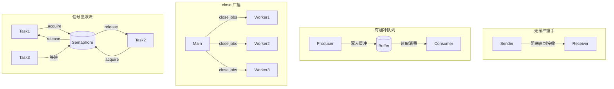

# 写作前的代码理解摘要

## 1. 项目地图

- **main 入口文件**：`series/21/cmd/chanlab/main.go`
- **核心业务逻辑文件**：同上（单文件演示项目）
- **关键结构体/接口**：
  - `config` 结构体：配置参数（buffer、items、prodDelay、consDelay、workers、semLimit、showTiming）
  - 四个核心演示函数：`demoUnbufferedHandshake`、`demoBufferedQueue`、`demoCloseAndOK`、`demoSemaphore`

## 2. 核心三问

**这个项目解决的具体痛点是什么？**
很多开发者把 channel 当成"万能锁"或"线程安全队列"，导致代码越写越绕。这个项目通过四个精心设计的演示，帮助开发者理解 channel 的本质：它既是通信管道，也是同步原语。分清"传数据"和"协调时序"两种用途，并发设计会清晰很多。

**它的核心技术实现逻辑（Trick）是什么？**
项目用四个递进的 Demo 展示 channel 的不同用法：无缓冲 channel 做握手同步（发送=阻塞点）、有缓冲 channel 做生产者-消费者队列（len/cap 可观测背压）、close 广播结束信号（多 worker 同时感知）、`chan struct{}` 做信号量限制并发（acquire/release 模式）。每个 Demo 都带时间戳或状态输出，让行为可观测。

**它最适合用在什么业务场景？**
适合作为 Go 并发入门的"第一课"，帮助开发者建立正确的 channel 心智模型。在实际业务中，无缓冲握手适合"确认点"场景，有缓冲队列适合平滑速率差异，close 广播适合通知多个消费者退出，信号量适合限制并发数（如连接池、限流）。

## 3. Go 语言特性提取

- **Channel（核心）**：无缓冲/有缓冲、发送/接收、close、len/cap
- **Goroutine**：并发执行单元
- **sync.WaitGroup**：等待多个 goroutine 完成
- **Defer**：延迟执行（wg.Done、释放信号量）
- **闭包**：goroutine 内捕获外部变量
- **flag 包**：命令行参数解析

---

**备选标题**

- 风格 A（痛点型）：《别再把 channel 当锁用了！一文搞懂 Go 并发通信的正确姿势》
- 风格 B（干货型）：《Go channel 四种核心用法：握手、队列、广播、信号量》
- 风格 C（悬念型）：《为什么你的 Go 并发代码总是"绕"？因为你没分清这两件事》

---

## 1. 场景复现：那个让我头疼的时刻

上周我接手了一个同事的代码，里面有一段"看起来很 Go"的并发逻辑：所有共享状态都通过 channel 传递，每个操作都要发一个消息、等一个回复。我花了半小时才理清数据流向，改一个小功能要动五六个地方。

更头疼的是另一个极端：另一个模块完全不用 channel，全靠 `sync.Mutex` 保护共享 map，临界区套临界区，死锁风险随时爆发。

我开始反思：**channel 到底该怎么用？**

后来我想明白了一件事：channel 不是"替代锁"的工具，它的本质是提供一种**可组合的通信机制**。它有两种用途：

1. **通信**：把数据从 A 传到 B
2. **同步**：利用阻塞语义协调时序

把这两种用途分清楚，很多并发设计会豁然开朗。

## 2. 架构蓝图：上帝视角看设计

这个演示项目用四个独立的 Demo 展示 channel 的四种典型用法：



四个 Demo 的核心区别：

| Demo | channel 类型 | 核心用途 | 关键行为 |
|------|-------------|---------|---------|
| 无缓冲握手 | `make(chan T)` | 同步 | 发送阻塞直到接收 |
| 有缓冲队列 | `make(chan T, n)` | 通信 | 缓冲满才阻塞 |
| close 广播 | 任意 | 同步 | 多接收者同时感知结束 |
| 信号量 | `make(chan struct{}, n)` | 同步 | 控制并发上限 |

## 3. 源码拆解：手把手带你读核心

### 3.1 无缓冲 channel：发送就是同步点

```go
func demoUnbufferedHandshake(showTiming bool) {
    ch := make(chan string) // 无缓冲！

    go func() {
        logf("sender: 准备发送 A（会阻塞，直到有人接收）")
        ch <- "A"  // 这里会卡住
        logf("sender: 已发送 A（说明接收方已经接走）")
    }()

    go func() {
        time.Sleep(40 * time.Millisecond)  // 故意晚 40ms
        logf("receiver: 准备接收")
        v := <-ch
        logf("receiver: 收到 %q", v)
    }()
}
```

**你注意到了吗？** `make(chan string)` 没有第二个参数，这就是无缓冲 channel。

**知识点贴士：无缓冲 channel 的阻塞语义**
- 发送方执行 `ch <- v` 时，如果没有接收方在等，发送方会**阻塞**
- 接收方执行 `<-ch` 时，如果没有发送方在等，接收方会**阻塞**
- 只有发送和接收**同时就绪**，数据才会传递

这意味着：**发送成功 = 接收方已经拿到数据**。这是天然的"握手"机制。

运行这段代码，你会看到时间戳证明：sender 在 receiver 接收前一直卡在"准备发送"，直到 40ms 后 receiver 开始接收，sender 才打印"已发送"。

### 3.2 有缓冲 channel：队列化通信

```go
func demoBufferedQueue(cfg config) {
    ch := make(chan int, cfg.buffer)  // 有缓冲！
    
    // 消费者
    go func() {
        for v := range ch {
            fmt.Printf("consumer: got=%d (len=%d cap=%d)\n", v, len(ch), cap(ch))
            time.Sleep(cfg.consDelay)  // 消费慢
        }
    }()

    // 生产者
    for i := 0; i < cfg.items; i++ {
        time.Sleep(cfg.prodDelay)  // 生产快
        fmt.Printf("producer: send=%d (len=%d cap=%d)\n", i, len(ch), cap(ch))
        ch <- i
    }
    close(ch)
}
```

**为什么这里用有缓冲？** 因为生产者和消费者速度不一样。生产者每 10ms 发一个，消费者每 30ms 处理一个。如果用无缓冲，生产者每次都要等消费者，吞吐量会被拖慢。

**知识点贴士：len(ch) 和 cap(ch)**
- `cap(ch)`：缓冲区容量（创建时指定）
- `len(ch)`：当前缓冲区里有多少元素
- 当 `len(ch) == cap(ch)` 时，发送会阻塞（背压）

运行时你会看到 `len(ch)` 逐渐增加，当达到 `cap(ch)` 时，生产者被迫等待——这就是**背压（backpressure）**。

**工程建议**：buffer 只用来平滑短期波动，不要设太大。过大的 buffer 只会把问题"藏进队列"，增加延迟和内存占用。

### 3.3 close 广播：通知所有消费者退出

```go
func demoCloseAndOK(workers int) {
    jobs := make(chan int)

    for w := 1; w <= workers; w++ {
        go func() {
            for job := range jobs {  // range 会在 close 后自动退出
                fmt.Printf("worker-%d: job=%d\n", w, job)
            }
            fmt.Printf("worker-%d: jobs closed\n", w)
        }()
    }

    for i := 0; i < 6; i++ {
        jobs <- i
    }
    close(jobs)  // 广播结束信号
}
```

**为什么用 close 而不是发送特殊值？** 比如发送 `-1` 表示结束？

问题在于：如果有 3 个 worker，你要发 3 个 `-1`；如果 worker 数量动态变化，你根本不知道要发几个。而 **close 是广播**：所有在 `range` 或 `<-ch` 等待的 goroutine 都会立刻感知到。

**知识点贴士：for range channel**
```go
for v := range ch {
    // 处理 v
}
```
这等价于：
```go
for {
    v, ok := <-ch
    if !ok {
        break  // channel 已关闭
    }
    // 处理 v
}
```

**关键原则**：**只有发送方关闭 channel**。接收方不知道是否还有其他发送者，贸然关闭会导致 panic。

### 3.4 channel 当信号量：限制并发

```go
func demoSemaphore(limit int) {
    sem := make(chan struct{}, limit)  // 容量 = 并发上限

    task := func(id int) {
        sem <- struct{}{}        // acquire：占一个坑
        defer func() { <-sem }() // release：释放坑位
        
        fmt.Printf("task-%d: start (inflight=%d)\n", id, len(sem))
        time.Sleep(35 * time.Millisecond)
        fmt.Printf("task-%d: end\n", id)
    }

    for i := 1; i <= 5; i++ {
        go task(i)
    }
}
```

**这里的 trick 是什么？** 我们根本不关心 channel 里传的是什么（所以用空结构体 `struct{}`），我们只利用它的**阻塞语义**：

- 缓冲区满了，发送会阻塞 → 新任务必须等待
- 缓冲区有空位，发送成功 → 任务可以执行

**知识点贴士：为什么用 `chan struct{}` 而不是 `chan bool`？**
`struct{}` 是零大小类型，不占内存。当你只需要"信号"而不需要"数据"时，这是 Go 的惯用写法。

运行时你会看到 `inflight`（正在执行的任务数）永远不超过 `limit`。这比用 Mutex + 计数器更简洁，而且没有锁竞争。

## 4. 避坑指南 & 深度思考

### 坑 1：忘记接收导致死锁

```go
ch := make(chan int)
ch <- 1  // 永远阻塞，没人接收
```

无缓冲 channel 发送时，如果没有接收者，goroutine 会永远卡住。Go 运行时检测到所有 goroutine 都阻塞时会报 `fatal error: all goroutines are asleep - deadlock!`

**解决**：确保有接收者；或者用 `select` + `default` 做非阻塞尝试；或者用超时兜底。

### 坑 2：发送到已关闭的 channel

```go
ch := make(chan int)
close(ch)
ch <- 1  // panic: send on closed channel
```

**解决**：约定"只有发送方关闭"，并在设计上保证 close 只发生一次。

### 坑 3：从 nil channel 读写

```go
var ch chan int  // nil
ch <- 1          // 永久阻塞
<-ch             // 永久阻塞
```

**解决**：初始化 channel（`make(chan int)`），在接口边界做非 nil 校验。

### 坑 4：缓冲设置过大

表面上不阻塞了，但延迟和内存不可控，问题被"藏在队列里"。

**解决**：小缓冲 + 有界并发 + 限流。必要时监控队列长度。

### 生产环境 vs Demo 的差距

这个 Demo 是教学用的，生产环境还需要：

1. **错误处理**：worker 处理失败怎么办？重试？丢弃？
2. **优雅关闭**：收到 SIGTERM 时如何 drain 队列？
3. **可观测性**：队列长度、处理延迟、错误率的指标
4. **背压策略**：队列满了是阻塞、丢弃、还是返回错误？

## 5. 快速上手 & 改造建议

### 运行命令

```bash
# 基本运行
go run ./series/21/cmd/chanlab

# 自定义参数
go run ./series/21/cmd/chanlab -buffer=5 -items=10 -prod=5ms -cons=20ms -workers=4 -sem=3
```

### 工程化改造建议

1. **加日志和指标**：在生产者/消费者里加入结构化日志，记录队列长度、处理耗时。可以用 `prometheus` 暴露 `channel_length` 指标。

2. **配置管理**：把 buffer 大小、worker 数量等参数放到配置文件或环境变量，而不是硬编码。不同环境（开发/测试/生产）可能需要不同配置。

3. **优雅关闭**：监听系统信号（`os.Signal`），收到 SIGTERM 时先停止生产者，等消费者 drain 完队列再退出。可以用 `context.WithCancel` 传播取消信号。

## 6. 总结与脑图

- **channel 有两种用途**：通信（传数据）和同步（协调时序），分清用途让设计更清晰
- **无缓冲 = 握手**：发送成功意味着接收方已拿到，适合"确认点"场景
- **有缓冲 = 队列**：平滑速率差异，但 buffer 不宜过大，注意背压
- **close = 广播**：通知所有接收者"不会再有新数据"，只有发送方应该 close
- **`chan struct{}` = 信号量**：利用阻塞语义限制并发，比锁更简洁

```
channel 本质
├── 通信（传数据）
│   └── 有缓冲 channel → 生产者-消费者队列
└── 同步（协调时序）
    ├── 无缓冲 channel → 握手/确认点
    ├── close → 广播结束信号
    └── chan struct{} → 信号量/限流
```
