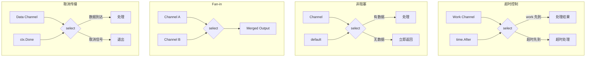

# 写作前的代码理解摘要

## 1. 项目地图

- **main 入口文件**：`series/22/cmd/selectlab/main.go`
- **核心业务逻辑文件**：同上（单文件演示项目）
- **关键结构体/接口**：
  - `config` 结构体：配置参数（timeout）
  - 五个核心演示函数：`demoTimeout`、`demoNonBlocking`、`demoFanIn`、`demoContextCancel`、`demoNilChannel`
  - `producer` 函数：生成带延迟的消息流
  - `fanIn` 函数：合并多个 channel 的经典实现

## 2. 核心三问

**这个项目解决的具体痛点是什么？**
并发代码最容易出问题的地方不是"开 goroutine"，而是"等待"：等谁、等多久、等不到怎么办。很多线上事故都是因为某个 goroutine 永远卡在 channel 读写上。这个项目通过五个 Demo 展示 `select` 如何把"等待"变成可控的：超时、非阻塞、多路复用、取消传播、动态禁用分支。

**它的核心技术实现逻辑（Trick）是什么？**
`select` 是 Go 的"多路等待器"，它让你同时监听多个 channel 操作，哪个先就绪就执行哪个。项目展示了五种典型用法：`time.After` 实现超时、`default` 实现非阻塞尝试、fan-in 合并多个输入、`ctx.Done()` 实现取消传播、nil channel 动态禁用分支。特别是 `fanIn` 函数展示了一个工程级技巧：关闭的 channel 设为 nil 来禁用对应 case。

**它最适合用在什么业务场景？**
任何需要"可控等待"的并发场景：HTTP 请求超时、多数据源竞速（谁先返回用谁）、优雅关闭（监听退出信号）、非阻塞队列操作（尝试发送/接收）。这是写出"不会死锁的并发代码"的核心工具。

## 3. Go 语言特性提取

- **select 语句（核心）**：多路等待、随机选择就绪 case
- **Channel**：发送/接收、close、nil channel 行为
- **time.After / time.NewTicker**：定时器与超时
- **context 包**：WithTimeout、WithCancel、Done()、Err()
- **Goroutine**：并发执行
- **闭包**：返回 channel 的工厂函数

---

**备选标题**

- 风格 A（痛点型）：《线上 goroutine 卡死？因为你没用好 select 的这 5 个姿势》
- 风格 B（干货型）：《Go select 完全指南：超时、非阻塞、fan-in、取消一网打尽》
- 风格 C（悬念型）：《为什么我说 select 是 Go 并发的"保险丝"？》

---

## 1. 场景复现：那个让我头疼的时刻

凌晨两点，我被告警电话吵醒。线上服务的 goroutine 数从几百飙到了几万，内存持续上涨，响应延迟从 50ms 涨到了 5 秒。

我登上机器一看，`pprof` 显示大量 goroutine 卡在同一个位置：

```
goroutine 12345 [chan receive]:
    main.handleRequest(...)
        /app/handler.go:42
```

原来是调用下游服务的代码：

```go
result := <-downstreamCh  // 永远等下去...
```

下游服务挂了，这个 channel 永远不会有数据。没有超时，没有取消，goroutine 就这样一个个堆积起来。

**问题的本质是：等待不可控。**

后来我重构了这段代码，加上了 `select` + 超时：

```go
select {
case result := <-downstreamCh:
    // 正常处理
case <-time.After(100 * time.Millisecond):
    // 超时处理
}
```

从此，这类问题再也没发生过。

`select` 就是 Go 并发的"保险丝"：它让你把多个等待点放在一起，显式表达**超时、取消、默认分支、多路复用**。

## 2. 架构蓝图：上帝视角看设计

这个演示项目展示了 `select` 的五种核心用法：



五个 Demo 的核心区别：

| Demo | 核心技术 | 解决的问题 | 关键代码 |
|------|---------|-----------|---------|
| 超时 | `time.After` | 等待有上限 | `case <-time.After(t)` |
| 非阻塞 | `default` | 尝试而不卡住 | `default: ...` |
| Fan-in | 多 case | 合并多个输入 | `case v := <-a; case v := <-b` |
| 取消 | `ctx.Done()` | 上游取消传播 | `case <-ctx.Done()` |
| nil channel | 设为 nil | 动态禁用分支 | `a = nil` |

## 3. 源码拆解：手把手带你读核心

### 3.1 超时：select + time.After

```go
func demoTimeout(timeout time.Duration) {
    work := func(d time.Duration) <-chan string {
        ch := make(chan string, 1)
        go func() {
            time.Sleep(d)
            ch <- fmt.Sprintf("work finished in %s", d)
        }()
        return ch
    }

    // 场景 1：工作 40ms，超时 80ms → 成功
    select {
    case msg := <-work(40 * time.Millisecond):
        fmt.Println("case work:", msg)
    case <-time.After(timeout):  // 80ms
        fmt.Println("case timeout: exceeded")
    }

    // 场景 2：工作 120ms，超时 80ms → 超时
    select {
    case msg := <-work(120 * time.Millisecond):
        fmt.Println("case work:", msg)
    case <-time.After(timeout):
        fmt.Println("case timeout: exceeded")
    }
}
```

**你注意到了吗？** `work` 函数返回的是 `<-chan string`（只读 channel），这是 Go 的惯用写法：函数内部创建 channel 并启动 goroutine 填充数据，返回只读端给调用者。

**知识点贴士：time.After 的原理**
`time.After(d)` 返回一个 channel，在 `d` 时间后会收到一个时间值。它本质上是：
```go
func After(d Duration) <-chan Time {
    return NewTimer(d).C
}
```

**select 的行为**：当多个 case 都没就绪时，select 会阻塞；当有一个或多个 case 就绪时，**随机选择一个执行**。

**工程提示**：`time.After` 在循环中会创建很多定时器对象，热点路径更推荐复用 `time.Timer`：
```go
timer := time.NewTimer(timeout)
defer timer.Stop()
for {
    timer.Reset(timeout)
    select {
    case <-dataCh:
        // ...
    case <-timer.C:
        // 超时
    }
}
```

### 3.2 非阻塞：default 分支

```go
func demoNonBlocking() {
    ch := make(chan int, 1)

    // 非阻塞接收
    select {
    case v := <-ch:
        fmt.Println("recv:", v)
    default:
        fmt.Println("recv: no data (default)")
    }

    // 非阻塞发送
    select {
    case ch <- 1:
        fmt.Println("send: ok")
    default:
        fmt.Println("send: would block (default)")
    }

    // 再发一次（缓冲已满）
    select {
    case ch <- 2:
        fmt.Println("send: ok")
    default:
        fmt.Println("send: would block (default)")
    }
}
```

**default 的魔力**：当 select 有 default 分支时，如果所有 channel case 都不就绪，会**立即执行 default**，不会阻塞。

这把"阻塞操作"变成了"尝试操作"：
- 尝试接收：有数据就拿，没有就算了
- 尝试发送：能发就发，发不了就算了

**典型场景**：
- 尝试从队列取任务（没有就做其他事）
- 尝试发送指标（发不出去就丢弃，不影响主流程）

**但要小心**：default 容易写出忙等（busy loop）把 CPU 打满：
```go
// 错误示例：CPU 100%
for {
    select {
    case v := <-ch:
        process(v)
    default:
        // 没数据，继续循环 → 忙等！
    }
}
```

正确做法是加入"节奏来源"（timer/ticker/背压）。

### 3.3 Fan-in：合并多个 channel

```go
func fanIn(a, b <-chan string) <-chan string {
    out := make(chan string)
    go func() {
        defer close(out)
        aOpen, bOpen := true, true
        for aOpen || bOpen {
            select {
            case v, ok := <-a:
                if !ok {
                    aOpen = false
                    a = nil  // 关键：禁用这个 case
                    continue
                }
                out <- v
            case v, ok := <-b:
                if !ok {
                    bOpen = false
                    b = nil  // 关键：禁用这个 case
                    continue
                }
                out <- v
            }
        }
    }()
    return out
}
```

**这段代码有个精妙的技巧**：当 channel 关闭后，把它设为 `nil`。

**知识点贴士：nil channel 的行为**
- 向 nil channel 发送：永久阻塞
- 从 nil channel 接收：永久阻塞
- 在 select 中：nil channel 的 case **永远不会被选中**

所以 `a = nil` 的效果是：**动态禁用这个 case**，让 select 只关注还没关闭的 channel。

**为什么需要 `v, ok := <-a` 这种写法？** 因为从已关闭的 channel 接收会立即返回零值，`ok` 为 `false`。如果不检查 `ok`，会不断收到零值。

### 3.4 取消传播：ctx.Done()

```go
func demoContextCancel(timeout time.Duration) {
    ctx, cancel := context.WithTimeout(context.Background(), timeout)
    defer cancel()

    done := make(chan struct{})
    go func() {
        defer close(done)
        ticker := time.NewTicker(20 * time.Millisecond)
        defer ticker.Stop()
        for {
            select {
            case <-ctx.Done():
                fmt.Println("worker: ctx canceled ->", ctx.Err())
                return
            case <-ticker.C:
                fmt.Println("worker: tick")
            }
        }
    }()

    select {
    case <-done:
        fmt.Println("main: worker finished")
    case <-ctx.Done():
        fmt.Println("main: ctx done ->", ctx.Err())
        <-done  // 等 worker 真正退出
    }
}
```

**这是 Go 并发的标准模式**：用 `ctx.Done()` 作为退出信号。

**知识点贴士：context.WithTimeout**
```go
ctx, cancel := context.WithTimeout(parent, timeout)
defer cancel()  // 必须调用，释放资源
```
- `ctx.Done()` 返回一个 channel，超时或调用 `cancel()` 时会被 close
- `ctx.Err()` 返回取消原因：`context.Canceled` 或 `context.DeadlineExceeded`

**为什么 main 里要 `<-done`？** 因为 `ctx.Done()` 只是发出信号，worker 可能还在执行最后的清理。等待 `done` 确保 worker 真正退出，避免资源泄漏。

### 3.5 nil channel：动态禁用分支

```go
func demoNilChannel() {
    var a <-chan int  // nil
    b := make(chan int, 1)
    b <- 7

    select {
    case v := <-a:
        fmt.Println("a:", v)  // 永远不会执行
    case v := <-b:
        fmt.Println("b:", v)  // 会执行
    }

    // 当所有 channel 都是 nil 时...
    a = nil
    b = nil
    select {
    case <-a:
        fmt.Println("unreachable")
    case <-b:
        fmt.Println("unreachable")
    case <-time.After(10 * time.Millisecond):
        fmt.Println("both nil -> timeout prevents deadlock")
    }
}
```

**关键点**：当所有 channel case 都是 nil 且没有 default/timeout 时，select 会**永久阻塞**。

这就是为什么在 fan-in 等场景中，即使把 channel 设为 nil，也要保证有退出条件（所有输入都关闭时退出循环）。

## 4. 避坑指南 & 深度思考

### 坑 1：没有超时/取消的 select

```go
select {
case v := <-ch1:
    // ...
case v := <-ch2:
    // ...
}
// 如果 ch1 和 ch2 都没数据，永远卡住
```

**解决**：加入 `case <-time.After(timeout)` 或 `case <-ctx.Done()`。

### 坑 2：循环里滥用 time.After

```go
for {
    select {
    case v := <-ch:
        process(v)
    case <-time.After(1 * time.Second):
        // 每次循环都创建新的 Timer！
    }
}
```

**解决**：复用 `time.Timer`，用 `Reset` 重置。

### 坑 3：读关闭 channel 的零值陷阱

```go
select {
case v := <-ch:
    process(v)  // ch 关闭后会不断收到零值
}
```

**解决**：用 `v, ok := <-ch` 检查，或用 `for range ch`。

### 坑 4：default 写成忙等

```go
for {
    select {
    case v := <-ch:
        process(v)
    default:
        // CPU 100%
    }
}
```

**解决**：去掉 default，或加入 `time.Sleep` / ticker 控制节奏。

### 生产环境 vs Demo 的差距

1. **Timer 复用**：热点路径要复用 `time.Timer`，避免 GC 压力
2. **错误处理**：超时后要返回明确的错误，便于上游处理
3. **指标埋点**：记录超时次数、取消次数，用于监控告警
4. **优雅关闭**：收到退出信号后要 drain 队列，不能直接丢弃

## 5. 快速上手 & 改造建议

### 运行命令

```bash
# 基本运行
go run ./series/22/cmd/selectlab

# 自定义超时
go run ./series/22/cmd/selectlab -timeout=50ms
```

### 工程化改造建议

1. **封装超时工具函数**：
```go
func DoWithTimeout[T any](ctx context.Context, timeout time.Duration, fn func() T) (T, error) {
    ctx, cancel := context.WithTimeout(ctx, timeout)
    defer cancel()
    
    ch := make(chan T, 1)
    go func() { ch <- fn() }()
    
    select {
    case result := <-ch:
        return result, nil
    case <-ctx.Done():
        var zero T
        return zero, ctx.Err()
    }
}
```

2. **统一的 fan-in 泛型实现**：把 `fanIn` 改成支持任意类型和任意数量输入的泛型函数。

3. **可观测性**：在 select 的各个分支加入指标埋点，记录走了哪个分支、耗时多少。

## 6. 总结与脑图

- **select 是多路等待器**：同时监听多个 channel，哪个先就绪执行哪个
- **time.After 实现超时**：给等待加上限，避免永久阻塞
- **default 实现非阻塞**：尝试操作，不卡住当前 goroutine
- **ctx.Done() 实现取消**：上游取消能传播到下游，统一退出协议
- **nil channel 禁用分支**：动态调整 select 的可选项，代码更整洁

```
select 核心用法
├── 超时控制
│   ├── time.After（简单场景）
│   └── time.Timer（热点路径复用）
├── 非阻塞操作
│   └── default 分支
├── 多路复用
│   ├── fan-in（合并输入）
│   └── 竞速（谁先返回用谁）
├── 取消传播
│   └── ctx.Done()
└── 动态禁用
    └── nil channel
```
