# 写作前的代码理解摘要

## 1. 项目地图

- **main 入口文件**：`series/23/cmd/leaklab/main.go`
- **核心业务逻辑文件**：同上（单文件演示项目）
- **关键结构体/接口**：
  - `config` 结构体：配置参数（mode、n、tick、linger）
  - 六个核心演示函数：`leakRecv`/`fixRecv`、`leakSend`/`fixSend`、`leakTicker`/`fixTicker`
  - `printStats` 函数：打印 goroutine 数量和内存统计

## 2. 核心三问

**这个项目解决的具体痛点是什么？**
服务跑着跑着内存慢慢涨、goroutine 数从几百涨到几万，重启后正常但根因没解决。这不是"内存泄漏"，而是 **goroutine 泄漏**：某些 goroutine 永远阻塞在 channel 读写或 ticker 上，不退出、资源不释放。这个项目用三组对照实验（leak vs fix）直观展示泄漏的成因和修复方法。

**它的核心技术实现逻辑（Trick）是什么？**
项目设计了三种最常见的泄漏模式：blocked on receive（channel 永不 close）、blocked on send（无接收者）、ticker never exits（没有退出条件）。每种模式都有 leak 和 fix 两个版本，通过 `runtime.NumGoroutine()` 和 `runtime.MemStats` 实时展示 goroutine 数量变化。fix 版本统一使用 `context` + `select` + `WaitGroup` 的组合来确保可退出。

**它最适合用在什么业务场景？**
适合作为 goroutine 泄漏的"诊断教材"。在实际业务中，这三种模式覆盖了 90% 的泄漏场景：消费者等不到生产者 close、生产者发不出去因为消费者已退出、后台任务没有退出条件。掌握这些模式后，排查线上泄漏问题会快很多。

## 3. Go 语言特性提取

- **Channel**：阻塞语义、close、nil channel
- **Goroutine**：生命周期管理
- **context 包**：WithCancel、WithTimeout、Done()
- **sync.WaitGroup**：等待多个 goroutine 完成
- **runtime 包**：NumGoroutine()、ReadMemStats()
- **time.Ticker**：周期性定时器、Stop()
- **select 语句**：多路等待、退出条件
- **Defer**：资源释放

---

**备选标题**

- 风格 A（痛点型）：《服务跑着跑着就卡了？90% 是 goroutine 泄漏，三种模式一次讲透》
- 风格 B（干货型）：《Go goroutine 泄漏排查指南：recv/send/ticker 三大元凶》
- 风格 C（悬念型）：《为什么你的 Go 服务 goroutine 数越来越多？因为它们"回不了家"》

---

## 1. 场景复现：那个让我头疼的时刻

那是一个周五下午，我正准备收拾东西下班，监控告警响了：服务内存从 500MB 涨到了 2GB，还在继续涨。

我登上机器，第一反应是看 goroutine 数：

```bash
curl localhost:6060/debug/pprof/goroutine?debug=1 | head -20
```

结果让我倒吸一口凉气：**goroutine 数从正常的 200 涨到了 15000**。

用 `pprof` 看堆栈，发现大量 goroutine 卡在同一个位置：

```
goroutine 12345 [chan receive]:
    main.processTask(...)
        /app/worker.go:87
```

原来是一个 worker 池的代码：

```go
func worker(tasks <-chan Task) {
    for task := range tasks {
        process(task)
    }
}
```

看起来没问题对吧？问题在于：**tasks channel 永远没有被 close**。

生产者在某些错误路径下直接 return 了，没有 close channel。消费者就这样永远等下去，一个请求泄漏一个 goroutine，积少成多。

**goroutine 泄漏的本质是：代码里存在一个"永远等不到的阻塞点"。**

## 2. 架构蓝图：上帝视角看设计

这个项目用三组对照实验展示泄漏的成因和修复：

```mermaid
flowchart TB
    subgraph LeakRecv["泄漏：blocked on receive"]
        G1[Goroutine] -->|<-ch| CH1[Channel]
        CH1 -.->|永不 close| X1[永久阻塞]
    end
    
    subgraph FixRecv["修复：select + ctx.Done"]
        G2[Goroutine] -->|select| S1{select}
        S1 -->|<-ch| CH2[Channel]
        S1 -->|<-ctx.Done| EXIT1[退出]
    end
    
    subgraph LeakSend["泄漏：blocked on send"]
        G3[Goroutine] -->|ch<-| CH3[Channel]
        CH3 -.->|无接收者| X2[永久阻塞]
    end
    
    subgraph FixSend["修复：select + timeout"]
        G4[Goroutine] -->|select| S2{select}
        S2 -->|ch<-| CH4[Channel]
        S2 -->|<-ctx.Done| EXIT2[退出]
    end
    
    subgraph LeakTicker["泄漏：ticker never exits"]
        G5[Goroutine] -->|for range| TK1[ticker.C]
        TK1 -.->|无退出条件| X3[永久运行]
    end
    
    subgraph FixTicker["修复：ctx + Stop"]
        G6[Goroutine] -->|select| S3{select}
        S3 -->|<-ticker.C| TK2[处理]
        S3 -->|<-ctx.Done| EXIT3[退出+Stop]
    end
```



三种泄漏模式的共同点：**协作方消失了，但等待还在继续。**

| 模式 | 泄漏原因 | 修复方法 |
|------|---------|---------|
| blocked on receive | channel 永不 close | select + ctx.Done |
| blocked on send | 无接收者 | select + timeout/ctx |
| ticker never exits | 无退出条件 | select + ctx.Done + Stop |

## 3. 源码拆解：手把手带你读核心

### 3.1 泄漏模式一：blocked on receive

```go
func leakRecv(n int, linger time.Duration) {
    ch := make(chan int)

    for i := 0; i < n; i++ {
        go func() {
            <-ch  // 永远等不到
        }()
    }

    time.Sleep(linger)
    printStats("after spawn (still blocked)")
}
```

**问题在哪？** `ch` 永远没有发送者，也没有被 close。所有 goroutine 都卡在 `<-ch`。

运行 `go run ./series/23/cmd/leaklab -mode=leak-recv -n=2000`，你会看到：

```
[start] goroutines=1 ...
[after spawn (still blocked)] goroutines=2001 ...
[end] goroutines=2001 ...
```

**2001 个 goroutine，一个都没退出。**

### 3.2 修复：select + ctx.Done

```go
func fixRecv(n int, linger time.Duration) {
    ch := make(chan int)
    ctx, cancel := context.WithCancel(context.Background())
    defer cancel()

    var wg sync.WaitGroup
    wg.Add(n)
    for i := 0; i < n; i++ {
        go func() {
            defer wg.Done()
            select {
            case <-ch:
                // 正常接收
            case <-ctx.Done():
                // 收到取消信号，退出
            }
        }()
    }

    time.Sleep(linger)
    printStats("after spawn")

    cancel()      // 发出取消信号
    wg.Wait()     // 等待所有 goroutine 退出
    printStats("after cancel + wait")
}
```

**修复的关键**：用 `select` 同时监听数据 channel 和 `ctx.Done()`。当 `cancel()` 被调用时，所有 goroutine 都能感知到并退出。

运行 `go run ./series/23/cmd/leaklab -mode=fix-recv -n=2000`：

```
[after spawn] goroutines=2001 ...
[after cancel + wait] goroutines=1 ...
```

**goroutine 数回落到 1，泄漏被修复。**

**知识点贴士：WaitGroup 的作用**
`wg.Wait()` 确保我们等到所有 goroutine 真正退出后再继续。如果不等，可能 `cancel()` 刚调用，goroutine 还没来得及退出，我们就打印统计了。

### 3.3 泄漏模式二：blocked on send

```go
func leakSend(n int, linger time.Duration) {
    ch := make(chan int)  // 无缓冲

    for i := 0; i < n; i++ {
        i := i
        go func() {
            ch <- i  // 永远发不出去
        }()
    }

    time.Sleep(linger)
    printStats("after spawn (still blocked)")
}
```

**问题在哪？** 无缓冲 channel，没有接收者。所有 goroutine 都卡在 `ch <- i`。

**知识点贴士：`i := i` 是什么？**
这是 Go 的一个经典陷阱。在循环里启动 goroutine 时，如果直接用 `i`，所有 goroutine 会共享同一个变量。`i := i` 创建一个新的局部变量，捕获当前值。（Go 1.22+ 已修复这个问题，但为了兼容性，很多代码还保留这个写法）

### 3.4 修复：select + timeout

```go
func fixSend(n int, linger time.Duration) {
    ch := make(chan int)
    ctx, cancel := context.WithTimeout(context.Background(), linger/2)
    defer cancel()

    var wg sync.WaitGroup
    wg.Add(n)
    for i := 0; i < n; i++ {
        i := i
        go func() {
            defer wg.Done()
            select {
            case ch <- i:
                // 发送成功
            case <-ctx.Done():
                // 超时或取消，退出
            }
        }()
    }

    time.Sleep(linger)
    wg.Wait()
    printStats("after timeout + wait")
}
```

**修复的关键**：发送操作也要有退出条件。用 `select` 监听 `ctx.Done()`，超时后自动退出。

### 3.5 泄漏模式三：ticker never exits

```go
func leakTicker(tick time.Duration, linger time.Duration) {
    ticker := time.NewTicker(tick)
    go func() {
        for range ticker.C {
            // 永远循环
        }
    }()

    time.Sleep(linger)
    printStats("after linger (ticker goroutine still running)")
}
```

**问题在哪？** `for range ticker.C` 永远不会结束，因为 ticker 没有被 Stop，也没有退出条件。

**知识点贴士：Ticker vs Timer**
- `time.Timer`：一次性定时器，到期后触发一次
- `time.Ticker`：周期性定时器，每隔一段时间触发一次
- 两者都需要调用 `Stop()` 来释放资源

### 3.6 修复：ctx + Stop + exit

```go
func fixTicker(tick time.Duration, linger time.Duration) {
    ctx, cancel := context.WithCancel(context.Background())
    ticker := time.NewTicker(tick)

    var wg sync.WaitGroup
    wg.Add(1)
    go func() {
        defer wg.Done()
        defer ticker.Stop()  // 关键：释放 ticker 资源
        for {
            select {
            case <-ctx.Done():
                return  // 退出循环
            case <-ticker.C:
                // 处理 tick
            }
        }
    }()

    time.Sleep(linger)
    printStats("after spawn")

    cancel()
    wg.Wait()
    printStats("after cancel + wait")
}
```

**修复的关键**：
1. 用 `select` 监听 `ctx.Done()` 作为退出条件
2. 用 `defer ticker.Stop()` 确保 ticker 资源被释放
3. 用 `WaitGroup` 确保 goroutine 真正退出

### 3.7 printStats：观测 goroutine 数量

```go
func printStats(label string) {
    var m runtime.MemStats
    runtime.ReadMemStats(&m)
    fmt.Printf("[%s] goroutines=%d heap_alloc=%s heap_objects=%d num_gc=%d\n",
        label,
        runtime.NumGoroutine(),
        bytes(m.HeapAlloc),
        m.HeapObjects,
        m.NumGC,
    )
}
```

**知识点贴士：runtime.NumGoroutine()**
返回当前存活的 goroutine 数量。这是排查泄漏的第一指标。

**注意**：`heap_alloc` 不一定会立刻下降，因为 GC 有自己的触发时机。判断泄漏主要看 **goroutine 数量趋势**。

## 4. 避坑指南 & 深度思考

### 坑 1：for range ch 永远不退出

```go
for v := range ch {
    process(v)
}
// 如果 ch 永不 close，这里永远到不了
```

**解决**：确保生产者会 close channel；或者改用 select + ctx.Done。

### 坑 2：发送端没接收者

```go
go func() {
    ch <- result  // 如果没人接收，永远卡住
}()
```

**解决**：
- 确保接收者存在
- 发送端带 ctx/timeout
- 改成有缓冲 channel（但要注意背压）

### 坑 3：多生产者乱关 channel

```go
// 错误：多个生产者都可能 close
go func() { close(ch) }()
go func() { close(ch) }()  // panic: close of closed channel
```

**解决**：约定"只有一个协调者关闭"，用 WaitGroup 等所有生产者结束后再 close。

### 坑 4：忘记调用 cancel

```go
ctx, cancel := context.WithCancel(parent)
// 忘记 defer cancel()
// 下游 goroutine 永远等不到取消信号
```

**解决**：创建 ctx 后立刻 `defer cancel()`。

### 坑 5：把泄漏当成"内存不下降"

goroutine 已退出，但 `heap_alloc` 没回落。这可能只是 GC 还没触发。

**解决**：主要看 `runtime.NumGoroutine()` 的趋势，而不是内存。

### 如何排查线上泄漏

1. **看 goroutine 数趋势**：用 Prometheus + Grafana 监控 `go_goroutines`
2. **pprof 看堆栈**：`/debug/pprof/goroutine?debug=1` 看卡在哪里
3. **找阻塞点**：通常是 channel 读写、锁、网络 IO
4. **找协作方**：谁应该发送/接收/close？为什么没做？

## 5. 快速上手 & 改造建议

### 运行命令

```bash
# 演示接收泄漏
go run ./series/23/cmd/leaklab -mode=leak-recv -n=2000 -linger=80ms

# 演示接收修复
go run ./series/23/cmd/leaklab -mode=fix-recv -n=2000 -linger=80ms

# 演示发送泄漏/修复
go run ./series/23/cmd/leaklab -mode=leak-send -n=2000
go run ./series/23/cmd/leaklab -mode=fix-send -n=2000

# 演示 ticker 泄漏/修复
go run ./series/23/cmd/leaklab -mode=leak-ticker -linger=60ms
go run ./series/23/cmd/leaklab -mode=fix-ticker -linger=60ms
```

### 工程化改造建议

1. **goroutine 数监控**：在服务启动时注册 Prometheus 指标，定期采集 `runtime.NumGoroutine()`。设置告警阈值（比如超过 1000 就告警）。

2. **统一的 worker 模板**：
```go
func worker(ctx context.Context, jobs <-chan Job, results chan<- Result) {
    for {
        select {
        case <-ctx.Done():
            return
        case job, ok := <-jobs:
            if !ok {
                return
            }
            result := process(job)
            select {
            case <-ctx.Done():
                return
            case results <- result:
            }
        }
    }
}
```

3. **代码审查检查清单**：每个 goroutine 都问一句"它怎么退出？"

## 6. 总结与脑图

- **goroutine 泄漏的本质**：永远等不到的阻塞点（channel 读写、ticker、锁）
- **三种常见模式**：blocked on receive、blocked on send、ticker never exits
- **统一修复策略**：select + ctx.Done() + 资源释放（Stop/Close）
- **排查方法**：看 goroutine 数趋势 → pprof 看堆栈 → 找阻塞点 → 找协作方
- **预防措施**：每个 goroutine 都要有明确的退出条件

```
goroutine 泄漏
├── 成因：永远等不到的阻塞点
│   ├── blocked on receive（channel 永不 close）
│   ├── blocked on send（无接收者）
│   └── ticker/loop never exits（无退出条件）
├── 修复：统一模式
│   ├── select + ctx.Done()
│   ├── defer 资源释放（Stop/Close）
│   └── WaitGroup 确保退出
└── 排查
    ├── runtime.NumGoroutine() 趋势
    ├── pprof 堆栈分析
    └── 找协作方（谁该 close/cancel？）
```
