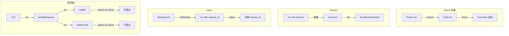

# 写作前的代码理解摘要

## 1. 项目地图

- **main 入口文件**：`series/24/cmd/ctxlab/main.go`
- **核心业务逻辑文件**：同上（单文件演示项目）
- **关键结构体/接口**：
  - `config` 结构体：配置参数（timeout）
  - `ctxKey` 类型：自定义 context key 类型
  - 四个核心演示函数：`demoCancelPropagation`、`demoTimeout`、`demoValue`、`demoCallChain`
  - 模拟调用链：`handleRequest` → `callDB` → `callRemote`

## 2. 核心三问

**这个项目解决的具体痛点是什么？**
上游请求已经超时返回了，下游 goroutine 还在跑；批处理任务被取消了，子任务却继续写数据库；日志里想打 request_id，调用链越走越深信息丢了。这些问题的根源是：并发程序缺少统一的"取消协议"。context 就是 Go 的解决方案：把取消、超时、元数据统一起来，让上游能控制下游。

**它的核心技术实现逻辑（Trick）是什么？**
项目通过四个 Demo 展示 context 的核心能力：cancel 传播（父取消子立刻感知）、timeout（DeadlineExceeded 可观测）、value（传递 request_id）、调用链贯穿（ctx 一路传到底）。特别是 `demoCallChain` 展示了一个完整的请求处理流程：入口创建 ctx → 注入 request_id → 传递给 DB/RPC 调用 → 每层都用 select 监听 ctx.Done()。

**它最适合用在什么业务场景？**
任何需要"可取消"的并发场景：HTTP 请求处理（客户端断开时取消后续操作）、批处理任务（用户取消时停止所有子任务）、微服务调用链（上游超时时下游及时退出）。context 是 Go 服务端编程的"标配"，几乎所有 IO 操作的第一个参数都是 ctx。

## 3. Go 语言特性提取

- **context 包（核心）**：Background、WithCancel、WithTimeout、WithValue、Done()、Err()
- **Channel**：ctx.Done() 返回的 channel
- **select 语句**：监听 ctx.Done() 和业务 channel
- **自定义类型**：`type ctxKey string` 避免 key 冲突
- **错误处理**：errors.New、fmt.Errorf、%w 包装
- **Defer**：defer cancel() 释放资源

---

**备选标题**

- 风格 A（痛点型）：《上游超时了下游还在跑？因为你没用好 Go 的 context》
- 风格 B（干货型）：《Go context 完全指南：取消、超时、传值一文搞定》
- 风格 C（悬念型）：《为什么 Go 函数的第一个参数总是 ctx？看完你就懂了》

---

## 1. 场景复现：那个让我头疼的时刻

我曾经接手过一个"诡异"的 Bug：用户反馈说请求超时了，但后台日志显示任务还在继续执行，甚至写入了数据库。

代码大概是这样的：

```go
func HandleOrder(w http.ResponseWriter, r *http.Request) {
    order := parseOrder(r)
    
    go func() {
        saveToDatabase(order)      // 异步保存
        notifyWarehouse(order)     // 通知仓库
        sendConfirmEmail(order)    // 发邮件
    }()
    
    w.Write([]byte("Order received"))
}
```

问题在于：**goroutine 和 HTTP 请求的生命周期完全脱钩了**。

用户请求超时断开，goroutine 还在跑。更糟的是，如果 `notifyWarehouse` 卡住了，`sendConfirmEmail` 永远执行不到，但数据库已经写了——数据不一致。

后来我用 context 重构了这段代码：

```go
func HandleOrder(w http.ResponseWriter, r *http.Request) {
    ctx := r.Context()  // 获取请求的 context
    order := parseOrder(r)
    
    if err := saveToDatabase(ctx, order); err != nil {
        // 处理错误
    }
    if err := notifyWarehouse(ctx, order); err != nil {
        // 处理错误
    }
    // ...
}
```

现在，当用户断开连接时，`ctx.Done()` 会被触发，所有下游操作都能感知到并及时退出。

**context 不是"又一个参数"，它是并发世界的"取消协议"。**

## 2. 架构蓝图：上帝视角看设计

这个项目展示了 context 的四个核心能力：



context 的三件事：

| 能力 | API | 用途 |
|------|-----|------|
| 取消 | `WithCancel` + `Done()` | 主动取消下游操作 |
| 超时 | `WithTimeout` + `Deadline()` | 限制操作时间 |
| 传值 | `WithValue` + `Value()` | 传递请求级元数据 |

## 3. 源码拆解：手把手带你读核心

### 3.1 cancel 传播：父取消，子立刻感知

```go
func demoCancelPropagation() {
    parent, cancel := context.WithCancel(context.Background())
    child, childCancel := context.WithCancel(parent)
    defer childCancel()

    done := make(chan struct{})
    go func() {
        defer close(done)
        select {
        case <-child.Done():
            fmt.Println("child done ->", child.Err())
        case <-time.After(200 * time.Millisecond):
            fmt.Println("child still running (unexpected)")
        }
    }()

    time.Sleep(30 * time.Millisecond)
    cancel()  // 取消 parent
    <-done
}
```

**你注意到了吗？** 我们取消的是 `parent`，但 `child` 也立刻感知到了。

**知识点贴士：context 的树形结构**
```
Background
    └── parent (WithCancel)
            └── child (WithCancel)
```
当 parent 被取消时，所有从它派生的 child 都会被取消。这是 context 的核心设计：**取消向下传播**。

**为什么要 `defer childCancel()`？** 即使 parent 已经取消，调用 childCancel 也是好习惯——它会释放 child 关联的资源。Go 的 `go vet` 会警告未调用的 cancel。

### 3.2 timeout：超时是可观测的退出原因

```go
func demoTimeout(timeout time.Duration) {
    // 场景 1：工作在超时前完成
    ctx, cancel := context.WithTimeout(context.Background(), timeout)
    defer cancel()

    select {
    case <-time.After(timeout / 2):  // 40ms
        fmt.Println("work finished before timeout")
    case <-ctx.Done():
        fmt.Println("ctx done ->", ctx.Err())
    }

    // 场景 2：工作超时
    ctx2, cancel2 := context.WithTimeout(context.Background(), timeout/2)  // 40ms
    defer cancel2()

    select {
    case <-time.After(timeout):  // 80ms
        fmt.Println("work finished (unexpected)")
    case <-ctx2.Done():
        fmt.Println("ctx2 done ->", ctx2.Err())  // deadline exceeded
    }
}
```

**知识点贴士：ctx.Err() 的两种值**
- `context.Canceled`：调用了 cancel()
- `context.DeadlineExceeded`：超时了

这让你在日志和指标里能区分"被主动取消"和"超时"，排查问题更方便。

**WithTimeout vs WithDeadline**
```go
// 等价的两种写法
ctx, cancel := context.WithTimeout(parent, 5*time.Second)
ctx, cancel := context.WithDeadline(parent, time.Now().Add(5*time.Second))
```
WithTimeout 更常用，因为通常我们关心的是"从现在开始多久"。

### 3.3 value：只传小元数据

```go
type ctxKey string

const keyRequestID ctxKey = "request_id"

func demoValue() {
    base := context.Background()
    ctx := context.WithValue(base, keyRequestID, "req-1001")

    fmt.Println("request_id =", requestID(ctx))
    fmt.Println("unknown key =", ctx.Value(ctxKey("missing")))  // nil
}

func requestID(ctx context.Context) string {
    v := ctx.Value(keyRequestID)
    s, _ := v.(string)
    return s
}
```

**为什么 key 用自定义类型 `ctxKey` 而不是 `string`？**

如果用 `string`，不同包可能用相同的 key 名字，导致冲突：
```go
// 包 A
ctx = context.WithValue(ctx, "id", "user-123")
// 包 B
ctx = context.WithValue(ctx, "id", "order-456")  // 覆盖了！
```

用自定义类型后，即使名字相同，类型不同也不会冲突：
```go
type keyA string
type keyB string
// keyA("id") != keyB("id")
```

**知识点贴士：Value 的正确用法**
- 只放请求级的小元数据：request_id、trace_id、user_id
- 不要放业务参数（用函数参数传）
- 不要放大对象（会随 ctx 传播，增加内存占用）

### 3.4 调用链：把 ctx 贯穿到底

```go
func demoCallChain(timeout time.Duration) {
    ctx, cancel := context.WithTimeout(context.Background(), timeout)
    defer cancel()
    ctx = context.WithValue(ctx, keyRequestID, "req-9009")

    err := handleRequest(ctx)
    fmt.Printf("handleRequest err=%v\n", err)
}

func handleRequest(ctx context.Context) error {
    if requestID(ctx) == "" {
        return errors.New("missing request_id")
    }

    if err := callDB(ctx); err != nil {
        return fmt.Errorf("db: %w", err)
    }
    if err := callRemote(ctx); err != nil {
        return fmt.Errorf("remote: %w", err)
    }
    return nil
}

func callDB(ctx context.Context) error {
    select {
    case <-time.After(40 * time.Millisecond):
        fmt.Println("callDB ok req=", requestID(ctx))
        return nil
    case <-ctx.Done():
        return ctx.Err()
    }
}

func callRemote(ctx context.Context) error {
    select {
    case <-time.After(80 * time.Millisecond):
        fmt.Println("callRemote ok req=", requestID(ctx))
        return nil
    case <-ctx.Done():
        return ctx.Err()
    }
}
```

**这是 Go 服务端编程的标准模式**：

1. **入口创建 ctx**：`context.WithTimeout(context.Background(), timeout)`
2. **注入元数据**：`context.WithValue(ctx, key, value)`
3. **一路传下去**：每个函数第一个参数是 `ctx context.Context`
4. **每个等待点监听 ctx.Done()**：用 select 确保可退出

**运行结果分析**：

当 timeout=90ms 时：
- callDB 需要 40ms → 成功
- callRemote 需要 80ms，但此时只剩 50ms → 超时

```
callDB ok req= req-9009
handleRequest err=remote: context deadline exceeded
```

**知识点贴士：错误包装 %w**
```go
return fmt.Errorf("remote: %w", err)
```
`%w` 会包装原始错误，让调用者可以用 `errors.Is(err, context.DeadlineExceeded)` 检查。

## 4. 避坑指南 & 深度思考

### 坑 1：创建了 ctx 但不传下去

```go
func handler(ctx context.Context) {
    ctx2, cancel := context.WithTimeout(ctx, 5*time.Second)
    defer cancel()
    
    go doWork()  // 错误：没传 ctx2！
}
```

**解决**：`go doWork(ctx2)`，并在 doWork 里监听 `ctx.Done()`。

### 坑 2：忘记调用 cancel

```go
ctx, cancel := context.WithCancel(parent)
// 忘记 defer cancel()
// 资源泄漏！
```

**解决**：创建后立刻 `defer cancel()`。Go 的 `go vet` 会警告这个问题。

### 坑 3：只在最外层检查 ctx

```go
func handler(ctx context.Context) {
    if ctx.Err() != nil {
        return
    }
    // 下面的操作不再检查 ctx
    slowOperation()  // 可能卡很久
}
```

**解决**：在每个阻塞点用 select 监听 `ctx.Done()`。

### 坑 4：把 ctx.Value 当参数传递

```go
// 错误：把业务参数塞进 ctx
ctx = context.WithValue(ctx, "order", bigOrderObject)
```

**解决**：业务参数用函数参数显式传递，Value 只放小元数据。

### 坑 5：在中间层重建 Background

```go
func middleware(ctx context.Context) {
    newCtx := context.Background()  // 错误：切断了取消链路！
    callDownstream(newCtx)
}
```

**解决**：只在入口创建 Background，中间层一律接收并传递 ctx。

### 坑 6：超时层级不一致

```go
// 上游：100ms 超时
ctx, _ := context.WithTimeout(parent, 100*time.Millisecond)

// 下游：默认 5s 超时（错误！）
ctx2, _ := context.WithTimeout(context.Background(), 5*time.Second)
```

**解决**：下游使用上游 ctx，必要时用 WithTimeout **缩短**而不是延长。

### 生产环境 vs Demo 的差距

1. **HTTP 框架集成**：`r.Context()` 自动关联请求生命周期
2. **gRPC 集成**：ctx 自动在服务间传播
3. **数据库驱动**：`db.QueryContext(ctx, ...)` 支持取消
4. **链路追踪**：trace_id 通过 ctx.Value 传播

## 5. 快速上手 & 改造建议

### 运行命令

```bash
# 基本运行
go run ./series/24/cmd/ctxlab

# 自定义超时（观察不同超时下的行为）
go run ./series/24/cmd/ctxlab -timeout=50ms   # callDB 成功，callRemote 超时
go run ./series/24/cmd/ctxlab -timeout=150ms  # 都成功
```

### 工程化改造建议

1. **统一的 ctx 工具函数**：
```go
// 从 ctx 读取 request_id，没有则生成
func RequestID(ctx context.Context) string {
    if id, ok := ctx.Value(keyRequestID).(string); ok && id != "" {
        return id
    }
    return uuid.New().String()
}

// 注入 request_id
func WithRequestID(ctx context.Context, id string) context.Context {
    return context.WithValue(ctx, keyRequestID, id)
}
```

2. **中间件自动注入**：
```go
func RequestIDMiddleware(next http.Handler) http.Handler {
    return http.HandlerFunc(func(w http.ResponseWriter, r *http.Request) {
        id := r.Header.Get("X-Request-ID")
        if id == "" {
            id = uuid.New().String()
        }
        ctx := WithRequestID(r.Context(), id)
        next.ServeHTTP(w, r.WithContext(ctx))
    })
}
```

3. **结构化日志集成**：
```go
func Log(ctx context.Context, msg string) {
    slog.Info(msg, "request_id", RequestID(ctx))
}
```

## 6. 总结与脑图

- **context 是并发的"取消协议"**：统一了取消、超时、元数据传递
- **取消向下传播**：父 ctx 取消，所有子 ctx 立刻感知
- **超时可观测**：ctx.Err() 区分 Canceled 和 DeadlineExceeded
- **Value 只传小元数据**：request_id、trace_id，不传业务参数
- **贯穿调用链**：每个函数第一个参数是 ctx，每个等待点监听 ctx.Done()

```
context 核心能力
├── 取消（Cancel）
│   ├── WithCancel：主动取消
│   ├── Done()：感知取消
│   └── 向下传播：父取消 → 子取消
├── 超时（Timeout）
│   ├── WithTimeout / WithDeadline
│   ├── Err()：区分 Canceled vs DeadlineExceeded
│   └── Deadline()：获取截止时间
├── 传值（Value）
│   ├── WithValue：注入元数据
│   ├── Value()：读取元数据
│   └── 自定义 key 类型避免冲突
└── 最佳实践
    ├── 第一个参数是 ctx
    ├── defer cancel()
    └── select 监听 ctx.Done()
```
