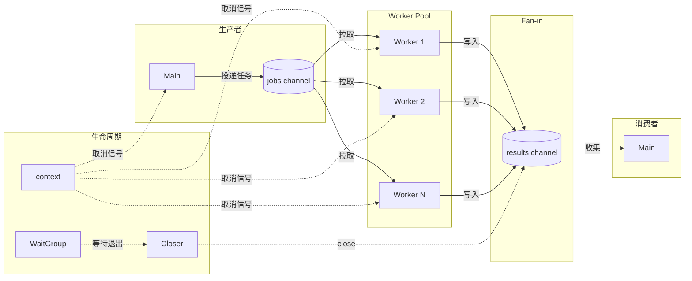

# 写作前的代码理解摘要

## 1. 项目地图

- **main 入口文件**：`series/25/cmd/patterns/main.go`
- **核心业务逻辑文件**：同上（单文件演示项目）
- **关键结构体/接口**：
  - `config` 结构体：配置参数（workers、items、timeout）
  - `job` 结构体：任务定义（id、data）
  - `result` 结构体：结果定义（id、hash、cost、err、worker）
  - `worker` 函数：工作协程的核心逻辑
  - `doHashWork` 函数：模拟 CPU 工作

## 2. 核心三问

**这个项目解决的具体痛点是什么？**
学会了 goroutine、channel、select、context 之后，写业务并发仍然"像拼积木一样乱"：无界并发把系统打爆、goroutine 泄漏越跑越多、取消/超时没传下去导致链路不一致。这个项目把最常用的并发模式做一次"收口总结"：worker pool + fan-out + fan-in + context，形成一套可复用的并发骨架。

**它的核心技术实现逻辑（Trick）是什么？**
项目实现了一个完整的 worker pool 模式：固定数量的 worker goroutine 从 jobs channel 拉取任务，处理后把结果写入 results channel。关键技巧包括：producer 和 worker 都用 select 监听 ctx.Done() 确保可取消、用 WaitGroup 等待所有 worker 退出后再 close results、发送结果时也监听 ctx 避免阻塞泄漏。整个模式形成一个"可控、可取消、可收敛"的并发结构。

**它最适合用在什么业务场景？**
任何需要"批量并发处理"的场景：批量数据处理、并发 API 调用、图片/视频转码、爬虫任务分发。这是 Go 并发编程的"默认模板"，遇到并发需求先套这个模板，再根据业务小步调整。

## 3. Go 语言特性提取

- **Channel（核心）**：jobs channel、results channel、关闭顺序
- **Goroutine**：worker pool、producer、closer
- **sync.WaitGroup**：等待所有 worker 退出
- **context 包**：WithTimeout、Done()、Err()
- **select 语句**：多路等待、可取消的发送/接收
- **闭包**：worker 捕获 workerID
- **crypto/sha1**：模拟 CPU 工作

---

**备选标题**

- 风格 A（痛点型）：《Go 并发代码总是"乱"？这套 worker pool 模板帮你收口》
- 风格 B（干货型）：《Go 并发模式终极指南：worker pool + fan-in/out 一文搞定》
- 风格 C（悬念型）：《为什么大厂的 Go 并发代码都长一个样？因为他们都用这套模板》

---

## 1. 场景复现：那个让我头疼的时刻

我曾经写过一段"看起来很并发"的代码：

```go
func processImages(images []Image) {
    for _, img := range images {
        go func(img Image) {
            result := resize(img)
            save(result)
        }(img)
    }
}
```

1000 张图片，就开 1000 个 goroutine。看起来很"Go"，对吧？

然后线上就炸了：
- 内存飙升（每个 goroutine 占用栈空间）
- 下游服务被打爆（1000 个并发请求）
- 部分任务失败了，但不知道哪些失败了
- 想取消任务？没门，goroutine 已经飞出去了

**问题的本质是：无界并发 + 无法取消 + 无法收敛结果。**

后来我用 worker pool 重构了这段代码：

```go
func processImages(ctx context.Context, images []Image) ([]Result, error) {
    jobs := make(chan Image)
    results := make(chan Result)
    
    // 启动固定数量的 worker
    var wg sync.WaitGroup
    for i := 0; i < 8; i++ {
        wg.Add(1)
        go worker(ctx, &wg, jobs, results)
    }
    
    // 投递任务
    go func() {
        defer close(jobs)
        for _, img := range images {
            select {
            case <-ctx.Done():
                return
            case jobs <- img:
            }
        }
    }()
    
    // 等待 worker 退出后关闭 results
    go func() {
        wg.Wait()
        close(results)
    }()
    
    // 收集结果
    var out []Result
    for r := range results {
        out = append(out, r)
    }
    return out, ctx.Err()
}
```

从此，并发度可控、可取消、结果可收敛。

**这就是 worker pool + fan-out + fan-in 模式的价值。**

## 2. 架构蓝图：上帝视角看设计

这个项目实现了一个完整的并发处理流水线：



**关闭顺序是关键**：

```
1. Producer 投递完成 → close(jobs)
2. Workers 读到 jobs 关闭 → 退出循环
3. WaitGroup 等待所有 Worker 退出
4. Closer 执行 close(results)
5. Consumer 的 range results 结束
```

如果顺序错了，要么 panic（发送到已关闭 channel），要么死锁（永远等不到关闭）。

## 3. 源码拆解：手把手带你读核心

### 3.1 数据结构定义

```go
type job struct {
    id   int
    data string
}

type result struct {
    id     int
    hash   string
    cost   time.Duration
    err    error
    worker int
}
```

**为什么 result 里有 worker 字段？** 方便调试和观测：知道每个任务是哪个 worker 处理的，可以分析负载是否均衡。

### 3.2 主流程：启动 worker pool

```go
func main() {
    cfg := parseFlags()
    
    ctx, cancel := context.WithTimeout(context.Background(), cfg.timeout)
    defer cancel()

    jobs := make(chan job)
    results := make(chan result)

    // 启动 worker pool
    var wg sync.WaitGroup
    wg.Add(cfg.workers)
    for w := 1; w <= cfg.workers; w++ {
        w := w  // 捕获循环变量
        go func() {
            defer wg.Done()
            worker(ctx, w, jobs, results)
        }()
    }
    
    // ... 后续代码
}
```

**知识点贴士：`w := w` 的作用**
在 Go 1.21 及之前，循环变量在所有迭代中共享同一个地址。如果不 `w := w`，所有 goroutine 可能都拿到最后一个值。Go 1.22+ 已修复，但为了兼容性，很多代码保留这个写法。

**为什么用 `wg.Add(cfg.workers)` 而不是在循环里 `wg.Add(1)`？**
两种写法都可以，但一次性 Add 更清晰：明确表示"我要等 N 个 worker"。

### 3.3 生产者：投递任务

```go
go func() {
    defer close(jobs)  // 关键：投递完成后关闭
    for i := 0; i < cfg.items; i++ {
        select {
        case <-ctx.Done():
            return  // 超时/取消时停止投递
        case jobs <- job{id: i, data: fmt.Sprintf("payload-%d", i)}:
        }
    }
}()
```

**为什么投递也要 select ctx.Done()？**

如果不监听 ctx，当 ctx 超时时：
- jobs channel 可能已满（worker 都退出了）
- 生产者卡在 `jobs <- job` 永远发不出去
- goroutine 泄漏

**defer close(jobs) 的位置很重要**：必须在生产者 goroutine 里，确保所有任务投递完成后才关闭。

### 3.4 关闭协调者：等待 worker 退出后关闭 results

```go
go func() {
    wg.Wait()       // 等待所有 worker 退出
    close(results)  // 然后关闭 results
}()
```

**这是整个模式最关键的协调逻辑**：

1. `wg.Wait()` 确保所有 worker 都退出了
2. 此时不会再有人往 results 发送
3. 安全地 close(results)
4. 消费者的 `range results` 自然结束

**如果过早 close(results) 会怎样？** Worker 还在发送，`results <- res` 会 panic。

### 3.5 Worker：核心处理逻辑

```go
func worker(ctx context.Context, workerID int, jobs <-chan job, results chan<- result) {
    for {
        select {
        case <-ctx.Done():
            return  // 取消时退出
        case j, ok := <-jobs:
            if !ok {
                return  // jobs 关闭时退出
            }

            start := time.Now()
            h, err := doHashWork(ctx, j.data)
            res := result{
                id:     j.id,
                hash:   h,
                cost:   time.Since(start),
                err:    err,
                worker: workerID,
            }

            // 发送结果也要监听 ctx
            select {
            case <-ctx.Done():
                return
            case results <- res:
            }
        }
    }
}
```

**Worker 有两个退出条件**：
1. `ctx.Done()`：上游取消/超时
2. `jobs` 关闭：所有任务处理完毕

**为什么发送 results 也要 select ctx.Done()？**

想象这个场景：
- ctx 超时了
- 消费者停止读取 results
- worker 卡在 `results <- res` 发不出去
- goroutine 泄漏

加上 `select { case <-ctx.Done(): return }` 就能避免这个问题。

**知识点贴士：`<-chan` 和 `chan<-`**
- `jobs <-chan job`：只读 channel（只能接收）
- `results chan<- result`：只写 channel（只能发送）

这是 Go 的类型系统帮你防止误用：worker 不应该关闭 jobs，也不应该从 results 读取。

### 3.6 模拟工作：doHashWork

```go
func doHashWork(ctx context.Context, s string) (string, error) {
    // 模拟 CPU 工作 + 取消点
    select {
    case <-ctx.Done():
        return "", ctx.Err()
    case <-time.After(6 * time.Millisecond):
    }

    sum := sha1.Sum([]byte(s))
    return hex.EncodeToString(sum[:]), nil
}
```

**为什么工作函数里也要检查 ctx？**

如果工作本身很耗时（比如网络请求、大文件处理），在工作过程中检查 ctx 可以更快响应取消，避免做无意义的工作。

### 3.7 消费者：收集结果

```go
seen := 0
var total time.Duration
for r := range results {
    seen++
    if r.err != nil {
        fmt.Printf("result id=%d worker=%d err=%v\n", r.id, r.worker, r.err)
        continue
    }
    total += r.cost
    if r.id%20 == 0 {
        fmt.Printf("result id=%d worker=%d hash=%s cost=%s\n", r.id, r.worker, r.hash[:8], r.cost)
    }
}

fmt.Printf("done: results=%d avg_cost=%s ctx_err=%v\n", seen, avg(total, seen), ctx.Err())
```

**`for r := range results` 什么时候结束？** 当 results 被 close 时。这就是为什么关闭顺序很重要。

## 4. 避坑指南 & 深度思考

### 坑 1：无界并发假装是 worker pool

```go
// 错误：每个任务都开 goroutine
for _, task := range tasks {
    go process(task)
}
```

**解决**：任务必须通过 jobs channel 进入固定数量的 worker。

### 坑 2：results 永远不 close

```go
// 错误：忘记关闭 results
// 消费者 range results 永远等不到结束
```

**解决**：用 WaitGroup 等 worker 退出后关闭 results。

### 坑 3：过早 close(results)

```go
// 错误：在 worker 还在发送时就关闭
close(results)  // panic: send on closed channel
```

**解决**：只让一个协调者 close，且在 wg.Wait() 之后。

### 坑 4：取消时仍在阻塞发送

```go
// 错误：发送 results 不监听 ctx
results <- res  // ctx 取消后可能永远卡住
```

**解决**：发送也要 `select { case <-ctx.Done(): return; case results <- res: }`。

### 坑 5：任务队列 buffer 过大

```go
jobs := make(chan job, 10000)  // 错误：把背压藏进队列
```

**解决**：小 buffer + 有界并发 + 限流。监控队列长度。

### 坑 6：错误处理策略混乱

遇到一个错误是取消全局（fail-fast）还是继续处理（best-effort）？

**解决**：明确策略。fail-fast 就在第一个错误时 cancel ctx；best-effort 就收集所有错误最后汇总。

### 生产环境 vs Demo 的差距

1. **重试机制**：失败的任务是否重试？重试几次？
2. **优先级队列**：不同任务是否有优先级？
3. **动态扩缩容**：能否根据队列长度动态调整 worker 数？
4. **指标埋点**：队列长度、处理延迟、错误率、worker 利用率

## 5. 快速上手 & 改造建议

### 运行命令

```bash
# 基本运行
go run ./series/25/cmd/patterns

# 自定义参数
go run ./series/25/cmd/patterns -workers=4 -items=50 -timeout=100ms

# 观察超时行为
go run ./series/25/cmd/patterns -workers=2 -items=100 -timeout=50ms
```

### 工程化改造建议

1. **泛型化 worker pool**：
```go
func WorkerPool[T, R any](
    ctx context.Context,
    workers int,
    jobs <-chan T,
    fn func(context.Context, T) (R, error),
) <-chan R {
    results := make(chan R)
    var wg sync.WaitGroup
    wg.Add(workers)
    for i := 0; i < workers; i++ {
        go func() {
            defer wg.Done()
            for {
                select {
                case <-ctx.Done():
                    return
                case job, ok := <-jobs:
                    if !ok {
                        return
                    }
                    if result, err := fn(ctx, job); err == nil {
                        select {
                        case <-ctx.Done():
                            return
                        case results <- result:
                        }
                    }
                }
            }
        }()
    }
    go func() {
        wg.Wait()
        close(results)
    }()
    return results
}
```

2. **错误阈值取消**：
```go
var errCount int32
if atomic.AddInt32(&errCount, 1) > maxErrors {
    cancel()  // 错误太多，取消全局
}
```

3. **指标埋点**：
```go
prometheus.NewGaugeVec(prometheus.GaugeOpts{
    Name: "worker_pool_queue_length",
}, []string{"pool_name"})
```

## 6. 总结与脑图

- **worker pool 解决并发度可控**：固定 N 个 worker，不会无界并发打爆系统
- **fan-out 解决任务分发**：多个 worker 竞争读取 jobs channel
- **fan-in 解决结果收敛**：多个 worker 写入同一个 results channel
- **context 解决可取消**：上游取消时，整个流水线能收敛退出
- **关闭顺序是关键**：producer close jobs → workers exit → wg.Wait → close results

```
并发模式骨架
├── Worker Pool
│   ├── 固定 N 个 worker
│   ├── 从 jobs channel 拉取任务
│   └── 并发度 = worker 数量
├── Fan-out
│   ├── 任务投递到 jobs channel
│   └── 多 worker 竞争读取
├── Fan-in
│   ├── 多 worker 写入 results channel
│   └── 消费者统一收集
├── Context 集成
│   ├── producer 监听 ctx.Done
│   ├── worker 监听 ctx.Done
│   └── 发送 results 也监听 ctx.Done
└── 关闭顺序
    ├── 1. close(jobs)
    ├── 2. workers 退出
    ├── 3. wg.Wait()
    ├── 4. close(results)
    └── 5. range results 结束
```
