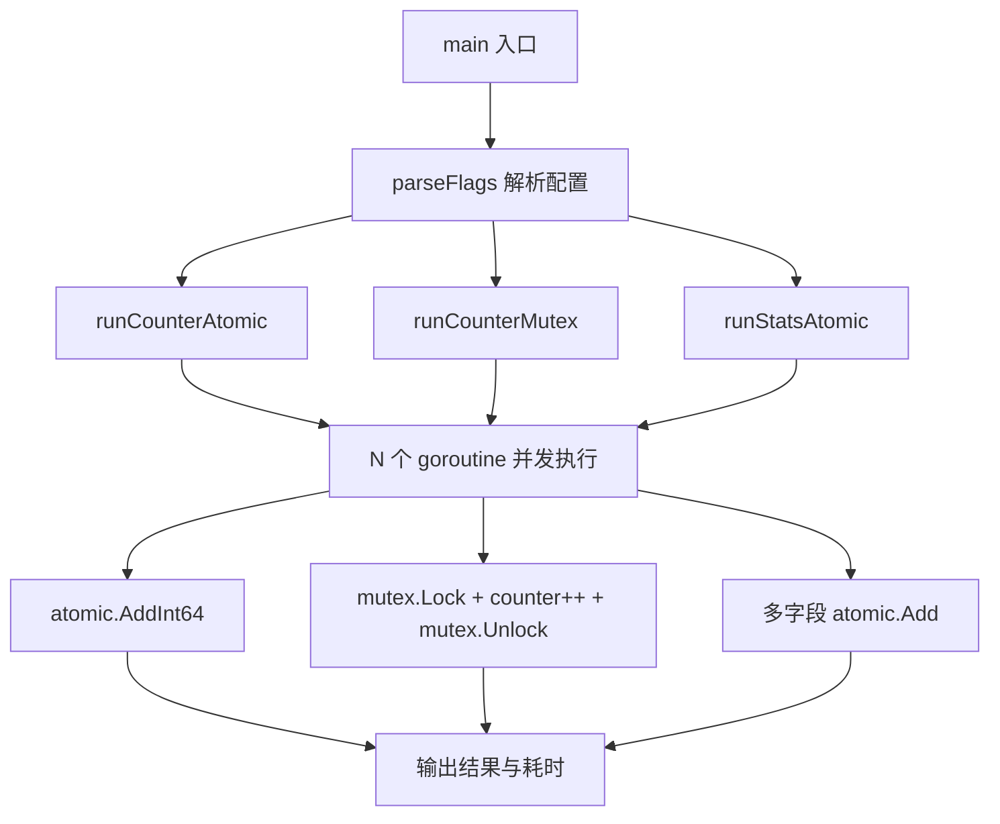

# 写作前的代码理解摘要

## 1. 项目地图

- **main 入口文件**：`series/26/cmd/atomiclab/main.go`
- **核心业务逻辑文件**：同上（单文件项目）
- **关键结构体/接口**：
  - `config` 结构体：存储 workers 和 loops 配置
  - `stats` 结构体：包含 requests、errors、latency 三个 int64 字段，用于演示多字段原子操作的边界问题

## 2. 核心三问

**这个项目解决的具体痛点是什么？**
很多开发者听说"atomic 比锁快"就无脑使用，结果代码难懂、bug 更多。项目通过可运行实验，让开发者直观感受 atomic 和 mutex 的性能差异，更重要的是明确 atomic 的"可用边界"——它只适合单变量原子性，无法保证多字段一致性。

**它的核心技术实现逻辑（Trick）是什么？**
项目设计了三组对比实验：atomic 计数器、mutex 计数器、atomic 多字段统计。通过相同的 workers 和 loops 配置，让读者看到 atomic 在单字段场景下的性能优势，同时暴露多字段场景下"无原子快照"的致命缺陷。

**它最适合用在什么业务场景？**
适合作为团队内部培训材料，帮助开发者理解并发编程中"选 atomic 还是选 mutex"的决策依据。也适合在 Code Review 时作为参考，避免滥用 atomic 导致的隐蔽 bug。

## 3. Go 语言特性提取

- **sync/atomic 包**：原子操作的核心，包括 `atomic.AddInt64`、`atomic.LoadInt64`
- **sync.WaitGroup**：协调多个 goroutine 的完成
- **sync.Mutex**：互斥锁，用于对比实验
- **Goroutine**：并发执行的轻量级线程
- **defer**：确保 `wg.Done()` 被调用
- **闭包**：goroutine 内部捕获外部变量

---

**备选标题**

- 风格 A（痛点型）：《atomic 用错了比不用还危险：一次线上统计指标"半更新"的排查》
- 风格 B（干货型）：《atomic vs mutex：一个实验告诉你边界在哪里》
- 风格 C（悬念型）：《为什么我不建议你把所有计数器都改成 atomic》

---

## 1. 场景复现：那个让我头疼的时刻

上个月，我接手了一个监控服务的优化任务。前任同事为了"极致性能"，把所有统计指标都改成了 `atomic.AddInt64`。代码看起来很"高级"，跑起来也没报错。

直到有一天，运营同学问我："为什么这个小时的请求数是 10 万，但错误数加成功数只有 9 万 8？"

我一开始以为是日志丢了，排查了半天才发现问题出在统计逻辑上。代码大概长这样：

```go
type Stats struct {
    requests int64
    errors   int64
    success  int64
}

// 每个请求结束时
atomic.AddInt64(&s.requests, 1)
if err != nil {
    atomic.AddInt64(&s.errors, 1)
} else {
    atomic.AddInt64(&s.success, 1)
}
```

看起来没毛病对吧？但问题在于：**当你读取这三个字段做汇总时，它们可能来自不同的时刻**。requests 可能已经加了，但 errors 还没来得及加。这就是"原子快照缺失"的典型问题。

我花了一下午重构成 mutex 方案，问题立刻消失了。这件事让我意识到：**atomic 不是银弹，它有非常明确的使用边界**。

今天这个项目，就是我当时写的一个对比实验，帮你直观感受 atomic 和 mutex 的差异。

## 2. 架构蓝图：上帝视角看设计

这个项目的结构非常简单，核心是三组对比实验：



三组实验的设计意图：

1. **atomic 计数器**：展示单字段场景下 atomic 的性能优势
2. **mutex 计数器**：作为对照组，展示锁的开销
3. **atomic 多字段统计**：暴露 atomic 在多字段场景下的局限性

## 3. 源码拆解：手把手带你读核心

### 3.1 配置解析：flag 包的标准用法

```go
type config struct {
    workers int
    loops   int
}

func parseFlags() config {
    var cfg config
    flag.IntVar(&cfg.workers, "workers", 40, "number of goroutines")
    flag.IntVar(&cfg.loops, "loops", 50_000, "increments per goroutine")
    flag.Parse()
    // 防御性编程：确保参数合法
    if cfg.workers < 1 {
        cfg.workers = 1
    }
    if cfg.loops < 0 {
        cfg.loops = 0
    }
    return cfg
}
```

你可以看到这里用了 `flag.IntVar` 而不是 `flag.Int`。区别在于：`IntVar` 把值写入你指定的变量，`Int` 返回一个指针。在结构体场景下，`IntVar` 更直观。

**知识点贴士**：Go 的 `flag` 包是命令行参数解析的标准库。`50_000` 这种写法是 Go 1.13 引入的数字字面量分隔符，让大数字更易读。

### 3.2 atomic 计数器：最简单的正确用法

```go
func runCounterAtomic(cfg config) {
    fmt.Println("\n--- atomic counter ---")
    var counter int64
    start := time.Now()
    var wg sync.WaitGroup
    wg.Add(cfg.workers)
    for i := 0; i < cfg.workers; i++ {
        go func() {
            defer wg.Done()
            for j := 0; j < cfg.loops; j++ {
                atomic.AddInt64(&counter, 1)
            }
        }()
    }
    wg.Wait()
    fmt.Printf("counter=%d expected=%d cost=%s\n", 
        counter, int64(cfg.workers*cfg.loops), time.Since(start))
}
```

这段代码展示了 atomic 的正确使用场景：**单个变量的原子递增**。

几个关键点：

1. **`atomic.AddInt64(&counter, 1)`**：注意第一个参数是指针。atomic 操作必须通过指针访问变量，这样才能保证操作的是同一块内存。

2. **`defer wg.Done()`**：放在 goroutine 开头，确保无论如何都会执行。这是 Go 并发编程的标准模式。

3. **为什么用 `int64` 而不是 `int`**：`atomic` 包对类型有严格要求，`int` 在不同平台上可能是 32 位或 64 位，用 `int64` 更安全。

**知识点贴士**：`sync.WaitGroup` 是 Go 中协调多个 goroutine 完成的标准工具。`Add` 设置计数，`Done` 减一，`Wait` 阻塞直到计数归零。

### 3.3 mutex 计数器：锁的开销有多大

```go
func runCounterMutex(cfg config) {
    fmt.Println("\n--- mutex counter ---")
    var counter int64
    var mu sync.Mutex
    start := time.Now()
    var wg sync.WaitGroup
    wg.Add(cfg.workers)
    for i := 0; i < cfg.workers; i++ {
        go func() {
            defer wg.Done()
            for j := 0; j < cfg.loops; j++ {
                mu.Lock()
                counter++
                mu.Unlock()
            }
        }()
    }
    wg.Wait()
    fmt.Printf("counter=%d expected=%d cost=%s\n", 
        counter, int64(cfg.workers*cfg.loops), time.Since(start))
}
```

对比 atomic 版本，这里多了 `Lock()` 和 `Unlock()` 的调用。锁的开销主要来自两方面：

1. **上下文切换**：当一个 goroutine 拿不到锁时，可能会被挂起
2. **内存屏障**：锁的获取和释放会触发内存同步

在我的机器上，mutex 版本大约比 atomic 慢 2-3 倍。但请注意：**这个差距只在极高频的单字段操作中才明显**。对于大多数业务代码，锁的开销可以忽略不计。

### 3.4 多字段统计：atomic 的边界在哪里

```go
type stats struct {
    requests int64
    errors   int64
    latency  int64
}

func runStatsAtomic(cfg config) {
    fmt.Println("\n--- atomic stats (multi-field boundary) ---")
    var s stats
    start := time.Now()
    var wg sync.WaitGroup
    wg.Add(cfg.workers)
    for i := 0; i < cfg.workers; i++ {
        go func() {
            defer wg.Done()
            for j := 0; j < cfg.loops; j++ {
                atomic.AddInt64(&s.requests, 1)
                if j%10 == 0 {
                    atomic.AddInt64(&s.errors, 1)
                }
                atomic.AddInt64(&s.latency, int64(j%7))
            }
        }()
    }
    wg.Wait()

    req := atomic.LoadInt64(&s.requests)
    errs := atomic.LoadInt64(&s.errors)
    lat := atomic.LoadInt64(&s.latency)
    fmt.Printf("requests=%d errors=%d latency_sum=%d cost=%s\n", 
        req, errs, lat, time.Since(start))
    fmt.Println("注意：多字段统计没有"原子快照"，若需要一致性应使用锁或拷贝策略。")
}
```

这段代码是整个项目的精华。它展示了 atomic 的致命局限：**你可以原子地更新每个字段，但无法原子地读取所有字段的一致快照**。

想象一下：当你调用 `atomic.LoadInt64(&s.requests)` 时，另一个 goroutine 可能正在执行 `atomic.AddInt64(&s.errors, 1)`。你读到的 requests 和 errors 可能来自不同的时刻。

**这就是为什么我开头的监控服务会出现"请求数 ≠ 成功数 + 错误数"的问题。**

如果你需要一致性快照，有两种方案：

1. **用 mutex 保护读写**：简单直接，推荐大多数场景
2. **Copy-on-Write**：写时复制整个结构体，读时直接读旧版本，适合读多写少的场景

## 4. 避坑指南 & 深度思考

### 4.1 atomic 的适用边界

| 场景 | 推荐方案 | 原因 |
|------|----------|------|
| 单字段计数器（QPS、请求数） | atomic | 性能好，语义清晰 |
| 状态位（是否关闭、是否初始化） | atomic | 单值布尔判断 |
| 指针/引用交换 | atomic.Value 或 CAS | 配置热更新等场景 |
| 多字段一致性 | mutex | atomic 无法保证快照一致 |
| 复杂业务不变量 | mutex | 可读性和正确性更重要 |

### 4.2 常见的错误用法

**错误 1：只改写一处，其他地方仍用普通读写**

```go
// 错误示例
atomic.AddInt64(&counter, 1)  // 写用 atomic
fmt.Println(counter)           // 读没用 atomic，data race！
```

正确做法：同一变量的所有读写都要用 atomic。

**错误 2：用 atomic 实现复杂状态机**

```go
// 错误示例：CAS 重试导致代码难读
for {
    old := atomic.LoadInt64(&state)
    new := computeNewState(old)
    if atomic.CompareAndSwapInt64(&state, old, new) {
        break
    }
}
```

这种代码在高争用下会疯狂重试，性能反而不如锁。而且逻辑复杂，容易出错。

**错误 3：误以为 atomic 是零成本**

atomic 虽然比锁快，但在高争用下仍有性能瓶颈。如果你的计数器被几十个 goroutine 同时更新，可以考虑**分片计数**：每个 goroutine 更新自己的局部计数器，最后汇总。

### 4.3 生产环境的差距

这个 Demo 是教学用的，生产环境还需要考虑：

1. **可观测性**：atomic 操作没有日志，出问题很难排查
2. **可测试性**：原子逻辑难以写单测，建议封装成小函数
3. **内存对齐**：在某些平台上，64 位原子操作要求 8 字节对齐

## 5. 快速上手 & 改造建议

### 运行命令

```bash
# 默认参数
go run ./series/26/cmd/atomiclab

# 自定义参数
go run ./series/26/cmd/atomiclab -workers=100 -loops=100000
```

### 工程化改造建议

1. **加入基准测试**：用 `testing.B` 写 benchmark，量化不同方案的性能差异
2. **封装统计器**：把 atomic 操作封装成 `Counter` 类型，提供 `Inc()`、`Get()` 方法，隐藏实现细节
3. **考虑分片计数**：高争用场景下，用 `[N]int64` 数组 + hash 分配，减少竞争

## 6. 总结与脑图

- **atomic 适合单字段、高频、低延迟的场景**，如计数器、状态位
- **mutex 适合多字段一致性、复杂逻辑的场景**，可读性和正确性更重要
- **先确保正确性，再用 profiling 决定是否优化**
- **如果 atomic 让代码难以维护，收益又有限，就不要勉强**
- **lock-free 不等于高性能**，大多数业务代码用锁就够了

```
atomic vs mutex 决策树
├── 单字段操作？
│   ├── 是 → 考虑 atomic
│   └── 否 → 用 mutex
├── 需要一致性快照？
│   ├── 是 → 用 mutex
│   └── 否 → 可以用 atomic
├── 代码复杂度可接受？
│   ├── 是 → 继续用 atomic
│   └── 否 → 换回 mutex
└── profiling 显示锁是瓶颈？
    ├── 是 → 考虑 atomic 或分片
    └── 否 → 保持 mutex
```
