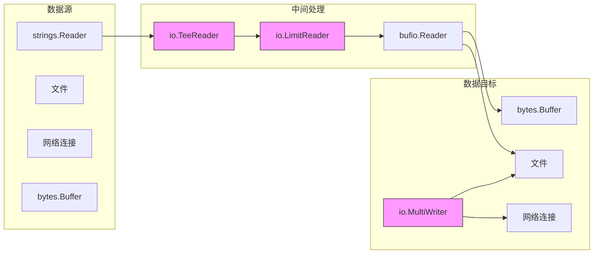

# 写作前的代码理解摘要

## 1. 项目地图

- **main 入口文件**：`series/27/cmd/ioflow/main.go`
- **核心业务逻辑文件**：同上（单文件项目）
- **关键结构体/接口**：
  - `countingWriter` 结构体：自定义 Writer，包装底层 Writer 并统计写入字节数
  - `io.Reader` / `io.Writer` 接口：Go 标准库中最核心的流式接口

## 2. 核心三问

**这个项目解决的具体痛点是什么？**
很多开发者处理 IO 时习惯用 `ReadAll` 一次性读入内存，结果线上大文件场景直接 OOM。项目通过 5 个可运行示例，展示 `io.Reader/Writer` 的流式处理能力，让开发者理解"流式思维"的价值。

**它的核心技术实现逻辑（Trick）是什么？**
项目演示了 Go 标准库中 5 个核心 IO 工具：`io.Copy`（流式复制）、`io.TeeReader`（一边读一边写到另一个 Writer）、`io.LimitReader`（限制读取字节数）、`io.MultiWriter`（一份数据写多个目标）、`io.Pipe`（生产者/消费者解耦）。这些工具可以像积木一样组合，覆盖几乎所有 IO 场景。

**它最适合用在什么业务场景？**
适合需要处理大文件、网络流、日志流的场景。比如：文件上传时边传边计算 hash、日志同时写文件和发送到远程、限制 HTTP 响应体大小防止内存爆炸等。

## 3. Go 语言特性提取

- **接口（Interface）**：`io.Reader` 和 `io.Writer` 是 Go 中最经典的接口设计
- **结构体嵌入**：`countingWriter` 通过组合实现功能扩展
- **Goroutine + Channel**：`io.Pipe` 示例中用于生产者/消费者模式
- **defer**：确保文件关闭、资源释放
- **闭包**：`section` 函数接收闭包作为参数

---

**备选标题**

- 风格 A（痛点型）：《一次 OOM 让我重新认识了 io.Reader：流式处理的正确姿势》
- 风格 B（干货型）：《io.Reader/Writer 全解析：5 个工具让你告别 ReadAll》
- 风格 C（悬念型）：《为什么大厂面试必问 io.Reader？因为 90% 的人都用错了》

---

## 1. 场景复现：那个让我头疼的时刻

去年我负责一个日志分析服务，需要从 S3 下载日志文件并解析。代码很简单：

```go
resp, _ := http.Get(logURL)
data, _ := io.ReadAll(resp.Body)
// 解析 data...
```

本地测试一切正常，上线后第二天凌晨就收到告警：**内存使用率 95%，服务即将被 OOM Kill**。

排查发现，有个客户的日志文件居然有 2GB。`io.ReadAll` 把整个文件读进内存，直接把服务干趴了。

我当时的第一反应是"加内存"，但运维同学白了我一眼："你这代码有问题，加多少内存都不够。"

后来我把代码改成流式处理：

```go
resp, _ := http.Get(logURL)
scanner := bufio.NewScanner(resp.Body)
for scanner.Scan() {
    // 逐行处理
}
```

内存使用率立刻从 95% 降到 5%。

这件事让我意识到：**`io.Reader/Writer` 不只是"读写接口"，它们是 Go 处理数据流的核心抽象**。今天这个项目，就是我整理的 5 个最常用的 IO 工具，帮你建立"流式思维"。

## 2. 架构蓝图：上帝视角看设计

Go 的 IO 设计哲学可以用一句话概括：**数据是流动的，不是静止的**。



项目演示的 5 个工具：

| 工具 | 作用 | 典型场景 |
|------|------|----------|
| `io.Copy` | 流式复制 | 文件复制、网络转发 |
| `io.TeeReader` | 读时旁路写 | 边读边计算 hash |
| `io.LimitReader` | 限制读取量 | 预览、防止大响应 |
| `io.MultiWriter` | 一写多目标 | 同时写文件和日志 |
| `io.Pipe` | 生产者/消费者 | 流式处理解耦 |

## 3. 源码拆解：手把手带你读核心

### 3.1 自定义 Writer：countingWriter

```go
type countingWriter struct {
    W io.Writer
    N int64
}

func (c *countingWriter) Write(p []byte) (int, error) {
    n, err := c.W.Write(p)
    c.N += int64(n)
    return n, err
}
```

这是一个非常经典的"装饰器模式"。`countingWriter` 包装了一个底层 Writer，在写入时顺便统计字节数。

**为什么这么设计？** 因为 `io.Writer` 接口只有一个方法：

```go
type Writer interface {
    Write(p []byte) (n int, err error)
}
```

任何实现了这个方法的类型都是 Writer。这种"最小接口"设计让组合变得极其灵活。

**知识点贴士**：Go 的接口是隐式实现的，不需要显式声明 `implements`。只要你的类型有 `Write` 方法，它就是 `io.Writer`。

### 3.2 io.Copy：最常用的流式复制

```go
func demoCopy() {
    src := strings.NewReader("hello io.Reader and io.Writer\n")
    var buf bytes.Buffer
    n, err := io.Copy(&buf, src)
    fmt.Printf("copied=%d err=%v\n", n, err)
    fmt.Printf("buffer=%q\n", buf.String())
}
```

`io.Copy` 是你应该默认使用的复制方式。它内部会自动分块读写，避免一次性加载整个数据。

**为什么不用 `io.ReadAll`？**

- `ReadAll` 会把所有数据读入内存，大文件会 OOM
- `Copy` 用固定大小的 buffer 分块处理，内存占用恒定

**知识点贴士**：`strings.NewReader` 把字符串包装成 `io.Reader`，`bytes.Buffer` 同时实现了 `io.Reader` 和 `io.Writer`。

### 3.3 io.TeeReader：一边读一边做旁路处理

```go
func demoTee() {
    src := strings.NewReader("log stream for hash\n")
    hasher := sha1.New()
    tee := io.TeeReader(src, hasher)

    var out bytes.Buffer
    _, _ = io.Copy(&out, tee)
    sum := hex.EncodeToString(hasher.Sum(nil))
    fmt.Printf("hash=%s output=%q\n", sum[:8], out.String())
}
```

`TeeReader` 的名字来自 Unix 的 `tee` 命令：数据流过时，同时写到另一个地方。

**典型场景**：文件上传时，边传边计算 MD5/SHA1，不需要读两遍。

```
数据流向：src → TeeReader → out
                    ↓
                  hasher（旁路）
```

**为什么这么设计？** 避免数据复制。如果你先 `ReadAll` 再计算 hash，数据要在内存里存两份。用 `TeeReader`，数据只流过一次。

### 3.4 io.LimitReader：限制读取量

```go
func demoLimit() {
    src := strings.NewReader("this is a long line for preview\n")
    limited := io.LimitReader(src, 10)
    b, _ := io.ReadAll(limited)
    fmt.Printf("preview=%q\n", string(b))
}
```

`LimitReader` 只允许读取前 N 字节，超过就返回 EOF。

**典型场景**：

- 文件预览：只读前 1KB 判断文件类型
- 防止大响应：HTTP 客户端限制响应体大小，避免被恶意服务拖垮

**注意**：`LimitReader` 只限制字节数，不保证 UTF-8 边界。如果你要截断中文，可能会截到半个字符。

### 3.5 io.MultiWriter：一份数据写多个目标

```go
func demoMultiWriter() {
    // ... 创建文件 f 和 buffer buf
    mw := io.MultiWriter(&buf, f)
    cw := &countingWriter{W: mw}

    _, err = io.Copy(cw, strings.NewReader("write to file and buffer\n"))
    fmt.Printf("bytes=%d err=%v file=%s\n", cw.N, err, path)
    fmt.Printf("buffer=%q\n", buf.String())
}
```

`MultiWriter` 把多个 Writer 合并成一个。写入时，数据会同时写到所有目标。

**典型场景**：

- 日志同时写文件和 stdout
- 数据同时写本地和远程备份

**注意**：任何一个 Writer 返回错误，整个写入就会中断。如果你需要"尽力写入"，要自己封装错误处理。

### 3.6 io.Pipe：生产者/消费者解耦

```go
func demoPipe() {
    pr, pw := io.Pipe()
    done := make(chan struct{})

    // 生产者 goroutine
    go func() {
        defer close(done)
        w := bufio.NewWriter(pw)
        for i := 1; i <= 3; i++ {
            _, _ = fmt.Fprintf(w, "line-%d\n", i)
            _ = w.Flush()
            time.Sleep(20 * time.Millisecond)
        }
        _ = pw.Close()  // 关键：必须 Close
    }()

    // 消费者
    reader := bufio.NewReader(pr)
    for {
        line, err := reader.ReadString('\n')
        if err != nil {
            break
        }
        fmt.Printf("recv=%q\n", strings.TrimSpace(line))
    }
    <-done
}
```

`io.Pipe` 创建一对连接的 Reader 和 Writer：写入 Writer 的数据可以从 Reader 读出。

**为什么需要 Pipe？** 它让你可以把"生成数据"和"消费数据"放在不同的 goroutine 里，实现流式处理的解耦。

**关键点**：

1. **必须 Close**：写端不 Close，读端会永远阻塞
2. **同步的**：Pipe 没有内部缓冲，写入会阻塞直到有人读取
3. **配合 bufio**：加一层缓冲可以提高效率

**知识点贴士**：`make(chan struct{})` 创建一个空结构体 channel，常用于信号通知。空结构体不占内存。

## 4. 避坑指南 & 深度思考

### 4.1 常见错误

**错误 1：ReadAll 处理大文件**

```go
// 错误：2GB 文件会吃掉 2GB 内存
data, _ := io.ReadAll(bigFile)
```

正确做法：用 `io.Copy` 或 `bufio.Scanner` 流式处理。

**错误 2：忘记关闭文件**

```go
// 错误：文件句柄泄漏
f, _ := os.Open(path)
// 忘记 f.Close()
```

正确做法：创建后立刻 `defer f.Close()`。

**错误 3：Pipe 写端不 Close**

```go
// 错误：读端永远阻塞
go func() {
    pw.Write(data)
    // 忘记 pw.Close()
}()
```

正确做法：写完必须 `pw.Close()` 或 `pw.CloseWithError(err)`。

**错误 4：TeeReader 想"复读"**

```go
// 错误：数据已经被消费，无法重来
tee := io.TeeReader(src, hasher)
io.Copy(&buf1, tee)
io.Copy(&buf2, tee)  // buf2 是空的！
```

如果需要多次读取，要先缓存到 buffer 或文件。

### 4.2 生产环境注意事项

1. **复用 buffer**：热路径上频繁创建 buffer 会导致 GC 压力，用 `sync.Pool` 复用
2. **错误处理**：`io.Copy` 返回的 `n` 和 `err` 都要检查，`n > 0` 时也可能有 `err`
3. **超时控制**：网络 IO 要配合 `context` 设置超时，避免永久阻塞

## 5. 快速上手 & 改造建议

### 运行命令

```bash
go run ./series/27/cmd/ioflow
```

### 工程化改造建议

1. **加入错误降级**：`MultiWriter` 某个目标失败时，记录日志但不阻断主流程
2. **实现限速 Reader**：每读 N 字节 sleep 一下，用于限速下载/上传
3. **组合链路**：把 `TeeReader` + `LimitReader` + `MultiWriter` 串起来，实现"边读边 hash 边预览边写多目标"

## 6. 总结与脑图

- **`io.Reader/Writer` 是 Go 中最核心的抽象**，几乎所有 IO 操作都基于它们
- **流式处理是默认选择**，`ReadAll` 只用于确定小数据
- **工具可以组合**：Copy/Tee/Multi/Limit/Pipe 像积木一样拼接
- **资源必须释放**：文件要 Close，Pipe 写端要 Close
- **错误要处理**：`n > 0` 时也可能有 `err`

```
io.Reader/Writer 工具箱
├── io.Copy
│   └── 流式复制，默认选择
├── io.TeeReader
│   └── 读时旁路，边读边处理
├── io.LimitReader
│   └── 限制读取量，预览/防护
├── io.MultiWriter
│   └── 一写多目标，日志/备份
├── io.Pipe
│   └── 生产者/消费者解耦
└── bufio.Reader/Writer
    └── 加缓冲，减少系统调用
```
