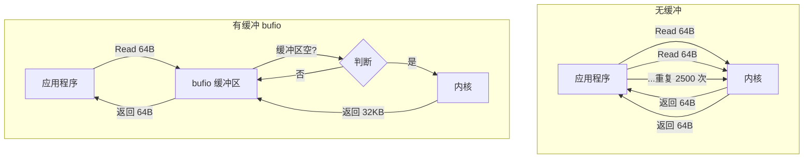

# 写作前的代码理解摘要

## 1. 项目地图

- **main 入口文件**：`series/28/cmd/buflab/main.go`
- **核心业务逻辑文件**：同上（单文件项目）
- **关键结构体/接口**：
  - `config` 结构体：存储 lines 和 size 配置
  - `bufio.Scanner`：按行读取的便捷工具
  - `bufio.Reader/Writer`：带缓冲的读写器

## 2. 核心三问

**这个项目解决的具体痛点是什么？**
同样读取一个文件，有人用 Go 跑得飞快，有人的程序却慢得像蜗牛。差别往往就在于是否使用了 bufio。项目通过 4 组对比实验，让开发者直观感受"加一层 buffer"带来的性能差异，理解系统调用成本。

**它的核心技术实现逻辑（Trick）是什么？**
项目生成一个测试文件，然后用 4 种方式读取：Scanner 按行读、ReadAll 一次性读、小块 Read（无缓冲）、小块 Read + bufio。通过对比耗时，展示 bufio 如何通过减少系统调用次数来提升吞吐。

**它最适合用在什么业务场景？**
适合需要处理大量小块 IO 的场景，如日志解析、配置文件读取、网络数据包处理。也适合作为性能优化的入门教材，帮助开发者建立"系统调用有成本"的意识。

## 3. Go 语言特性提取

- **bufio 包**：`bufio.Scanner`、`bufio.Reader`、`bufio.Writer`、`bufio.NewReaderSize`
- **defer**：确保文件关闭
- **闭包**：`section` 函数接收闭包作为参数
- **多返回值**：函数返回 `(int, time.Duration, error)`
- **bytes 包**：`bytes.Repeat` 生成测试数据

---

**备选标题**

- 风格 A（痛点型）：《同样的代码，为什么他的比我快 10 倍？bufio 的秘密》
- 风格 B（干货型）：《bufio 深度解析：一层 buffer 如何让 IO 性能翻倍》
- 风格 C（悬念型）：《你的 Go 程序慢，可能只是少了这 32KB》

---

## 1. 场景复现：那个让我头疼的时刻

前段时间，我在做一个日志分析工具。需求很简单：读取日志文件，统计每种错误类型的出现次数。

我写了个"朴素版"：

```go
f, _ := os.Open(logPath)
buf := make([]byte, 64)  // 每次读 64 字节
for {
    n, err := f.Read(buf)
    if err == io.EOF {
        break
    }
    // 处理 buf[:n]
}
```

本地测试，160KB 的文件跑了 3 毫秒。我觉得还行，就上线了。

结果同事用同样的逻辑处理同样的文件，只用了 0.08 毫秒。**快了 40 倍**。

我一开始以为是机器差异，后来发现他只是多加了一行：

```go
br := bufio.NewReader(f)
```

就这一行，性能差了一个数量级。

这件事让我意识到：**IO 的瓶颈往往不在"读多少数据"，而在"调用了多少次系统调用"**。每次 `f.Read()` 都会触发一次系统调用，而系统调用是有成本的——上下文切换、内核态/用户态切换、内存拷贝。

bufio 的作用就是：**一次系统调用读入大块数据，后续的小读取直接从用户态内存取**。

今天这个项目，就是我整理的对比实验，帮你直观感受 bufio 的威力。

## 2. 架构蓝图：上帝视角看设计



**关键洞察**：读 160KB 文件，每次读 64 字节：

- 无缓冲：2500 次系统调用
- 有缓冲（32KB）：5 次系统调用

系统调用次数减少 500 倍，性能自然飙升。

## 3. 源码拆解：手把手带你读核心

### 3.1 生成测试文件

```go
func writeFile(path string, lines int, size int) error {
    f, err := os.Create(path)
    if err != nil {
        return err
    }
    defer f.Close()

    w := bufio.NewWriterSize(f, 32*1024)  // 写也用 bufio
    line := bytes.Repeat([]byte("x"), size-1)
    line = append(line, '\n')

    for i := 0; i < lines; i++ {
        if _, err := w.Write(line); err != nil {
            return err
        }
    }
    return w.Flush()  // 关键：必须 Flush
}
```

几个关键点：

1. **写也用 bufio**：`bufio.NewWriterSize` 创建带缓冲的 Writer，减少写入时的系统调用
2. **`bytes.Repeat`**：生成重复字节，用于构造测试数据
3. **必须 Flush**：bufio.Writer 的数据先写到缓冲区，`Flush()` 才会真正写入文件

**知识点贴士**：`defer f.Close()` 放在 `err` 检查之后。如果 `os.Create` 失败，`f` 是 nil，调用 `nil.Close()` 会 panic。

### 3.2 Scanner 按行读取

```go
func readWithScanner(path string) (int, time.Duration, error) {
    f, err := os.Open(path)
    if err != nil {
        return 0, 0, err
    }
    defer f.Close()

    start := time.Now()
    scanner := bufio.NewScanner(f)
    count := 0
    for scanner.Scan() {
        count++
    }
    return count, time.Since(start), scanner.Err()
}
```

`bufio.Scanner` 是按行读取的便捷工具。它内部自带缓冲，所以性能不错。

**注意事项**：

- 默认 token 上限是 64KB，超长行会报错
- 可以用 `scanner.Buffer()` 调整上限
- `scanner.Err()` 要在循环结束后检查

### 3.3 ReadAll 一次性读入

```go
func readAll(path string) (int, time.Duration, error) {
    f, err := os.Open(path)
    if err != nil {
        return 0, 0, err
    }
    defer f.Close()

    start := time.Now()
    b, err := io.ReadAll(f)
    if err != nil {
        return 0, 0, err
    }
    return len(b), time.Since(start), nil
}
```

`io.ReadAll` 把整个文件读入内存。对于小文件，这是最简单的方式。

**什么时候用 ReadAll？**

- 文件确定很小（< 1MB）
- 需要多次随机访问内容
- 简单脚本，不在乎内存

**什么时候不用？**

- 文件可能很大
- 只需要顺序处理一次
- 生产环境的热路径

### 3.4 小块读取（无缓冲）：性能杀手

```go
func readSmallChunks(path string, chunk int) (int, time.Duration, error) {
    f, err := os.Open(path)
    if err != nil {
        return 0, 0, err
    }
    defer f.Close()

    start := time.Now()
    buf := make([]byte, chunk)  // 64 字节的小 buffer
    total := 0
    for {
        n, err := f.Read(buf)
        total += n
        if err != nil {
            if err == io.EOF {
                break
            }
            return total, time.Since(start), err
        }
    }
    return total, time.Since(start), nil
}
```

这就是我最初写的"朴素版"。每次 `f.Read(buf)` 都是一次系统调用。

**为什么慢？**

假设文件 160KB，每次读 64 字节：
- 系统调用次数：160 * 1024 / 64 = 2560 次
- 每次系统调用大约 1-10 微秒
- 总开销：2.5 - 25 毫秒（仅系统调用）

### 3.5 小块读取 + bufio：性能救星

```go
func readBuffered(path string, chunk int, bufSize int) (int, time.Duration, error) {
    f, err := os.Open(path)
    if err != nil {
        return 0, 0, err
    }
    defer f.Close()

    start := time.Now()
    br := bufio.NewReaderSize(f, bufSize)  // 32KB 缓冲
    buf := make([]byte, chunk)  // 仍然每次读 64 字节
    total := 0
    for {
        n, err := br.Read(buf)
        total += n
        if err != nil {
            if err == io.EOF {
                break
            }
            return total, time.Since(start), err
        }
    }
    return total, time.Since(start), nil
}
```

加了一层 `bufio.Reader`，代码几乎没变，但性能天差地别。

**为什么快？**

- bufio 一次从文件读 32KB 到用户态缓冲区
- 后续的 `br.Read(buf)` 直接从缓冲区取，不触发系统调用
- 系统调用次数：160 * 1024 / 32 / 1024 = 5 次

**知识点贴士**：`bufio.NewReaderSize(f, bufSize)` 可以指定缓冲区大小。默认是 4KB，对于文件 IO 通常 32KB 是个不错的起点。

## 4. 避坑指南 & 深度思考

### 4.1 常见错误

**错误 1：Scanner token 超限**

```go
// 错误：超长行会报 bufio.Scanner: token too long
scanner := bufio.NewScanner(f)
for scanner.Scan() {
    // 如果某行超过 64KB，这里会中断
}
```

正确做法：

```go
scanner := bufio.NewScanner(f)
buf := make([]byte, 0, 64*1024)
scanner.Buffer(buf, 1024*1024)  // 最大允许 1MB 的行
```

**错误 2：忘记 Flush**

```go
// 错误：数据可能没写入文件
w := bufio.NewWriter(f)
w.Write(data)
// 忘记 w.Flush()
```

正确做法：写完后 `w.Flush()`，或者用 `defer w.Flush()`。

**错误 3：buffer 太小或太大**

- 太小：系统调用仍然很多，没有效果
- 太大：浪费内存，可能触发更多 GC

经验值：文件 IO 用 32KB，网络 IO 用 4-8KB。

**错误 4：混用 bufio.Reader 和底层文件**

```go
// 错误：数据会错乱
br := bufio.NewReader(f)
br.Read(buf1)
f.Read(buf2)  // 这里读到的不是你想的位置！
```

bufio 会预读数据到缓冲区，直接读底层文件会跳过缓冲区里的数据。

### 4.2 buffer 大小怎么选？

| 场景 | 推荐大小 | 原因 |
|------|----------|------|
| 文件顺序读 | 32KB - 64KB | 匹配文件系统块大小 |
| 网络 IO | 4KB - 8KB | 匹配 TCP 窗口 |
| 日志写入 | 4KB - 16KB | 平衡延迟和吞吐 |
| 内存紧张 | 4KB | 最小有效值 |

**不是越大越好**：

- 更大的 buffer 意味着更多内存
- 如果数据量本身就小，大 buffer 是浪费
- 用基准测试找到"刚好够用"的值

### 4.3 生产环境注意事项

1. **复用 buffer**：热路径上用 `sync.Pool` 复用 buffer，减少分配
2. **监控系统调用**：用 `strace` 或 `perf` 观察系统调用次数
3. **考虑 mmap**：超大文件可以考虑内存映射，避免拷贝

## 5. 快速上手 & 改造建议

### 运行命令

```bash
# 默认参数：2000 行，每行 80 字节
go run ./series/28/cmd/buflab

# 自定义参数
go run ./series/28/cmd/buflab -lines=10000 -size=200
```

### 工程化改造建议

1. **加入 benchmark**：用 `testing.B` 写基准测试，量化不同 buffer 大小的影响
2. **对比写入性能**：把读取逻辑改成写入，观察 bufio.Writer 的效果
3. **实现自适应 buffer**：根据文件大小动态调整 buffer 大小

## 6. 总结与脑图

- **bufio 的核心价值**：用更大的用户态缓冲换更少的系统调用
- **系统调用是有成本的**：上下文切换、内核态/用户态切换
- **Scanner 适合按行读**：但要注意 token 上限
- **Writer 必须 Flush**：否则数据可能丢失
- **buffer 大小要适中**：32KB 是文件 IO 的好起点

```
bufio 使用决策树
├── 需要按行读取？
│   ├── 是 → bufio.Scanner
│   │   └── 行可能超长？→ 调整 Buffer()
│   └── 否 → bufio.Reader
├── 需要写入？
│   └── bufio.Writer
│       └── 记得 Flush()
├── buffer 大小？
│   ├── 文件 IO → 32KB
│   ├── 网络 IO → 4-8KB
│   └── 不确定 → 基准测试
└── 性能仍不够？
    ├── sync.Pool 复用 buffer
    ├── 考虑 mmap
    └── 检查是否有其他瓶颈
```
