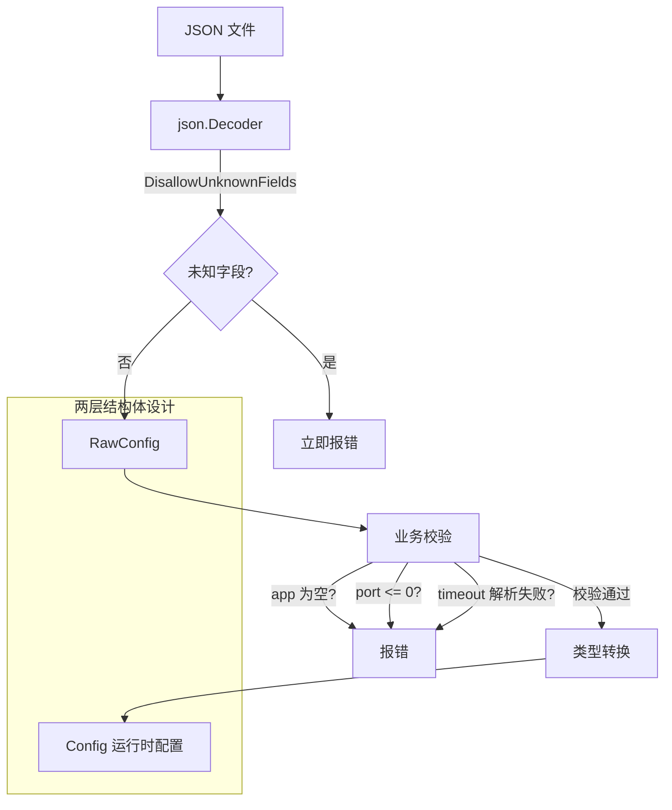

# 写作前的代码理解摘要

## 1. 项目地图

- **main 入口文件**：`series/29/cmd/jsonlab/main.go`
- **核心业务逻辑文件**：同上（单文件项目）
- **关键结构体/接口**：
  - `RawConfig`：原始配置结构体，字段类型与 JSON 对应（如 `json.Number`）
  - `Config`：运行时配置结构体，字段类型是业务需要的（如 `time.Duration`）
  - `OutputConfig`：输出用结构体，用于序列化展示
  - `Limits`：嵌套结构体，包含 `max_conn` 和 `burst`

## 2. 核心三问

**这个项目解决的具体痛点是什么？**
很多人用 JSON 配置做项目启动，结果上线后才发现：字段拼错了没人报错、大整数精度丢失、零值覆盖了默认值。项目通过一个完整的配置加载器示例，展示 `encoding/json` 的正确用法和常见陷阱。

**它的核心技术实现逻辑（Trick）是什么？**
项目采用"两层结构体"设计：`RawConfig` 负责 JSON 解码，字段类型与 JSON 兼容；`Config` 是运行时配置，字段类型是业务需要的。中间通过校验和转换逻辑连接。同时使用 `DisallowUnknownFields` 和 `UseNumber` 实现严格解码。

**它最适合用在什么业务场景？**
适合任何需要从 JSON 加载配置的场景，如微服务配置、CLI 工具配置、API 请求解析。也适合作为团队 JSON 处理规范的参考实现。

## 3. Go 语言特性提取

- **结构体 tag**：`json:"port"` 指定 JSON 字段名，`omitempty` 控制序列化行为
- **json.Decoder**：流式解码，支持 `DisallowUnknownFields` 和 `UseNumber`
- **json.Number**：保留数字原始字符串，避免精度丢失
- **错误包装**：`fmt.Errorf("invalid timeout: %w", err)` 使用 `%w` 包装错误
- **多返回值**：函数返回 `(Config, error)`

---

**备选标题**

- 风格 A（痛点型）：《一个拼写错误让我排查了三小时：JSON 配置的正确打开方式》
- 风格 B（干货型）：《encoding/json 避坑指南：从默认值到大整数精度》
- 风格 C（悬念型）：《为什么你的 JSON 配置总是"静默失败"？》

---

## 1. 场景复现：那个让我头疼的时刻

上个季度，我们上线了一个新服务。配置文件长这样：

```json
{
  "app": "order-api",
  "port": 9090,
  "timeot": "500ms",
  "retries": 5
}
```

你发现问题了吗？`timeout` 拼成了 `timeot`。

但 Go 的 `json.Unmarshal` 默认不会报错。它只是静默忽略了这个未知字段，然后用默认值 `0` 填充 `Timeout`。

服务上线后，所有请求都在 0 秒超时，疯狂报错。我们排查了三个小时，才发现是配置文件拼写错误。

这件事让我意识到：**`encoding/json` 的默认行为对配置场景是危险的**。它太"宽容"了，宽容到会把你的错误藏起来。

后来我重构了配置加载逻辑，加入了严格模式和校验层。今天这个项目，就是那次重构的精华版。

## 2. 架构蓝图：上帝视角看设计



**核心设计思想**：

1. **RawConfig**：字段类型与 JSON 兼容，负责"接住"JSON 数据
2. **Config**：字段类型是业务需要的，如 `time.Duration`、`int64`
3. **中间层**：校验 + 转换，把"松散的 JSON"变成"严格的领域模型"

## 3. 源码拆解：手把手带你读核心

### 3.1 两层结构体设计

```go
// RawConfig：与 JSON 结构对应
type RawConfig struct {
    App      string            `json:"app"`
    Port     int               `json:"port"`
    Timeout  string            `json:"timeout"`    // JSON 里是字符串
    Retries  int               `json:"retries"`
    ID       json.Number       `json:"id"`         // 保留原始数字
    Features []string          `json:"features"`
    Limits   Limits            `json:"limits"`
    Metadata map[string]string `json:"metadata"`
    Note     string            `json:"note,omitempty"`
}

// Config：运行时使用
type Config struct {
    App      string
    Addr     string            // 从 Port 转换而来
    Timeout  time.Duration     // 从字符串解析而来
    Retries  int
    ID       int64             // 从 json.Number 转换而来
    Features []string
    Limits   Limits
    Metadata map[string]string
}
```

**为什么要两层？**

1. **类型安全**：`time.Duration` 不能直接从 JSON 解码，需要先解码成字符串再解析
2. **校验分离**：解码只管"JSON 语法正确"，校验管"业务规则正确"
3. **默认值处理**：可以在 `RawConfig` 初始化时设置默认值

**知识点贴士**：`json:"note,omitempty"` 中的 `omitempty` 只影响编码（Marshal），不影响解码。很多人误以为它会影响解码时的默认值处理。

### 3.2 严格解码：拒绝未知字段

```go
func decodeStrict(r io.Reader, v any) error {
    dec := json.NewDecoder(r)
    dec.DisallowUnknownFields()  // 关键：拒绝未知字段
    dec.UseNumber()               // 关键：保留数字精度
    
    if err := dec.Decode(v); err != nil {
        return err
    }
    
    // 检查是否有多余的 JSON 数据
    if err := dec.Decode(&struct{}{}); err != io.EOF {
        if err == nil {
            return errors.New("unexpected extra JSON data")
        }
        return err
    }
    return nil
}
```

这个函数是整个项目的核心。三个关键点：

**1. `DisallowUnknownFields()`**

默认情况下，JSON 里的未知字段会被静默忽略。开启这个选项后，`{"timeot": "500ms"}` 会直接报错：

```
json: unknown field "timeot"
```

**2. `UseNumber()`**

默认情况下，JSON 数字会被解码成 `float64`。问题是 `float64` 只能精确表示 2^53 以内的整数。

```go
// 9007199254740993 用 float64 会变成 9007199254740992
var data map[string]interface{}
json.Unmarshal([]byte(`{"id": 9007199254740993}`), &data)
fmt.Println(data["id"])  // 输出 9.007199254740992e+15
```

`UseNumber()` 会把数字保留为 `json.Number` 类型（本质是字符串），你可以用 `.Int64()` 或 `.Float64()` 手动转换。

**3. 检查多余数据**

如果 JSON 文件末尾有多余内容（比如不小心粘贴了两份配置），默认不会报错。第二次 `Decode` 检查是否遇到 `io.EOF`，确保文件只有一个 JSON 对象。

### 3.3 默认值与合并

```go
func loadConfig(path string) (Config, error) {
    // 先设置默认值
    raw := RawConfig{
        Port:    8080,
        Timeout: "2s",
        Retries: 3,
        Features: []string{"search", "stats"},
        Limits: Limits{
            MaxConn: 100,
            Burst:   20,
        },
        Metadata: map[string]string{"env": "dev"},
    }

    file, err := os.Open(path)
    if err != nil {
        return Config{}, err
    }
    defer file.Close()

    // 解码会覆盖 JSON 中存在的字段
    if err := decodeStrict(file, &raw); err != nil {
        return Config{}, err
    }
    
    // ... 校验和转换
}
```

**默认值的工作原理**：

1. 先用默认值初始化 `RawConfig`
2. `json.Decode` 只会覆盖 JSON 中存在的字段
3. JSON 中不存在的字段保持默认值

**注意**：如果 JSON 显式写了 `"retries": 0`，会覆盖默认值 3。这是"缺失"和"显式给零值"的区别。

### 3.4 校验层：业务规则检查

```go
if raw.App == "" {
    return Config{}, errors.New("app is required")
}
if raw.Port <= 0 {
    return Config{}, errors.New("port must be positive")
}

timeout, err := time.ParseDuration(raw.Timeout)
if err != nil {
    return Config{}, fmt.Errorf("invalid timeout: %w", err)
}

id, err := raw.ID.Int64()
if err != nil {
    return Config{}, fmt.Errorf("invalid id: %w", err)
}
```

校验层做三件事：

1. **必填检查**：`app` 不能为空
2. **范围检查**：`port` 必须为正数
3. **格式转换**：`timeout` 从字符串解析为 `time.Duration`

**知识点贴士**：`fmt.Errorf("invalid timeout: %w", err)` 使用 `%w` 包装错误。这样调用方可以用 `errors.Is()` 或 `errors.As()` 检查原始错误类型。

### 3.5 类型转换：从 Raw 到 Config

```go
cfg := Config{
    App:      raw.App,
    Addr:     fmt.Sprintf(":%d", raw.Port),  // 转换为地址格式
    Timeout:  timeout,                        // 已解析的 Duration
    Retries:  raw.Retries,
    ID:       id,                             // 已转换的 int64
    Features: raw.Features,
    Limits:   raw.Limits,
    Metadata: raw.Metadata,
}
```

最后一步是类型转换。注意 `Addr` 字段：JSON 里是 `port: 9090`，运行时需要的是 `:9090` 格式。这种"表示层"和"业务层"的差异，正是两层结构体设计要解决的问题。

## 4. 避坑指南 & 深度思考

### 4.1 常见错误

**错误 1：不开启 DisallowUnknownFields**

```go
// 危险：拼写错误不会报错
json.Unmarshal(data, &config)
```

正确做法：用 `Decoder` + `DisallowUnknownFields()`。

**错误 2：大整数用 float64**

```go
// 危险：超过 2^53 的整数会丢精度
var data map[string]interface{}
json.Unmarshal(jsonData, &data)
id := data["id"].(float64)  // 精度已丢失
```

正确做法：用 `UseNumber()` + `json.Number.Int64()`。

**错误 3：误解 omitempty**

```go
type Config struct {
    Retries int `json:"retries,omitempty"`
}
// 误以为 JSON 没有 retries 时会用某个默认值
// 实际上 omitempty 只影响编码，不影响解码
```

正确做法：解码前手动设置默认值。

**错误 4：time.Duration 直接解码**

```go
type Config struct {
    Timeout time.Duration `json:"timeout"`
}
// JSON: {"timeout": "500ms"}
// 错误：会解码失败，因为 Duration 期望的是纳秒数
```

正确做法：用字符串接收，再 `time.ParseDuration()`。

### 4.2 零值 vs 缺失

这是 JSON 处理中最微妙的问题：

| JSON 内容 | 解码后的值 | 语义 |
|-----------|------------|------|
| 字段不存在 | 保持原值（默认值） | "我没说" |
| `"retries": 0` | 0 | "我明确说是 0" |
| `"retries": null` | 0（零值） | "我明确说是空" |

如果你需要区分"缺失"和"显式给零值"，可以用指针：

```go
type Config struct {
    Retries *int `json:"retries"`
}
// 缺失时 Retries 是 nil
// 显式给 0 时 Retries 是 &0
```

### 4.3 生产环境建议

1. **配置校验要全面**：不只是类型正确，还要检查范围、格式、依赖关系
2. **错误信息要友好**：告诉用户哪个字段有问题，期望什么格式
3. **考虑热更新**：配置变更时如何保证线程安全？参考 `atomic.Value`

## 5. 快速上手 & 改造建议

### 运行命令

```bash
go run ./series/29/cmd/jsonlab
```

### 工程化改造建议

1. **加入环境变量覆盖**：`PORT` 环境变量优先级高于配置文件
2. **实现配置热更新**：用 `fsnotify` 监听文件变化，`atomic.Value` 存储配置
3. **为 Duration 写自定义类型**：实现 `UnmarshalJSON`，避免每次手动解析

## 6. 总结与脑图

- **默认行为对配置是危险的**：未知字段被忽略、大整数丢精度
- **用 Decoder + DisallowUnknownFields + UseNumber** 实现严格解码
- **两层结构体设计**：RawConfig 接 JSON，Config 给业务用
- **解码和校验分离**：解码管语法，校验管业务规则
- **零值和缺失是不同的**：需要区分时用指针

```
JSON 配置加载最佳实践
├── 解码层
│   ├── json.Decoder（不是 Unmarshal）
│   ├── DisallowUnknownFields()
│   ├── UseNumber()
│   └── 检查多余数据
├── 结构体设计
│   ├── RawConfig：与 JSON 对应
│   ├── Config：业务使用
│   └── 默认值在 RawConfig 初始化时设置
├── 校验层
│   ├── 必填检查
│   ├── 范围检查
│   └── 格式转换
└── 常见陷阱
    ├── omitempty 只影响编码
    ├── float64 大整数丢精度
    ├── Duration 不能直接解码
    └── 零值 vs 缺失
```
