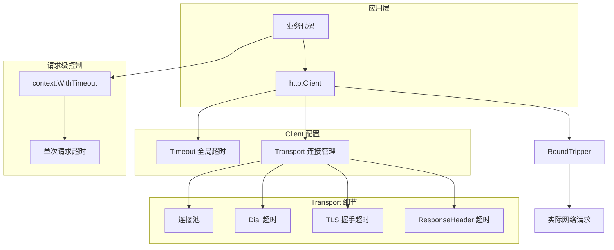

# 写作前的代码理解摘要

## 1. 项目地图

- **main 入口文件**：`series/30/cmd/httpclient/main.go`
- **核心业务逻辑文件**：同上（单文件项目）
- **关键结构体/接口**：
  - `mockTransport`：自定义 `http.RoundTripper`，模拟快/慢响应
  - `http.Client`：HTTP 客户端，包含超时配置和 Transport
  - `context.Context`：用于请求级超时控制

## 2. 核心三问

**这个项目解决的具体痛点是什么？**
很多人写 HTTP 客户端只会 `http.Get`，线上却经常遇到"请求卡死、超时不可控、连接数飙升"的问题。项目通过模拟快/慢响应，展示全局超时和请求级超时的差异，帮助开发者理解 HTTP 客户端的正确用法。

**它的核心技术实现逻辑（Trick）是什么？**
项目用自定义 `RoundTripper` 模拟网络延迟，避免依赖真实服务器。通过构建两个不同超时配置的 Client，演示：快接口正常返回、慢接口触发全局超时、慢接口配合请求级 context 超时。让读者直观看到超时机制的工作方式。

**它最适合用在什么业务场景？**
适合任何需要调用外部 HTTP 服务的场景，如微服务间调用、第三方 API 集成、爬虫开发。也适合作为团队 HTTP 客户端规范的参考实现。

## 3. Go 语言特性提取

- **接口（Interface）**：`http.RoundTripper` 接口，自定义请求处理逻辑
- **context 包**：`context.WithTimeout` 实现请求级超时
- **defer**：确保 `resp.Body.Close()` 和 `cancel()` 被调用
- **select 语句**：在 `mockTransport` 中实现超时感知
- **time 包**：`time.After`、`time.Since` 用于延迟和计时

---

**备选标题**

- 风格 A（痛点型）：《一次请求卡死让我重写了所有 HTTP 调用：超时配置的正确姿势》
- 风格 B（干货型）：《net/http 客户端最佳实践：从超时到连接池》
- 风格 C（悬念型）：《为什么你的 HTTP 请求总是"偶发卡死"？》

---

## 1. 场景复现：那个让我头疼的时刻

去年双十一前夕，我们的订单服务突然开始报警：**goroutine 数量从几百飙升到几万，内存持续增长，最后 OOM 重启**。

排查发现，问题出在调用支付网关的代码：

```go
resp, err := http.Get(paymentURL)
if err != nil {
    return err
}
defer resp.Body.Close()
// ...
```

看起来没毛病对吧？但问题在于：**`http.DefaultClient` 没有设置超时**。

当支付网关因为流量过大响应变慢时，我们的请求就一直挂着。每个挂起的请求都占用一个 goroutine，goroutine 越积越多，最后把服务拖垮了。

更坑的是，这个问题平时根本测不出来——只有在对方服务变慢时才会暴露。

后来我把代码改成：

```go
client := &http.Client{
    Timeout: 3 * time.Second,
}
resp, err := client.Get(paymentURL)
```

问题立刻解决。但这只是开始，后来我发现 HTTP 客户端还有很多坑：连接池配置、请求级超时、Body 必须关闭……

今天这个项目，就是我整理的 HTTP 客户端最佳实践，帮你避开这些坑。

## 2. 架构蓝图：上帝视角看设计



**关键概念**：

| 层级 | 配置项 | 作用 |
|------|--------|------|
| Client | `Timeout` | 整个请求的总超时（包括连接、发送、等待、读取） |
| Transport | `DialTimeout` | TCP 连接建立超时 |
| Transport | `TLSHandshakeTimeout` | TLS 握手超时 |
| Transport | `ResponseHeaderTimeout` | 等待响应头超时 |
| 请求级 | `context.WithTimeout` | 单次请求的独立超时 |

## 3. 源码拆解：手把手带你读核心

### 3.1 自定义 RoundTripper：模拟网络延迟

```go
type mockTransport struct{}

func (mockTransport) RoundTrip(req *http.Request) (*http.Response, error) {
    delay := 80 * time.Millisecond
    body := `{"ok":true,"path":"fast"}`
    if strings.Contains(req.URL.Path, "/slow") {
        delay = 1200 * time.Millisecond
        body = `{"ok":true,"path":"slow"}`
    }

    // 关键：响应 context 取消
    select {
    case <-time.After(delay):
    case <-req.Context().Done():
        return nil, req.Context().Err()
    }

    resp := &http.Response{
        StatusCode: http.StatusOK,
        Header:     make(http.Header),
        Body:       io.NopCloser(strings.NewReader(body)),
        Request:    req,
    }
    resp.Header.Set("Content-Type", "application/json")
    return resp, nil
}
```

这段代码是整个项目的核心。它实现了 `http.RoundTripper` 接口，模拟网络请求的延迟。

**几个关键点**：

1. **`RoundTripper` 接口**：只有一个方法 `RoundTrip(*Request) (*Response, error)`。`http.Client` 的所有请求最终都会调用这个方法。

2. **`select` 语句**：同时监听两个 channel——`time.After(delay)` 和 `req.Context().Done()`。谁先触发就走谁的分支。

3. **响应 context 取消**：当请求被取消（超时或主动取消）时，`req.Context().Done()` 会收到信号，我们返回 `context.Err()`。

**知识点贴士**：`io.NopCloser` 把一个 `io.Reader` 包装成 `io.ReadCloser`，`Close()` 方法什么都不做。用于构造测试用的 Response Body。

### 3.2 创建带超时的 Client

```go
func newClient(timeout time.Duration) *http.Client {
    return &http.Client{
        Timeout:   timeout,
        Transport: mockTransport{},
    }
}
```

**`Client.Timeout` 的含义**：从请求开始到响应体读取完成的总时间。包括：

- DNS 解析
- TCP 连接建立
- TLS 握手
- 发送请求
- 等待响应头
- 读取响应体

**注意**：如果你只设置了 `Timeout`，但响应体很大、读取很慢，也会触发超时。

### 3.3 请求级超时：context 的威力

```go
func doGet(label string, client *http.Client, url string, ctxTimeout time.Duration) {
    start := time.Now()

    ctx := context.Background()
    if ctxTimeout > 0 {
        var cancel context.CancelFunc
        ctx, cancel = context.WithTimeout(ctx, ctxTimeout)
        defer cancel()  // 关键：必须调用 cancel
    }

    req, err := http.NewRequestWithContext(ctx, http.MethodGet, url, nil)
    if err != nil {
        fmt.Printf("%s: build request error=%v\n", label, err)
        return
    }

    resp, err := client.Do(req)
    // ...
}
```

**为什么需要请求级超时？**

假设你的 Client 全局超时是 3 秒，但某个接口的 SLA 是 500ms。你不想因为这个接口慢而等 3 秒，这时就需要请求级超时。

**`context.WithTimeout` vs `Client.Timeout`**：

- `Client.Timeout`：所有请求共享，是"兜底"超时
- `context.WithTimeout`：单次请求独立，可以更短

**关键**：`defer cancel()` 必须调用！否则会导致 goroutine 泄漏。即使请求正常完成，也要调用 `cancel()` 释放资源。

### 3.4 正确处理响应

```go
resp, err := client.Do(req)
if err != nil {
    fmt.Printf("%s: error=%v cost=%s\n", label, err, time.Since(start))
    return
}
defer resp.Body.Close()  // 关键：必须关闭

body, err := io.ReadAll(io.LimitReader(resp.Body, 256))
if err != nil {
    fmt.Printf("%s: read error=%v cost=%s\n", label, err, time.Since(start))
    return
}
```

**三个关键点**：

1. **`defer resp.Body.Close()`**：必须关闭！否则连接无法回收，最终耗尽连接池。

2. **`io.LimitReader`**：限制读取大小。如果对方返回一个 1GB 的响应，你不想把内存撑爆。

3. **检查 StatusCode**：`err == nil` 只表示"请求成功发出并收到响应"，不表示"业务成功"。4xx/5xx 也是 `err == nil`。

### 3.5 main 函数：对比实验

```go
func main() {
    base := "http://mock.local"

    fastClient := newClient(800 * time.Millisecond)
    slowClient := newClient(2 * time.Second)

    doGet("fast /fast", fastClient, base+"/fast", 0)
    doGet("fast /slow", fastClient, base+"/slow", 0)
    doGet("slow /slow", slowClient, base+"/slow", 0)
    doGet("slow /slow (ctx 500ms)", slowClient, base+"/slow", 500*time.Millisecond)

    fastClient.CloseIdleConnections()
    slowClient.CloseIdleConnections()
}
```

四组实验：

| 实验 | Client 超时 | 接口延迟 | context 超时 | 结果 |
|------|-------------|----------|--------------|------|
| fast /fast | 800ms | 80ms | 无 | 成功 |
| fast /slow | 800ms | 1200ms | 无 | 超时（Client.Timeout） |
| slow /slow | 2s | 1200ms | 无 | 成功 |
| slow /slow (ctx) | 2s | 1200ms | 500ms | 超时（context） |

**`CloseIdleConnections()`**：关闭空闲连接。在程序退出前调用，确保资源释放。

## 4. 避坑指南 & 深度思考

### 4.1 常见错误

**错误 1：使用 `http.DefaultClient`**

```go
// 危险：没有超时，可能永久阻塞
resp, err := http.Get(url)
```

正确做法：创建自己的 Client，设置 Timeout。

**错误 2：每次请求创建新 Client**

```go
// 错误：连接无法复用，性能差
func callAPI() {
    client := &http.Client{Timeout: 3 * time.Second}
    client.Get(url)
}
```

正确做法：全局复用 Client（或按业务域复用）。

**错误 3：忘记关闭 Body**

```go
// 错误：连接泄漏
resp, _ := client.Get(url)
// 忘记 resp.Body.Close()
```

正确做法：`defer resp.Body.Close()`，即使你不需要读取 Body。

**错误 4：不限制响应大小**

```go
// 危险：恶意服务可以返回超大响应
body, _ := io.ReadAll(resp.Body)
```

正确做法：`io.LimitReader(resp.Body, maxSize)` 或 `http.MaxBytesReader`。

**错误 5：只检查 err，不检查 StatusCode**

```go
// 错误：4xx/5xx 也是 err == nil
resp, err := client.Get(url)
if err != nil {
    return err
}
// 没检查 resp.StatusCode
```

正确做法：统一封装响应检查逻辑。

### 4.2 超时配置建议

| 场景 | Client.Timeout | 请求级 context |
|------|----------------|----------------|
| 内部微服务 | 3-5s | 按 SLA 设置 |
| 第三方 API | 10-30s | 按接口设置 |
| 文件下载 | 较长或不设置 | 用 context 控制 |

**经验法则**：

- `Client.Timeout` 是兜底，设置一个"绝对不能超过"的值
- 请求级 context 是精细控制，按业务需求设置
- 两者取较小值生效

### 4.3 生产环境建议

1. **统一封装**：不要让业务代码直接用 `http.Client`，封装一层加入日志、指标、重试
2. **连接池监控**：监控 `Transport` 的连接数，避免耗尽
3. **重试要谨慎**：只对幂等请求重试，加退避策略，避免雪崩

## 5. 快速上手 & 改造建议

### 运行命令

```bash
go run ./series/30/cmd/httpclient
```

### 工程化改造建议

1. **加入重试逻辑**：指数退避 + 最大重试次数 + 只重试幂等请求
2. **加入 httptrace**：输出 DNS、连接、TLS 各阶段耗时
3. **封装统一 Client**：加入日志、指标、错误分类

## 6. 总结与脑图

- **永远不要用 `http.DefaultClient`**：它没有超时
- **Client 要复用**：连接池是性能关键
- **Body 必须关闭**：否则连接泄漏
- **响应大小要限制**：防止被恶意服务拖垮
- **超时分两层**：Client.Timeout 兜底，context 精细控制

```
HTTP 客户端最佳实践
├── Client 配置
│   ├── 设置 Timeout（必须）
│   ├── 全局复用（不要每次创建）
│   └── 程序退出时 CloseIdleConnections
├── 请求级控制
│   ├── context.WithTimeout
│   ├── defer cancel()（必须）
│   └── http.NewRequestWithContext
├── 响应处理
│   ├── defer resp.Body.Close()（必须）
│   ├── io.LimitReader 限制大小
│   └── 检查 StatusCode
├── Transport 调优（进阶）
│   ├── MaxIdleConnsPerHost
│   ├── IdleConnTimeout
│   └── 各阶段超时
└── 生产环境
    ├── 统一封装
    ├── 日志 + 指标
    └── 重试 + 退避
```
