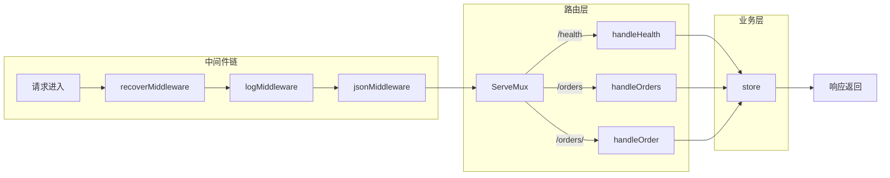

# 写作前的代码理解摘要

## 1. 项目地图

- **main 入口文件**：`series/31/cmd/httpapi/main.go`
- **核心业务逻辑文件**：同上（单文件项目）
- **关键结构体/接口**：
  - `order`：订单数据结构
  - `createOrderRequest`：创建订单请求体
  - `store`：内存存储，带读写锁
  - `api`：HTTP 处理器集合
  - `http.Handler`：标准库核心接口

## 2. 核心三问

**痛点**：很多人写 Go HTTP 服务要么只会 `http.HandleFunc` 草草上阵，路由混乱、状态码随缘、错误无法统一；要么一上来就引框架，业务一变就被框架绑住。其实标准库 `net/http` 已经足够写出清晰可维护的 API。

**核心 Trick**：通过中间件链（`chain` 函数）实现横切关注点的复用，用 `ServeMux` 做最小路由，用 `httptest` 做无端口演示。JSON 解码时启用 `DisallowUnknownFields` + `io.LimitReader` 做严格校验。

**适用场景**：中小型 API 服务、微服务内部接口、需要快速验证的原型项目，以及任何想摆脱框架依赖、追求代码可控性的场景。

## 3. Go 语言特性提取

- **sync.RWMutex**：读写锁保护并发访问
- **defer**：确保锁释放和资源清理
- **Interface（http.Handler）**：标准库的核心抽象
- **闭包**：中间件函数返回 `http.HandlerFunc`
- **结构体方法**：`(s *store)` 和 `(a *api)` 的方法绑定
- **泛型 any**：`writeJSON` 接受任意类型

---

**标题备选**

- A（痛点型）：用标准库写 HTTP API，我再也不想依赖框架了
- B（干货型）：net/http 实战：中间件链 + 严格 JSON + httptest 一次讲透
- C（悬念型）：为什么我建议你先别用 Gin？聊聊 net/http 的正确打开方式

## 1. 场景复现：那个让我头疼的时刻

上个月我接手了一个"简单"的内部 API 项目。前任同事用某框架写的，代码量不大，但改起来让我头疼：路由定义散落在三个文件里，中间件和业务逻辑混在一起，错误返回有的是 JSON 有的是纯文本，状态码更是随缘——404 和 400 混着用。

我花了两天时间理清逻辑，最后决定用标准库 `net/http` 重写。不是因为框架不好，而是这个项目太小，框架的"便利"反而成了负担。重写后代码量少了三分之一，结构清晰到一眼能看懂。

这让我意识到：**很多人不是不会用标准库，而是没把它的"核心模式"用起来**。今天我就带你从零写一个订单 API，把 Handler、路由、中间件、状态码这些核心概念讲透。

## 2. 架构蓝图：上帝视角看设计



整个架构分三层：

- **中间件链**：请求进来先过 recover（防 panic）、log（记日志）、json（统一响应头），这些横切逻辑不用每个 handler 重复写
- **路由层**：`ServeMux` 做最简单的前缀匹配，`/orders` 处理列表和创建，`/orders/` 处理单个订单
- **业务层**：`store` 是内存存储，用读写锁保护并发访问

## 3. 源码拆解：手把手带你读核心

### 3.1 中间件链：复用的艺术

```go
func chain(h http.Handler, m ...func(http.Handler) http.Handler) http.Handler {
    wrapped := h
    for i := len(m) - 1; i >= 0; i-- {
        wrapped = m[i](wrapped)
    }
    return wrapped
}
```

你可以看到这里用了**倒序遍历**。为什么？因为中间件是"洋葱模型"——最先注册的最外层，最后执行。调用时是 `chain(mux, recoverMiddleware, logMiddleware, jsonMiddleware)`，实际执行顺序是 recover → log → json → handler。

**知识点贴士**：Go 的函数是一等公民，可以作为参数传递。`func(http.Handler) http.Handler` 这个签名就是中间件的标准形式。

### 3.2 recover 中间件：防止一个 panic 搞崩整个服务

```go
func recoverMiddleware(next http.Handler) http.Handler {
    return http.HandlerFunc(func(w http.ResponseWriter, r *http.Request) {
        defer func() {
            if rec := recover(); rec != nil {
                writeError(w, http.StatusInternalServerError, "internal error")
            }
        }()
        next.ServeHTTP(w, r)
    })
}
```

这里用了 **defer + recover** 组合。`defer` 保证函数退出前一定执行，`recover` 能捕获 panic。没有这层保护，一个 handler 里的空指针就能让整个服务挂掉。

**为什么返回 500 而不是把错误信息暴露出去？** 安全考虑。panic 信息可能包含敏感的堆栈细节，不应该返回给客户端。

### 3.3 严格的 JSON 解码：尽早失败

```go
func readJSON(r *http.Request, dst any) error {
    defer r.Body.Close()

    limited := io.LimitReader(r.Body, 1<<20)  // 1MB 限制
    dec := json.NewDecoder(limited)
    dec.DisallowUnknownFields()  // 拒绝未知字段
    if err := dec.Decode(dst); err != nil {
        return fmt.Errorf("invalid json: %w", err)
    }
    if err := dec.Decode(&struct{}{}); err != io.EOF {
        return fmt.Errorf("invalid json: unexpected extra data")
    }
    return nil
}
```

这段代码有三个防御点：

1. **`io.LimitReader`**：限制请求体大小，防止恶意大请求拖垮服务
2. **`DisallowUnknownFields`**：客户端拼错字段名会报错，而不是静默忽略
3. **二次 Decode 检查**：确保请求体只有一个 JSON 对象，没有多余数据

**知识点贴士**：`1<<20` 是位运算，等于 2 的 20 次方，也就是 1MB。Go 里经常用这种写法表示字节大小。

### 3.4 读写锁：并发安全的关键

```go
func (s *store) create(req createOrderRequest) order {
    s.mu.Lock()
    defer s.mu.Unlock()
    // 写操作...
}

func (s *store) list() []order {
    s.mu.RLock()
    defer s.mu.RUnlock()
    // 读操作...
}
```

`sync.RWMutex` 是读写锁：

- **写锁（Lock）**：独占，其他读写都要等
- **读锁（RLock）**：共享，多个读可以并发

为什么不直接用 `sync.Mutex`？因为读操作远多于写操作，读写锁能提高并发性能。

### 3.5 httptest：不启动服务也能测试

```go
func simulate(handler http.Handler, method, path string, payload any) {
    req := httptest.NewRequest(method, "http://api.local"+path, body)
    rec := httptest.NewRecorder()
    handler.ServeHTTP(rec, req)
    fmt.Printf("-> %s %s status=%d body=%s\n", method, path, rec.Code, rec.Body.String())
}
```

`httptest` 是标准库提供的测试工具，能在内存中模拟 HTTP 请求。不需要真的监听端口，就能验证 handler 的行为。这对写单元测试和文档示例都很方便。

## 4. 避坑指南 & 深度思考

### 常见坑

1. **忘记设置状态码**：`http.ResponseWriter` 默认是 200，错误也会被当成功
2. **路由冲突**：`/orders` 和 `/orders/` 是两个不同的路由，别搞混
3. **中间件顺序错误**：recover 必须在最外层，否则 panic 捕获不到
4. **未知字段静默忽略**：不开 `DisallowUnknownFields`，客户端拼错字段你都不知道

### 生产环境差距

这个 Demo 和生产代码还有几个差距：

- **没有优雅关闭**：生产环境需要处理 SIGTERM，等待请求处理完再退出
- **没有请求超时**：应该用 `http.Server` 设置 `ReadTimeout`/`WriteTimeout`
- **存储是内存**：真实场景要换成数据库，并处理事务
- **没有认证鉴权**：生产 API 需要 JWT 或 API Key 验证

## 5. 快速上手 & 改造建议

### 运行命令

```bash
go run ./series/31/cmd/httpapi
```

### 工程化改造建议

1. **加结构化日志**：把 `fmt.Printf` 换成 `slog`，支持 JSON 格式输出，方便日志采集
2. **配置外部化**：端口、超时时间等用环境变量或配置文件管理
3. **健康检查增强**：`/health` 可以检查数据库连接、依赖服务状态，返回更详细的信息

## 6. 总结与脑图

- `http.Handler` 是 Go HTTP 服务的最小抽象，所有框架都基于它
- 中间件链让横切逻辑（日志、恢复、认证）可复用，不污染业务代码
- JSON 解码要"严格且有限"：`DisallowUnknownFields` + `LimitReader`
- `httptest` 让你不启动服务就能测试 handler
- 状态码是 API 的契约，400/404/405/500 各有语义，别乱用
