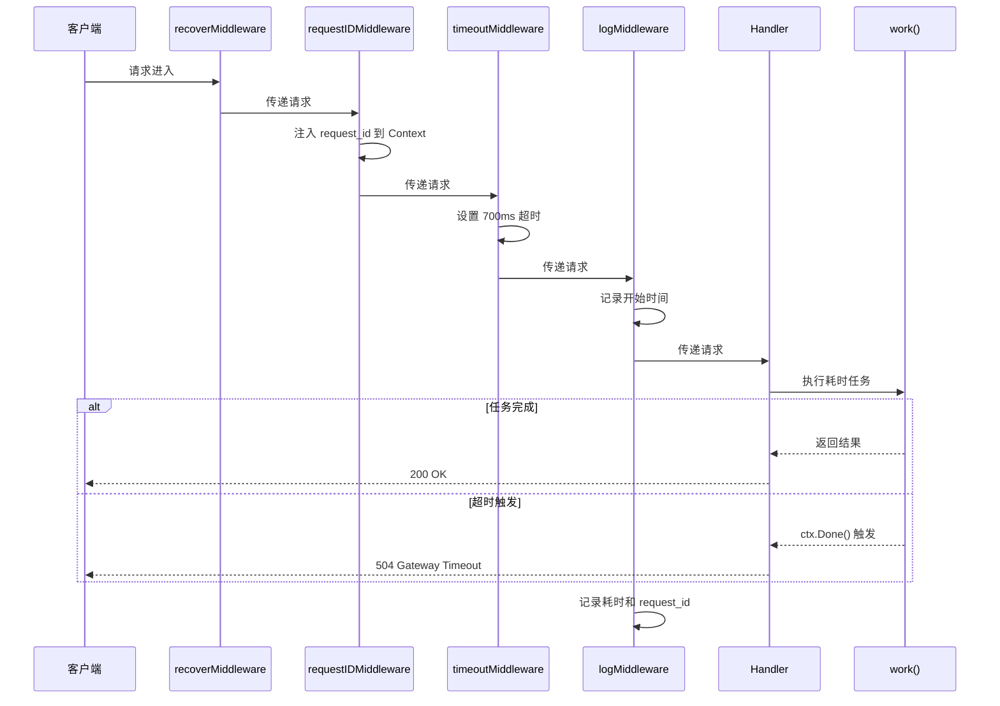

# 写作前的代码理解摘要

## 1. 项目地图

- **main 入口文件**：`series/32/cmd/ctxhttp/main.go`
- **核心业务逻辑文件**：同上（单文件项目）
- **关键结构体/接口**：
  - `ctxKey`：自定义 Context Key 类型
  - `requestIDKey`：请求 ID 的 Key 常量
  - `http.Handler`：标准库核心接口
  - `context.Context`：请求生命周期管理

## 2. 核心三问

**痛点**：HTTP 服务经常遇到"偶发慢请求、超时不生效、日志对不上请求"的困扰。你以为是业务慢，其实是请求生命周期没有被管理：超时没设置，取消没处理，日志没有关联 request id。

**核心 Trick**：通过 `context.WithTimeout` 在中间件层统一设置超时，业务代码用 `select` 监听 `ctx.Done()` 实现真正的超时响应。用 `context.WithValue` 注入 request id，实现全链路追踪。多个超时叠加时，以最短的为准（最短优先原则）。

**适用场景**：需要超时控制的 API 服务、微服务调用链路追踪、需要请求级别日志关联的系统，以及任何对响应时间有 SLA 要求的场景。

## 3. Go 语言特性提取

- **context.Context**：请求生命周期管理的核心
- **context.WithTimeout**：带超时的 Context 派生
- **context.WithValue**：在 Context 中传递请求级元数据
- **select**：多路复用，监听超时和正常完成
- **sync/atomic**：原子操作生成递增 ID
- **闭包**：中间件工厂函数 `timeoutMiddleware(timeout)`

---

**标题备选**

- A（痛点型）：请求超时不生效？你可能没搞懂 Context 的正确用法
- B（干货型）：Context + HTTP 实战：超时控制、请求追踪、生命周期管理一文讲透
- C（悬念型）：为什么你的超时设置形同虚设？聊聊 Go 请求生命周期的那些坑

## 1. 场景复现：那个让我头疼的时刻

上周我排查一个线上问题：用户反馈接口偶尔超时，但我们的监控显示 P99 延迟正常。我翻了半天日志，发现一个尴尬的事实——**日志里根本对不上是哪个请求超时了**。

更糟糕的是，我发现代码里虽然设置了 5 秒超时，但实际上慢请求跑了 30 秒才返回。超时设置形同虚设。

问题出在哪？两个地方：

1. 日志没有 request id，无法串联一个请求的完整链路
2. 超时只设置了，但业务代码没有监听 `ctx.Done()`，所以超时信号发了，没人理

这让我意识到：**Context 不是设置了就完事，你得让整个调用链都"听"它的话**。今天我就带你把 Context 在 HTTP 服务中的用法讲透。

## 2. 架构蓝图：上帝视角看设计



关键点：

- **requestIDMiddleware**：给每个请求分配唯一 ID，注入到 Context
- **timeoutMiddleware**：设置服务端超时，派生带 deadline 的 Context
- **work 函数**：用 `select` 同时监听任务完成和超时信号

## 3. 源码拆解：手把手带你读核心

### 3.1 自定义 Context Key：类型安全的秘诀

```go
type ctxKey string

const requestIDKey ctxKey = "request_id"
```

为什么要自定义类型，而不是直接用 `string`？

因为 Context 的 Key 是用 `==` 比较的。如果你用 `string`，别的包也用 `string`，Key 可能冲突。自定义类型 `ctxKey` 是你这个包独有的，不会和别人撞车。

**知识点贴士**：Go 的类型系统很严格，`ctxKey("foo")` 和 `string("foo")` 是不同的类型，即使底层值一样，`==` 比较也是 false。

### 3.2 请求 ID 中间件：链路追踪的起点

```go
func requestIDMiddleware(next http.Handler) http.Handler {
    return http.HandlerFunc(func(w http.ResponseWriter, r *http.Request) {
        id := atomic.AddInt64(&reqSeq, 1)
        reqID := fmt.Sprintf("req-%04d", id)
        ctx := context.WithValue(r.Context(), requestIDKey, reqID)
        next.ServeHTTP(w, r.WithContext(ctx))
    })
}
```

这里有几个细节：

1. **`atomic.AddInt64`**：原子操作，保证并发安全。多个请求同时进来，ID 不会重复
2. **`context.WithValue`**：派生一个新 Context，带上 request id
3. **`r.WithContext(ctx)`**：把新 Context 绑定到请求上，后续 handler 都能拿到

**为什么不用全局变量 + 锁？** 原子操作比锁更轻量，适合这种简单的递增场景。

### 3.3 超时中间件：deadline 的传递

```go
func timeoutMiddleware(timeout time.Duration) func(http.Handler) http.Handler {
    return func(next http.Handler) http.Handler {
        return http.HandlerFunc(func(w http.ResponseWriter, r *http.Request) {
            ctx, cancel := context.WithTimeout(r.Context(), timeout)
            defer cancel()
            next.ServeHTTP(w, r.WithContext(ctx))
        })
    }
}
```

这是一个**中间件工厂函数**——它接收超时时间，返回一个中间件。这样你可以灵活配置不同接口的超时。

**`defer cancel()` 为什么必须写？** 即使超时没触发，也要调用 `cancel()` 释放资源。否则 Context 关联的 goroutine 会泄漏。

**知识点贴士**：`context.WithTimeout` 返回的 `cancel` 函数是幂等的，调用多次没问题。养成 `defer cancel()` 的习惯，不会错。

### 3.4 业务代码：真正监听超时

```go
func work(ctx context.Context, delay time.Duration) error {
    select {
    case <-time.After(delay):
        return nil
    case <-ctx.Done():
        return ctx.Err()
    }
}
```

这是**超时生效的关键**。`select` 同时监听两个 channel：

- `time.After(delay)`：任务正常完成
- `ctx.Done()`：超时或取消信号

哪个先到就走哪个分支。如果超时先到，返回 `ctx.Err()`（可能是 `context.DeadlineExceeded` 或 `context.Canceled`）。

**为什么很多人的超时不生效？** 因为他们只设置了超时，但业务代码里没有 `select` 监听 `ctx.Done()`。超时信号发了，没人理。

### 3.5 最短超时优先

```go
func simulate(handler http.Handler, label, path string, clientTimeout time.Duration) {
    ctx := context.Background()
    if clientTimeout > 0 {
        var cancel context.CancelFunc
        ctx, cancel = context.WithTimeout(ctx, clientTimeout)
        defer cancel()
    }
    req := httptest.NewRequest(http.MethodGet, "http://api.local"+path, nil).WithContext(ctx)
    // ...
}
```

当客户端设置 300ms 超时，服务端设置 700ms 超时时，实际会在 300ms 触发。这就是**最短优先原则**：多个 deadline 叠加，以最早到期的为准。

这很合理——任何一方的预算耗尽，继续执行都是浪费资源。

## 4. 避坑指南 & 深度思考

### 常见坑

1. **只设置超时不监听**：`context.WithTimeout` 只是设置了 deadline，业务代码必须用 `select` 监听 `ctx.Done()`
2. **忘记传递 Context**：子函数还是用 `context.Background()`，超时信号传不下去
3. **滥用 Context Value**：把大量业务数据塞进 Context，这是反模式。Context 只放请求级元数据
4. **忘记 defer cancel()**：Context 资源泄漏，goroutine 越积越多

### 生产环境补充

- **request id 应该从 header 读取**：如果上游已经生成了 `X-Request-ID`，应该复用而不是重新生成
- **超时要分级**：不同接口 SLA 不同，读接口可以短一些，写接口可以长一些
- **错误码要区分**：`context.DeadlineExceeded` 返回 504，`context.Canceled` 返回 499（客户端主动断开）

## 5. 快速上手 & 改造建议

### 运行命令

```bash
go run ./series/32/cmd/ctxhttp
```

### 工程化改造建议

1. **request id 写入响应头**：`w.Header().Set("X-Request-ID", reqID)`，方便客户端排查问题
2. **超时配置化**：不同接口的超时时间从配置文件读取，而不是硬编码
3. **集成 tracing**：把 request id 换成 OpenTelemetry 的 trace id，接入分布式追踪系统

## 6. 总结与脑图

- `r.Context()` 是请求的"生命线"，随请求创建、随请求结束而取消
- 超时设置后，业务代码必须用 `select` 监听 `ctx.Done()` 才能真正生效
- 多个超时叠加时，以最短的为准（最短优先原则）
- Context Value 只放请求级元数据（request id、trace id），不要塞业务数据
- `defer cancel()` 是好习惯，防止 Context 资源泄漏
