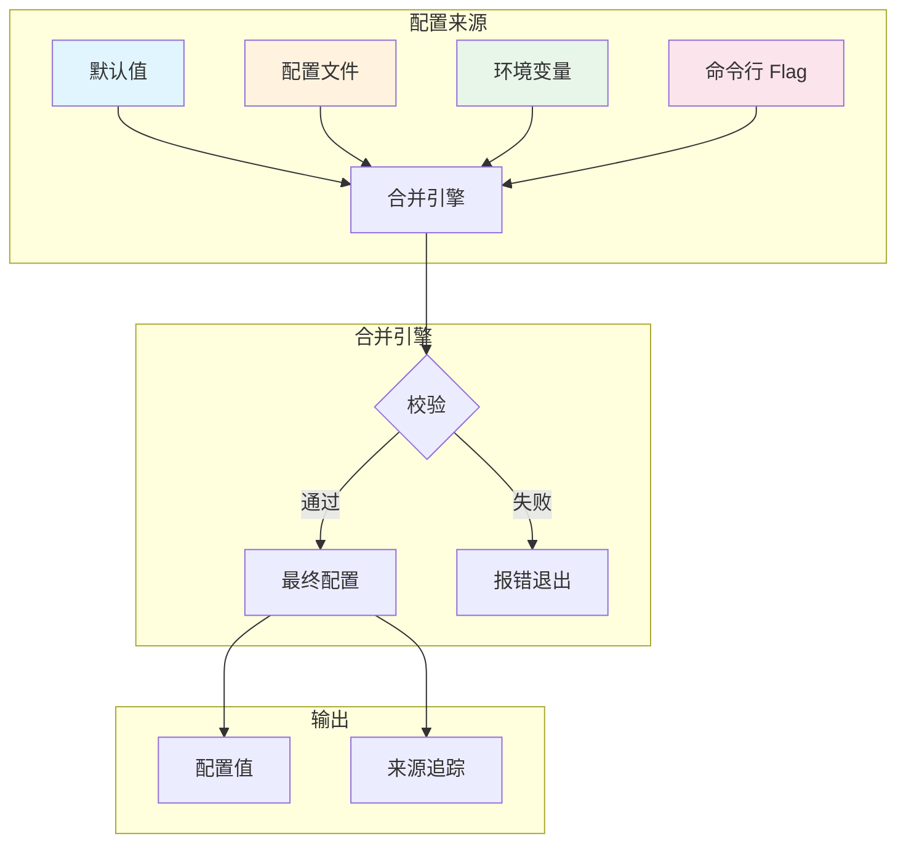

# 写作前的代码理解摘要

## 1. 项目地图

- **main 入口文件**：`series/33/cmd/configlab/main.go`
- **核心业务逻辑文件**：同上（单文件项目）
- **关键结构体/接口**：
  - `fileConfig`：配置文件结构（指针字段，区分"没写"和"写了零值"）
  - `rawConfig`：最终配置结构
  - `sources`：记录每个配置项的来源
  - `resolved`：输出结构，包含配置值和来源

## 2. 核心三问

**痛点**：配置管理看似简单，实则坑多。flag 和 env 谁覆盖谁？默认值写哪？配置文件里写 `0` 和不写有什么区别？上线后发现"配置没生效"，排查半天才发现优先级搞反了。

**核心 Trick**：建立明确的配置合并顺序（默认值 < 配置文件 < 环境变量 < flag），用指针字段区分"没写"和"写了零值"，输出时同时打印配置值和来源，实现可追溯的配置管理。

**适用场景**：CLI 工具、微服务配置管理、需要多环境部署的应用，以及任何需要"配置可观察性"的场景。

## 3. Go 语言特性提取

- **指针字段**：`*string`、`*int` 区分 nil 和零值
- **泛型函数**：`applyFileField[T any]` 统一处理不同类型
- **flag 包**：命令行参数解析
- **os.LookupEnv**：区分"环境变量不存在"和"环境变量为空"
- **json.Decoder.DisallowUnknownFields**：严格 JSON 解析
- **defer**：确保文件关闭

---

**标题备选**

- A（痛点型）：配置没生效？你可能搞错了 flag/env/config 的优先级
- B（干货型）：Go 配置管理实战：合并策略 + 来源追踪 + 校验一文讲透
- C（悬念型）：为什么我的配置总是"不听话"？聊聊配置工程化的正确姿势

## 1. 场景复现：那个让我头疼的时刻

前阵子我们上线了一个新服务，测试环境一切正常，生产环境却报错：端口冲突。

我检查了配置文件，端口是 9090，没问题。检查了环境变量，`APP_PORT=8080`，也没问题。但服务启动时用的是 8080，和另一个服务撞了。

排查了半小时，我才发现问题：**运维同事在启动命令里加了 `-port=8080`，flag 覆盖了环境变量**。

更尴尬的是，我们的日志里只打印了最终配置值，没有打印"这个值是从哪来的"。如果当时能看到 `port: 8080 (source: flag)`，问题秒定位。

这件事让我意识到：**配置不是"能跑就行"，它需要明确的优先级、严格的校验、可追溯的来源**。今天我就带你实现一套工程化的配置管理方案。

## 2. 架构蓝图：上帝视角看设计



配置合并的黄金顺序：**默认值 < 配置文件 < 环境变量 < flag**

- **默认值**：代码里写死，保证程序能跑
- **配置文件**：项目级配置，适合团队共享
- **环境变量**：部署级配置，适合运维注入
- **Flag**：临时覆盖，适合本地调试

后面的覆盖前面的，但每一层都是可选的。

## 3. 源码拆解：手把手带你读核心

### 3.1 指针字段：区分"没写"和"写了零值"

```go
type fileConfig struct {
    App      *string `json:"app"`
    Port     *int    `json:"port"`
    Timeout  *string `json:"timeout"`
    LogLevel *string `json:"log_level"`
    FeatureX *bool   `json:"feature_x"`
}
```

为什么用指针？看这个例子：

```json
{"port": 0}      // 用户明确写了 0
{}               // 用户没写 port
```

如果 `Port` 是 `int` 类型，这两种情况解析后都是 `0`，你分不清。但如果是 `*int`：

- 用户写了 `0`：`Port` 指向值为 0 的 int
- 用户没写：`Port` 是 nil

**知识点贴士**：Go 的 JSON 解析器对指针字段的处理是：字段不存在时保持 nil，字段存在时分配内存并赋值。这个特性非常适合配置场景。

### 3.2 泛型辅助函数：减少重复代码

```go
func applyFileField[T any](val *T, dst *T, src *string, from string) {
    if val == nil {
        return
    }
    *dst = *val
    *src = from
}
```

这个泛型函数处理"如果配置文件里有这个字段，就覆盖默认值，并记录来源"。不管是 `string`、`int` 还是 `bool`，一个函数搞定。

调用时：

```go
applyFileField(fc.App, &cfg.App, &src.App, "config")
applyFileField(fc.Port, &cfg.Port, &src.Port, "config")
```

**知识点贴士**：Go 1.18 引入了泛型，`[T any]` 表示 T 可以是任意类型。这里用泛型避免了为每种类型写一个函数。

### 3.3 环境变量：用 LookupEnv 而不是 Getenv

```go
func applyEnv(cfg *rawConfig, src *sources) error {
    if v, ok := os.LookupEnv("APP_PORT"); ok {
        port, err := strconv.Atoi(v)
        if err != nil {
            return fmt.Errorf("invalid APP_PORT: %w", err)
        }
        cfg.Port = port
        src.Port = "env"
    }
    // ...
}
```

为什么用 `os.LookupEnv` 而不是 `os.Getenv`？

- `Getenv("FOO")` 返回空字符串，你分不清是"没设置"还是"设置为空"
- `LookupEnv("FOO")` 返回 `(value, ok)`，`ok` 为 false 表示没设置

这个区别在配置场景很重要：用户可能故意设置 `APP_NAME=""` 表示"我要空字符串"。

### 3.4 Flag 解析：只覆盖用户明确传的

```go
func applyFlags(args []string, configPath string, cfg *rawConfig, src *sources) error {
    fs := flag.NewFlagSet("configlab", flag.ContinueOnError)
    // 定义 flag...
    
    if err := fs.Parse(args); err != nil {
        return err
    }

    set := map[string]bool{}
    fs.Visit(func(f *flag.Flag) {
        set[f.Name] = true
    })

    if set["port"] {
        cfg.Port = *port
        src.Port = "flag"
    }
    // ...
}
```

这里有个技巧：**用 `fs.Visit` 判断用户是否明确传了这个 flag**。

为什么不直接用 flag 的值？因为 flag 有默认值。如果用户没传 `-port`，`*port` 也有值（从 `cfg.Port` 继承的）。我们只想在用户明确传了 `-port=xxx` 时才覆盖。

`fs.Visit` 只遍历用户明确设置的 flag，完美解决这个问题。

### 3.5 校验：尽早失败

```go
func validateConfig(cfg rawConfig) error {
    if strings.TrimSpace(cfg.App) == "" {
        return errors.New("app is required")
    }
    if cfg.Port <= 0 || cfg.Port > 65535 {
        return errors.New("port must be 1-65535")
    }
    if _, err := time.ParseDuration(cfg.Timeout); err != nil {
        return fmt.Errorf("invalid timeout: %w", err)
    }
    if !validLogLevel(cfg.LogLevel) {
        return fmt.Errorf("invalid log level: %s", cfg.LogLevel)
    }
    return nil
}
```

配置合并完，必须校验。这里检查了：

- 必填字段不能为空
- 端口范围合法
- timeout 能解析为 `time.Duration`
- log level 是预定义的值

**为什么不在每一层单独校验？** 因为配置是叠加的，单层可能不完整。只有合并完才能做完整校验。

## 4. 避坑指南 & 深度思考

### 常见坑

1. **优先级混乱**：env 和 flag 谁覆盖谁搞不清，导致配置"不听话"
2. **零值覆盖默认值**：配置文件里写 `port: 0`，把默认的 8080 覆盖了
3. **配置文件拼错字段**：默认解码会忽略，导致配置无效
4. **缺少来源追踪**：出问题时不知道配置是从哪来的

### 命名约定

建议同一配置在不同入口保持一致的命名：

| 配置项 | 配置文件 | 环境变量 | Flag |
|--------|----------|----------|------|
| 日志级别 | `log_level` | `APP_LOG_LEVEL` | `-log-level` |
| 端口 | `port` | `APP_PORT` | `-port` |

这样运维和开发都能快速对应。

## 5. 快速上手 & 改造建议

### 运行命令

```bash
# 混合使用环境变量和 flag
APP_PORT=7070 APP_LOG_LEVEL=debug go run ./series/33/cmd/configlab -timeout=500ms -feature-x=false
```

### 工程化改造建议

1. **支持多格式配置文件**：除了 JSON，支持 YAML 和 TOML，用 `filepath.Ext` 判断格式
2. **配置热更新**：用 `fsnotify` 监听配置文件变化，但要注意线程安全
3. **敏感配置加密**：数据库密码等敏感信息从 Secret Manager 读取，不要明文写配置文件

## 6. 总结与脑图

- 配置合并的黄金顺序：默认值 < 配置文件 < 环境变量 < flag
- 用指针字段区分"没写"和"写了零值"，避免误覆盖
- 用 `os.LookupEnv` 而不是 `os.Getenv`，区分"没设置"和"设置为空"
- 用 `flag.Visit` 判断用户是否明确传了某个 flag
- 输出配置时同时打印来源，出问题秒定位
