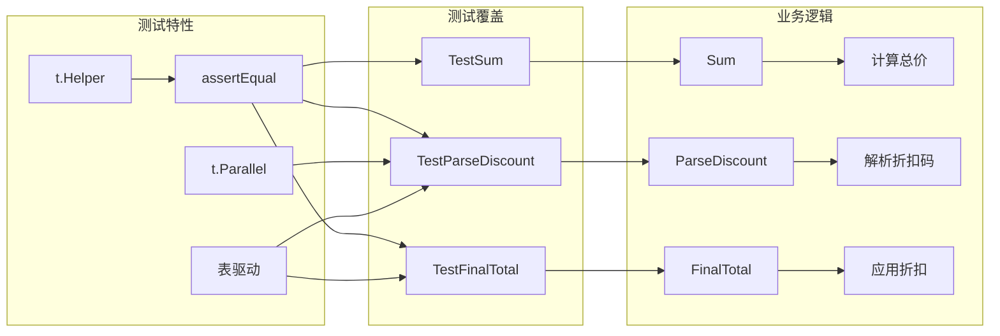

# 写作前的代码理解摘要

## 1. 项目地图

- **main 入口文件**：无（纯库项目）
- **核心业务逻辑文件**：`series/34/pricing/pricing.go`
- **测试文件**：`series/34/pricing/pricing_test.go`
- **关键结构体/接口**：
  - `Item`：商品结构
  - `Discount`：折扣结构（Kind + Value）
  - `ErrInvalidDiscount`：自定义错误类型

## 2. 核心三问

**痛点**：很多人把测试当"上线前的形式流程"，写几行断言就结束。但在 Go 里，`go test` 不只是验收工具，更是开发时的"安全护栏"。没有测试，你不敢改；测试写得好，你才敢重构。

**核心 Trick**：用表驱动测试（Table-Driven Test）统一覆盖多个场景，用 `t.Run` 做结构化子测试，用 `t.Parallel` 加速执行，用 `errors.Is` 做可靠的错误断言，用 `t.Helper` 提升断言可读性。

**适用场景**：任何需要保证代码质量的项目，特别是核心业务逻辑、公共库、需要频繁重构的模块。

## 3. Go 语言特性提取

- **表驱动测试**：Go 社区的默认测试范式
- **t.Run**：结构化子测试
- **t.Parallel**：并行测试加速
- **t.Helper**：自定义断言函数标记
- **errors.Is**：错误链比较
- **泛型函数**：`assertEqual[T comparable]` 通用断言

---

**标题备选**

- A（痛点型）：测试不是形式主义：聊聊 Go 测试如何成为你的开发护栏
- B（干货型）：go test 实战：表驱动 + 子测试 + 并行 + 错误断言一文讲透
- C（悬念型）：为什么大佬们都爱写测试？因为他们比你更怕 Bug

## 1. 场景复现：那个让我头疼的时刻

上个月我重构了一个定价模块，改了折扣计算的逻辑。改完自测了一下，没问题，提交上线。

结果第二天客服找过来：有用户反馈，用了 `OFF10` 折扣码，价格没变。

我一查，原来是我重构时把 `OFF` 前缀的判断改成了大小写敏感，用户输入的是小写 `off10`，直接被当成无效码了。

如果当时有测试覆盖"大小写不敏感"这个场景，CI 就会拦住我。但我没写，因为我觉得"这么简单的逻辑不会出错"。

这件事让我意识到：**测试不是给别人看的，是给自己兜底的**。特别是重构的时候，测试就是你的安全网。今天我就带你用 Go 的测试工具链，把一个定价模块的测试写得又快又稳。

## 2. 架构蓝图：上帝视角看设计



测试结构：

- **TestSum**：最简单的单元测试，验证求和逻辑
- **TestParseDiscount**：表驱动测试，覆盖各种折扣码格式
- **TestFinalTotal**：集成测试，验证完整的定价流程

## 3. 源码拆解：手把手带你读核心

### 3.1 表驱动测试：一次覆盖多个场景

```go
func TestParseDiscount(t *testing.T) {
    cases := []struct {
        name    string
        code    string
        want    Discount
        wantErr bool
    }{
        {name: "empty", code: "", want: Discount{Kind: "none"}},
        {name: "percent", code: "OFF10", want: Discount{Kind: "percent", Value: 10}},
        {name: "percent lowercase", code: "off20", want: Discount{Kind: "percent", Value: 20}},
        {name: "minus", code: "MINUS500", want: Discount{Kind: "minus", Value: 500}},
        {name: "bad percent", code: "OFF0", wantErr: true},
        {name: "bad percent high", code: "OFF95", wantErr: true},
        {name: "bad minus", code: "MINUS0", wantErr: true},
        {name: "bad format", code: "HELLO", wantErr: true},
    }

    for _, tc := range cases {
        tc := tc  // 重要！
        t.Run(tc.name, func(t *testing.T) {
            // ...
        })
    }
}
```

表驱动测试的好处：

1. **可读性高**：所有用例一目了然
2. **扩展成本低**：加用例只需要加一行
3. **结构统一**：输入、期望输出、是否报错，格式固定

**为什么要 `tc := tc`？** 这是 Go 的一个经典坑。`for` 循环的变量 `tc` 是复用的，如果子测试是并行的，可能读到错误的值。`tc := tc` 在每次迭代创建一个新变量，避免这个问题。

**知识点贴士**：Go 1.22 开始，循环变量的语义改了，不再需要 `tc := tc`。但为了兼容老版本，很多项目还是会写。

### 3.2 t.Run：结构化子测试

```go
t.Run(tc.name, func(t *testing.T) {
    t.Parallel()
    got, err := ParseDiscount(tc.code)
    // ...
})
```

`t.Run` 创建子测试，好处是：

1. **单独运行**：`go test -run TestParseDiscount/percent` 只跑这一个
2. **独立统计**：每个子测试有自己的 PASS/FAIL
3. **并行友好**：子测试可以独立并行

### 3.3 t.Parallel：加速测试

```go
t.Run(tc.name, func(t *testing.T) {
    t.Parallel()
    // ...
})
```

`t.Parallel()` 标记这个测试可以和其他并行测试同时跑。Go 的测试框架会自动调度。

运行时你会看到：

```
=== RUN   TestParseDiscount/empty
=== PAUSE TestParseDiscount/empty
=== RUN   TestParseDiscount/percent
=== PAUSE TestParseDiscount/percent
=== CONT  TestParseDiscount/empty
=== CONT  TestParseDiscount/percent
```

`PAUSE` 表示等待其他并行测试，`CONT` 表示继续执行。这样多个子测试可以同时跑，节省时间。

### 3.4 errors.Is：可靠的错误断言

```go
if tc.wantErr {
    if err == nil {
        t.Fatalf("expected error")
    }
    if !errors.Is(err, ErrInvalidDiscount) {
        t.Fatalf("expected ErrInvalidDiscount, got %v", err)
    }
    return
}
```

为什么用 `errors.Is` 而不是 `err == ErrInvalidDiscount`？

因为错误可能被包装。比如：

```go
return fmt.Errorf("%w: %q", ErrInvalidDiscount, code)
```

这里用 `%w` 包装了原始错误。直接 `==` 比较会失败，但 `errors.Is` 会沿着错误链查找。

**知识点贴士**：Go 1.13 引入了错误包装机制，`%w` 创建错误链，`errors.Is` 和 `errors.As` 用于检查错误链。

### 3.5 t.Helper：让报错定位更准

```go
func assertEqual[T comparable](t *testing.T, got, want T) {
    t.Helper()
    if got != want {
        t.Fatalf("got %v want %v", got, want)
    }
}
```

`t.Helper()` 标记这个函数是测试辅助函数。当断言失败时，报错会指向调用 `assertEqual` 的那一行，而不是 `assertEqual` 内部。

没有 `t.Helper()`：

```
pricing_test.go:15: got 1800 want 2000  // 指向 assertEqual 内部
```

有 `t.Helper()`：

```
pricing_test.go:42: got 1800 want 2000  // 指向业务测试代码
```

后者更容易定位问题。

## 4. 避坑指南 & 深度思考

### 常见坑

1. **测试写在错误目录**：`*_test.go` 必须和被测文件同目录
2. **错误比较用字符串**：错误信息改了测试就挂，用 `errors.Is` 更稳
3. **子测试未隔离**：共享变量导致并发污染，记得 `tc := tc`
4. **只测成功路径**：边界条件、错误场景也要覆盖

### 测试命名建议

用例名要"场景化"，失败时一眼能看懂：

```go
// 好的命名
{name: "percent lowercase", code: "off20", ...}
{name: "bad percent high", code: "OFF95", ...}

// 不好的命名
{name: "case1", code: "off20", ...}
{name: "case2", code: "OFF95", ...}
```

## 5. 快速上手 & 改造建议

### 运行命令

```bash
# 运行所有测试，显示详情
go test ./series/34/pricing -v

# 只运行某个测试
go test ./series/34/pricing -run TestParseDiscount -v

# 禁用缓存，强制重新运行
go test ./series/34/pricing -count=1 -v
```

### 工程化改造建议

1. **接入 CI**：每次提交自动跑测试，保证主干稳定
2. **覆盖率检查**：`go test -cover` 看覆盖率，关键路径要 80% 以上
3. **TestMain 初始化**：如果测试需要数据库连接等资源，用 `TestMain` 统一初始化和清理

## 6. 总结与脑图

- `*_test.go` 是测试入口，编译期和业务代码分离
- 表驱动测试是 Go 社区的默认范式，可读性高、扩展成本低
- `t.Run` 创建结构化子测试，可以单独运行和统计
- `t.Parallel` 让子测试并行执行，加速测试
- `errors.Is` 沿着错误链查找，比 `==` 更可靠
- `t.Helper` 让自定义断言的报错定位更准确
