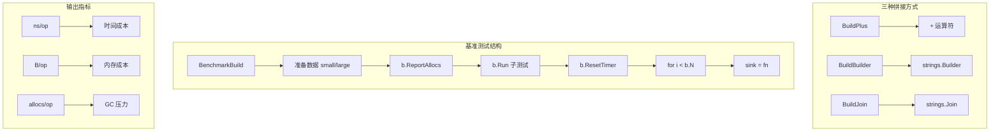

# 写作前的代码理解摘要

## 1. 项目地图

- **main 入口文件**：无（纯库项目）
- **核心业务逻辑文件**：`series/35/format/format.go`
- **测试文件**：`series/35/format/format_test.go`
- **关键函数**：
  - `BuildPlus`：用 `+` 拼接字符串
  - `BuildBuilder`：用 `strings.Builder` 拼接
  - `BuildJoin`：用 `strings.Join` 拼接

## 2. 核心三问

**痛点**：很多人第一次写基准测试，以为跑出一串 `ns/op` 就能下结论，结果线上还是慢。要么测到了编译器优化后的"假快"，要么把初始化开销算进了性能。基准测试不是跑一下就行，它需要正确的结构、合理的对比和可信的指标。

**核心 Trick**：用 `b.ResetTimer` 排除初始化开销，用 `sink` 变量防止编译器优化掉结果，用 `-benchmem` 同时关注时间和内存分配，用 `b.Run` 做多方案对比，用 small/large 两组数据验证规模效应。

**适用场景**：性能敏感的核心路径优化、技术选型对比、内存分配问题排查，以及任何需要用数据说话的性能讨论。

## 3. Go 语言特性提取

- **b.N**：基准测试的自动迭代次数
- **b.ResetTimer**：重置计时器，排除准备工作
- **b.ReportAllocs**：报告内存分配
- **b.Run**：子基准测试
- **strings.Builder**：高效字符串拼接
- **包级变量 sink**：防止编译器优化

---

**标题备选**

- A（痛点型）：你的 benchmark 可能测了个寂寞：聊聊基准测试的正确姿势
- B（干货型）：Go benchmark 实战：防优化 + 内存分析 + 多方案对比一文讲透
- C（悬念型）：为什么你的性能测试结果不可信？编译器可能在骗你

## 1. 场景复现：那个让我头疼的时刻

前阵子我优化一个日志模块，需要把多个字段拼成一行。我写了个 benchmark，对比 `+` 拼接和 `strings.Builder`，结果显示差距不大，我就用了更简单的 `+`。

上线后，高峰期内存飙升，GC 频繁触发，P99 延迟从 50ms 涨到 200ms。

我回去看 benchmark，发现两个问题：

1. 测试数据太小（只有 5 个字段），没体现出规模效应
2. 我只看了 `ns/op`，没看 `allocs/op`

加上 `-benchmem` 重新跑，真相大白：`+` 拼接在大规模下分配次数是 `Builder` 的 1000 倍。分配多意味着 GC 压力大，这才是线上问题的根源。

这件事让我意识到：**benchmark 不是跑一下就信，你得知道怎么跑、看什么指标、防什么坑**。今天我就带你把 Go 基准测试的门道讲透。

## 2. 架构蓝图：上帝视角看设计



基准测试的核心流程：

1. **准备数据**：small（32 个词）和 large（1024 个词）两组
2. **排除干扰**：`b.ResetTimer` 把准备时间排除
3. **防止优化**：结果写入 `sink`，防止编译器优化掉
4. **多维度指标**：时间、内存、分配次数都要看

## 3. 源码拆解：手把手带你读核心

### 3.1 三种拼接方式的实现

```go
// 方式一：+ 拼接
func BuildPlus(words []string) string {
    var s string
    for _, w := range words {
        s += w
    }
    return s
}

// 方式二：strings.Builder
func BuildBuilder(words []string) string {
    var b strings.Builder
    need := 0
    for _, w := range words {
        need += len(w)
    }
    b.Grow(need)  // 预分配
    for _, w := range words {
        b.WriteString(w)
    }
    return b.String()
}

// 方式三：strings.Join
func BuildJoin(words []string) string {
    return strings.Join(words, "")
}
```

为什么 `+` 拼接慢？

每次 `s += w`，Go 都要：
1. 分配一块新内存（旧长度 + 新长度）
2. 把旧内容复制过去
3. 把新内容追加上去

如果有 1000 个词，就要分配 1000 次内存，复制 1000 次。

`strings.Builder` 用 `Grow` 预分配足够空间，只分配一次，后续都是追加，不需要复制。

**知识点贴士**：Go 的字符串是不可变的（immutable），每次修改都会创建新字符串。这是 `+` 拼接慢的根本原因。

### 3.2 sink 变量：防止编译器"聪明过头"

```go
var sink string

func BenchmarkBuild(b *testing.B) {
    // ...
    bench := func(name string, words []string, fn func([]string) string) {
        b.Run(name, func(b *testing.B) {
            var out string
            b.ResetTimer()
            for i := 0; i < b.N; i++ {
                out = fn(words)
            }
            sink = out  // 关键！
        })
    }
    // ...
}
```

为什么要 `sink = out`？

Go 编译器很聪明，如果它发现 `out` 没人用，可能直接把整个循环优化掉。你以为测了 1000 万次，实际上一次都没跑。

把结果赋值给包级变量 `sink`，编译器就不敢优化了——它不知道 `sink` 会不会被别的地方用到。

**知识点贴士**：这个技巧叫"escape to heap"或"prevent dead code elimination"。在性能测试中非常常见。

### 3.3 b.ResetTimer：排除准备工作

```go
b.Run(name, func(b *testing.B) {
    var out string
    b.ResetTimer()  // 从这里开始计时
    for i := 0; i < b.N; i++ {
        out = fn(words)
    }
    sink = out
})
```

`b.ResetTimer()` 把之前的计时清零。这样准备数据的时间不会算进性能指标。

如果不加，你测的就不是"拼接性能"，而是"准备数据 + 拼接"的总时间。

### 3.4 b.ReportAllocs：内存才是关键

```go
func BenchmarkBuild(b *testing.B) {
    // ...
    b.ReportAllocs()
    // ...
}
```

或者命令行加 `-benchmem`：

```bash
go test -bench . -benchmem
```

这会输出三个指标：

- **ns/op**：每次操作的纳秒数
- **B/op**：每次操作分配的字节数
- **allocs/op**：每次操作的分配次数

很多时候，`ns/op` 差距不大，但 `allocs/op` 差距巨大。分配多意味着 GC 压力大，在高并发场景会成为瓶颈。

### 3.5 small/large 对比：验证规模效应

```go
small := makeWords(32, 6)   // 32 个词，每个 6 字节
large := makeWords(1024, 6) // 1024 个词，每个 6 字节

bench("plus/small", small, BuildPlus)
bench("plus/large", large, BuildPlus)
bench("builder/small", small, BuildBuilder)
bench("builder/large", large, BuildBuilder)
```

为什么要两组数据？

因为有些方案在小规模下差距不明显，大规模才暴露问题。比如 `+` 拼接：

- small（32 词）：1754 ns/op，31 allocs/op
- large（1024 词）：907548 ns/op，1023 allocs/op

大规模下慢了 500 倍，分配次数涨了 33 倍。如果只测 small，你可能觉得"差不多"。

## 4. 避坑指南 & 深度思考

### 常见坑

1. **结果被优化掉**：没用 `sink`，编译器把循环删了，测出来特别快
2. **把初始化算进去**：没用 `b.ResetTimer`，准备数据的时间也算了
3. **只看 ns/op**：忽略内存分配，线上 GC 爆炸
4. **样本太小**：小数据掩盖了规模效应

### 指标解读

| 指标 | 含义 | 关注点 |
|------|------|--------|
| ns/op | 每次操作耗时 | CPU 密集型任务 |
| B/op | 每次操作分配字节 | 内存占用 |
| allocs/op | 每次操作分配次数 | GC 压力 |

一般来说，`allocs/op` 比 `B/op` 更重要。分配 1 次 1MB 比分配 1000 次 1KB 对 GC 友好得多。

## 5. 快速上手 & 改造建议

### 运行命令

```bash
# 运行基准测试，显示内存分配
go test ./series/35/format -bench . -benchmem -run=^$

# 跑 3 秒，结果更稳定
go test ./series/35/format -bench . -benchmem -benchtime=3s -run=^$

# 跑 5 次，用 benchstat 对比
go test ./series/35/format -bench . -benchmem -count=5 -run=^$ > old.txt
# 改代码后
go test ./series/35/format -bench . -benchmem -count=5 -run=^$ > new.txt
benchstat old.txt new.txt
```

### 工程化改造建议

1. **用真实数据规模**：别用 32 个词测，用你线上真实的数据量
2. **多跑几次取平均**：单次结果波动大，用 `-count=5` 跑多次
3. **用 benchstat 对比**：优化前后的对比，用工具算统计显著性

## 6. 总结与脑图

- `b.N` 是基准测试的节拍器，Go 自动调整迭代次数保证结果稳定
- 用 `sink` 变量防止编译器优化掉你的代码
- 用 `b.ResetTimer` 排除准备工作的时间
- 用 `-benchmem` 同时关注 ns/op、B/op、allocs/op
- 用 small/large 两组数据验证规模效应
- 关注趋势而不是绝对值，不同机器结果会有差异
