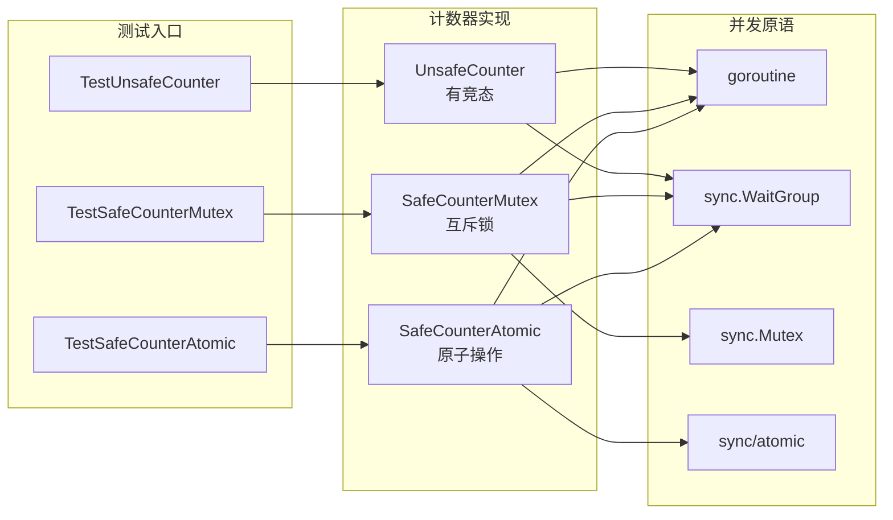

# 写作前的代码理解摘要

## 1. 项目地图

- **main 入口文件路径**：无独立 main，本项目为测试驱动示例
- **核心业务逻辑所在文件路径**：`series/36/racecase/race.go`
- **测试文件路径**：`series/36/racecase/race_test.go`
- **关键结构体/接口名称**：无自定义结构体，核心为三个函数 `UnsafeCounter`、`SafeCounterMutex`、`SafeCounterAtomic`

## 2. 核心三问

**这个项目解决的具体痛点是什么？**
并发程序中最隐蔽的 bug 就是数据竞争——代码"看起来能跑"，但结果时对时错，线上偶发异常却难以复现。这个项目通过一个最小化的计数器示例，演示如何用 Go 的 race detector 把隐藏的并发问题暴露出来。

**它的核心技术实现逻辑（Trick）是什么？**
项目故意实现了一个有竞态的 `UnsafeCounter`，让多个 goroutine 同时对同一个 `int` 变量做 `count++`。然后提供两种修复方案：`sync.Mutex` 加锁和 `sync/atomic` 原子操作。配合 `go test -race` 命令，可以直观看到竞态检测的报告输出。

**它最适合用在什么业务场景？**
任何涉及并发读写共享变量的场景：计数器、缓存更新、状态标记、连接池管理等。尤其适合在 CI 流水线中定期跑 `-race`，把潜在的并发 bug 扼杀在上线之前。

## 3. Go 语言特性提取

- **Goroutine**：`go func()` 启动并发执行
- **sync.WaitGroup**：等待一组 goroutine 完成
- **sync.Mutex**：互斥锁保护临界区
- **sync/atomic**：原子操作实现无锁并发
- **defer**：确保 `wg.Done()` 和 `mu.Unlock()` 被执行
- **闭包捕获**：goroutine 内部访问外层变量

---

**备选标题**

- 风格 A（痛点型）：《线上计数总是少几个？一个命令帮你揪出并发 Bug》
- 风格 B（干货型）：《Go race detector 实战：从数据竞争到安全计数器》
- 风格 C（悬念型）：《为什么你的并发代码"看起来没问题"却总出错？》

---

## 1. 场景复现：那个让我头疼的时刻

上周我接手了一个老项目的统计模块，功能很简单：统计每天的请求量。代码逻辑清晰，测试也能跑过，但运维同事反馈说**线上数据总是比预期少那么几十条**。

我翻了半天日志，没发现丢数据的痕迹。直到我注意到统计逻辑里有一段并发代码：

```go
var count int
for i := 0; i < n; i++ {
    go func() {
        count++
    }()
}
```

看起来没毛病对吧？但这就是典型的**数据竞争**——多个 goroutine 同时读写同一个变量，结果完全不可预测。

我加了一行命令：

```bash
go test -race ./...
```

终端立刻飘红，race detector 把问题位置精确到了行号。那一刻我才意识到：**并发 bug 不是靠肉眼能看出来的，得靠工具。**

---

## 2. 架构蓝图：上帝视角看设计

这个示例项目结构非常简洁，核心就是演示"有问题的写法"和"正确的写法"：



三个函数做的事情一样：启动 n 个 goroutine，每个 goroutine 对计数器加 1，最后返回结果。区别在于**同步机制**：
- `UnsafeCounter`：裸奔，没有任何保护
- `SafeCounterMutex`：用互斥锁包住临界区
- `SafeCounterAtomic`：用原子操作直接累加

---

## 3. 源码拆解：手把手带你读核心

### 3.1 有竞态的写法：UnsafeCounter

```go
func UnsafeCounter(n int) int {
    var count int
    var wg sync.WaitGroup
    wg.Add(n)
    for i := 0; i < n; i++ {
        go func() {
            defer wg.Done()
            count++
        }()
    }
    wg.Wait()
    return count
}
```

你可以看到，`count++` 这行代码被多个 goroutine 同时执行。**`count++` 不是原子操作**，它实际上是"读取 → 加 1 → 写回"三步，任何一步被打断都会导致结果错乱。

**知识点贴士**：`sync.WaitGroup` 是 Go 里等待一组 goroutine 完成的标准做法。`wg.Add(n)` 设置计数，每个 goroutine 结束时调用 `wg.Done()` 减 1，主 goroutine 调用 `wg.Wait()` 阻塞直到计数归零。

### 3.2 互斥锁版本：SafeCounterMutex

```go
func SafeCounterMutex(n int) int {
    var count int
    var wg sync.WaitGroup
    var mu sync.Mutex
    wg.Add(n)
    for i := 0; i < n; i++ {
        go func() {
            defer wg.Done()
            mu.Lock()
            count++
            mu.Unlock()
        }()
    }
    wg.Wait()
    return count
}
```

这里用 `sync.Mutex` 把 `count++` 包起来。**同一时刻只有一个 goroutine 能持有锁**，其他的必须排队等待。

**为什么这么写？** 互斥锁是最通用的同步手段，适合保护任意复杂的临界区。代价是有锁竞争时会有性能开销。

**知识点贴士**：`mu.Lock()` 和 `mu.Unlock()` 必须成对出现。如果你担心忘记解锁，可以用 `defer mu.Unlock()`，但要注意 defer 是在函数返回时执行，不是在代码块结束时。

### 3.3 原子操作版本：SafeCounterAtomic

```go
func SafeCounterAtomic(n int) int {
    var count int64
    var wg sync.WaitGroup
    wg.Add(n)
    for i := 0; i < n; i++ {
        go func() {
            defer wg.Done()
            atomic.AddInt64(&count, 1)
        }()
    }
    wg.Wait()
    return int(count)
}
```

`atomic.AddInt64` 是一个**原子操作**，CPU 层面保证"读取 → 加 1 → 写回"是不可分割的。

**为什么用 `int64` 而不是 `int`？** `sync/atomic` 包只提供了固定位宽的原子操作（`int32`、`int64`、`uint32`、`uint64`），没有 `int` 版本。这是为了跨平台一致性。

**知识点贴士**：原子操作比互斥锁更轻量，但只适合简单的数值操作。如果你需要同时更新多个变量，或者操作逻辑复杂，还是得用锁。

### 3.4 测试用例

```go
func TestUnsafeCounter(t *testing.T) {
    for i := 0; i < 3; i++ {
        _ = UnsafeCounter(1000)
    }
}

func TestSafeCounterMutex(t *testing.T) {
    got := SafeCounterMutex(1000)
    if got != 1000 {
        t.Fatalf("got %d want %d", got, 1000)
    }
}

func TestSafeCounterAtomic(t *testing.T) {
    got := SafeCounterAtomic(1000)
    if got != 1000 {
        t.Fatalf("got %d want %d", got, 1000)
    }
}
```

注意 `TestUnsafeCounter` 故意不检查返回值——因为结果本来就不确定。它的作用是**配合 `-race` 触发竞态检测**。

---

## 4. 避坑指南 & 深度思考

### 4.1 常见陷阱

**陷阱一：普通测试跑过就以为没问题**

`go test ./...` 不带 `-race` 时，竞态问题可能完全不暴露。测试通过不代表代码正确。

**陷阱二：循环变量捕获**

在 Go 1.22 之前，下面的写法有坑：

```go
for i := 0; i < n; i++ {
    go func() {
        fmt.Println(i) // 可能全部打印 n
    }()
}
```

所有 goroutine 共享同一个 `i`，等到执行时 `i` 已经变成了 `n`。Go 1.22 修复了这个问题，但如果你用老版本，需要显式传参：`go func(i int) { ... }(i)`。

**陷阱三：以为 `sync.Map` 就万事大吉**

`sync.Map` 只保证单个操作的原子性，如果你需要"先读后写"的复合操作，仍然可能有竞态。

### 4.2 生产环境差距

这个 Demo 是最小化示例，生产代码还需要考虑：

- **锁粒度**：锁的范围越大，并发度越低。实际项目中要尽量缩小临界区。
- **死锁风险**：多把锁时要注意加锁顺序，避免循环等待。
- **性能监控**：高并发场景下，锁竞争可能成为瓶颈，需要用 pprof 分析。

---

## 5. 快速上手 & 改造建议

### 5.1 运行命令

```bash
# 普通测试（可能看不出问题）
go test ./series/36/racecase

# 启用 race detector（推荐）
go test ./series/36/racecase -race

# 只跑有竞态的测试
go test ./series/36/racecase -race -run TestUnsafeCounter
```

运行 `-race` 后，你会看到类似这样的输出：

```
==================
WARNING: DATA RACE
Read at 0x00c000012328 by goroutine 15:
  learn-go/series/36/racecase.UnsafeCounter.func1()
      .../race.go:15 +0x7b

Previous write at 0x00c000012328 by goroutine 12:
  learn-go/series/36/racecase.UnsafeCounter.func1()
      .../race.go:15 +0x8d
```

报告清楚地告诉你：**哪一行代码、哪两个 goroutine 发生了冲突**。

### 5.2 工程化改造建议

**建议一：把 `-race` 加入 CI 流水线**

在 GitHub Actions 或 GitLab CI 里加一步：

```yaml
- name: Race Detection
  run: go test -race ./...
```

每次提交都跑一遍，把竞态问题扼杀在合并之前。

**建议二：对关键模块单独跑 `-race`**

`-race` 会让测试变慢 2~5 倍。如果全量跑太慢，可以只对并发密集的模块跑：

```bash
go test -race ./internal/cache/...
go test -race ./internal/counter/...
```

**建议三：用 `atomic.Int64` 替代 `atomic.AddInt64`**

Go 1.19 引入了 `atomic.Int64` 类型，用法更直观：

```go
var count atomic.Int64
count.Add(1)
fmt.Println(count.Load())
```

不用再传指针，代码更清晰。

---

## 6. 总结与脑图

- **数据竞争**是并发 bug 的重灾区，`count++` 这种看似简单的操作也不安全
- **`go test -race`** 是 Go 内置的竞态检测工具，能精确定位冲突位置
- **`sync.Mutex`** 适合保护复杂临界区，**`sync/atomic`** 适合简单数值操作
- **测试通过 ≠ 没有竞态**，`-race` 应该成为 CI 的标配
- **先保证正确，再谈性能**——错误的优化只会让 bug 更难定位
