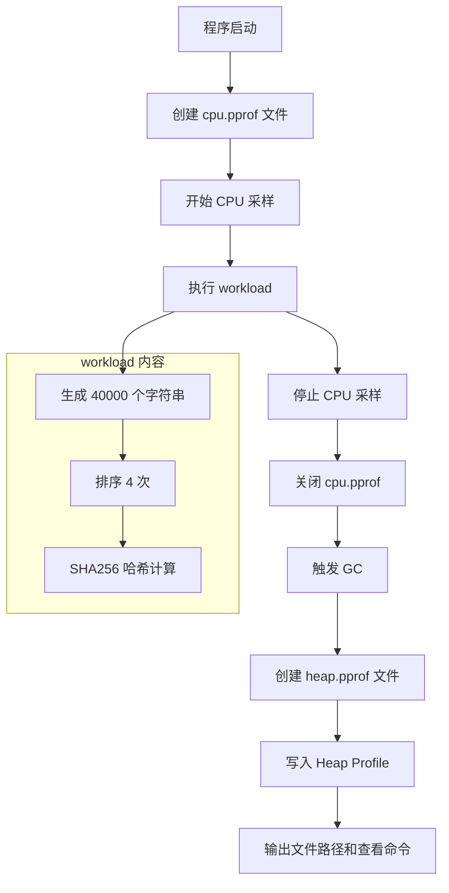

# 写作前的代码理解摘要

## 1. 项目地图

- **main 入口文件路径**：`series/37/cmd/pproflab/main.go`
- **核心业务逻辑所在文件路径**：同上，`workload()` 函数模拟 CPU 和内存密集型操作
- **输出文件路径**：`series/37/tmp/cpu.pprof` 和 `series/37/tmp/heap.pprof`
- **关键函数名称**：`main()`、`workload()`、`profileDir()`

## 2. 核心三问

**这个项目解决的具体痛点是什么？**
性能问题最怕"凭感觉优化"——你觉得是数据库慢，结果瓶颈在字符串拼接；你觉得是算法复杂，结果是内存分配太频繁。这个项目演示如何用 Go 内置的 pprof 工具生成 CPU 和内存 profile 文件，让性能问题"有据可查"。

**它的核心技术实现逻辑（Trick）是什么？**
项目用 `runtime/pprof` 包在代码中手动开启 CPU 采样，执行一段包含字符串操作、排序、哈希计算的 workload，然后停止采样并写入文件。同时在 workload 结束后触发 GC，再写入 heap profile。最后输出文件路径和查看命令，形成完整的"采集 → 分析"闭环。

**它最适合用在什么业务场景？**
任何需要定位性能瓶颈的场景：接口响应慢、批处理任务耗时长、内存占用异常等。特别适合在本地复现问题后，用 pprof 精确定位热点函数，避免盲目优化。

## 3. Go 语言特性提取

- **runtime/pprof**：CPU 和内存 profile 的核心包
- **runtime.GC()**：手动触发垃圾回收，稳定 heap profile 结果
- **defer**：确保文件句柄被正确关闭
- **os.Create / os.MkdirAll**：文件和目录操作
- **filepath.Join**：跨平台路径拼接
- **time.Since**：计算耗时

---

**备选标题**

- 风格 A（痛点型）：《接口慢了 3 秒，我是怎么用 pprof 找到元凶的》
- 风格 B（干货型）：《Go pprof 实战：从生成 profile 到定位热点函数》
- 风格 C（悬念型）：《为什么你的性能优化总是"优化了个寂寞"？》

---

## 1. 场景复现：那个让我头疼的时刻

前阵子我负责的一个数据处理服务突然变慢了，P99 延迟从 200ms 飙到了 800ms。我第一反应是查数据库——没问题；查网络——也正常；查代码改动——最近只加了一个"小功能"。

我盯着那段代码看了半小时，觉得逻辑没毛病。直到同事提醒我：**"你跑过 pprof 吗？"**

我加了几行代码生成 profile 文件，用 `go tool pprof -top` 一看，排在第一的热点函数赫然是 `strings.Repeat`——我新加的那个"小功能"里，有一个循环在疯狂拼接字符串。

那一刻我才明白：**性能问题不能靠猜，得靠数据。**

---

## 2. 架构蓝图：上帝视角看设计

这个示例的流程非常直接：



整个流程分三步：
1. **采集 CPU profile**：记录 workload 执行期间的 CPU 使用分布
2. **采集 Heap profile**：记录内存分配情况
3. **输出分析入口**：告诉你怎么查看结果

---

## 3. 源码拆解：手把手带你读核心

### 3.1 主函数：采集流程编排

```go
func main() {
    outDir := profileDir()
    if err := os.MkdirAll(outDir, 0o755); err != nil {
        panic(err)
    }

    cpuPath := filepath.Join(outDir, "cpu.pprof")
    memPath := filepath.Join(outDir, "heap.pprof")

    cpuFile, err := os.Create(cpuPath)
    if err != nil {
        panic(err)
    }

    if err := pprof.StartCPUProfile(cpuFile); err != nil {
        _ = cpuFile.Close()
        panic(err)
    }

    result := workload()

    pprof.StopCPUProfile()
    _ = cpuFile.Close()
    // ...
}
```

你可以看到，CPU profile 的采集就是**三步走**：
1. `pprof.StartCPUProfile(file)` 开始采样
2. 执行你要分析的代码
3. `pprof.StopCPUProfile()` 停止采样

**为什么要传文件句柄？** 因为 pprof 会把采样数据直接写入文件，避免在内存里积累大量数据。

**知识点贴士**：`pprof.StartCPUProfile` 底层是通过信号机制定期采样当前的调用栈，默认每秒采样 100 次。这种采样方式开销很小，适合在生产环境使用。

### 3.2 Heap Profile：内存去哪了

```go
runtime.GC()
memFile, err := os.Create(memPath)
if err != nil {
    panic(err)
}
if err := pprof.WriteHeapProfile(memFile); err != nil {
    _ = memFile.Close()
    panic(err)
}
_ = memFile.Close()
```

**为什么要先调用 `runtime.GC()`？** Heap profile 记录的是"当前存活的对象"，如果不先 GC，可能会包含很多即将被回收的垃圾对象，干扰分析结果。

**知识点贴士**：`pprof.WriteHeapProfile` 是一次性快照，不像 CPU profile 那样需要"开始 → 结束"。它记录的是调用时刻的内存分配情况。

### 3.3 Workload：制造热点

```go
func workload() string {
    start := time.Now()
    data := make([]string, 0, 40000)
    for i := 0; i < 40000; i++ {
        data = append(data, strings.Repeat("go", i%10+1))
    }
    for i := 0; i < 4; i++ {
        sort.Strings(data)
    }

    h := sha256.New()
    for _, item := range data {
        h.Write([]byte(item))
    }
    elapsed := time.Since(start)
    fmt.Printf("workload finished in %s\n", elapsed)
    return fmt.Sprintf("%x", h.Sum(nil))
}
```

这个 workload 故意设计了三种典型的性能消耗：
- **字符串生成**：`strings.Repeat` 会分配新内存
- **排序**：`sort.Strings` 是 CPU 密集型操作
- **哈希计算**：`sha256` 也是 CPU 密集型

**为什么排序 4 次？** 为了让排序操作在 profile 里更明显。实际项目中，热点函数往往是被高频调用的那些。

### 3.4 输出分析入口

```go
fmt.Println("done")
fmt.Printf("result checksum: %s\n", result)
fmt.Printf("cpu profile: %s\n", cpuPath)
fmt.Printf("heap profile: %s\n", memPath)
fmt.Println("\nview tips:")
fmt.Println("go tool pprof -top", cpuPath)
fmt.Println("go tool pprof -top", memPath)
```

程序最后会告诉你文件在哪、怎么查看。这是个好习惯——**让工具的输出自带使用说明**。

---

## 4. 避坑指南 & 深度思考

### 4.1 常见陷阱

**陷阱一：Profile 范围太大**

如果你把整个 `main` 函数都包进去，profile 里会混入初始化、配置加载等无关代码，干扰分析。**只包住你关心的那段逻辑**。

**陷阱二：忘记 StopCPUProfile**

如果程序异常退出，`StopCPUProfile` 没执行，生成的文件可能不完整或无法读取。建议用 `defer`：

```go
pprof.StartCPUProfile(f)
defer pprof.StopCPUProfile()
```

**陷阱三：Heap Profile 波动大**

内存分配受 GC 时机影响很大。如果你发现每次跑出来的结果差异很大，试试在采样前手动 `runtime.GC()`，并多跑几次看趋势。

**陷阱四：只看 CPU 不看内存**

有些性能问题的根源是内存分配太频繁，导致 GC 压力大。CPU 和 Heap 要一起看。

### 4.2 生产环境差距

这个 Demo 用的是文件方式生成 profile，适合本地分析。生产环境通常用 `net/http/pprof`，可以在线抓取：

```go
import _ "net/http/pprof"

go func() {
    http.ListenAndServe(":6060", nil)
}()
```

然后用 `go tool pprof http://localhost:6060/debug/pprof/profile` 远程采集。

---

## 5. 快速上手 & 改造建议

### 5.1 运行命令

```bash
# 运行程序，生成 profile 文件
go run ./series/37/cmd/pproflab

# 查看 CPU 热点（按自身耗时排序）
go tool pprof -top series/37/tmp/cpu.pprof

# 查看 CPU 热点（按累计耗时排序）
go tool pprof -top -cum series/37/tmp/cpu.pprof

# 查看内存热点
go tool pprof -top series/37/tmp/heap.pprof

# 生成火焰图（需要安装 graphviz）
go tool pprof -web series/37/tmp/cpu.pprof
```

运行后你会看到类似这样的输出：

```
workload finished in 6.803856ms
done
result checksum: 1dd32a066aabbdf8d96c77a05c204d3d36137a4d5910e9a79413e054c637ef01
cpu profile: series/37/tmp/cpu.pprof
heap profile: series/37/tmp/heap.pprof
```

用 `go tool pprof -top` 查看时，会显示每个函数的耗时占比：

```
(pprof) top
Showing nodes accounting for 60ms, 100% of 60ms total
      flat  flat%   sum%        cum   cum%
      30ms 50.00% 50.00%       30ms 50.00%  sort.insertionSort
      20ms 33.33% 83.33%       20ms 33.33%  runtime.memmove
      10ms 16.67%   100%       10ms 16.67%  strings.Repeat
```

### 5.2 工程化改造建议

**建议一：给服务加上 HTTP pprof 端点**

```go
import _ "net/http/pprof"

func main() {
    go func() {
        log.Println(http.ListenAndServe(":6060", nil))
    }()
    // 你的业务代码
}
```

这样可以随时在线抓取 profile，不用重启服务。

**建议二：用 `-bench` 配合 `-cpuprofile`**

如果你有 benchmark 测试，可以直接生成 profile：

```bash
go test -bench=. -cpuprofile=cpu.pprof ./...
```

这样能精确分析某个函数的性能。

**建议三：定期采集，建立基线**

把 profile 采集加入监控流程，定期对比。如果某次发布后热点函数突然变了，说明有性能回退。

---

## 6. 总结与脑图

- **pprof 是 Go 内置的性能分析工具**，能告诉你"时间花在哪、内存耗在哪"
- **CPU profile 用采样方式**，开销小，适合生产环境
- **Heap profile 是快照**，采样前建议先 GC 以减少噪音
- **`go tool pprof -top`** 是最快的查看方式，`-web` 可以生成火焰图
- **性能优化要有数据支撑**，先找到最大的热点，再决定是否优化
