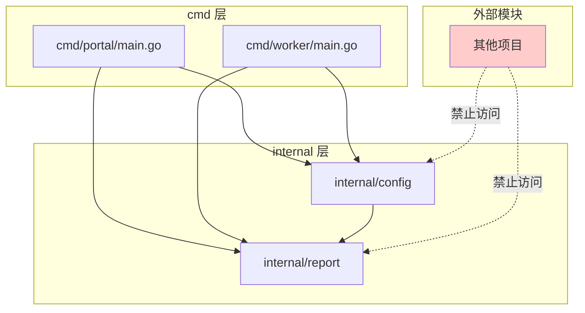

# 写作前的代码理解摘要

## 1. 项目地图

- **main 入口文件路径**：
  - `series/38/cmd/portal/main.go`（Portal 入口）
  - `series/38/cmd/worker/main.go`（Worker 入口）
- **核心业务逻辑所在文件路径**：
  - `series/38/internal/config/config.go`（配置加载）
  - `series/38/internal/report/report.go`（报告生成）
- **关键结构体/接口名称**：`Config`、`Snapshot`、`Summary()`

## 2. 核心三问

**这个项目解决的具体痛点是什么？**
很多人学 Go 项目结构时只记住"把 main 放到 cmd"，但真正写项目时依然困惑：internal 到底该放什么？为什么有些包别人导不进来？项目越写越大，依赖关系越来越乱。这个项目演示了 `cmd` 和 `internal` 的正确用法——它们不是摆设，而是**约束依赖方向**的工具。

**它的核心技术实现逻辑（Trick）是什么？**
项目设计了两个独立的命令入口（portal 和 worker），它们共享同一套内部能力（config 和 report）。`internal` 目录下的包只能被当前模块内部导入，外部模块无法访问。这种结构强制了"cmd → internal"的单向依赖，避免了内部实现被外部滥用。

**它最适合用在什么业务场景？**
任何需要多入口的项目：一个 API 服务 + 一个后台 Worker、一个 CLI 工具 + 一个 Daemon 进程、微服务中的多个子命令等。通过 `cmd` 分离入口、`internal` 封装内部逻辑，可以保持代码结构清晰、依赖方向可控。

## 3. Go 语言特性提取

- **internal 包访问限制**：Go 编译器强制的模块边界
- **多 main 包**：一个模块可以有多个可执行入口
- **环境变量读取**：`os.Getenv` 配合 `strings.TrimSpace`
- **类型转换**：`strconv.Atoi` 字符串转整数
- **结构体组合**：`Snapshot` 嵌入 `Config`

---

**备选标题**

- 风格 A（痛点型）：《项目越写越乱？聊聊 Go 的 cmd 和 internal 到底怎么用》
- 风格 B（干货型）：《Go 项目结构实战：用 internal 约束依赖方向》
- 风格 C（悬念型）：《为什么你的 Go 项目结构总是"看起来对，用起来乱"？》

---

## 1. 场景复现：那个让我头疼的时刻

去年我接手了一个"历史悠久"的 Go 项目，代码量不大，但结构让我头疼：

- `main.go` 有 800 多行，什么逻辑都往里塞
- 工具函数散落在各个包里，互相引用
- 想加一个新的命令入口，发现到处都是循环依赖

我花了两天时间重构，把代码按 `cmd` 和 `internal` 重新组织。重构完的那一刻，我终于理解了这两个目录的真正意义：**它们不是为了好看，而是为了约束依赖方向**。

`cmd` 是入口，只负责"组装"；`internal` 是内部能力，只被本模块使用。这种结构一旦建立，后续加功能、改逻辑都会顺畅很多。

---

## 2. 架构蓝图：上帝视角看设计



关键点：
- **cmd 层**：每个子目录是一个独立的可执行程序
- **internal 层**：只能被当前模块内部导入，外部模块无法访问
- **依赖方向**：`cmd → internal`，单向流动，不能反过来

---

## 3. 源码拆解：手把手带你读核心

### 3.1 配置加载：internal/config

```go
package config

import (
    "os"
    "strconv"
    "strings"
)

type Config struct {
    App     string
    Mode    string
    Region  string
    Workers int
}

func Load() Config {
    cfg := Config{
        App:     "sample",
        Mode:    "portal",
        Region:  "local",
        Workers: 4,
    }

    if v := strings.TrimSpace(os.Getenv("APP_NAME")); v != "" {
        cfg.App = v
    }
    if v := strings.TrimSpace(os.Getenv("APP_MODE")); v != "" {
        cfg.Mode = v
    }
    if v := strings.TrimSpace(os.Getenv("APP_REGION")); v != "" {
        cfg.Region = v
    }
    if v := strings.TrimSpace(os.Getenv("APP_WORKERS")); v != "" {
        if n, err := strconv.Atoi(v); err == nil && n > 0 {
            cfg.Workers = n
        }
    }

    return cfg
}
```

你可以看到，`Load()` 函数做了两件事：
1. **设置默认值**：即使没有环境变量，程序也能跑
2. **从环境变量覆盖**：支持运行时配置

**为什么用 `strings.TrimSpace`？** 环境变量有时会带空格或换行符，trim 一下更安全。

**为什么放在 internal 里？** 配置加载是内部实现细节，外部模块不应该直接调用。如果以后要改成从文件读取，只需要改这一个地方。

**知识点贴士**：`os.Getenv` 返回空字符串表示环境变量不存在，Go 里没有"环境变量不存在"和"环境变量为空"的区别。如果你需要区分，可以用 `os.LookupEnv`。

### 3.2 报告生成：internal/report

```go
package report

import (
    "fmt"
    "time"

    "learn-go/series/38/internal/config"
)

type Snapshot struct {
    Config  config.Config
    Handled int
    Failed  int
    Elapsed time.Duration
}

func Summary(s Snapshot) string {
    return fmt.Sprintf(
        "app=%s mode=%s region=%s handled=%d failed=%d cost=%s",
        s.Config.App,
        s.Config.Mode,
        s.Config.Region,
        s.Handled,
        s.Failed,
        s.Elapsed,
    )
}
```

`Snapshot` 结构体把配置和运行结果打包在一起，`Summary` 函数生成结构化的输出。

**为什么 report 依赖 config？** 因为报告需要包含配置信息。这是 `internal` 内部的依赖，完全合理。

**为什么输出是 `key=value` 格式？** 这是结构化日志的常见格式，方便后续用 grep 或日志平台检索。

### 3.3 Portal 入口

```go
package main

import (
    "fmt"
    "math/rand"
    "time"

    "learn-go/series/38/internal/config"
    "learn-go/series/38/internal/report"
)

func main() {
    cfg := config.Load()
    cfg.Mode = "portal"

    start := time.Now()
    handled, failed := simulateRequests(cfg.Workers, 120)

    summary := report.Summary(report.Snapshot{
        Config:  cfg,
        Handled: handled,
        Failed:  failed,
        Elapsed: time.Since(start),
    })

    fmt.Println("portal summary:")
    fmt.Println(summary)
}

func simulateRequests(workers, total int) (int, int) {
    rand.Seed(time.Now().UnixNano())
    failed := 0
    for i := 0; i < total; i++ {
        if rand.Intn(100) < 7 {
            failed++
        }
    }
    return total, failed
}
```

Portal 入口做了三件事：
1. **加载配置**并覆盖 Mode
2. **执行业务逻辑**（模拟请求处理）
3. **生成报告**

**为什么 `cfg.Mode = "portal"` 要在入口里设置？** 因为 Mode 是由入口决定的，不是由环境变量决定的。这体现了"入口自持职责"的原则。

### 3.4 Worker 入口

```go
package main

import (
    "fmt"
    "time"

    "learn-go/series/38/internal/config"
    "learn-go/series/38/internal/report"
)

func main() {
    cfg := config.Load()
    cfg.Mode = "worker"

    start := time.Now()
    handled, failed := runJobs(cfg.Workers, 80)

    summary := report.Summary(report.Snapshot{
        Config:  cfg,
        Handled: handled,
        Failed:  failed,
        Elapsed: time.Since(start),
    })

    fmt.Println("worker summary:")
    fmt.Println(summary)
}

func runJobs(workers, total int) (int, int) {
    failed := 0
    for i := 0; i < total; i++ {
        if i%17 == 0 {
            failed++
        }
        time.Sleep(2 * time.Millisecond)
        _ = workers
    }
    return total, failed
}
```

Worker 入口的结构和 Portal 几乎一样，只是业务逻辑不同。**这就是 `cmd` + `internal` 的威力**：两个入口共享配置和报告能力，但各自有独立的业务逻辑。

---

## 4. 避坑指南 & 深度思考

### 4.1 常见陷阱

**陷阱一：把业务逻辑写进 cmd**

很多人图省事，把所有代码都塞进 `main.go`。结果入口变成"巨型 main"，难以测试、难以复用。

**正确做法**：入口只做"组装"——解析参数、加载配置、调用业务函数、输出结果。业务逻辑放到 `internal` 里。

**陷阱二：internal 包被外部引用**

如果你发现外部模块需要用你的 internal 包，说明这个包应该被"升级"为公开包。可以把它移到 `pkg` 目录。

**陷阱三：依赖方向反了**

`internal` 包不应该导入 `cmd` 包。如果你发现需要这么做，说明职责划分有问题。

**陷阱四：一个大而全的 internal 包**

所有代码都塞进一个 `internal/app` 包，和没有拆分一样。应该按领域拆分：`internal/config`、`internal/report`、`internal/handler` 等。

### 4.2 internal vs pkg

| 目录 | 用途 | 访问范围 |
|------|------|----------|
| `internal` | 内部实现 | 只能被当前模块导入 |
| `pkg` | 公开能力 | 可以被任何模块导入 |

**经验法则**：先放 `internal`，等确实需要被外部复用时，再迁移到 `pkg`。不要一开始就全部公开。

---

## 5. 快速上手 & 改造建议

### 5.1 运行命令

```bash
# 运行 Portal 入口
APP_NAME=order APP_REGION=cn APP_WORKERS=6 go run ./series/38/cmd/portal

# 运行 Worker 入口
APP_NAME=order APP_REGION=cn APP_WORKERS=3 go run ./series/38/cmd/worker
```

Portal 输出示例：

```
portal summary:
app=order mode=portal region=cn handled=120 failed=7 cost=65.588µs
```

Worker 输出示例：

```
worker summary:
app=order mode=worker region=cn handled=80 failed=5 cost=177.877358ms
```

你可以看到，两个入口共享同一套配置（APP_NAME、APP_REGION），但 Mode 是各自设置的。

### 5.2 工程化改造建议

**建议一：把目录结构约定写进 README**

```markdown
## 项目结构

- `cmd/` - 可执行入口，每个子目录是一个独立程序
- `internal/` - 内部包，只能被本模块导入
- `pkg/` - 公开包，可以被外部模块导入（如有需要）
```

这样新同事一眼就能理解项目结构。

**建议二：入口越来越多时，抽出 app 包**

```go
// internal/app/app.go
func Run(cfg Config, mode string) error {
    // 统一的启动逻辑
}
```

让 `cmd` 更薄，只负责解析参数和调用 `app.Run`。

**建议三：配置支持多来源**

当前只支持环境变量，可以扩展为"文件 + 环境变量 + 命令行参数"三层覆盖：

```go
func Load() Config {
    cfg := loadFromFile("config.yaml")  // 基础配置
    cfg = overrideFromEnv(cfg)          // 环境变量覆盖
    cfg = overrideFromFlags(cfg)        // 命令行参数覆盖
    return cfg
}
```

---

## 6. 总结与脑图

- **`cmd/` 是入口层**，每个子目录对应一个可执行程序，只负责组装和调度
- **`internal/` 是内部能力层**，只能被当前模块导入，外部模块无法访问
- **依赖方向必须单向**：`cmd → internal`，不能反过来
- **多入口共享内部能力**是 `cmd` + `internal` 的核心价值
- **先 internal 后 pkg**：等确实需要被外部复用时再公开
