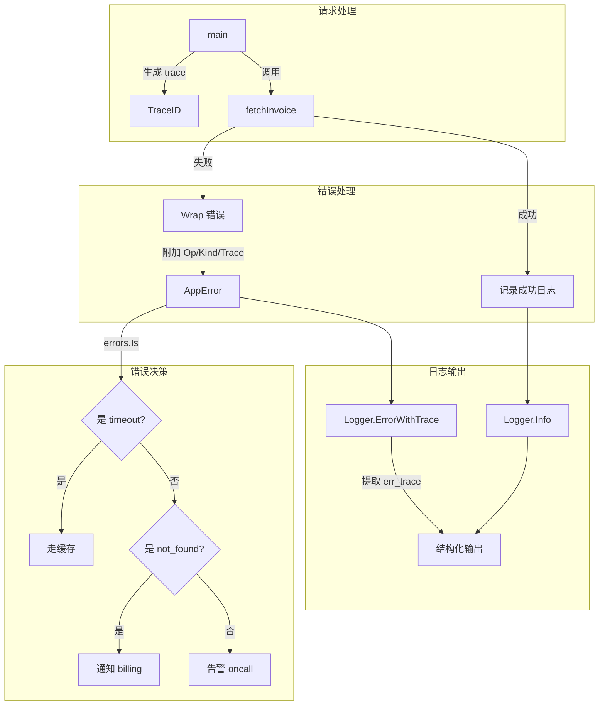

# 写作前的代码理解摘要

## 1. 项目地图

- **main 入口文件路径**：`series/39/cmd/obslog/main.go`
- **核心业务逻辑所在文件路径**：`series/39/internal/obs/obs.go`
- **关键结构体/接口名称**：
  - `Logger`：结构化日志器
  - `AppError`：自定义错误类型（带 Op、Kind、Trace）
  - `Field`：日志字段

## 2. 核心三问

**这个项目解决的具体痛点是什么？**
系统出问题时最尴尬的不是"报错"，而是"没线索"：日志没有请求标识、错误只是字符串、定位只能靠猜。这个项目演示了如何设计一套"可观测"的错误和日志体系——错误可分类、可追溯，日志结构化、可检索。

**它的核心技术实现逻辑（Trick）是什么？**
项目定义了一个 `AppError` 结构体，包含 `Op`（操作名）、`Kind`（错误类别）、`Trace`（追踪 ID）和原始错误。通过实现 `Error()` 和 `Unwrap()` 方法，让它既能被 `errors.Is` 判断原始错误，又能被 `errors.As` 提取上下文信息。日志器则统一输出 `key=value` 格式，并在错误日志中自动附加 `err_trace`。

**它最适合用在什么业务场景？**
任何需要排障的后端服务：API 网关、订单系统、支付服务等。当线上出问题时，通过 trace id 串起同一请求的所有日志，通过 error kind 快速定位错误类型，大幅缩短排障时间。

## 3. Go 语言特性提取

- **errors.Is / errors.As**：Go 1.13+ 的错误链判断
- **自定义 error 类型**：实现 `Error()` 和 `Unwrap()` 方法
- **可变参数**：`fields ...Field` 实现灵活的日志字段
- **类型断言**：`errors.As(err, &app)` 提取具体错误类型
- **闭包与方法**：Logger 的方法封装日志输出逻辑

---

**备选标题**

- 风格 A（痛点型）：《线上出 Bug 没线索？聊聊 Go 的错误设计和结构化日志》
- 风格 B（干货型）：《Go 可观测性实战：从错误包装到 Trace 串联》
- 风格 C（悬念型）：《为什么你的日志"看起来很多"却"查不到问题"？》

---

## 1. 场景复现：那个让我头疼的时刻

上个月我被拉去排查一个线上问题：用户反馈"支付失败"，但日志里只有一行：

```
2024/01/15 14:32:01 error: db timeout
```

就这？没有请求 ID、没有用户信息、没有调用链路。我翻了半小时日志，愣是没找到这条错误对应的是哪个请求。

后来我花了两天时间重构日志系统，加上了 trace id、错误分类、结构化字段。再出问题时，日志变成了这样：

```
level=ERROR service=billing trace=trace-123 op=fetch_invoice invoice_id=456 err=fetchInvoice: timeout: db timeout
```

一眼就能看出：是 billing 服务、fetch_invoice 操作、invoice_id 是 456、错误类型是 timeout。**可观测性不是上复杂平台，而是先把错误和日志的语义做对。**

---

## 2. 架构蓝图：上帝视角看设计



核心设计：
1. **错误包装**：在边界处用 `Wrap` 附加上下文（Op、Kind、Trace）
2. **错误决策**：用 `errors.Is` 和 `IsKind` 判断错误类型，走不同分支
3. **日志串联**：请求级 trace 和错误级 err_trace 同时输出

---

## 3. 源码拆解：手把手带你读核心

### 3.1 自定义错误类型：AppError

```go
type AppError struct {
    Op    string
    Kind  string
    Err   error
    Trace string
}

func (e AppError) Error() string {
    return fmt.Sprintf("%s: %s: %v", e.Op, e.Kind, e.Err)
}

func (e AppError) Unwrap() error {
    return e.Err
}
```

`AppError` 是整个可观测性设计的核心。它包含四个字段：
- **Op**：操作名，比如 `fetchInvoice`
- **Kind**：错误类别，比如 `timeout`、`not_found`
- **Trace**：追踪 ID，用于串联日志
- **Err**：原始错误

**为什么要实现 `Unwrap()`？** 这样 `errors.Is(err, errTimeout())` 仍然能判断原始错误。错误链不会因为包装而断掉。

**知识点贴士**：Go 1.13 引入了 `errors.Is` 和 `errors.As`。`Is` 用于判断错误链中是否包含某个特定错误，`As` 用于提取错误链中的某个类型。它们会自动调用 `Unwrap()` 遍历错误链。

### 3.2 错误包装函数：Wrap

```go
func Wrap(op, kind, trace string, err error) error {
    if err == nil {
        return nil
    }
    return AppError{Op: op, Kind: kind, Trace: trace, Err: err}
}
```

`Wrap` 是一个工厂函数，把原始错误包装成 `AppError`。注意它会检查 `err == nil`，避免包装空错误。

**为什么在边界处包装？** 因为边界（比如调用外部服务、访问数据库）是最容易出错的地方，也是最需要上下文的地方。

### 3.3 错误类型判断：IsKind

```go
func IsKind(err error, kind string) bool {
    var app AppError
    if errors.As(err, &app) {
        return app.Kind == kind
    }
    return false
}

func AsAppError(err error) (AppError, bool) {
    var app AppError
    if errors.As(err, &app) {
        return app, true
    }
    return AppError{}, false
}
```

`IsKind` 用于判断错误的类别。它先用 `errors.As` 提取 `AppError`，再比较 `Kind` 字段。

**为什么不直接用 `errors.Is`？** 因为 `errors.Is` 比较的是错误实例，而我们想比较的是错误类别。一个 `timeout` 类别可能对应多种原始错误。

### 3.4 结构化日志器：Logger

```go
type Logger struct {
    service string
    logger  *log.Logger
}

func (l *Logger) emit(level, msg string, fields ...Field) {
    parts := []string{
        "level=" + level,
        "service=" + l.service,
        "msg=" + msg,
    }
    for _, f := range fields {
        parts = append(parts, f.String())
    }
    l.logger.Println(strings.Join(parts, " "))
}

func (l *Logger) ErrorWithTrace(err error, fields ...Field) {
    if app, ok := AsAppError(err); ok && app.Trace != "" {
        fields = append(fields, Field{Key: "err_trace", Value: app.Trace})
    }
    l.Error(err, fields...)
}
```

日志器的核心是 `emit` 方法，它把所有字段拼成 `key=value` 格式输出。

**`ErrorWithTrace` 的巧妙之处**：它会自动从 `AppError` 中提取 `Trace`，作为 `err_trace` 字段输出。这样日志里既有请求级的 `trace`，也有错误级的 `err_trace`，两者可以交叉定位。

### 3.5 业务逻辑：错误决策

```go
amount, err := fetchInvoice(id)
if err != nil {
    logger.ErrorWithTrace(err,
        obs.Str("trace", trace),
        obs.Str("op", "fetch_invoice"),
        obs.Int("invoice_id", id),
        obs.Duration("cost", time.Since(start)),
    )

    switch {
    case errors.Is(err, errTimeout()):
        logger.Info("fallback to cache", obs.Str("trace", trace))
    case obs.IsKind(err, kindNotFound):
        logger.Info("notify billing", obs.Str("trace", trace))
    default:
        logger.Info("alert oncall", obs.Str("trace", trace))
    }
    return
}
```

这段代码展示了错误决策的完整流程：
1. **记录错误日志**：包含 trace、操作名、业务字段、耗时
2. **根据错误类型决策**：timeout 走缓存、not_found 通知 billing、其他告警 oncall

**为什么用 `switch` 而不是 `if-else`？** 因为 `switch` 更清晰，而且可以用 `case` 的短路特性。

---

## 4. 避坑指南 & 深度思考

### 4.1 常见陷阱

**陷阱一：错误只用字符串**

```go
return errors.New("db timeout")
```

这种错误无法分类、无法自动处理。调用方只能靠字符串匹配，一旦错误信息改了就全挂。

**陷阱二：日志缺少 trace**

没有 trace 的日志就像没有门牌号的快递，根本找不到对应的请求。

**陷阱三：错误未包装**

```go
return err // 直接返回原始错误
```

上层拿不到任何上下文信息，只知道"出错了"，不知道"在哪出错"。

**陷阱四：过度日志**

什么都记，噪音太大。日志应该只记录**必要的业务字段**，避免敏感信息。

### 4.2 生产环境差距

这个 Demo 用的是简单的 `log.Logger`，生产环境通常用 `zap` 或 `zerolog`：

```go
logger.Error("fetch failed",
    zap.String("trace", trace),
    zap.Int("invoice_id", id),
    zap.Error(err),
)
```

另外，trace id 应该通过 `context.Context` 传递，而不是手动传参。

---

## 5. 快速上手 & 改造建议

### 5.1 运行命令

```bash
# 正常运行（随机 ID）
go run ./series/39/cmd/obslog

# 固定触发超时错误
INVOICE_ID=35 go run ./series/39/cmd/obslog

# 固定触发 not_found 错误
INVOICE_ID=21 go run ./series/39/cmd/obslog
```

超时错误输出示例：

```
2025/01/04 15:56:21 level=ERROR service=billing msg=error trace=trace-xxx op=fetch_invoice invoice_id=35 cost=85.34µs err_trace=trace-yyy err=fetchInvoice: timeout: db timeout
2025/01/04 15:56:21 level=INFO service=billing msg=alert oncall trace=trace-xxx
```

你可以看到：
- `trace` 是请求级的追踪 ID
- `err_trace` 是错误发生时的追踪 ID
- 两者结合可以精确定位问题

### 5.2 工程化改造建议

**建议一：用 context 传递 trace**

```go
func fetchInvoice(ctx context.Context, id int) (int, error) {
    trace := TraceFromContext(ctx)
    // ...
}
```

这样 trace 不用手动传参，代码更干净。

**建议二：把日志器换成 zap**

```go
logger, _ := zap.NewProduction()
logger.Error("fetch failed",
    zap.String("trace", trace),
    zap.Error(err),
)
```

zap 性能更好，支持 JSON 输出，方便接入日志平台。

**建议三：为 AppError 增加 Code 字段**

```go
type AppError struct {
    Op    string
    Kind  string
    Code  int    // HTTP 状态码或业务错误码
    Err   error
    Trace string
}
```

这样 API 层可以直接用 Code 返回给客户端。

---

## 6. 总结与脑图

- **错误要可分类**：用 Kind 标签区分 timeout、not_found 等类型，支持自动决策
- **错误要可追溯**：用 Wrap 附加 Op 和 Trace，保留错误链
- **日志要结构化**：统一 `key=value` 格式，方便检索和聚合
- **trace 要贯穿全链路**：请求级 trace + 错误级 err_trace，交叉定位
- **先做对语义，再上平台**：可观测性的基础是错误和日志的设计，不是工具
