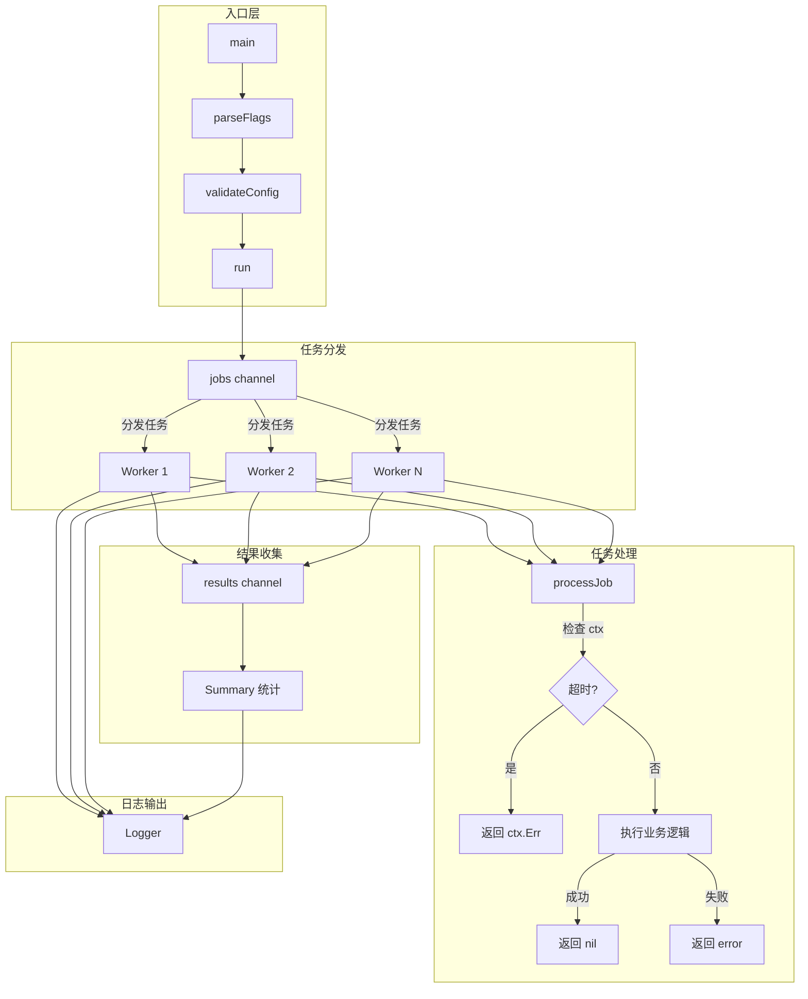

# 写作前的代码理解摘要

## 1. 项目地图

- **main 入口文件路径**：`series/40/cmd/capstone/main.go`
- **核心业务逻辑所在文件路径**：同上，所有逻辑集中在一个文件中
- **关键结构体/接口名称**：
  - `Config`：运行配置（Jobs、Workers、Timeout）
  - `Summary`：运行摘要（Handled、Failed、Canceled、Elapsed）
  - `result`：单个任务结果
  - `Logger`：结构化日志器
  - `Field`：日志字段

## 2. 核心三问

**这个项目解决的具体痛点是什么？**
很多人学完 Go 语法、写完几个小 demo 后，会遇到一个真实痛点：代码能跑，但不敢改；功能能交付，但出了问题很难查。这个项目是一个"毕业设计"，把结构、错误、并发、配置、日志这些工程能力串成一套完整的实践。

**它的核心技术实现逻辑（Trick）是什么？**
项目实现了一个可配置的任务执行器：用 channel 分发任务、用 worker pool 并发处理、用 context 控制超时、用结构化日志记录过程、用 Summary 汇总结果。每个任务的成功/失败/取消都被精确统计，形成完整的运行报告。

**它最适合用在什么业务场景？**
任何需要并发处理批量任务的场景：消息队列消费者、定时任务调度器、批量数据处理、并发爬虫等。这个模式可以直接复用，只需要替换 `processJob` 的具体逻辑。

## 3. Go 语言特性提取

- **Goroutine + Channel**：worker pool 模式
- **sync.WaitGroup**：等待所有 worker 完成
- **context.WithTimeout**：统一控制执行预算
- **errors.Is**：判断 context 取消/超时
- **flag 包**：命令行参数解析
- **select**：多路复用，响应取消信号
- **defer**：确保资源清理

---

**备选标题**

- 风格 A（痛点型）：《代码能跑但不敢改？聊聊从"会写 Go"到"写好 Go"》
- 风格 B（干货型）：《Go 工程实战：一个任务执行器串起并发、超时、日志》
- 风格 C（悬念型）：《为什么你的 Go 代码"能跑"却"不好维护"？》

---

## 1. 场景复现：那个让我头疼的时刻

去年我写了一个批量处理任务的小工具，功能很简单：从队列里取任务、并发处理、记录结果。代码能跑，测试也过了，我就上线了。

然后问题来了：
- 有时候任务卡住，整个程序就卡住了——**没有超时控制**
- 出错了只知道"失败了"，不知道是哪个任务、什么原因——**日志没有结构**
- 想改并发数，得改代码重新编译——**配置写死了**
- 运行完了不知道成功多少、失败多少——**没有统计**

我花了一周时间重构，把这些问题一个个解决。重构完的代码，就是这个项目的雏形。

**从"会写 Go"到"写好 Go"，不是再学一个语法点，而是把结构、错误、并发、配置、日志这些工程能力串起来。**

---

## 2. 架构蓝图：上帝视角看设计



核心设计：
1. **入口薄、逻辑清**：main 只做解析和组装，业务逻辑在 `run` 函数
2. **并发有预算**：`context.WithTimeout` 控制总执行时间
3. **结果可统计**：Handled、Failed、Canceled 分类计数
4. **日志结构化**：每个任务的执行过程都有迹可循

---

## 3. 源码拆解：手把手带你读核心

### 3.1 配置与校验

```go
type Config struct {
    Jobs    int
    Workers int
    Timeout time.Duration
}

func parseFlags() Config {
    cfg := Config{
        Jobs:    9,
        Workers: 3,
        Timeout: 500 * time.Millisecond,
    }

    flag.IntVar(&cfg.Jobs, "jobs", cfg.Jobs, "number of jobs")
    flag.IntVar(&cfg.Workers, "workers", cfg.Workers, "number of workers")
    flag.DurationVar(&cfg.Timeout, "timeout", cfg.Timeout, "run timeout")
    flag.Parse()

    return cfg
}

func validateConfig(cfg Config) error {
    if cfg.Jobs <= 0 {
        return errors.New("jobs must be positive")
    }
    if cfg.Workers <= 0 {
        return errors.New("workers must be positive")
    }
    if cfg.Timeout <= 0 {
        return errors.New("timeout must be positive")
    }
    return nil
}
```

配置分两步：**解析**和**校验**。

**为什么要分开？** 解析只负责"读取"，校验只负责"检查"。职责单一，方便测试。

**知识点贴士**：`flag.IntVar` 和 `flag.DurationVar` 是 Go 标准库的命令行参数解析。`DurationVar` 支持 `500ms`、`1s`、`2m` 这样的时间格式，非常方便。

### 3.2 核心运行逻辑：run

```go
func run(ctx context.Context, cfg Config, logger *Logger, runID string) Summary {
    start := time.Now()
    jobs := make(chan int)
    results := make(chan result)

    var wg sync.WaitGroup
    for i := 1; i <= cfg.Workers; i++ {
        wg.Add(1)
        go worker(ctx, i, jobs, results, logger, runID, &wg)
    }

    go func() {
        defer close(jobs)
        for i := 1; i <= cfg.Jobs; i++ {
            select {
            case <-ctx.Done():
                return
            case jobs <- i:
            }
        }
    }()

    go func() {
        wg.Wait()
        close(results)
    }()

    summary := Summary{Jobs: cfg.Jobs}
    for res := range results {
        summary.Handled++
        if res.err != nil {
            if errors.Is(res.err, context.DeadlineExceeded) || errors.Is(res.err, context.Canceled) {
                summary.Canceled++
            } else {
                summary.Failed++
            }
        }
    }
    summary.Elapsed = time.Since(start)
    return summary
}
```

这是整个项目的核心，我来逐段解释：

**第一段：创建 channel 和启动 worker**

```go
jobs := make(chan int)
results := make(chan result)

for i := 1; i <= cfg.Workers; i++ {
    wg.Add(1)
    go worker(ctx, i, jobs, results, logger, runID, &wg)
}
```

`jobs` channel 用于分发任务，`results` channel 用于收集结果。启动 N 个 worker，每个 worker 从 `jobs` 取任务、往 `results` 写结果。

**第二段：任务分发**

```go
go func() {
    defer close(jobs)
    for i := 1; i <= cfg.Jobs; i++ {
        select {
        case <-ctx.Done():
            return
        case jobs <- i:
        }
    }
}()
```

用一个 goroutine 往 `jobs` channel 发送任务。**关键点**：用 `select` 监听 `ctx.Done()`，如果超时了就停止分发。`defer close(jobs)` 确保分发完成后关闭 channel。

**第三段：等待 worker 完成**

```go
go func() {
    wg.Wait()
    close(results)
}()
```

用另一个 goroutine 等待所有 worker 完成，然后关闭 `results` channel。这样主 goroutine 的 `for res := range results` 才能正常退出。

**第四段：结果统计**

```go
for res := range results {
    summary.Handled++
    if res.err != nil {
        if errors.Is(res.err, context.DeadlineExceeded) || errors.Is(res.err, context.Canceled) {
            summary.Canceled++
        } else {
            summary.Failed++
        }
    }
}
```

遍历所有结果，分类统计。**注意错误分类**：context 取消/超时算 Canceled，其他错误算 Failed。

### 3.3 Worker：任务处理

```go
func worker(ctx context.Context, id int, jobs <-chan int, results chan<- result, logger *Logger, runID string, wg *sync.WaitGroup) {
    defer wg.Done()
    for jobID := range jobs {
        jobStart := time.Now()
        err := processJob(ctx, jobID)
        cost := time.Since(jobStart)

        fields := []Field{
            Str("run", runID),
            Int("worker", id),
            Int("job", jobID),
            Duration("cost", cost),
        }

        switch {
        case err == nil:
            logger.Info("job done", fields...)
        case errors.Is(err, context.DeadlineExceeded) || errors.Is(err, context.Canceled):
            logger.Info("job canceled", fields...)
        default:
            logger.Error("job failed", append(fields, Err(err))...)
        }

        results <- result{id: jobID, err: err, cost: cost}
    }
}
```

Worker 的职责很清晰：
1. 从 `jobs` channel 取任务
2. 调用 `processJob` 处理
3. 记录日志（成功/取消/失败）
4. 把结果发送到 `results` channel

**为什么 channel 类型是 `<-chan int` 和 `chan<- result`？** 这是 Go 的单向 channel 语法，限制 worker 只能从 `jobs` 读、只能往 `results` 写，防止误用。

### 3.4 任务处理：processJob

```go
func processJob(ctx context.Context, id int) error {
    delay := time.Duration(80+(id%5)*40) * time.Millisecond
    timer := time.NewTimer(delay)
    defer timer.Stop()

    select {
    case <-ctx.Done():
        return ctx.Err()
    case <-timer.C:
    }

    if id%9 == 0 {
        return fmt.Errorf("job %d: %w", id, errJobFailed)
    }
    return nil
}
```

这个函数模拟了真实的任务处理：
- **延迟**：每个任务耗时 80~200ms
- **超时检查**：用 `select` 监听 `ctx.Done()`，如果超时就立即返回
- **模拟失败**：id 是 9 的倍数时返回错误

**为什么用 `time.NewTimer` 而不是 `time.Sleep`？** 因为 `Sleep` 无法被打断，而 `Timer` 配合 `select` 可以响应取消信号。

**知识点贴士**：`defer timer.Stop()` 是个好习惯。如果 timer 还没触发就被取消了，不 Stop 会导致资源泄漏。

---

## 4. 避坑指南 & 深度思考

### 4.1 常见陷阱

**陷阱一：main 过于臃肿**

所有逻辑都塞进 main，难以测试、难以复用。

**正确做法**：main 只做解析和组装，业务逻辑抽成函数。

**陷阱二：并发没有超时**

goroutine 卡住了，整个程序就卡住了。

**正确做法**：用 `context.WithTimeout` 设置执行预算。

**陷阱三：channel 没有关闭**

`for range channel` 会一直阻塞，直到 channel 被关闭。

**正确做法**：生产者负责关闭 channel，消费者只负责读取。

**陷阱四：错误一刀切**

所有错误都当"失败"处理，无法区分"超时取消"和"业务失败"。

**正确做法**：用 `errors.Is` 判断错误类型，分类处理。

### 4.2 生产环境差距

这个 Demo 是单机版，生产环境还需要考虑：
- **任务持久化**：任务来源可能是数据库或消息队列
- **重试机制**：失败的任务是否需要重试
- **优雅退出**：收到 SIGTERM 时如何处理正在执行的任务
- **监控指标**：Prometheus metrics 暴露执行统计

---

## 5. 快速上手 & 改造建议

### 5.1 运行命令

```bash
# 默认运行（9 个任务，3 个 worker，500ms 超时）
go run ./series/40/cmd/capstone

# 自定义参数
go run ./series/40/cmd/capstone -jobs=20 -workers=5 -timeout=1s

# 体验超时取消
go run ./series/40/cmd/capstone -timeout=200ms
```

正常运行输出示例：

```
2025/01/04 16:42:31 level=INFO service=capstone msg=run start run=run-xxx jobs=9 workers=3 timeout=500ms
2025/01/04 16:42:31 level=INFO service=capstone msg=job done run=run-xxx worker=1 job=1 cost=121ms
2025/01/04 16:42:31 level=ERROR service=capstone msg=job failed run=run-xxx worker=1 job=9 cost=240ms err=job 9: job failed
2025/01/04 16:42:31 level=INFO service=capstone msg=run summary run=run-xxx handled=9 failed=1 canceled=0 cost=601ms
```

超时运行输出示例：

```
2025/01/04 16:43:00 level=INFO service=capstone msg=job canceled run=run-xxx worker=2 job=5 cost=200ms
2025/01/04 16:43:00 level=INFO service=capstone msg=run summary run=run-xxx handled=6 failed=0 canceled=2 cost=200ms
```

### 5.2 工程化改造建议

**建议一：用 context 传递 trace**

```go
ctx = context.WithValue(ctx, traceKey, runID)
```

这样 trace 不用手动传参，代码更干净。

**建议二：增加重试机制**

```go
func processJobWithRetry(ctx context.Context, id int, maxRetry int) error {
    var err error
    for i := 0; i < maxRetry; i++ {
        err = processJob(ctx, id)
        if err == nil {
            return nil
        }
        if errors.Is(err, context.DeadlineExceeded) {
            return err // 超时不重试
        }
    }
    return err
}
```

**建议三：支持优雅退出**

```go
ctx, cancel := context.WithCancel(context.Background())
go func() {
    sigCh := make(chan os.Signal, 1)
    signal.Notify(sigCh, syscall.SIGTERM, syscall.SIGINT)
    <-sigCh
    cancel()
}()
```

收到退出信号时，取消 context，让正在执行的任务有机会清理。

---

## 6. 总结与脑图

- **入口薄、逻辑清**：main 只做解析和组装，业务逻辑抽成函数
- **并发有预算**：用 `context.WithTimeout` 控制总执行时间，避免无限等待
- **错误可分类**：用 `errors.Is` 区分超时取消和业务失败
- **日志结构化**：统一 `key=value` 格式，包含 run id、worker id、job id
- **结果可统计**：Handled、Failed、Canceled 分类计数，运行结果一目了然
